# C4 System Design Documentation Generator

Generate comprehensive C4 architecture diagrams (Context, Container, Component, Code) for software systems using PlantUML or Mermaid syntax.

## Skill Metadata

**Name:** c4-diagrams
**Trigger:** User explicitly requests C4 diagrams or architecture documentation
**Version:** 1.2.0
**Category:** Documentation & Architecture
**Data Source:** Code inspection only (no documentation files)

## When to Invoke

Invoke this skill when the user:
- Explicitly asks for "C4 diagrams" or "architecture diagrams"
- Requests system architecture documentation
- Says "generate architecture docs" or "document the system design"
- Uses commands like `/c4-diagrams` or "create C4 model"

**DO NOT** invoke automatically - this is a user-requested skill only.

## Prerequisites

Before starting:
1. Verify you have read access to the codebase
2. Identify key system components and boundaries in engine/ and web/
3. **CRITICAL:** Only inspect actual code files - NEVER read documentation files (README.md, conductor/, docs/, etc.)

## Scope Limitation

**CRITICAL:** This skill analyzes ONLY the following directories:
- **`engine/`** - Python data processing pipeline
- **`web/`** - Next.js web application

**EXCLUDED from analysis:**
- Any directories other than `engine/` and `web/`
- Configuration, documentation, and tooling folders are not part of the runtime architecture

The C4 diagrams should represent only the runtime application architecture (web app + data engine), not the development/documentation infrastructure.

## Default Behavior

When invoked, this skill will:
- **Scope:** Only `engine/` and `web/` folders
- **Generate:** Level 1 (Context) and Level 2 (Container) diagrams
- **Format:** Mermaid syntax with top-down (TB) orientation, optimized for narrow vertical scrolling (Obsidian-friendly)
- **Output:** Separate files per diagram level
- **Location:** `docs/architecture/` at repository root (standard best practice)

## Core Instructions

**🚨 CRITICAL RULE: CODE INSPECTION ONLY 🚨**

This skill derives ALL architecture information from actual code files only:
- ✅ **Allowed:** `package.json`, `requirements.txt`, `schema.prisma`, `.py`/`.ts`/`.tsx` source files, import statements
- ❌ **Forbidden:** `README.md`, `conductor/`, `docs/`, any `.md` documentation files, code comments describing future plans

If information doesn't exist in actual running code, don't include it in the diagram.

### Step 1: Gather Context from Code Only

**CRITICAL:** Only inspect actual code files. DO NOT read documentation files.

Read the following files in parallel to understand the system:
- `web/package.json` - Frontend dependencies and structure
- `engine/requirements.txt` or `engine/pyproject.toml` - Backend dependencies
- `web/prisma/schema.prisma` or equivalent - Database schema
- Main application entry points in web/ and engine/ (e.g., `web/app/page.tsx`, `engine/ingest.py`)
- Actual import statements in code files to identify libraries used

### Step 2: Analyze System Architecture from Code Only

Based on **ACTUAL CODE** in `engine/` and `web/` folders:
- **Identify actors** - Infer from code usage (e.g., web app = end users, CLI scripts = admins)
- **Map system boundaries** - What's inside vs outside based on actual code structure
- **Catalog containers** - Applications, databases, file stores identified from actual code:
  - Database: Check `schema.prisma` provider field for actual database type
  - Web app: Check `package.json` dependencies and actual route files
  - Data engine: Check Python imports and module structure
  - Storage: Check actual file I/O operations in code
- **List components** - Key modules within containers from actual Python/TypeScript files
- **Track dependencies** - Parse import statements and API calls
- **External systems** - Identify from API calls, import statements, environment variables (not from documentation comments)
- **NEVER use:** conductor/, docs/, .claude/, README files, or any documentation sources

### Step 3: Generate C4 Level 1 - System Context

**Purpose:** Show how users and external systems interact with this application.

Create a diagram showing:
- The software system as a box in the center
- People (users, admins, etc.) who interact with it
- External systems that integrate with it
- Relationships and protocols between them

**Save to:** `docs/architecture/c4-level1-context.md`

**Template (Mermaid with TB orientation):**


```mermaid
graph TB
    %% Users
    User["👤 User<br/>(End User)<br/>Browses and searches for local venues"]
    Admin["👤 Admin<br/>(System Administrator)<br/>Manages content and listings"]

    %% System
    System["📦 [System Name]<br/>Hyper-local directory platform<br/>Connects users with local venues"]

    %% External Systems
    External1["⚙️ External System 1<br/>(e.g., Payment Gateway)<br/>Processes payments"]
    External2["⚙️ External System 2<br/>(e.g., Google Maps API)<br/>Provides location data"]

    %% Relationships
    User -->|"Browses via HTTPS"| System
    Admin -->|"Manages via HTTPS"| System
    System -->|"Calls API / HTTPS"| External1
    System -->|"Geocoding API / HTTPS"| External2
```

### Step 4: Generate C4 Level 2 - Container Diagram

**Purpose:** Show the high-level technical building blocks (Frontend, API, Database, Background Workers, etc.).

Create a diagram showing:
- Containers within the system (web app, API, database, workers, etc.)
- **CRITICAL:** Each container MUST be labeled with its primary technology stack (e.g., Next.js/React, Python/FastAPI, PostgreSQL, Redis)
- External dependencies
- Inter-container communication protocols

**Save to:** `docs/architecture/c4-level2-container.md`

**Template (Mermaid with TB orientation):**


**IMPORTANT:** Replace bracketed placeholders with actual values from code inspection only.

### Step 5: Create Documentation Files

Create **separate files** for each diagram level:

#### File 1: `c4-level1-context.md`
```markdown
# C4 Level 1: System Context

**Generated:** [Date]
**System:** [System Name]

## Purpose

This diagram shows how users and external systems interact with [System Name].

## Diagram

[Mermaid diagram code here]

## Key Actors

- **User:** [Description]
- **Admin:** [Description]

## External Dependencies

| System | Purpose | Protocol |
|--------|---------|----------|
| [Name] | [Why]   | [How]    |
```

#### File 2: `c4-level2-container.md`
```markdown
# C4 Level 2: Container Diagram

**Generated:** [Date]
**System:** [System Name]

## Purpose

This diagram shows the high-level technical building blocks of [System Name].

## Diagram

[Mermaid diagram code here]

## Containers

| Container | Technology | Responsibility |
|-----------|-----------|----------------|
| Web Application | Next.js, React, TypeScript | Delivers responsive UI |
| API | Next.js API Routes | Handles business logic |
| Database | PostgreSQL | Stores data |
| [etc.] | [Tech] | [Purpose] |

## Technology Stack Summary

- **Frontend:** [Stack]
- **Backend:** [Stack]
- **Database:** [Stack]
- **Infrastructure:** [Stack]
```

#### File 3: `README.md` (in architecture folder)
```markdown
# Architecture Documentation

## C4 Model Diagrams

- [Level 1: System Context](./c4-level1-context.md) - How users and external systems interact
- [Level 2: Container](./c4-level2-container.md) - High-level technical building blocks

## Viewing Diagrams

These diagrams use Mermaid syntax and render automatically in:
- GitHub/GitLab
- Obsidian (with Mermaid plugin)
- VS Code (with Mermaid preview extension)

Or use [Mermaid Live](https://mermaid.live/) for online rendering.

## Maintenance

Update these diagrams when:
- Adding new containers (services, databases, etc.)
- Changing technology stack
- Adding external integrations
- Modifying system boundaries
```

### Step 6: Validate and Review

Before finalizing:
1. Verify all major containers are represented
2. Check that relationships and protocols are accurate
3. Ensure diagrams follow C4 model conventions (top-down, clear boundaries)
4. **CRITICAL:** Validate that ALL container technology labels match actual code in engine/ and web/
5. Verify external systems are correctly identified
6. Ensure Mermaid syntax is valid (test in Mermaid Live if uncertain)

Present to user:
- "I've created C4 diagrams in `docs/architecture/`:"
- "  - `c4-level1-context.md` - System Context"
- "  - `c4-level2-container.md` - Container Diagram"
- "  - `README.md` - Index and viewing instructions"
- "All containers are labeled with their technology stacks."

## Error Handling

**If codebase is too complex:**
- Focus on main system boundary only
- Exclude minor services/utilities from Container diagram
- Present simplified view, offer to expand specific areas

**If uncertain about system boundaries:**
- Present assumptions to user for validation
- Use best judgment based on file structure and dependencies

**If tech stack is unclear:**
- Read web/package.json, engine/requirements.txt, engine/pyproject.toml
- Inspect actual imports in Python/TypeScript files
- Check schema.prisma for database provider
- Examine actual file I/O operations for storage mechanisms
- If still unclear after code inspection, label as "Unknown - needs clarification"
- **NEVER** consult documentation files to clarify tech stack

**If docs/architecture/ directory doesn't exist:**
- Create `docs/architecture/` at repository root (standard best practice)
- Inform user of the location

## Quality Checklist

Before marking complete:
- [ ] Level 1 (Context) diagram created in separate file
- [ ] Level 2 (Container) diagram created in separate file
- [ ] README.md created in architecture folder
- [ ] All diagrams use valid Mermaid syntax with TB orientation
- [ ] System boundaries clearly defined with `subgraph`
- [ ] All major external dependencies shown
- [ ] **ALL containers labeled with technology stack** (e.g., Next.js/React, PostgreSQL)
- [ ] Technology labels match actual code in engine/ and web/
- [ ] Relationships show protocols (HTTPS, SQL, JSON, etc.)
- [ ] Files saved in `docs/architecture/` at repository root
- [ ] README includes viewing instructions for Mermaid

## Examples

### Example 1: E-commerce Platform

**User Request:** "/c4-diagrams"

**Response:**
1. Read `web/package.json`, `engine/requirements.txt`, codebase structure in web/ and engine/
2. Analyze system: Web frontend (React), API (Node.js), Database (PostgreSQL), Payment gateway (Stripe), Shipping API
3. Generate `c4-level1-context.md` showing: User → System → Stripe, Shipping API
4. Generate `c4-level2-container.md` showing: Web App (React/Next.js), API (Node.js/Express), DB (PostgreSQL), Redis Cache, Background Workers (Node.js) - all with tech labels
5. Create `README.md` with index and Mermaid rendering instructions
6. Save to `docs/architecture/`
7. Report: "Created C4 diagrams in docs/architecture/: Level 1 Context, Level 2 Container, with README. All containers labeled with tech stacks."

### Example 2: Hyper-local Directory Platform

**User Request:** "Generate architecture documentation"

**Response:**
1. **Code-only inspection:** Read `web/package.json`, `engine/requirements.txt`, `web/prisma/schema.prisma`
2. **Findings from code:**
   - Next.js 16, React 19, TypeScript (from package.json)
   - Prisma, Pydantic (from requirements.txt and imports)
   - SQLite database (from schema.prisma `provider = "sqlite"`)
   - File-based storage (from actual I/O operations in Python code)
3. **Identify actors from code usage:**
   - Web app = End Users
   - Python CLI scripts = Admins
4. **External systems from actual API calls/imports:**
   - No external API calls found in current code (none shown)
5. Generate Level 1 showing users and system boundary
6. Generate Level 2 showing:
   - Web App (Next.js 16/React 19/TypeScript)
   - Data Engine (Python/Pydantic)
   - Database (SQLite - from actual schema.prisma)
   - Raw Data Storage (File System - from actual I/O code)
7. Save 3 files in `docs/architecture/` with Mermaid TB diagrams
8. **All technology labels verified against actual code files only**

## Best Practices

1. **Code-Only Inspection** - NEVER read documentation files (README, conductor/, docs/, etc.)
2. **Technology Labels Are Mandatory** - Every container MUST show its tech stack from actual code
3. **Use Consistent Naming** - Match names in diagrams to actual code/services in engine/ and web/
4. **Top-Down Orientation** - Always use `graph TB`. STRONGLY PREFER narrow, vertical stacking over wide horizontal ranks. Avoid wide subgraphs that force horizontal scrolling in Obsidian.
5. **Separate Files** - One file per diagram level for easier navigation
6. **Version Control** - Treat diagrams as code, commit with meaningful messages
7. **Validate Against Code** - Technology labels must match actual package.json, requirements.txt, schema.prisma, imports
8. **Keep Updated** - Remind user to update diagrams when architecture changes
9. **Focus on Value** - Show major containers only, exclude minor utilities
10. **Standard Location** - Always save to `docs/architecture/` at repository root (industry best practice)
11. **No Assumptions** - If something isn't in the code (e.g., "prod database"), don't include it

## Notes

- C4 diagrams are living documentation - they should evolve with the codebase
- Mermaid renders automatically in GitHub, GitLab, Obsidian, and VS Code
- Use `graph TB` orientation (top-down) for better readability in Markdown editors
- Always create 3 files: `c4-level1-context.md`, `c4-level2-container.md`, `README.md`
- Technology labels in `<b>` tags stand out in rendered Mermaid diagrams
- Test complex diagrams at https://mermaid.live/ before finalizing
- Always include a README in the architecture directory explaining how to view diagrams

## Related Skills

- **architecture-review** - Review existing architecture for issues
- **tech-stack-update** - Update tech-stack.md with findings
- **api-documentation** - Document APIs shown in diagrams

---

**Version:** 1.2.0
**Last Updated:** 2026-01-13
**Skill Type:** Documentation Generator
**Default Output:** Mermaid (TB), Context + Container, Separate files, Technology-labeled
**Scope:** engine/ and web/ folders only (runtime architecture)
**Output Location:** docs/architecture/ at repository root
**Data Source:** Code inspection ONLY - no documentation files (README, conductor/, docs/, etc.)
