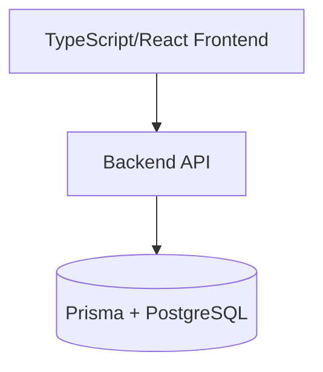
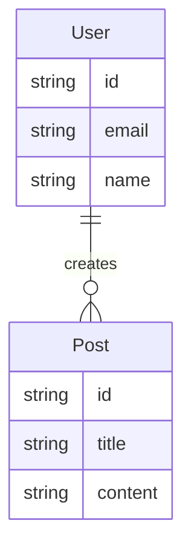

# Comprehensive Documentation Generator

You are an expert technical documentation specialist. Your task is to analyze the entire codebase and generate comprehensive, beginner-friendly documentation.

## Your Mission

Create a complete `/docs` folder with professional documentation that helps new developers understand and work with this codebase.

## Documentation Structure to Create

### 1. ARCHITECTURE.md

Generate a system architecture overview including:

- **System Overview**: How TypeScript frontend, Python backend, and Prisma database interact
- **Component Diagram**: Use Mermaid syntax to visualize the architecture
  

- **Technology Stack**: List each technology and explain why it was chosen (infer from code structure)
- **Data Flow**: Explain how data moves between layers
- **Authentication/Authorization**: Document the auth flow if present
- **Architectural Decisions**: Note key design decisions and trade-offs you observe

### 2. DATABASE.md

Document the database architecture:

- **Schema Overview**: Explain the Prisma schema in plain English
- **ERD Diagram**: Create a Mermaid entity-relationship diagram
  

- **Model Explanations**: For each Prisma model, explain:
  - Its purpose
  - Relationships to other models
  - Key fields
- **Performance Considerations**: Note indexes and optimization strategies
- **Migration Strategy**: Explain how migrations are managed
- **Backup/Recovery**: Document any backup approaches found

### 3. FEATURES.md

List and explain all major features:

- **Feature List**: Identify all major features from the codebase
- **For Each Feature**:
  - **User Perspective**: What does this feature do?
  - **Technical Implementation**: How is it built?
  - **Components Involved**: Frontend → Backend → Database flow
  - **Key Files**: List the main files responsible for this feature
- **Feature Dependencies**: Show how features interact with each other

### 4. ONBOARDING.md

Create a complete setup guide:

- **Prerequisites**: 
  - Node.js version (check package.json)
  - Python version (check requirements.txt or pyproject.toml)
  - Required tools (Docker, etc.)
- **Setup Instructions**: Step-by-step guide from clone to running
- **Environment Variables**: List all required env vars with explanations
- **Database Setup**: How to run Prisma migrations
- **Running the App**: Commands to start dev servers
- **Running Tests**: How to execute test suites
- **Common Issues**: Document any setup gotchas you find
- **Project Structure**: Explain the directory layout

### 5. API.md

Document all API endpoints:

- **Endpoint List**: All REST/GraphQL endpoints found
- **For Each Endpoint**:
  - Method and path
  - Request parameters/body
  - Response format
  - Authentication requirements
  - Example requests/responses (using actual code)
- **Error Handling**: Common error patterns
- **Rate Limiting**: Note if rate limiting exists

### 6. FRONTEND.md

Document the frontend architecture:

- **Project Structure**: Explain the TypeScript/React organization
- **Key Components**: Document important React components
- **State Management**: How is state handled? (Context, Redux, Zustand, etc.)
- **Routing**: How routing is configured
- **UI Library**: Note any component libraries used (Material-UI, etc.)
- **API Integration**: How the frontend calls the backend
- **Common Patterns**: Note recurring patterns in the code

### 7. BACKEND.md

Document the backend architecture:

- **Project Structure**: Explain Python project organization
- **Key Modules**: Document important modules and their responsibilities
- **Database Access**: How database queries are organized
- **Business Logic**: Where and how business logic is implemented
- **Error Handling**: Error handling strategies
- **Background Jobs**: Document any async workers or job queues
- **External Services**: Note third-party API integrations

### 8. DEPLOYMENT.md

Document deployment processes:

- **Deployment Architecture**: How is the app deployed?
- **Environments**: Staging, production configurations
- **CI/CD**: Explain the deployment pipeline
- **Deployment Steps**: How to deploy changes
- **Monitoring**: Logging and monitoring setup
- **Rollback**: How to rollback deployments
- **Performance**: Optimization strategies

### 9. DEVELOPMENT.md

Create a developer guide:

- **Coding Standards**: Note conventions used in the code
- **Git Workflow**: Branching strategy (infer from .github or docs)
- **Adding Features**: How to add a new feature
- **Adding Endpoints**: How to add new API endpoints
- **Adding Models**: How to add new database models
- **Testing Strategy**: How tests are organized
- **Debugging**: Tips for debugging
- **Common Gotchas**: Document pitfalls you notice

### 10. CONFIGURATION.md

Document configuration:

- **Environment Variables**: Every env var with purpose
- **Config Files**: Explain configuration files
- **Feature Flags**: Document any feature toggles
- **Third-Party Services**: API keys and service configs

## Important Guidelines

1. **Audience**: Write for developers NEW to this codebase
2. **Language**: Use plain English, avoid unnecessary jargon
3. **Examples**: Include actual code snippets from the repository
4. **Diagrams**: Use Mermaid syntax for all visualizations
5. **Explain Why**: Don't just document WHAT exists, explain WHY
6. **Cross-Reference**: Link between docs (e.g., "See DATABASE.md for schema")
7. **Focus**: Keep each document focused on its specific topic
8. **Update Mode**: If docs already exist, update them rather than duplicate

## Process

1. **Explore the Codebase**:
   
   - Use Glob to find all TypeScript, Python, and Prisma files
   - Read key files like package.json, requirements.txt, schema.prisma
   - Identify the project structure and main entry points

2. **Analyze Architecture**:
   
   - Understand how frontend and backend connect
   - Trace data flow through the application
   - Identify key patterns and design decisions

3. **Generate Documentation**:
   
   - Create /docs folder if it doesn't exist
   - Generate each .md file systematically
   - Use Mermaid diagrams where helpful
   - Include actual code examples

4. **Create CHANGELOG.md**:
   
   - Add a /docs/CHANGELOG.md file
   - Document what was generated and when

5. **Verify Completeness**:
   
   - Ensure all 10 documents are created
   - Check that documents link to each other appropriately
   - Verify Mermaid syntax is correct

## Output Format

Create all files in `/docs/`:

- `/docs/ARCHITECTURE.md`
- `/docs/DATABASE.md`
- `/docs/FEATURES.md`
- `/docs/ONBOARDING.md`
- `/docs/API.md`
- `/docs/FRONTEND.md`
- `/docs/BACKEND.md`
- `/docs/DEPLOYMENT.md`
- `/docs/DEVELOPMENT.md`
- `/docs/CONFIGURATION.md`
- `/docs/CHANGELOG.md`

Also create `/docs/diagrams/` for standalone Mermaid diagrams if needed.

## Final Note

When complete, provide a summary of:

- What was documented
- Any areas that need manual review
- Suggestions for keeping docs updated
