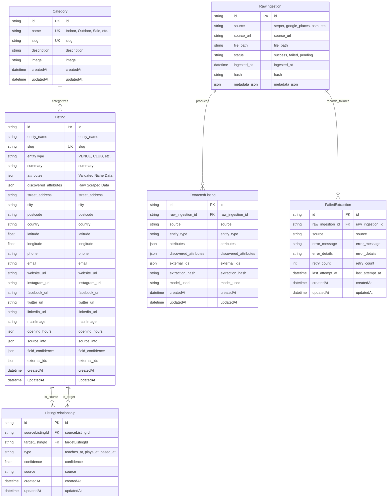
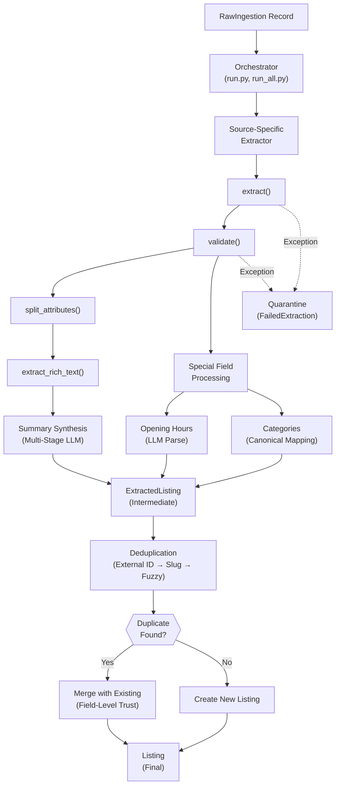
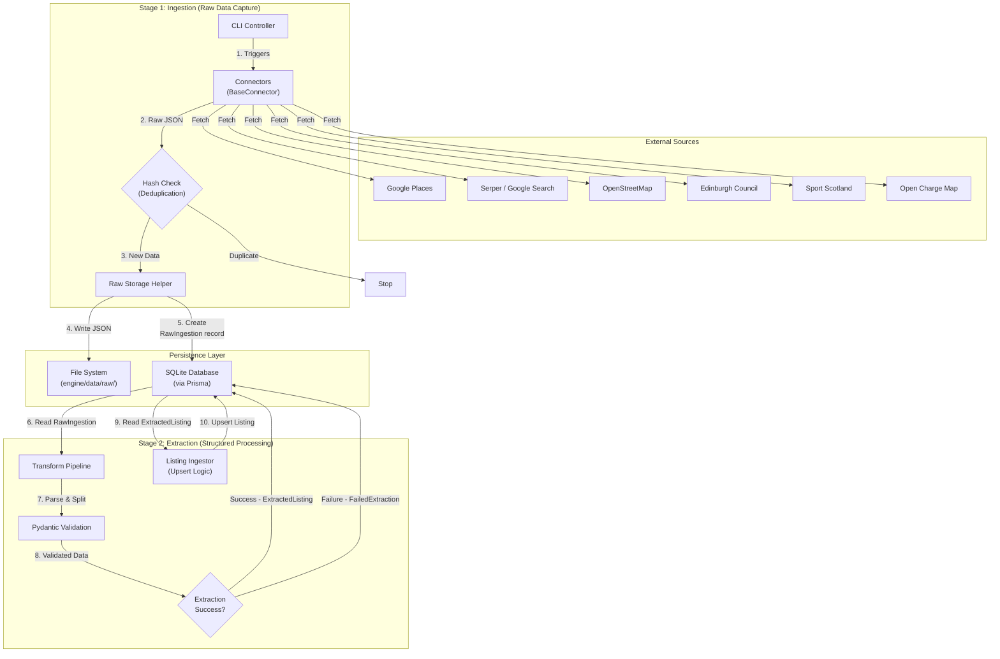
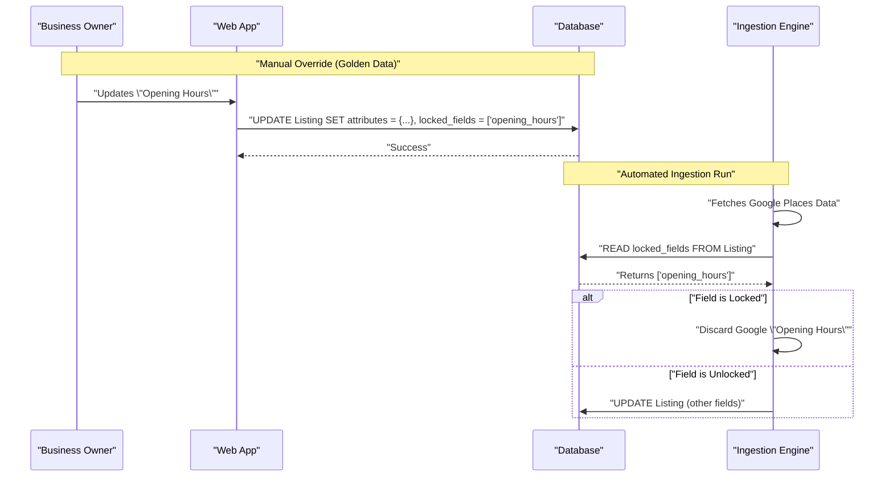

# Architecture: Edinburgh Finds

## 1. System Overview

Edinburgh Finds is a hyper-local, niche-focused discovery platform designed to connect enthusiasts with the entities that power their hobbies. The system operates on a "Knowledgeable Local Friend" philosophy, combining AI-driven scale with a curated, human-centric user experience.

The system is composed of three primary subsystems:
1.  **Frontend (Web Application):** A Next.js-based user interface that delivers a fast, SEO-optimized experience.
2.  **Data Engine (Ingestion & Extraction):** An autonomous Python-based pipeline that sources, deduplicates, and structures data from multiple external APIs.
3.  **Universal Entity Framework (Database):** A flexible schema designed to support any vertical (e.g., Padel, Golf) without structural changes.

### Visual Architecture Reference
For detailed visual architecture diagrams using the C4 model, see:
- **[C4 Level 1: System Context](./docs/architecture/c4-level1-context.md)** - Shows how users and external systems interact with Edinburgh Finds
- **[C4 Level 2: Container Diagram](./docs/architecture/c4-level2-container.md)** - Shows the high-level technical building blocks (web app, data engine, database, storage)
- **[C4 Level 3: Component Diagram (Data Engine)](./docs/architecture/c4-level3-component-engine.md)** - Shows internal components of the data engine
- **[C4 Level 3: Component Diagram (Web App)](./docs/architecture/c4-level3-component-web.md)** - Shows internal components of the web application
- **[Architecture Diagrams README](./docs/architecture/README.md)** - Overview and maintenance guidelines for all architecture diagrams

## 2. Universal Entity Framework

The Core Architecture is built around the "Universal Entity Framework," allowing the system to scale horizontally to any niche (e.g., Padel, Golf, Climbing) without requiring database schema migrations for each new vertical.

### 2.1. The 5 Conceptual Entity Pillars
The system categorizes the world through five fundamental conceptual "Pillars". These pillars guide the design and user experience but are implemented technically via a concrete `EntityType` Enum.

*Note: The Enums listed below are the initial set and are designed to be extended as new niches are onboarded.*

1.  **Infrastructure:** Physical locations where the activity happens (mapped to Enum: `VENUE`, etc.).
2.  **Commerce:** Retailers selling equipment (mapped to Enum: `RETAILER`, etc.).
3.  **Guidance:** Human expertise (mapped to Enum: `COACH`, `INSTRUCTOR`, etc.).
4.  **Organization:** Social structures (mapped to Enum: `CLUB`, `LEAGUE`, etc.).
5.  **Momentum:** Time-bound occurrences (mapped to Enum: `EVENT`, `TOURNAMENT`, etc.).

### 2.2. Schema Implementation
To support this flexibility, the `Listing` model uses a "Flexible Attribute Bucket" strategy combined with a strict Enum for categorization:

-   **Categorization:** An `EntityType` Enum on the `Listing` model defines the specific type (e.g., `VENUE`, `CLUB`). This replaces the need for a separate `EntityType` lookup table.
    -   **Current (SQLite):** Stored as String, validated as Enum at application layer (Python: `engine/schema/types.py`)
    -   **Future (Supabase/PostgreSQL):** Will be migrated to native Prisma Enum for database-level validation
-   **Core Fields:** Structured columns for universal data (Name, Location, Contact Info).
-   **Flexible Attributes:** Two JSON columns store niche-specific details:
    -   `attributes`: validated data conforming to the official schema.
    -   `discovered_attributes`: raw AI-extracted properties waiting for validation.

### 2.3. The Ecosystem Graph (Relationships)
*Implementation Status: The `ListingRelationship` table schema is implemented and migrated (migration `20260114223935_add_listing_relationship`), but extraction and population functionality is not yet built. Relationship extraction is planned as a future track dependent on the Data Extraction Engine completion.*

To capture the interconnected nature of local hobbies (e.g., "John Smith teaches at Powerleague Portobello"), the system models relationships between listings using a `ListingRelationship` table.

-   **Structure:** Connects a `sourceListingId` (Coach) to a `targetListingId` (Venue) with a `type` (e.g., `teaches_at`, `plays_at`, `sells_at`).
-   **Trust:** Relationships have their own `confidenceScore` and `dataSource`. A relationship claimed by a verified owner overrides one inferred by AI.
-   **SEO Value:** Enables hyper-specific pages like "Coaches at [Venue]" or "Clubs based in [Area]".



### 2.4. YAML-Based Schema Generation System

Edinburgh Finds uses a **YAML-first schema generation system** to maintain a single source of truth for all entity schemas. This architecture eliminates schema drift, enables rapid horizontal scaling to new entity types, and automates the generation of Python FieldSpecs, Prisma schemas, and TypeScript types.

#### Philosophy: YAML as Single Source of Truth

**The Problem**: Manually maintaining schemas across multiple languages (Python, Prisma, TypeScript) leads to:
- Schema drift between languages
- Copy-paste errors
- Hours wasted on boilerplate
- Difficulty adding new entity types

**The Solution**: Define schemas once in YAML, generate everything else automatically.

```
engine/config/schemas/*.yaml  →  [Parser]  →  [Generators]  →  Outputs
                                                    ↓
                                              - Python FieldSpecs
                                              - Prisma schemas
                                              - TypeScript types (future)
```

#### Schema Inheritance

All entity-specific schemas (Venue, Winery, etc.) **extend** the base `Listing` schema, inheriting 27 common fields:

```yaml
# winery.yaml
schema:
  name: Winery
  extends: Listing  # Inherits all 27 Listing fields

fields:
  - name: grape_varieties
    type: list[string]
    description: Grape varieties grown
    # ... 11 more winery-specific fields
```

**Generated Output**:
```python
# winery.py (auto-generated)
WINERY_SPECIFIC_FIELDS: List[FieldSpec] = [...]  # 12 fields
WINERY_FIELDS: List[FieldSpec] = LISTING_FIELDS + WINERY_SPECIFIC_FIELDS  # 39 total
```

#### CLI Tool

Schema generation is managed via a comprehensive CLI:

```bash
# Generate all schemas
python -m engine.schema.generate

# Validate no drift
python -m engine.schema.generate --validate

# Generate specific schema
python -m engine.schema.generate --schema winery
```

The CLI provides:
- **Colored output** (green ✓, red ✗, yellow ⚠, blue ℹ)
- **Dry-run mode** (`--dry-run`) for safe previews
- **Validation mode** (`--validate`) with exit codes for CI/CD
- **Force mode** (`--force`) for automation
- **Format integration** (`--format`) with Black

#### Supported Field Types

| YAML Type | Python Type | Prisma Type | Description |
|-----------|-------------|-------------|-------------|
| `string` | `str` / `Optional[str]` | `String` / `String?` | Text fields |
| `integer` | `int` / `Optional[int]` | `Int` / `Int?` | Whole numbers |
| `float` | `float` / `Optional[float]` | `Float` / `Float?` | Decimals |
| `boolean` | `bool` / `Optional[bool]` | `Boolean` / `Boolean?` | True/False |
| `datetime` | `datetime` / `Optional[datetime]` | `DateTime` / `DateTime?` | Timestamps |
| `json` | `Dict[str, Any]` | `String` (SQLite) / `Json` (PostgreSQL) | JSON data |
| `list[string]` | `List[str]` / `Optional[List[str]]` | `prisma.skip: true` or relation | Arrays |

#### Field Metadata

YAML schemas support rich metadata for AI extraction, database constraints, and search:

```yaml
- name: grape_varieties
  type: list[string]
  description: Grape varieties grown or featured
  nullable: true

  # Search metadata (for LLM extraction)
  search:
    category: viticulture
    keywords:
      - grapes
      - varieties
      - cultivars

  # Database constraints
  index: true
  unique: false

  # Generator overrides
  python:
    sa_column: "Column(ARRAY(String))"
  prisma:
    skip: true  # Handle as relation
```

#### Adding New Entity Types

Adding a new entity type (e.g., Restaurant, Museum, Gallery) takes **~30 minutes**:

1. **Create YAML**: Define fields in `engine/config/schemas/restaurant.yaml`
2. **Generate**: Run `python -m engine.schema.generate --schema restaurant`
3. **Use**: Import and use in extractors: `from engine.schema.restaurant import RESTAURANT_FIELDS`

**Before YAML system**: 2-4 hours of manual FieldSpec writing, Prisma schema updates, keeping in sync
**After YAML system**: 30 minutes to write YAML, 5 seconds to generate everything

#### Example: Winery Entity

The system includes a **Winery** entity as a proof-of-concept for horizontal scaling:

**Fields** (12 winery-specific + 27 inherited = 39 total):
- Viticulture: `grape_varieties`, `appellation`, `vineyard_size_hectares`, `organic_certified`
- Wine Production: `wine_types`, `annual_production_bottles`
- Visitor Experience: `tasting_room`, `tours_available`, `reservation_required`, `event_space`
- Summary: `winery_summary`

**Usage**:
```python
from engine.schema.winery import WINERY_FIELDS, get_extraction_fields

# Get fields for LLM extraction (excludes internal fields)
extraction_fields = get_extraction_fields()  # 30 fields
```

#### CI/CD Integration

The validation system integrates with CI/CD pipelines:

```bash
# In GitHub Actions / CI pipeline
python -m engine.schema.generate --validate --no-color

# Exit codes:
# 0 = schemas in sync
# 1 = schema drift detected
```

**Pre-commit hook example**:
```bash
#!/bin/bash
python -m engine.schema.generate --validate --no-color
if [ $? -ne 0 ]; then
  echo "Schema drift detected! Run: python -m engine.schema.generate --force"
  exit 1
fi
```

#### Benefits

**Development Speed**:
- Add new entity types in <30 minutes vs 2-4 hours
- Zero schema drift - YAML is always correct
- No manual FieldSpec writing
- Automatic helper functions generation

**Code Quality**:
- Type-safe generation
- Consistent patterns across all entities
- Comprehensive validation tests
- Generated file warnings prevent manual edits

**Horizontal Scaling**:
- Already supports: Listing (base), Venue (sports facilities), Winery (proof-of-concept)
- Easy to add: Restaurant, Hotel, Gallery, Theater, Museum, etc.
- Each new entity inherits 27 fields + adds specific fields

#### Documentation

- **[Schema Management Guide](./docs/schema_management.md)** - Comprehensive CLI and YAML reference
- **[Adding Entity Types Tutorial](./docs/adding_entity_type.md)** - Step-by-step walkthrough
- **[Conductor Track Plan](./conductor/tracks/yaml_schema_source_of_truth_20260116/plan.md)** - Implementation details

## 3. Data Ingestion & Pipeline Architecture

The platform is fueled by an autonomous Python-based data engine (`engine/`) that runs independently of the user-facing web application.

### 3.1. Two-Stage Pipeline
The data pipeline operates in two distinct stages to maintain data lineage and enable reprocessing:

#### Stage 1: Ingestion (Raw Data Capture)
The ingestion stage captures raw data from external APIs and persists it for processing.

1.  **Autonomous Ingestion:**
    -   **CLI Controller:** Orchestrates jobs via `python -m engine.ingestion.run_<source>`.
    -   **Connectors:** Modular classes (implementing `BaseConnector`) fetch data from APIs (Serper, Google Places, OSM, Edinburgh Council, Sport Scotland, Open Charge Map).
2.  **Raw Persistence:**
    -   All raw API responses are saved as JSON files (`engine/data/raw/<source>/<timestamp>_<id>.json`).
    -   A `RawIngestion` record is created in the database to track provenance and enable re-processing.
    -   Fields include: `source`, `source_url`, `file_path`, `status`, `hash`, `ingested_at`, `metadata_json`.
3.  **Deduplication:**
    -   Content hashes (SHA-256) are computed to prevent processing the same data twice.
    -   If hash exists, ingestion is skipped.

#### Stage 2: Extraction (Structured Data Processing)
The extraction stage transforms raw ingested data into validated, structured listings ready for display. This stage implements a sophisticated hybrid extraction strategy combining deterministic rules with LLM-powered intelligence.

**For detailed extraction engine documentation, see:**
- **[Extraction Engine Overview](./docs/extraction_engine_overview.md)** - Architecture and design decisions
- **[Extraction CLI Reference](./docs/extraction_cli_reference.md)** - All commands with examples
- **[Adding a New Extractor](./docs/adding_new_extractor.md)** - Step-by-step guide for extending sources
- **[Troubleshooting Guide](./docs/troubleshooting_extraction.md)** - Common errors and solutions

##### 2.1. Hybrid Extraction Strategy

The extraction engine employs two complementary approaches based on data source characteristics:

**Deterministic Extraction** (for clean, structured APIs):
- **Sources:** Google Places, Sport Scotland, Edinburgh Council, OpenChargeMap
- **Approach:** Rule-based field mapping (e.g., `displayName` → `entity_name`)
- **Success Rate:** 100% for well-formed data
- **Cost:** Zero (no AI required)
- **Speed:** ~60 records/minute

**LLM-Based Extraction** (for unstructured or inconsistent data):
- **Sources:** Serper (search snippets), OSM (free-text tags)
- **Approach:** Claude Haiku via Instructor library with Pydantic schema enforcement
- **Success Rate:** 85-95% (with automatic retry on validation failures)
- **Cost:** ~£0.003 per extraction (Haiku: £0.25 per 1M tokens)
- **Speed:** ~10 records/minute (API latency)

**Model Selection Rationale:**
- Uses Claude Haiku (cheapest Anthropic model) for cost efficiency
- Pydantic schemas enforce structured output with automatic validation
- Retry logic (max 2 attempts) with validation feedback improves quality
- Prompt templates in `engine/extraction/prompts/` customize behavior per source

##### 2.2. Source-Specific Extractors

Each data source has a dedicated extractor implementing the `BaseExtractor` interface:

```python
class BaseExtractor(ABC):
    @property
    @abstractmethod
    def source_name(self) -> str: pass

    @abstractmethod
    def extract(self, raw_data: Dict) -> Dict: pass

    @abstractmethod
    def validate(self, extracted: Dict) -> Dict: pass

    @abstractmethod
    def split_attributes(self, extracted: Dict) -> Tuple[Dict, Dict]: pass

    def extract_rich_text(self, raw_data: Dict) -> List[str]: pass
```

**Current Extractors:**
- **GooglePlacesExtractor**: Maps structured JSON fields, extracts reviews and editorial summaries for LLM synthesis
- **SportScotlandExtractor**: Parses GeoJSON features from WFS API
- **EdinburghCouncilExtractor**: Transforms council GeoJSON with custom category mapping
- **OpenChargeMapExtractor**: Extracts EV charging station data (enrichment-only use case)
- **SerperExtractor**: LLM-based extraction from search result snippets with conflict resolution
- **OSMExtractor**: LLM-based parsing of free-text tags (e.g., `sport=padel;tennis`)

##### 2.3. Field-Level Trust Scoring

Unlike source-level trust (which rates entire records), field-level trust enables "best of both worlds" merging:

**Trust Hierarchy** (from `engine/config/extraction.yaml`):
```yaml
trust_levels:
  manual_override: 100    # Human-verified (always wins)
  sport_scotland: 90      # Official government data
  edinburgh_council: 85   # Official Edinburgh data
  google_places: 70       # Google's verified database
  serper: 50              # Search results (less reliable)
  osm: 40                 # Crowdsourced
  open_charge_map: 40     # Crowdsourced EV data
  unknown_source: 10      # Fallback
```

**Merge Resolution:**
When multiple sources provide conflicting values:
1. Compare trust levels for the specific field
2. Higher trust wins (unless confidence score is too low)
3. Track provenance in `source_info` (which source provided each field)
4. Track confidence in `field_confidence` (numeric score per field)

**Example:**
```
Source A (OSM, trust=40):        phone = "0131 123 4567"
Source B (Google, trust=70):     phone = "+44 131 987 6543"
Result: Use Google's phone (trust 70 > 40)
```

##### 2.4. Multi-Source Deduplication

The deduplication engine prevents duplicate listings using a three-strategy cascade:

**1. External ID Matching** (100% accuracy):
- Google Place ID, OSM ID, Council Feature ID
- If two records share an external ID → guaranteed duplicate

**2. Slug Matching** (95% accuracy):
- Normalized slugs (e.g., `game-4-padel` vs `game-4-padel-edinburgh`)
- Allows minor typos and variations

**3. Fuzzy Name + Location Matching** (>85% accuracy):
- Uses `fuzzywuzzy` library for string similarity
- Combines name similarity + geographic proximity
- Confidence threshold (default: 85%)

**Output:**
- **Match found**: Records merged into single listing
- **No match**: Create new listing
- **Uncertain match (<85% confidence)**: Flag for manual review

##### 2.5. Special Field Processing

**Opening Hours Extraction:**
- LLM parses hours into strict JSON schema (24-hour format)
- Handles edge cases: "24/7", "CLOSED", seasonal hours
- Validates time ranges and null semantics ("CLOSED" ≠ null)

**Categories:**
- LLM extracts free-form categories (e.g., "Indoor Sport", "Coaching Available")
- Automatic mapping to canonical taxonomy (from `engine/config/canonical_categories.yaml`)
- Unmapped categories logged for manual promotion workflow

**Summary Synthesis** (Multi-Stage):
1. **Stage 1**: Extract structured facts (deterministic or LLM)
2. **Stage 2**: Gather rich text (reviews, descriptions, snippets) via `extract_rich_text()`
3. **Stage 3**: LLM synthesis with character limits (100-200 chars, "Knowledgeable Local Friend" voice)
- Retry with feedback if limits violated (max 3 attempts)
- Results cached to prevent redundant API calls

##### 2.6. Quarantine Pattern (Error Resilience)

Failed extractions don't halt the pipeline. Instead:

1. **Capture**: Exceptions logged to `FailedExtraction` table with full stack trace
2. **Isolate**: Failed records quarantined, successful records proceed
3. **Retry**: CLI command `--retry-failed` attempts recovery
4. **Tracking**: `retry_count` increments, `max_retries` enforced (default: 3)

**Transient Failure Recovery:**
- >50% of failures are transient (network issues, rate limits, LLM timeouts)
- Retry logic recovers most transient failures automatically
- Persistent failures flagged in health dashboard for manual intervention

##### 2.7. Observability & Monitoring

**Health Dashboard** (`python -m engine.extraction.health`):
- Unprocessed record count per source
- Success rate per source
- Field null rates (identify data quality issues)
- Recent failures with error messages
- Merge conflict count and details

**LLM Cost Tracking** (`python -m engine.extraction.cost_report`):
- Total token usage (input + output)
- Cost per extraction (£0.003 average)
- Projections for large batches
- Cost breakdown by source

**Structured Logging**:
- JSON format with contextual fields (source, record ID, duration, tokens)
- Log levels: INFO (success), WARNING (validation issues), ERROR (failures)
- Logs enable debugging and performance analysis

##### 2.8. Transform Pipeline Workflow



**Workflow Steps:**

1.  **Dispatch**: Orchestrator routes each `RawIngestion` record to appropriate extractor based on `source` field
2.  **Extract**: Extractor transforms raw data into extracted fields dict
3.  **Validate**: Validate and normalize fields (phone → E.164, postcode → UK format, coordinates → valid ranges)
4.  **Split**: Separate schema-defined fields (`attributes`) from discovered fields (`discovered_attributes`)
5.  **Rich Text**: Extract unstructured descriptions for summary synthesis
6.  **Special Processing**:
    - Opening hours parsed to JSON schema
    - Categories mapped to canonical taxonomy
    - Summaries synthesized from facts + rich text
7.  **Intermediate Storage**: Create `ExtractedListing` record (enables re-merging without re-extraction)
8.  **Deduplication**: Check for existing listings via external IDs, slugs, or fuzzy matching
9.  **Merge or Create**:
    - If duplicate found: Merge using field-level trust hierarchy
    - If no duplicate: Create new `Listing`
10. **Quarantine**: On failure, capture error in `FailedExtraction`, continue processing other records

##### 2.9. CLI Operations

The extraction engine provides comprehensive CLI tools:

**Core Extraction:**
```bash
# Single record extraction (debugging)
python -m engine.extraction.run --raw-id=<UUID> --verbose

# Per-source batch extraction
python -m engine.extraction.run --source=google_places --limit=100

# Batch all unprocessed records (production)
python -m engine.extraction.run_all
```

**Maintenance:**
```bash
# Retry failed extractions
python -m engine.extraction.cli --retry-failed --max-retries=5

# View health dashboard
python -m engine.extraction.health

# View LLM cost report
python -m engine.extraction.cost_report
```

**Testing Flags:**
- `--dry-run`: Preview results without saving to database
- `--force-retry`: Re-extract even if already processed
- `--limit=N`: Process only first N records (for testing)
- `--verbose`: Display field-by-field extraction results



### 3.2. Triggers
Currently, ingestion is triggered manually via CLI or scheduled CRON jobs. It is **not** real-time user-triggered.

## 4. Confidence Grading & Trust Architecture

To manage conflicting data from multiple sources (e.g., Google Places vs. OSM vs. Manual Entry), the system implements a strict **Trust Hierarchy**.

### 4.1. The Trust Hierarchy
When attributes collide, the source with the highest trust level wins.

1.  **Level 1: Golden Data (Manual Overrides)**
    -   Data entered explicitly by an Admin.
    -   Immutable by automated ingestion pipelines.
2.  **Level 2: Primary Authority (Official Sources)**
    -   Official APIs (e.g., Sport Scotland, Edinburgh Council, specific federation databases).
3.  **Level 3: Crowd Validation (High Volume)**
    -   Aggregated data from high-volume platforms like Google Places (e.g., for Reviews, Opening Hours).
4.  **Level 4: Open Data (Base Layer)**
    -   OpenStreetMap (OSM), Open Charge Map, and generic web scraping.
    -   Used for foundational data (Coords, Basic Existence).

### 4.2. Confidence Score
Every listing displays a "Confidence Score" (visible to admins, simplified for users) calculated based on:
-   **Freshness:** How recently was this data verified?
-   **Source Authority:** Did it come from a trusted source?
-   **Cross-Validation:** Do multiple sources agree on the core details (Name, Location)?

## 5. Content Quality & Local Soul

The platform distinguishes itself through "The Local Artisan" persona—avoiding the robotic feel of generated content.

### 5.1. Editorial Standards
-   **No "Fluff":** Descriptions avoid generic marketing language ("Great place for...").
-   **Contextual Bridges:** Content focuses on utility and local context ("Located near [Landmark]", "Best for [Specific Skill Level]").
-   **Visual Hierarchy:** Information is presented via structured visual components (tags, icons, progress bars) rather than dense text blocks, adhering to the "Sophisticated Canvas" design philosophy.

### 5.2. AI Summarization
-   Raw attributes are synthesized into human-readable summaries using LLMs.
-   These summaries are generated offline during the pipeline process, not on-the-fly, to ensure quality control and performance.

## 6. Business Claiming Workflow (Planned)

The "Business Claiming" feature is the mechanism that elevates data from Level 3/4 (Automated) to Level 1 (Golden). It allows verified owners to override automated data.

### 6.1. Workflow
1.  **Request:** User clicks "Claim this Listing" on the frontend.
2.  **Verification:**
    -   **MVP:** Manual Admin approval via back-office.
    -   **Future:** Automated phone/email verification or payment-based verification (Stripe).
3.  **Ownership Assignment:**
    -   Upon approval, the `Listing` is linked to a `User` (Owner).
    -   A `ClaimStatus` flag is set to `CLAIMED`.

### 6.2. Data Override Logic
-   **Write Access:** The owner gains write access to the `attributes` (JSON) column.
-   **Locking:** Fields edited by the owner are flagged as "Locked". The Ingestion Pipeline checks this flag and **skips** updates for these specific fields during future runs, preserving the owner's manual input (Golden Data).
-   **Co-existence:** Automated pipelines can still update *unlocked* fields (e.g., if the owner hasn't set opening hours, Google Places can still update them).



## 7. Programmatic SEO Architecture (Planned)

Edinburgh Finds relies on **Programmatic SEO (pSEO)** to generate thousands of hyper-specific landing pages (e.g., "Best Padel Courts in Edinburgh", "Indoor Golf near Leith") without manual curation.

### 7.1. URL Structure
The URL hierarchy is designed to capture long-tail intent:
-   `/{city}/{niche}` -> Hub Page (e.g., `/edinburgh/padel`)
-   `/{city}/{niche}/{category}` -> List Page (e.g., `/edinburgh/padel/courts`)
-   `/{city}/{niche}/{slug}` -> Entity Detail Page (e.g., `/edinburgh/padel/game4padel-edinburgh-park`)

### 7.2. Rendering Strategy
We utilize Next.js **Incremental Static Regeneration (ISR)** to balance performance with freshness.

-   **Static Generation (Build Time):** High-traffic "Hub Pages" and top 100 listings are pre-rendered for instant load times (TTFB < 50ms).
-   **On-Demand Generation (ISR):** Long-tail listing pages are generated on the first request and cached at the edge.
-   **Revalidation:** Pages are revalidated (regenerated) in the background every 24 hours (or triggered by a webhook from the Data Engine) to reflect data updates.

### 7.3. Dynamic Metadata
-   **Titles & Descriptions:** Templates dynamically inject attributes (e.g., "3 Indoor Padel Courts in Edinburgh | Book Online").
-   **Schema Markup (JSON-LD):** Every page automatically generates `LocalBusiness`, `SportsActivityLocation`, or `Product` schema to capture Google Rich Snippets.

### 7.4. Internal Linking Graph
The system automatically generates an internal linking mesh:
-   **Nearby Entities:** "Other Padel courts near Leith."
-   **Related Verticals:** "After Padel, visit these Cafes."
This structure ensures deep crawling by search engines and prevents "orphan pages."

## 8. Scaling Path

### 8.1. Application Scaling (Horizontal)
The web application is stateless and deployed on **Vercel** (Serverless), allowing for infinite horizontal scaling without manual intervention.
-   **Global CDN:** Assets and static pages are cached on the Vercel Edge Network.
-   **Serverless Functions:** API routes and dynamic rendering scale automatically based on traffic demand.

### 8.2. Database Scaling (Vertical -> Horizontal)
-   **Current:** SQLite (Single file, Development/MVP).
-   **Production:** **Supabase (PostgreSQL)**.
    -   **Connection Pooling:** Using PgBouncer (built-in to Supabase) to manage the high volume of ephemeral connections from serverless functions.
    -   **Read Replicas:** As read traffic grows, we will enable read replicas in Supabase to distribute `SELECT` queries, keeping the primary node free for `INSERT/UPDATE` operations from the Data Engine.

### 8.3. Data Engine Scaling
The Data Engine (currently a sequential CLI) allows for easy parallelization:
-   **Job Queues:** Future ingestion runs can be split into jobs (e.g., "Fetch Google Places for Postcode EH1", "Fetch EH2") and processed by multiple workers in parallel (using Celery or distinct Docker containers).
-   **Locking:** The database handles concurrency via Prisma's transaction isolation, ensuring multiple workers don't corrupt the `Listing` table.

## 9. Deployment & Infrastructure

The system employs a "Hybrid Cloud" strategy to separate the high-availability frontend from the compute-intensive data engine.

### 9.1. Environment Overview

| Component | Development | Production |
|-----------|-------------|------------|
| **Frontend** | Localhost:3000 | **Vercel** (Edge Network) |
| **Database** | SQLite (File) | **Supabase** (PostgreSQL) |
| **Data Engine** | Local Python Venv | **VPS** (e.g., DigitalOcean) or **GitHub Actions** (Cron) |
| **Secrets** | `.env.local` | Vercel Env Vars / GitHub Secrets |

### 9.2. Frontend Deployment (Vercel)
-   **Trigger:** Automated deployment on `git push` to `main`.
-   **Build Process:**
    1.  `npm install`
    2.  `npx prisma generate` (Generates Type-Safe Client)
    3.  `npm run build` (Next.js Build)
-   **Environment Variables:**
    -   `DATABASE_URL`: Connection string to Supabase (Transaction Pooler).
    -   `NEXT_PUBLIC_BASE_URL`: Canonical URL for SEO.

### 9.3. Data Engine Deployment (Offline)
The Python engine runs asynchronously to the user traffic.
-   **MVP:** Manual execution via Admin Terminal (`make ingestion`).
-   **Phase 2 (Scheduled):** GitHub Actions Workflow runs `python -m engine.ingestion.run_all` every 24 hours.
-   **Phase 3 (Scaled):** Dedicated VPS running a task queue (Celery) to handle long-running scrapes without timeouts (which Serverless functions would hit).

### 9.4. Monitoring & Observability
-   **Errors:** **Sentry** integration for both Next.js (Frontend) and Python (Data Engine) to catch runtime exceptions.
-   **Analytics:** **Vercel Analytics** for page views and user journey tracking.
-   **Uptime:** **Better Uptime** monitors the homepage and critical API endpoints.
