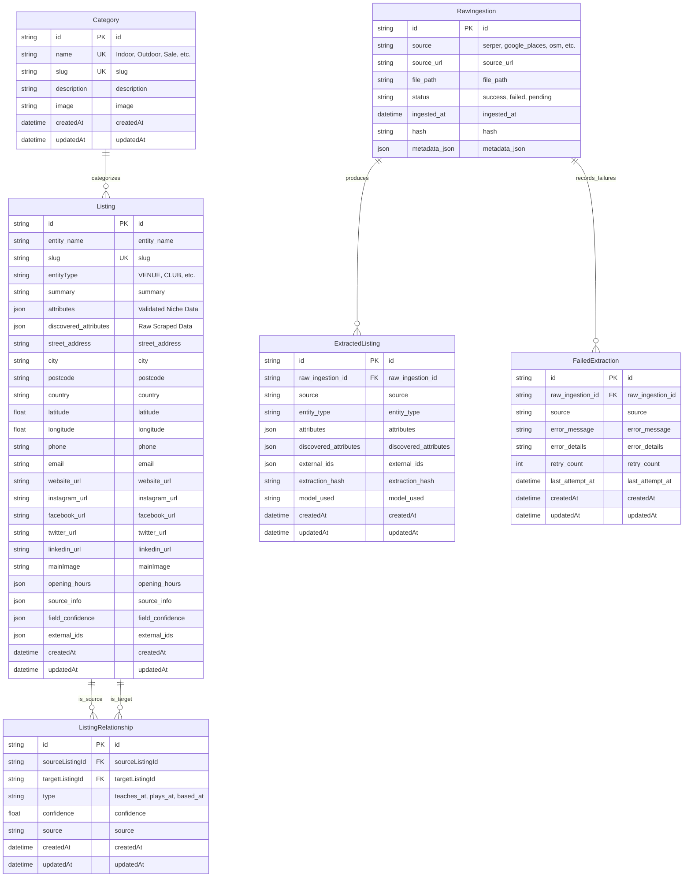
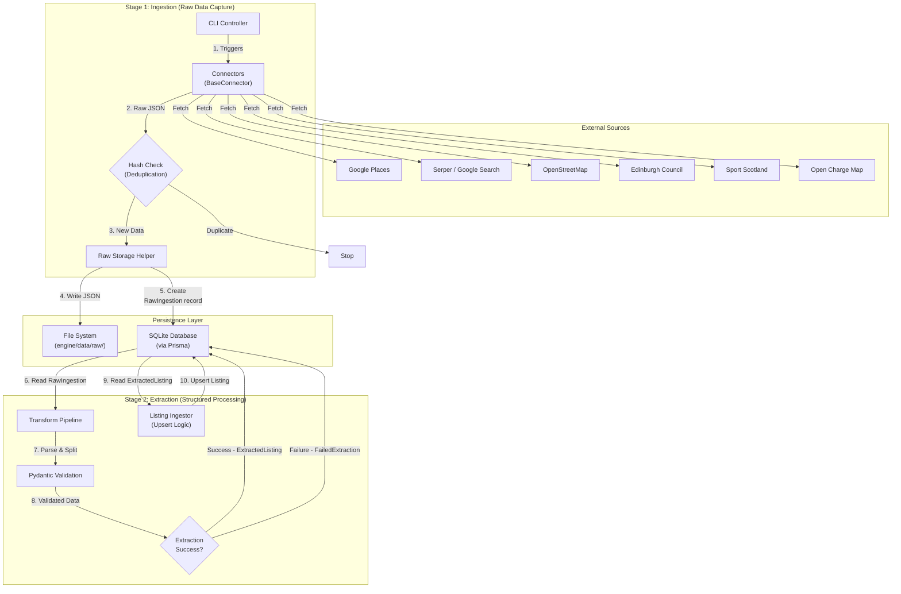
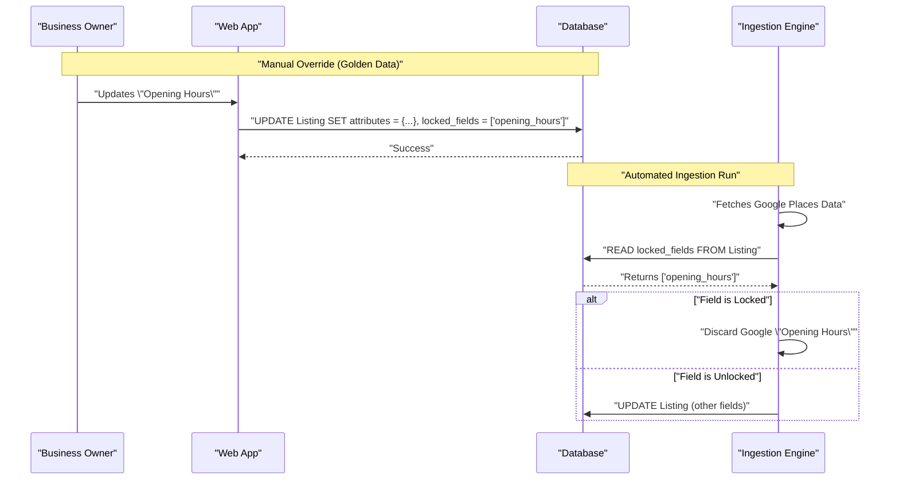

# Architecture: Edinburgh Finds

## 1. System Overview

Edinburgh Finds is a hyper-local, niche-focused discovery platform designed to connect enthusiasts with the entities that power their hobbies. The system operates on a "Knowledgeable Local Friend" philosophy, combining AI-driven scale with a curated, human-centric user experience.

The system is composed of three primary subsystems:
1.  **Frontend (Web Application):** A Next.js-based user interface that delivers a fast, SEO-optimized experience.
2.  **Data Engine (Ingestion & Extraction):** An autonomous Python-based pipeline that sources, deduplicates, and structures data from multiple external APIs.
3.  **Universal Entity Framework (Database):** A flexible schema designed to support any vertical (e.g., Padel, Golf) without structural changes.

### Visual Architecture Reference
For detailed visual architecture diagrams using the C4 model, see:
- **[C4 Level 1: System Context](./docs/architecture/c4-level1-context.md)** - Shows how users and external systems interact with Edinburgh Finds
- **[C4 Level 2: Container Diagram](./docs/architecture/c4-level2-container.md)** - Shows the high-level technical building blocks (web app, data engine, database, storage)
- **[C4 Level 3: Component Diagram (Data Engine)](./docs/architecture/c4-level3-component-engine.md)** - Shows internal components of the data engine
- **[C4 Level 3: Component Diagram (Web App)](./docs/architecture/c4-level3-component-web.md)** - Shows internal components of the web application
- **[Architecture Diagrams README](./docs/architecture/README.md)** - Overview and maintenance guidelines for all architecture diagrams

## 2. Universal Entity Framework

The Core Architecture is built around the "Universal Entity Framework," allowing the system to scale horizontally to any niche (e.g., Padel, Golf, Climbing) without requiring database schema migrations for each new vertical.

### 2.1. The 5 Conceptual Entity Pillars
The system categorizes the world through five fundamental conceptual "Pillars". These pillars guide the design and user experience but are implemented technically via a concrete `EntityType` Enum.

*Note: The Enums listed below are the initial set and are designed to be extended as new niches are onboarded.*

1.  **Infrastructure:** Physical locations where the activity happens (mapped to Enum: `VENUE`, etc.).
2.  **Commerce:** Retailers selling equipment (mapped to Enum: `RETAILER`, etc.).
3.  **Guidance:** Human expertise (mapped to Enum: `COACH`, `INSTRUCTOR`, etc.).
4.  **Organization:** Social structures (mapped to Enum: `CLUB`, `LEAGUE`, etc.).
5.  **Momentum:** Time-bound occurrences (mapped to Enum: `EVENT`, `TOURNAMENT`, etc.).

### 2.2. Schema Implementation
To support this flexibility, the `Listing` model uses a "Flexible Attribute Bucket" strategy combined with a strict Enum for categorization:

-   **Categorization:** An `EntityType` Enum on the `Listing` model defines the specific type (e.g., `VENUE`, `CLUB`). This replaces the need for a separate `EntityType` lookup table.
    -   **Current (SQLite):** Stored as String, validated as Enum at application layer (Python: `engine/schema/types.py`)
    -   **Future (Supabase/PostgreSQL):** Will be migrated to native Prisma Enum for database-level validation
-   **Core Fields:** Structured columns for universal data (Name, Location, Contact Info).
-   **Flexible Attributes:** Two JSON columns store niche-specific details:
    -   `attributes`: validated data conforming to the official schema.
    -   `discovered_attributes`: raw AI-extracted properties waiting for validation.

### 2.3. The Ecosystem Graph (Relationships)
*Implementation Status: The `ListingRelationship` table schema is implemented and migrated (migration `20260114223935_add_listing_relationship`), but extraction and population functionality is not yet built. Relationship extraction is planned as a future track dependent on the Data Extraction Engine completion.*

To capture the interconnected nature of local hobbies (e.g., "John Smith teaches at Powerleague Portobello"), the system models relationships between listings using a `ListingRelationship` table.

-   **Structure:** Connects a `sourceListingId` (Coach) to a `targetListingId` (Venue) with a `type` (e.g., `teaches_at`, `plays_at`, `sells_at`).
-   **Trust:** Relationships have their own `confidenceScore` and `dataSource`. A relationship claimed by a verified owner overrides one inferred by AI.
-   **SEO Value:** Enables hyper-specific pages like "Coaches at [Venue]" or "Clubs based in [Area]".

## 3. Data Ingestion & Pipeline Architecture

The platform is fueled by an autonomous Python-based data engine (`engine/`) that runs independently of the user-facing web application.

### 3.1. Two-Stage Pipeline
The data pipeline operates in two distinct stages to maintain data lineage and enable reprocessing:

#### Stage 1: Ingestion (Raw Data Capture)
The ingestion stage captures raw data from external APIs and persists it for processing.

1.  **Autonomous Ingestion:**
    -   **CLI Controller:** Orchestrates jobs via `python -m engine.ingestion.run_<source>`.
    -   **Connectors:** Modular classes (implementing `BaseConnector`) fetch data from APIs (Serper, Google Places, OSM, Edinburgh Council, Sport Scotland, Open Charge Map).
2.  **Raw Persistence:**
    -   All raw API responses are saved as JSON files (`engine/data/raw/<source>/<timestamp>_<id>.json`).
    -   A `RawIngestion` record is created in the database to track provenance and enable re-processing.
    -   Fields include: `source`, `source_url`, `file_path`, `status`, `hash`, `ingested_at`, `metadata_json`.
3.  **Deduplication:**
    -   Content hashes (SHA-256) are computed to prevent processing the same data twice.
    -   If hash exists, ingestion is skipped.

#### Stage 2: Extraction (Structured Data Processing)
The extraction stage transforms raw ingested data into validated, structured listings.

1.  **Transform Pipeline:**
    -   Raw data from `RawIngestion` is parsed using connector-specific transform logic.
    -   Data is split into `attributes` (validated fields) and `discovered_attributes` (unstructured AI-extracted data).
    -   Pydantic models validate data against the schema.
2.  **Extraction Tracking:**
    -   **Success:** `ExtractedListing` records are created with `extraction_hash` for deduplication.
    -   **Failure:** `FailedExtraction` records capture errors with retry tracking (`retry_count`, `error_message`, `error_details`).
3.  **Listing Upsert:**
    -   Validated `ExtractedListing` data is "Upserted" (Update or Insert) into the `Listing` table.
    -   Trust Architecture rules determine which source wins during conflicts.

### 3.2. Triggers
Currently, ingestion is triggered manually via CLI or scheduled CRON jobs. It is **not** real-time user-triggered.

## 4. Confidence Grading & Trust Architecture

To manage conflicting data from multiple sources (e.g., Google Places vs. OSM vs. Manual Entry), the system implements a strict **Trust Hierarchy**.

### 4.1. The Trust Hierarchy
When attributes collide, the source with the highest trust level wins.

1.  **Level 1: Golden Data (Manual Overrides)**
    -   Data entered explicitly by an Admin.
    -   Immutable by automated ingestion pipelines.
2.  **Level 2: Primary Authority (Official Sources)**
    -   Official APIs (e.g., Sport Scotland, Edinburgh Council, specific federation databases).
3.  **Level 3: Crowd Validation (High Volume)**
    -   Aggregated data from high-volume platforms like Google Places (e.g., for Reviews, Opening Hours).
4.  **Level 4: Open Data (Base Layer)**
    -   OpenStreetMap (OSM), Open Charge Map, and generic web scraping.
    -   Used for foundational data (Coords, Basic Existence).

### 4.2. Confidence Score
Every listing displays a "Confidence Score" (visible to admins, simplified for users) calculated based on:
-   **Freshness:** How recently was this data verified?
-   **Source Authority:** Did it come from a trusted source?
-   **Cross-Validation:** Do multiple sources agree on the core details (Name, Location)?

## 5. Content Quality & Local Soul

The platform distinguishes itself through "The Local Artisan" persona—avoiding the robotic feel of generated content.

### 5.1. Editorial Standards
-   **No "Fluff":** Descriptions avoid generic marketing language ("Great place for...").
-   **Contextual Bridges:** Content focuses on utility and local context ("Located near [Landmark]", "Best for [Specific Skill Level]").
-   **Visual Hierarchy:** Information is presented via structured visual components (tags, icons, progress bars) rather than dense text blocks, adhering to the "Sophisticated Canvas" design philosophy.

### 5.2. AI Summarization
-   Raw attributes are synthesized into human-readable summaries using LLMs.
-   These summaries are generated offline during the pipeline process, not on-the-fly, to ensure quality control and performance.

## 6. Business Claiming Workflow (Planned)

The "Business Claiming" feature is the mechanism that elevates data from Level 3/4 (Automated) to Level 1 (Golden). It allows verified owners to override automated data.

### 6.1. Workflow
1.  **Request:** User clicks "Claim this Listing" on the frontend.
2.  **Verification:**
    -   **MVP:** Manual Admin approval via back-office.
    -   **Future:** Automated phone/email verification or payment-based verification (Stripe).
3.  **Ownership Assignment:**
    -   Upon approval, the `Listing` is linked to a `User` (Owner).
    -   A `ClaimStatus` flag is set to `CLAIMED`.

### 6.2. Data Override Logic
-   **Write Access:** The owner gains write access to the `attributes` (JSON) column.
-   **Locking:** Fields edited by the owner are flagged as "Locked". The Ingestion Pipeline checks this flag and **skips** updates for these specific fields during future runs, preserving the owner's manual input (Golden Data).
-   **Co-existence:** Automated pipelines can still update *unlocked* fields (e.g., if the owner hasn't set opening hours, Google Places can still update them).

## 7. Programmatic SEO Architecture (Planned)

Edinburgh Finds relies on **Programmatic SEO (pSEO)** to generate thousands of hyper-specific landing pages (e.g., "Best Padel Courts in Edinburgh", "Indoor Golf near Leith") without manual curation.

### 7.1. URL Structure
The URL hierarchy is designed to capture long-tail intent:
-   `/{city}/{niche}` -> Hub Page (e.g., `/edinburgh/padel`)
-   `/{city}/{niche}/{category}` -> List Page (e.g., `/edinburgh/padel/courts`)
-   `/{city}/{niche}/{slug}` -> Entity Detail Page (e.g., `/edinburgh/padel/game4padel-edinburgh-park`)

### 7.2. Rendering Strategy
We utilize Next.js **Incremental Static Regeneration (ISR)** to balance performance with freshness.

-   **Static Generation (Build Time):** High-traffic "Hub Pages" and top 100 listings are pre-rendered for instant load times (TTFB < 50ms).
-   **On-Demand Generation (ISR):** Long-tail listing pages are generated on the first request and cached at the edge.
-   **Revalidation:** Pages are revalidated (regenerated) in the background every 24 hours (or triggered by a webhook from the Data Engine) to reflect data updates.

### 7.3. Dynamic Metadata
-   **Titles & Descriptions:** Templates dynamically inject attributes (e.g., "3 Indoor Padel Courts in Edinburgh | Book Online").
-   **Schema Markup (JSON-LD):** Every page automatically generates `LocalBusiness`, `SportsActivityLocation`, or `Product` schema to capture Google Rich Snippets.

### 7.4. Internal Linking Graph
The system automatically generates an internal linking mesh:
-   **Nearby Entities:** "Other Padel courts near Leith."
-   **Related Verticals:** "After Padel, visit these Cafes."
This structure ensures deep crawling by search engines and prevents "orphan pages."

## 8. Scaling Path

### 8.1. Application Scaling (Horizontal)
The web application is stateless and deployed on **Vercel** (Serverless), allowing for infinite horizontal scaling without manual intervention.
-   **Global CDN:** Assets and static pages are cached on the Vercel Edge Network.
-   **Serverless Functions:** API routes and dynamic rendering scale automatically based on traffic demand.

### 8.2. Database Scaling (Vertical -> Horizontal)
-   **Current:** SQLite (Single file, Development/MVP).
-   **Production:** **Supabase (PostgreSQL)**.
    -   **Connection Pooling:** Using PgBouncer (built-in to Supabase) to manage the high volume of ephemeral connections from serverless functions.
    -   **Read Replicas:** As read traffic grows, we will enable read replicas in Supabase to distribute `SELECT` queries, keeping the primary node free for `INSERT/UPDATE` operations from the Data Engine.

### 8.3. Data Engine Scaling
The Data Engine (currently a sequential CLI) allows for easy parallelization:
-   **Job Queues:** Future ingestion runs can be split into jobs (e.g., "Fetch Google Places for Postcode EH1", "Fetch EH2") and processed by multiple workers in parallel (using Celery or distinct Docker containers).
-   **Locking:** The database handles concurrency via Prisma's transaction isolation, ensuring multiple workers don't corrupt the `Listing` table.

## 9. Deployment & Infrastructure

The system employs a "Hybrid Cloud" strategy to separate the high-availability frontend from the compute-intensive data engine.

### 9.1. Environment Overview

| Component | Development | Production |
|-----------|-------------|------------|
| **Frontend** | Localhost:3000 | **Vercel** (Edge Network) |
| **Database** | SQLite (File) | **Supabase** (PostgreSQL) |
| **Data Engine** | Local Python Venv | **VPS** (e.g., DigitalOcean) or **GitHub Actions** (Cron) |
| **Secrets** | `.env.local` | Vercel Env Vars / GitHub Secrets |

### 9.2. Frontend Deployment (Vercel)
-   **Trigger:** Automated deployment on `git push` to `main`.
-   **Build Process:**
    1.  `npm install`
    2.  `npx prisma generate` (Generates Type-Safe Client)
    3.  `npm run build` (Next.js Build)
-   **Environment Variables:**
    -   `DATABASE_URL`: Connection string to Supabase (Transaction Pooler).
    -   `NEXT_PUBLIC_BASE_URL`: Canonical URL for SEO.

### 9.3. Data Engine Deployment (Offline)
The Python engine runs asynchronously to the user traffic.
-   **MVP:** Manual execution via Admin Terminal (`make ingestion`).
-   **Phase 2 (Scheduled):** GitHub Actions Workflow runs `python -m engine.ingestion.run_all` every 24 hours.
-   **Phase 3 (Scaled):** Dedicated VPS running a task queue (Celery) to handle long-running scrapes without timeouts (which Serverless functions would hit).

### 9.4. Monitoring & Observability
-   **Errors:** **Sentry** integration for both Next.js (Frontend) and Python (Data Engine) to catch runtime exceptions.
-   **Analytics:** **Vercel Analytics** for page views and user journey tracking.
-   **Uptime:** **Better Uptime** monitors the homepage and critical API endpoints.
