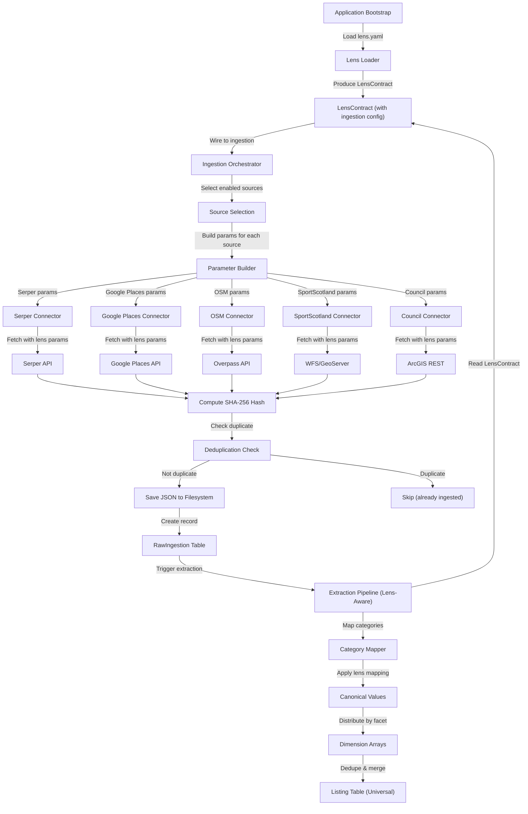
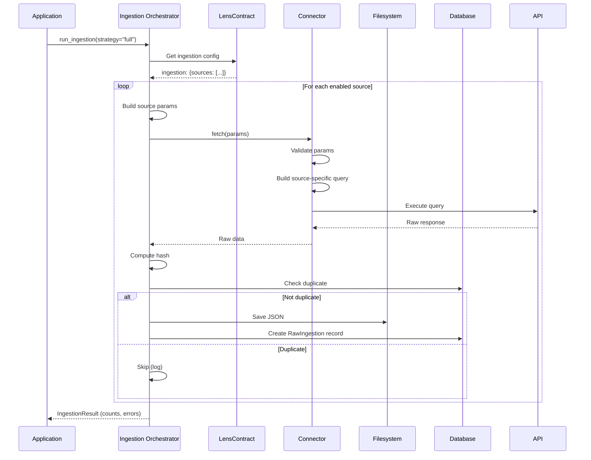
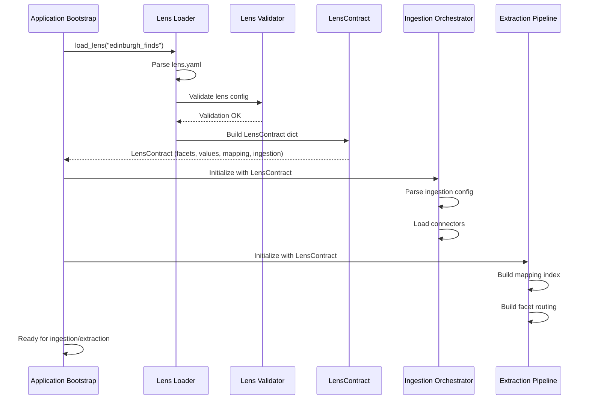

# Ingest Engine Redesign for Lens Architecture

**Version:** 1.0
**Date:** 2026-01-20
**Status:** Proposal

---

## Executive Summary

The current ingest engine successfully captures data from 6 sources but is **hard-coded to the sports/fitness vertical**. This document proposes a complete redesign to make ingestion **lens-driven**, enabling horizontal scaling to new verticals (wine discovery, restaurants, hotels) with zero engine code changes.

**Key Transformation:**
```
Current:  Hard-coded sports queries → Universal connectors → Lens-aware extraction
Proposed: Lens-driven ingestion config → Universal connectors → Lens-aware extraction
```

**Core Innovation:** Move ingestion strategy from code to configuration by extending `lens.yaml` with an `ingestion` section that declares data sources, search strategies, and source-specific parameters per vertical.

---

## Table of Contents

1. [Current State Analysis](#1-current-state-analysis)
2. [Problems & Limitations](#2-problems--limitations)
3. [Proposed Architecture](#3-proposed-architecture)
4. [Lens-Driven Ingestion Configuration](#4-lens-driven-ingestion-configuration)
5. [Universal Connector Interface](#5-universal-connector-interface)
6. [Ingestion Strategies by Vertical](#6-ingestion-strategies-by-vertical)
7. [Data Flow & Integration](#7-data-flow--integration)
8. [Deduplication & Provenance](#8-deduplication--provenance)
9. [Implementation Phases](#9-implementation-phases)
10. [Benefits & Trade-offs](#10-benefits--trade-offs)
11. [Success Criteria](#11-success-criteria)

---

## 1. Current State Analysis

### 1.1 Existing Architecture

**Two-Stage Pipeline:**

```
┌─────────────────────────────────────────────────────────────┐
│ STAGE 1: INGESTION (Raw Data Capture)                      │
│                                                             │
│ Connectors (6 sources):                                    │
│  • serper.py          - Google search results              │
│  • google_places.py   - Google Places API v1               │
│  • open_street_map.py - Overpass API (OSM)                 │
│  • sport_scotland.py  - WFS/GeoServer (gov data)           │
│  • edinburgh_council.py - ArcGIS REST (council data)       │
│  • open_charge_map.py - EV charging stations               │
│                                                             │
│ Flow: Fetch → Hash → Dedupe → Save JSON → RawIngestion DB │
└─────────────────────────────────────────────────────────────┘
                              ↓
┌─────────────────────────────────────────────────────────────┐
│ STAGE 2: EXTRACTION (Structured Processing)                │
│                                                             │
│ Extractors (hybrid strategy):                              │
│  • Deterministic: Google Places, SportScotland, Council    │
│  • LLM-based: Serper, OSM (Claude Haiku)                   │
│                                                             │
│ Flow: Dispatch → Extract → Validate → Map Categories →    │
│       Apply Lens → Dedupe/Merge → Store Listing           │
└─────────────────────────────────────────────────────────────┘
```

### 1.2 Current Connector Implementation

**Example: Serper Connector (Hard-coded Sports)**

```python
# engine/ingestion/connectors/serper.py (conceptual)
class SerperConnector(BaseConnector):
    async def fetch(self, query: str) -> dict:
        # ❌ HARD-CODED: Sports-specific search query
        search_query = f"{query} sports facility Edinburgh"
        response = await self.api_client.search(search_query)
        return response.json()
```

**Example: OSM Connector (Hard-coded Sports)**

```python
# engine/ingestion/connectors/open_street_map.py (conceptual)
class OSMConnector(BaseConnector):
    async def fetch(self, query: str) -> dict:
        # ❌ HARD-CODED: Sports-specific Overpass filters
        overpass_query = f"""
        [out:json];
        area[name="Edinburgh"]->.searchArea;
        (
          node["sport"](area.searchArea);
          way["leisure"="sports_centre"](area.searchArea);
        );
        out body;
        """
        return await self.overpass_api.query(overpass_query)
```

### 1.3 What Works Well

✅ **Universal connector interface** (`BaseConnector` abstract class)
✅ **Content-based deduplication** (SHA-256 hashing)
✅ **Provenance tracking** (`RawIngestion` table with source, URL, timestamp)
✅ **Rate limiting & retry logic** (exponential backoff, structured logging)
✅ **Filesystem organization** (`engine/data/raw/<source>/<timestamp>_<id>.json`)
✅ **Extraction is lens-aware** (via `LensContract`)

### 1.4 What Needs Redesign

❌ **Hard-coded vertical concepts in connectors** (sports queries, OSM filters)
❌ **No lens-driven ingestion strategy** (can't add wine vertical without code changes)
❌ **Scattered configuration** (search queries, filters embedded in connector code)
❌ **No systematic data source selection per vertical** (all connectors run for all verticals)
❌ **Ingestion parameters not declarative** (location bounds, search terms in code)

---

## 2. Problems & Limitations

### 2.1 Horizontal Scaling Blocked

**Problem:** Adding a new vertical (e.g., Wine Discovery) requires modifying connector code.

**Example - Wine Vertical:**
- **Serper**: Need wine-specific search queries (`"winery Edinburgh"`, `"tasting room Edinburgh"`)
- **OSM**: Need wine-specific Overpass filters (`craft=winery`, `shop=wine`, `amenity=bar[wine_bar]`)
- **Google Places**: Need wine-specific place types (`winery`, `wine_bar`, `liquor_store`)
- **New Sources**: May need wine-specific sources (VineyardDB API, local wine association data)

**Current Approach (BROKEN):**
```python
# ❌ Requires code changes for each vertical
if vertical == "sports":
    query = f"{term} sports facility Edinburgh"
elif vertical == "wine":
    query = f"{term} winery Edinburgh"
# ... endless if/elif chains
```

### 2.2 Configuration Scattered Across Code

**Problem:** Ingestion parameters are embedded in connector implementation files instead of declarative configuration.

**Current Issues:**
- Search query templates in connector code
- OSM tag filters hard-coded in connector
- Geographic bounds hard-coded or CLI arguments
- API-specific parameters (place types, categories) in code
- No single source of truth for ingestion strategy

### 2.3 No Systematic Source Selection

**Problem:** All connectors run for all verticals, even when sources are irrelevant.

**Examples:**
- **SportScotland**: Only relevant for Edinburgh Finds (sports), useless for wine vertical
- **OpenChargeMap**: Only relevant if EV charging is a lens feature
- **Wine-specific APIs**: Don't exist yet, no pattern for adding them

### 2.4 Ingestion-Extraction Mismatch

**Problem:** Extraction is lens-aware (via `LensContract`) but ingestion is not.

**Current State:**
```
Ingestion:  Hard-coded sports → Universal RawIngestion
Extraction: Lens-aware mapping → Lens-aware classification → Universal Listing
```

**Desired State:**
```
Ingestion:  Lens-driven config → Universal RawIngestion
Extraction: Lens-aware mapping → Lens-aware classification → Universal Listing
```

---

## 3. Proposed Architecture

### 3.1 Core Principles

1. **Lens-driven ingestion**: All vertical-specific ingestion logic lives in `lens.yaml`
2. **Universal connectors**: Connector implementations remain vertical-agnostic
3. **Declarative configuration**: Data sources, search strategies, and parameters in config
4. **Zero engine changes**: Adding new vertical = new `lens.yaml`, zero connector code changes
5. **Pluggable strategies**: Support multiple ingestion strategies per source per vertical

### 3.2 System Overview

```
┌─────────────────────────────────────────────────────────────┐
│ APPLICATION BOOTSTRAP                                        │
│ - Load lens from lenses/loader                              │
│ - Produce LensContract with ingestion config                │
│ - Wire LensContract → Ingestion Engine                      │
└─────────────────────────────────────────────────────────────┘
    ↓ LensContract (includes ingestion section)
┌─────────────────────────────────────────────────────────────┐
│ INGESTION ORCHESTRATOR (NEW)                                │
│ - Read ingestion config from LensContract                   │
│ - Select enabled sources for this lens                      │
│ - Build source-specific parameters from config              │
│ - Orchestrate connector execution with lens params          │
└─────────────────────────────────────────────────────────────┘
    ↓ Lens-specific queries & filters
┌─────────────────────────────────────────────────────────────┐
│ UNIVERSAL CONNECTORS (Minimal Changes)                      │
│ - Accept source-agnostic parameters (query, filters, bounds)│
│ - Fetch data using provided parameters                      │
│ - Return raw data (no vertical interpretation)             │
│ - Maintain provenance (source, URL, timestamp)             │
└─────────────────────────────────────────────────────────────┘
    ↓ RawIngestion records
┌─────────────────────────────────────────────────────────────┐
│ EXTRACTION PIPELINE (Existing - Lens-Aware)                 │
│ - Already lens-aware via LensContract                       │
│ - Map categories using lens mapping rules                   │
│ - Apply lens module triggers                                │
│ - Store universal entities with opaque dimensions           │
└─────────────────────────────────────────────────────────────┘
```

### 3.3 Key Components

#### A. Ingestion Orchestrator (NEW)

**Responsibilities:**
- Load ingestion config from `LensContract.ingestion`
- Determine which sources are enabled for current lens
- Build source-specific parameters from lens config
- Orchestrate parallel/sequential connector execution
- Handle source-level rate limiting and scheduling
- Aggregate ingestion metrics and logs

**Interface:**
```python
class IngestionOrchestrator:
    def __init__(self, lens_contract: Dict):
        self.ingestion_config = lens_contract["ingestion"]
        self.connectors = self._load_connectors()

    async def run_ingestion(self, strategy: str = "full") -> IngestionResult:
        """
        Execute ingestion for all enabled sources.

        Args:
            strategy: "full" | "incremental" | "specific_source"

        Returns:
            IngestionResult with counts, errors, and provenance
        """
        pass

    def _build_source_params(self, source_config: Dict) -> Dict:
        """Build connector-specific parameters from lens config."""
        pass
```

#### B. Universal Connectors (REFACTORED)

**Changes:**
- Accept lens-provided parameters instead of hard-coding
- Remove vertical-specific logic (move to lens config)
- Add parameter validation for lens-provided inputs
- Maintain backward compatibility during transition

**Refactored Interface:**
```python
class BaseConnector(ABC):
    @abstractmethod
    async def fetch(self, params: Dict) -> Dict:
        """
        Fetch data using lens-provided parameters.

        Args:
            params: Source-specific parameters from lens config
                   - query_template: str (e.g., "{term} {place_type} {location}")
                   - filters: Dict (e.g., OSM tags, place types)
                   - bounds: Dict (geographic bounds)
                   - api_config: Dict (API-specific params)

        Returns:
            Dict: Raw response data
        """
        pass
```

#### C. Lens Contract Extension (UPDATED)

**Add `ingestion` section to `LensContract`:**

```python
{
  "facets": {...},
  "values": [...],
  "mapping_rules": [...],
  "modules": {...},
  "module_triggers": [...],

  # NEW: Ingestion configuration
  "ingestion": {
    "sources": [
      {
        "connector": "serper",
        "enabled": true,
        "priority": 10,
        "strategy": "keyword_search",
        "params": {
          "query_template": "{term} {context} {location}",
          "search_terms": ["padel", "tennis court", "sports centre"],
          "context": "sports facility",
          "location": "Edinburgh",
          "result_limit": 100
        }
      },
      {
        "connector": "osm",
        "enabled": true,
        "priority": 20,
        "strategy": "tag_filter",
        "params": {
          "area": "Edinburgh",
          "filters": [
            {"sport": "*"},
            {"leisure": "sports_centre"},
            {"leisure": "pitch"},
            {"leisure": "swimming_pool"}
          ]
        }
      },
      # ... other sources
    ],
    "scheduling": {
      "full_refresh_interval": "weekly",
      "incremental_interval": "daily",
      "max_parallel_sources": 3
    },
    "geographic_scope": {
      "primary_area": "Edinburgh",
      "bounding_box": {
        "north": 55.9878,
        "south": 55.8967,
        "west": -3.3210,
        "east": -3.1398
      }
    }
  }
}
```

---

## 4. Lens-Driven Ingestion Configuration

### 4.1 Ingestion Section in lens.yaml

**Add to `lenses/edinburgh_finds/lens.yaml`:**

```yaml
# ... existing facets, values, mapping_rules, modules ...

# INGESTION CONFIGURATION
# Defines data sources, search strategies, and source-specific parameters for this vertical
ingestion:
  # Geographic Scope
  geographic_scope:
    primary_area: "Edinburgh"
    bounding_box:
      north: 55.9878
      south: 55.8967
      west: -3.3210
      east: -3.1398
    include_surrounding: true
    surrounding_radius_km: 10

  # Data Sources
  sources:
    # Serper (Google Search Results)
    - connector: serper
      enabled: true
      priority: 10
      strategy: keyword_search
      rate_limit:
        requests_per_minute: 30
        burst: 5
      params:
        query_template: "{term} {context} {location}"
        search_terms:
          - "padel courts"
          - "tennis courts"
          - "swimming pools"
          - "sports centres"
          - "gyms"
          - "football pitches"
          - "athletics tracks"
        context: "sports facility"
        location: "Edinburgh"
        result_limit: 100
        result_types: ["places", "websites"]

    # Google Places API
    - connector: google_places
      enabled: true
      priority: 20
      strategy: place_type_search
      rate_limit:
        requests_per_minute: 60
        burst: 10
      params:
        location:
          lat: 55.9533
          lng: -3.1883
        radius_meters: 15000
        place_types:
          - "gym"
          - "stadium"
          - "sports_complex"
          - "swimming_pool"
        search_keywords:
          - "padel"
          - "tennis"
          - "sports centre"
          - "leisure centre"
        language: "en"
        result_limit: 200

    # OpenStreetMap (Overpass API)
    - connector: osm
      enabled: true
      priority: 30
      strategy: tag_filter
      rate_limit:
        requests_per_minute: 10
        burst: 2
      params:
        area: "Edinburgh"
        filters:
          # Sports-specific OSM tags
          - sport: "*"                     # Any sport tag
          - leisure: sports_centre
          - leisure: pitch
          - leisure: swimming_pool
          - leisure: fitness_centre
          - leisure: stadium
          - leisure: track
          - amenity: gym
        output_format: json
        include_tags: true
        include_geometry: true

    # Sport Scotland (Government Data)
    - connector: sport_scotland
      enabled: true
      priority: 40
      strategy: wfs_feature_query
      rate_limit:
        requests_per_minute: 30
        burst: 5
      params:
        service_url: "https://spatialdata.gov.scot/geoserver/wfs"
        layer: "sport_scotland:facilities"
        cql_filter: "locality = 'Edinburgh' OR council_area = 'City of Edinburgh'"
        output_format: json
        max_features: 1000

    # Edinburgh Council (ArcGIS REST)
    - connector: edinburgh_council
      enabled: true
      priority: 50
      strategy: arcgis_feature_query
      rate_limit:
        requests_per_minute: 60
        burst: 10
      params:
        service_url: "https://edinburghcouncilmaps.info/arcgis/rest/services"
        layers:
          - "Leisure/SportsAndRecreation"
          - "Leisure/CommunityFacilities"
        where_clause: "STATUS = 'Active'"
        output_format: json
        max_records: 2000

    # OpenChargeMap (EV Charging - Optional)
    - connector: open_charge_map
      enabled: false  # Disabled for sports vertical
      priority: 60
      strategy: proximity_search
      params:
        location:
          lat: 55.9533
          lng: -3.1883
        radius_km: 20
        compact: false

  # Scheduling
  scheduling:
    full_refresh_interval: "weekly"      # Full re-ingestion
    incremental_interval: "daily"        # New/updated records only
    max_parallel_sources: 3              # Concurrent connector execution
    stagger_delay_seconds: 5             # Delay between source starts

  # Deduplication Strategy
  deduplication:
    strategies:
      - external_id    # Match by external ID (Google Place ID, OSM ID)
      - slug           # Match by normalized slug
      - fuzzy_location # Match by name + location proximity
    confidence_threshold: 0.85
    preserve_highest_trust: true
```

### 4.2 Wine Discovery Lens Configuration

**Example: `lenses/wine_discovery/lens.yaml`**

```yaml
# ... wine-specific facets, values, mapping_rules ...

ingestion:
  geographic_scope:
    primary_area: "Scotland"
    regions:
      - "Edinburgh & Lothians"
      - "Fife"
      - "Borders"
    include_uk_wide: false

  sources:
    # Serper - Wine-specific searches
    - connector: serper
      enabled: true
      priority: 10
      strategy: keyword_search
      params:
        query_template: "{term} {context} {location}"
        search_terms:
          - "winery"
          - "vineyard"
          - "wine tasting"
          - "wine bar"
          - "wine shop"
        context: "wine"
        location: "Edinburgh Scotland"
        result_limit: 50

    # Google Places - Wine-specific place types
    - connector: google_places
      enabled: true
      priority: 20
      strategy: place_type_search
      params:
        location:
          lat: 55.9533
          lng: -3.1883
        radius_meters: 50000  # Wider radius for wine (fewer venues)
        place_types:
          - "liquor_store"
          - "bar"
        search_keywords:
          - "winery"
          - "wine tasting"
          - "wine bar"
          - "vineyard"
        result_limit: 100

    # OSM - Wine-specific tags
    - connector: osm
      enabled: true
      priority: 30
      strategy: tag_filter
      params:
        area: "Scotland"
        filters:
          - craft: winery
          - shop: wine
          - shop: alcohol
          - amenity: bar
            bar_type: wine_bar
          - tourism: wine_cellar

    # Sport Scotland - DISABLED (not relevant for wine)
    - connector: sport_scotland
      enabled: false

    # Edinburgh Council - DISABLED (no wine data)
    - connector: edinburgh_council
      enabled: false

    # Hypothetical Wine-Specific Source
    - connector: scotland_wine_association
      enabled: false  # Not implemented yet
      priority: 100
      strategy: member_directory
      params:
        api_endpoint: "https://api.scotlandwine.org/members"
        api_key: "${SCOTLAND_WINE_API_KEY}"
        filter_region: "Edinburgh"
```

---

## 5. Universal Connector Interface

### 5.1 Refactored BaseConnector

```python
"""
Universal BaseConnector Interface (Lens-Aware)

This refactored interface accepts lens-provided parameters instead of
hard-coding vertical-specific logic. All connectors must implement this
interface to support lens-driven ingestion.
"""

from abc import ABC, abstractmethod
from typing import Dict, List, Optional
from dataclasses import dataclass


@dataclass
class IngestionParams:
    """
    Universal parameter container for connector execution.

    Attributes:
        query_template: Template string for search queries (e.g., "{term} {location}")
        search_terms: List of terms to search for
        filters: Source-specific filters (OSM tags, place types, etc.)
        bounds: Geographic bounds for queries
        api_config: API-specific configuration
        result_limit: Maximum results to fetch
        language: Preferred language for results
        output_format: Desired output format
    """
    query_template: Optional[str] = None
    search_terms: Optional[List[str]] = None
    filters: Optional[Dict] = None
    bounds: Optional[Dict] = None
    api_config: Optional[Dict] = None
    result_limit: Optional[int] = 100
    language: Optional[str] = "en"
    output_format: Optional[str] = "json"


class BaseConnector(ABC):
    """
    Abstract base class for lens-aware data source connectors.

    All connectors must implement this interface to support lens-driven
    ingestion with declarative configuration from lens.yaml.
    """

    @property
    @abstractmethod
    def source_name(self) -> str:
        """Unique identifier for this connector."""
        pass

    @abstractmethod
    async def fetch(self, params: IngestionParams) -> Dict:
        """
        Fetch data using lens-provided parameters.

        Args:
            params: IngestionParams with lens-specific configuration

        Returns:
            Dict: Raw response data with source-specific structure

        Example:
            params = IngestionParams(
                query_template="{term} {context} {location}",
                search_terms=["padel", "tennis"],
                context="sports facility",
                location="Edinburgh"
            )
            raw_data = await connector.fetch(params)
        """
        pass

    @abstractmethod
    async def save(self, data: Dict, source_url: str, metadata: Dict) -> str:
        """
        Save raw data to filesystem and create RawIngestion record.

        Args:
            data: Raw data dictionary to save
            source_url: Original URL where data was fetched
            metadata: Additional metadata (lens_id, strategy, etc.)

        Returns:
            str: File path where data was saved
        """
        pass

    @abstractmethod
    async def is_duplicate(self, content_hash: str) -> bool:
        """
        Check if content with this hash already exists.

        Args:
            content_hash: SHA-256 hash of content

        Returns:
            bool: True if duplicate, False otherwise
        """
        pass

    def validate_params(self, params: IngestionParams) -> None:
        """
        Validate lens-provided parameters for this connector.

        Raises:
            ValueError: If required parameters are missing or invalid

        Example:
            def validate_params(self, params: IngestionParams):
                if not params.search_terms:
                    raise ValueError("search_terms required for Serper connector")
        """
        pass
```

### 5.2 Example: Refactored Serper Connector

**Before (Hard-coded Sports):**

```python
class SerperConnector(BaseConnector):
    async def fetch(self, query: str) -> dict:
        # ❌ Hard-coded sports context
        search_query = f"{query} sports facility Edinburgh"
        response = await self.api_client.search(search_query)
        return response.json()
```

**After (Lens-driven):**

```python
class SerperConnector(BaseConnector):
    @property
    def source_name(self) -> str:
        return "serper"

    def validate_params(self, params: IngestionParams) -> None:
        """Validate required parameters for Serper."""
        if not params.query_template:
            raise ValueError("query_template required")
        if not params.search_terms:
            raise ValueError("search_terms required")

    async def fetch(self, params: IngestionParams) -> Dict:
        """
        ✅ Lens-driven: Accepts parameters from lens config.

        Example lens config:
          query_template: "{term} {context} {location}"
          search_terms: ["padel", "tennis"]
          context: "sports facility"
          location: "Edinburgh"

        Generated queries:
          - "padel sports facility Edinburgh"
          - "tennis sports facility Edinburgh"
        """
        self.validate_params(params)

        results = []
        for term in params.search_terms:
            # Build query from template
            query = params.query_template.format(
                term=term,
                context=params.api_config.get("context", ""),
                location=params.api_config.get("location", "")
            )

            # Fetch from Serper API
            response = await self.api_client.search(
                query=query,
                num_results=params.result_limit,
                language=params.language
            )

            results.extend(response.get("organic", []))

        return {"results": results, "query_count": len(params.search_terms)}
```

### 5.3 Example: Refactored OSM Connector

**Before (Hard-coded Sports):**

```python
class OSMConnector(BaseConnector):
    async def fetch(self, query: str) -> dict:
        # ❌ Hard-coded sports tags
        overpass_query = """
        [out:json];
        area[name="Edinburgh"]->.searchArea;
        (
          node["sport"](area.searchArea);
          way["leisure"="sports_centre"](area.searchArea);
        );
        out body;
        """
        return await self.overpass_api.query(overpass_query)
```

**After (Lens-driven):**

```python
class OSMConnector(BaseConnector):
    @property
    def source_name(self) -> str:
        return "osm"

    def validate_params(self, params: IngestionParams) -> None:
        """Validate required parameters for OSM."""
        if not params.filters:
            raise ValueError("filters required for OSM connector")
        if not params.api_config.get("area"):
            raise ValueError("area required in api_config")

    async def fetch(self, params: IngestionParams) -> Dict:
        """
        ✅ Lens-driven: Builds Overpass query from lens filters.

        Example lens config (sports):
          filters:
            - sport: "*"
            - leisure: sports_centre
            - leisure: pitch

        Example lens config (wine):
          filters:
            - craft: winery
            - shop: wine
            - amenity: bar
        """
        self.validate_params(params)

        # Build Overpass query from lens filters
        area = params.api_config["area"]
        filter_queries = self._build_filter_queries(params.filters)

        overpass_query = f"""
        [out:json];
        area[name="{area}"]->.searchArea;
        (
          {filter_queries}
        );
        out body;
        """

        response = await self.overpass_api.query(overpass_query)
        return response

    def _build_filter_queries(self, filters: List[Dict]) -> str:
        """
        Convert lens filters to Overpass QL.

        Example:
          Input:  [{"sport": "*"}, {"leisure": "sports_centre"}]
          Output: 'node["sport"](area.searchArea);
                   way["leisure"="sports_centre"](area.searchArea);'
        """
        queries = []
        for filter_dict in filters:
            for key, value in filter_dict.items():
                if value == "*":
                    queries.append(f'node["{key}"](area.searchArea);')
                    queries.append(f'way["{key}"](area.searchArea);')
                else:
                    queries.append(f'node["{key}"="{value}"](area.searchArea);')
                    queries.append(f'way["{key}"="{value}"](area.searchArea);')
        return "\n  ".join(queries)
```

---

## 6. Ingestion Strategies by Vertical

### 6.1 Sports/Fitness (Edinburgh Finds)

**Data Source Mix:**

| Source | Strategy | Priority | Rationale |
|--------|----------|----------|-----------|
| **SportScotland** | WFS Feature Query | High | Official government data (90 trust score) |
| **Google Places** | Place Type Search | High | Verified database (70 trust score) |
| **Edinburgh Council** | ArcGIS Query | Medium | Official council data (85 trust score) |
| **OSM** | Tag Filter | Medium | Crowdsourced, good coverage (40 trust score) |
| **Serper** | Keyword Search | Low | Search results, broad coverage (50 trust score) |

**Search Terms:**
```yaml
search_terms:
  - "padel courts"
  - "tennis courts"
  - "swimming pools"
  - "sports centres"
  - "gyms"
  - "football pitches"
  - "athletics tracks"
  - "leisure centres"
```

**OSM Tag Filters:**
```yaml
filters:
  - sport: "*"                     # Any sport
  - leisure: sports_centre
  - leisure: pitch
  - leisure: swimming_pool
  - leisure: fitness_centre
  - leisure: stadium
  - leisure: track
  - amenity: gym
```

### 6.2 Wine Discovery

**Data Source Mix:**

| Source | Strategy | Priority | Rationale |
|--------|----------|----------|-----------|
| **Google Places** | Place Type + Keyword | High | Best coverage for wine venues |
| **OSM** | Tag Filter | Medium | Good for wineries, wine bars |
| **Serper** | Keyword Search | Medium | Discover new venues |
| **SportScotland** | DISABLED | N/A | Not relevant for wine |
| **Council** | DISABLED | N/A | No wine-specific data |

**Search Terms:**
```yaml
search_terms:
  - "winery"
  - "vineyard"
  - "wine tasting"
  - "wine bar"
  - "wine shop"
  - "wine cellar"
  - "distillery"  # Scotland-specific
```

**OSM Tag Filters:**
```yaml
filters:
  - craft: winery
  - craft: distillery
  - shop: wine
  - shop: alcohol
  - amenity: bar
    bar_type: wine_bar
  - tourism: wine_cellar
```

**Geographic Scope:**
```yaml
geographic_scope:
  primary_area: "Scotland"
  regions:
    - "Edinburgh & Lothians"
    - "Fife"
    - "Borders"
    - "Highlands"
  radius_km: 100  # Wider than sports (fewer venues)
```

### 6.3 Restaurant Discovery (Hypothetical)

**Data Source Mix:**

| Source | Strategy | Priority | Rationale |
|--------|----------|----------|-----------|
| **Google Places** | Place Type Search | High | Best restaurant coverage |
| **Serper** | Keyword Search | High | Discover new restaurants |
| **OSM** | Tag Filter | Medium | Restaurant metadata |
| **Council Health Inspections** | Public API | High | Food hygiene ratings (hypothetical) |
| **TripAdvisor API** | Review Aggregation | Medium | Reviews (hypothetical) |

**Search Terms:**
```yaml
search_terms:
  - "restaurant"
  - "cafe"
  - "bistro"
  - "fine dining"
  - "pub food"
  - "takeaway"
```

**Place Types:**
```yaml
place_types:
  - "restaurant"
  - "cafe"
  - "bar"
  - "meal_takeaway"
  - "bakery"
  - "food"
```

---

## 7. Data Flow & Integration

### 7.1 End-to-End Flow with Lens-Driven Ingestion



### 7.2 Ingestion Orchestration Sequence



### 7.3 Bootstrap Sequence



---

## 8. Deduplication & Provenance

### 8.1 Content-Based Deduplication (Stage 1)

**Current (Preserved):**
- Compute SHA-256 hash of raw JSON payload
- Check `RawIngestion.hash` for existing record
- Skip if duplicate (log, don't re-ingest)

**Enhancement:**
- Add `lens_id` to `RawIngestion` table
- Allow same content hash across different lenses
- Unique constraint: `(hash, lens_id)`

**Rationale:** Same Google Place may be relevant for multiple verticals (e.g., a venue with both gym and wine bar).

### 8.2 Entity-Level Deduplication (Stage 2)

**Current (Preserved):**
- Three-strategy cascade:
  1. External ID matching (Google Place ID, OSM ID)
  2. Slug matching (normalized names)
  3. Fuzzy name + location matching (confidence threshold)

**Enhancement:**
- Lens-aware deduplication: Same entity may have different canonical values per lens
- Example: "The Pear Tree" (pub with sports facilities)
  - **Sports lens**: `canonical_activities: ["football", "rugby"]`
  - **Restaurant lens**: `canonical_roles: ["serves_food", "serves_drinks"]`
- Merge strategy: Union of dimensions, not replacement

### 8.3 Provenance Tracking

**RawIngestion Schema (Enhanced):**

```prisma
model RawIngestion {
  id             String   @id @default(cuid())
  source         String                        // Connector name (serper, google_places)
  lens_id        String                        // NEW: Lens that triggered ingestion
  source_url     String                        // Original API URL
  file_path      String                        // JSON file path
  status         String                        // pending | processed | failed
  hash           String                        // SHA-256 content hash
  metadata_json  Json?                         // Source-specific metadata
  ingestion_strategy String?                   // NEW: Strategy used (keyword_search, tag_filter)
  ingestion_params   Json?                     // NEW: Lens params used for this ingestion
  created_at     DateTime @default(now())
  updated_at     DateTime @updatedAt

  @@unique([hash, lens_id])  // NEW: Allow same content across lenses
  @@index([source])
  @@index([lens_id])
  @@index([status])
  @@index([created_at])
}
```

**Benefits:**
- Audit trail: Know which lens triggered ingestion
- Reproducibility: Stored params enable re-ingestion with same config
- Multi-lens support: Same source, different lens interpretations

---

## 9. Implementation Phases

### Phase 1: Ingestion Orchestrator (Foundation)

**Goal:** Create lens-aware ingestion orchestrator that reads lens config and orchestrates connectors.

**Tasks:**
1. Create `engine/ingestion/orchestrator.py`
2. Add `ingestion` section parser to `lenses/loader.py`
3. Update `LensContract` dict to include `ingestion` key
4. Implement source selection logic
5. Implement parameter builder (lens config → `IngestionParams`)
6. Add ingestion metrics and logging

**Deliverables:**
- [ ] `IngestionOrchestrator` class
- [ ] Lens config parser for `ingestion` section
- [ ] Unit tests for parameter building
- [ ] Integration test with mock connectors

**Acceptance Criteria:**
- Orchestrator loads ingestion config from `LensContract`
- Selects only enabled sources
- Builds `IngestionParams` from lens config
- Handles missing/invalid config gracefully

---

### Phase 2: Connector Refactoring (Serper + OSM)

**Goal:** Refactor 2 connectors (Serper, OSM) to accept lens-provided parameters.

**Tasks:**
1. Update `BaseConnector` interface with `IngestionParams`
2. Refactor `SerperConnector` to accept `query_template`, `search_terms`
3. Refactor `OSMConnector` to accept `filters`, `area`
4. Add parameter validation to both connectors
5. Update connector unit tests with lens params
6. Add integration tests with real lens config

**Deliverables:**
- [ ] Updated `BaseConnector` interface
- [ ] Refactored `SerperConnector` (lens-driven)
- [ ] Refactored `OSMConnector` (lens-driven)
- [ ] Unit tests with lens params
- [ ] Integration tests with `edinburgh_finds` lens

**Acceptance Criteria:**
- Serper accepts lens search terms, builds queries from template
- OSM accepts lens filters, builds Overpass query
- Both validate params, raise errors for missing config
- No hard-coded vertical concepts remain

---

### Phase 3: Lens Configuration (Edinburgh Finds)

**Goal:** Add full `ingestion` section to Edinburgh Finds lens.

**Tasks:**
1. Add `ingestion` section to `lenses/edinburgh_finds/lens.yaml`
2. Define all 6 data sources with parameters
3. Set geographic scope (Edinburgh bounding box)
4. Configure rate limits per source
5. Define scheduling strategy
6. Document ingestion config in lens README

**Deliverables:**
- [ ] `ingestion` section in `lens.yaml` (all sources)
- [ ] Lens validation tests (fail if config invalid)
- [ ] Documentation for ingestion config schema

**Acceptance Criteria:**
- Lens loader successfully parses `ingestion` section
- All required fields present for each source
- Validation catches missing/invalid config
- Ingestion orchestrator can load config without errors

---

### Phase 4: Remaining Connectors (Google Places, SportScotland, Council)

**Goal:** Refactor remaining 3 connectors to accept lens params.

**Tasks:**
1. Refactor `GooglePlacesConnector` (place types, keywords)
2. Refactor `SportScotlandConnector` (WFS layer, CQL filter)
3. Refactor `EdinburghCouncilConnector` (ArcGIS layers, where clause)
4. Update all connector tests
5. Integration test with full Edinburgh Finds lens

**Deliverables:**
- [ ] Refactored `GooglePlacesConnector`
- [ ] Refactored `SportScotlandConnector`
- [ ] Refactored `EdinburghCouncilConnector`
- [ ] All connector tests passing
- [ ] End-to-end test: Lens → Orchestrator → All Connectors

**Acceptance Criteria:**
- All connectors accept lens params
- No hard-coded vertical concepts in any connector
- Full ingestion works for Edinburgh Finds lens

---

### Phase 5: Wine Discovery Validation

**Goal:** Create Wine Discovery lens with different data sources to prove horizontal scaling.

**Tasks:**
1. Create `lenses/wine_discovery/lens.yaml`
2. Define wine-specific facets, values, mapping rules
3. Add `ingestion` section with wine-specific config
4. Disable irrelevant sources (SportScotland, Council)
5. Configure wine-specific search terms, OSM tags, place types
6. Run ingestion with wine lens, validate results

**Deliverables:**
- [ ] `wine_discovery` lens with full config
- [ ] Wine-specific ingestion config
- [ ] Test ingestion run with wine lens
- [ ] Validation: Zero engine/connector code changes

**Acceptance Criteria:**
- Wine lens loads successfully
- Ingestion runs with wine-specific params
- Serper queries wine terms (not sports)
- OSM filters wine tags (not sports)
- No engine/connector code changes required

---

### Phase 6: Deduplication & Provenance

**Goal:** Enhance deduplication to support multi-lens and add provenance tracking.

**Tasks:**
1. Add `lens_id` column to `RawIngestion` table
2. Add `ingestion_strategy` and `ingestion_params` columns
3. Update unique constraint: `(hash, lens_id)`
4. Update deduplication logic to check `(hash, lens_id)`
5. Store lens params in `ingestion_params` JSON
6. Update entity deduplication to support union of dimensions

**Deliverables:**
- [ ] Migration: Add `lens_id`, `ingestion_strategy`, `ingestion_params`
- [ ] Updated deduplication logic
- [ ] Tests for multi-lens deduplication
- [ ] Provenance query tool (CLI)

**Acceptance Criteria:**
- Same content hash can exist for different lenses
- `RawIngestion` stores lens params for reproducibility
- Entity deduplication merges dimensions across lenses
- Provenance tool shows which lens triggered ingestion

---

### Phase 7: CLI & Observability

**Goal:** Update CLI to support lens-driven ingestion and add observability.

**Tasks:**
1. Update `engine/ingestion/cli.py` to accept `--lens-id` flag
2. Add `--source` flag to run specific source only
3. Add `--strategy` flag (full | incremental | test)
4. Create ingestion dashboard (`engine/ingestion/dashboard.py`)
5. Add metrics: records ingested, sources executed, errors, duration
6. Add structured logging with lens context

**Deliverables:**
- [ ] Updated CLI with lens-aware flags
- [ ] Ingestion dashboard (CLI-based)
- [ ] Metrics collection and reporting
- [ ] Structured logging with lens context

**Acceptance Criteria:**
- CLI: `python -m engine.ingestion.run --lens-id=edinburgh_finds`
- CLI: `python -m engine.ingestion.run --lens-id=wine_discovery --source=serper`
- Dashboard shows per-lens, per-source metrics
- Logs include `lens_id`, `source`, `strategy` fields

---

### Phase 8: Testing & Validation

**Goal:** Comprehensive testing of lens-driven ingestion system.

**Tasks:**
1. Unit tests: All connectors with lens params
2. Integration tests: Orchestrator + connectors + lens config
3. End-to-end tests: Full ingestion → extraction → query
4. Validation tests: Lens config schema validation
5. Performance tests: Parallel source execution, rate limiting
6. Regression tests: Edinburgh Finds produces same results as before

**Deliverables:**
- [ ] Unit test suite (>80% coverage)
- [ ] Integration test suite
- [ ] End-to-end test suite
- [ ] Validation test suite
- [ ] Performance benchmarks
- [ ] Regression test baseline

**Acceptance Criteria:**
- All tests passing
- Edinburgh Finds ingestion produces same results as before
- Wine lens ingestion works with zero engine changes
- Performance: Parallel execution faster than sequential
- No hard-coded vertical concepts in engine code

---

## 10. Benefits & Trade-offs

### 10.1 Benefits

#### Horizontal Scaling
✅ **Add new vertical with zero engine code changes**
- Create `lens.yaml` with ingestion config
- Define search terms, filters, place types
- Enable/disable sources per vertical
- No connector code changes

#### Configuration as Code
✅ **Single source of truth for ingestion strategy**
- All vertical-specific logic in `lens.yaml`
- Versioned with git (audit trail)
- Easy to review and understand
- Declarative, not imperative

#### Development Velocity
✅ **Faster iteration on new verticals**
- No Python code changes for new vertical
- Non-engineers can configure ingestion (YAML editing)
- A/B test different search strategies by editing config
- Faster deployment (config change, not code deploy)

#### Maintainability
✅ **Reduced connector complexity**
- Connectors are simple adapters, not vertical experts
- Universal interface reduces cognitive load
- Easier to add new data sources
- Less code = fewer bugs

#### Multi-Lens Support
✅ **Same codebase, multiple verticals**
- Run ingestion for multiple lenses
- Share connectors across verticals
- Provenance tracks which lens triggered ingestion
- Entity deduplication supports multi-lens

#### Testing
✅ **Easier to test with mock configs**
- Inject test lens config for unit tests
- No need to mock connector internals
- Test different strategies without code changes
- Regression tests via config snapshots

### 10.2 Trade-offs

#### Configuration Complexity
⚠️ **Lens config becomes more complex**
- `lens.yaml` grows with ingestion section
- Need validation to catch config errors
- Learning curve for ingestion config schema
- **Mitigation:** Clear docs, validation errors, examples

#### Migration Effort
⚠️ **All connectors need refactoring**
- 6 connectors to refactor (1-2 days each)
- Integration tests need updating
- Existing CLI scripts need updating
- **Mitigation:** Phased rollout, backward compatibility layer

#### Parameter Explosion
⚠️ **Source-specific params can get messy**
- OSM has different params than Google Places
- `IngestionParams` tries to be universal but may not fit all sources
- Risk of source-specific hacks
- **Mitigation:** Clear param conventions, source-specific validation

#### Runtime Errors
⚠️ **Config errors detected at runtime, not compile time**
- YAML typos, missing fields discovered during execution
- Less type safety than code
- **Mitigation:** Comprehensive validation, fail-fast on invalid config

#### Performance Overhead
⚠️ **Parameter building adds small overhead**
- Parse lens config, build params for each source
- Negligible for ingestion (network-bound)
- **Mitigation:** Cache built params per source

### 10.3 Risk Mitigation Summary

| Risk | Impact | Likelihood | Mitigation |
|------|--------|------------|------------|
| Config errors break ingestion | High | Medium | Comprehensive validation, fail-fast, unit tests |
| Connector refactoring introduces bugs | High | Medium | Phased rollout, integration tests, regression tests |
| Params don't fit all sources | Medium | Medium | Source-specific validation, extensible `IngestionParams` |
| Migration takes too long | Medium | Low | Phased implementation, backward compat layer |
| Performance regression | Low | Low | Benchmarks, profiling, caching |

---

## 11. Success Criteria

### 11.1 Functional Criteria

1. ✅ **Lens-driven ingestion works for Edinburgh Finds**
   - All 6 sources run with lens-provided params
   - No hard-coded sports concepts in connectors
   - Same results as before refactor (regression test)

2. ✅ **Wine Discovery lens works with zero engine changes**
   - Create `wine_discovery` lens with ingestion config
   - Run ingestion, get wine-specific results
   - Confirm: No connector code changes required

3. ✅ **Source selection works**
   - Enabled sources run, disabled sources skip
   - Per-lens source configuration (SportScotland disabled for wine)

4. ✅ **Parameter building works**
   - Orchestrator builds correct `IngestionParams` from lens config
   - Connectors receive expected params
   - Validation catches missing/invalid params

5. ✅ **Deduplication works across lenses**
   - Same content hash can exist for multiple lenses
   - Entity deduplication merges dimensions
   - Provenance tracks which lens triggered ingestion

### 11.2 Non-Functional Criteria

6. ✅ **Performance: No regression**
   - Ingestion time same or faster than before
   - Parallel source execution works
   - Rate limiting prevents API throttling

7. ✅ **Code Quality: Engine purity maintained**
   - Zero vertical concepts in engine code
   - Connectors are vertical-agnostic
   - All vertical logic in `lens.yaml`

8. ✅ **Testing: Comprehensive coverage**
   - Unit tests: >80% coverage
   - Integration tests: Orchestrator + connectors
   - End-to-end tests: Ingestion → extraction → query
   - Regression tests: Edinburgh Finds baseline

9. ✅ **Documentation: Complete**
   - Ingestion config schema documented
   - Connector refactoring guide
   - Lens configuration examples
   - Migration guide for existing connectors

10. ✅ **Observability: Production-ready**
    - Structured logging with lens context
    - Metrics: per-lens, per-source stats
    - Error tracking: failures traced to lens config
    - Dashboard: CLI-based ingestion dashboard

### 11.3 Acceptance Tests

**Test 1: Edinburgh Finds Ingestion**
```bash
# Run full ingestion for sports lens
python -m engine.ingestion.run --lens-id=edinburgh_finds --strategy=full

# Verify results match baseline
python -m engine.ingestion.validate --lens-id=edinburgh_finds --baseline=tests/fixtures/baseline_edinburgh_finds.json
```

**Test 2: Wine Discovery Ingestion (Zero Engine Changes)**
```bash
# Create wine lens (no code changes)
cat > lenses/wine_discovery/lens.yaml <<EOF
# ... wine lens config with ingestion section ...
EOF

# Run ingestion for wine lens
python -m engine.ingestion.run --lens-id=wine_discovery --strategy=full

# Verify wine-specific results
python -m engine.ingestion.validate --lens-id=wine_discovery --expect-wine-results
```

**Test 3: Source Selection**
```bash
# Run single source for sports lens
python -m engine.ingestion.run --lens-id=edinburgh_finds --source=serper

# Verify only Serper ran
python -m engine.ingestion.dashboard --lens-id=edinburgh_finds --show-sources
# Expected: serper: 100 records, others: 0 records
```

**Test 4: Multi-Lens Deduplication**
```bash
# Ingest same venue for both lenses
python -m engine.ingestion.run --lens-id=edinburgh_finds
python -m engine.ingestion.run --lens-id=restaurant_discovery

# Verify same RawIngestion exists for both lenses
python -m engine.ingestion.query --hash=<sha256> --expect-lenses=edinburgh_finds,restaurant_discovery
```

**Test 5: Config Validation**
```bash
# Invalid lens config (missing search_terms)
cat > lenses/invalid_lens/lens.yaml <<EOF
ingestion:
  sources:
    - connector: serper
      enabled: true
      params: {}  # Missing search_terms
EOF

# Run ingestion, expect validation error
python -m engine.ingestion.run --lens-id=invalid_lens
# Expected: ValueError: search_terms required for Serper connector
```

---

## Appendix A: Configuration Schema

### Ingestion Section Schema

```yaml
ingestion:
  # REQUIRED: Geographic scope for this lens
  geographic_scope:
    primary_area: string              # Required: Primary city/region
    bounding_box:                     # Optional: Explicit bounds
      north: float                    # Latitude
      south: float
      west: float                     # Longitude
      east: float
    include_surrounding: boolean      # Optional: Include surrounding areas
    surrounding_radius_km: integer    # Optional: Radius for surrounding

  # REQUIRED: Data sources for this lens
  sources:
    - connector: string               # Required: Connector name (serper, google_places, osm, etc.)
      enabled: boolean                # Required: Enable/disable this source
      priority: integer               # Required: Execution order (lower = earlier)
      strategy: string                # Required: Ingestion strategy name
      rate_limit:                     # Optional: Rate limiting
        requests_per_minute: integer
        burst: integer
      params:                         # Required: Source-specific parameters
        # Universal params (supported by most sources)
        query_template: string        # Template for search queries
        search_terms: [string]        # List of search terms
        location: string              # Location string
        result_limit: integer         # Max results to fetch
        language: string              # Language code

        # Source-specific params
        filters: [object]             # OSM: Tag filters
        place_types: [string]         # Google Places: Place types
        area: string                  # OSM: Area name
        service_url: string           # WFS/ArcGIS: Service URL
        # ... (see source-specific docs)

  # OPTIONAL: Scheduling configuration
  scheduling:
    full_refresh_interval: string     # Cron or interval (weekly, monthly)
    incremental_interval: string      # Cron or interval (daily, hourly)
    max_parallel_sources: integer     # Concurrent source execution
    stagger_delay_seconds: integer    # Delay between source starts

  # OPTIONAL: Deduplication strategy
  deduplication:
    strategies: [string]              # Order of dedup strategies
    confidence_threshold: float       # Min confidence for fuzzy match
    preserve_highest_trust: boolean   # Keep highest trust source
```

---

## Appendix B: Connector-Specific Parameters

### Serper Connector

```yaml
- connector: serper
  params:
    query_template: "{term} {context} {location}"  # Required
    search_terms: [string]                         # Required
    context: string                                # Optional: Context string
    location: string                               # Optional: Location string
    result_limit: integer                          # Optional: Max results (default: 100)
    result_types: [string]                         # Optional: ["places", "websites"]
    language: string                               # Optional: Language code
```

### Google Places Connector

```yaml
- connector: google_places
  params:
    location:                                      # Required: Center point
      lat: float
      lng: float
    radius_meters: integer                         # Required: Search radius
    place_types: [string]                          # Required: Google place types
    search_keywords: [string]                      # Optional: Additional keywords
    language: string                               # Optional: Language code
    result_limit: integer                          # Optional: Max results (default: 200)
```

### OSM Connector

```yaml
- connector: osm
  params:
    area: string                                   # Required: Area name
    filters: [object]                              # Required: OSM tag filters
      - tag_key: tag_value                         # Example: sport: "*"
    output_format: string                          # Optional: json | xml (default: json)
    include_tags: boolean                          # Optional: Include all tags
    include_geometry: boolean                      # Optional: Include geometries
```

### SportScotland Connector

```yaml
- connector: sport_scotland
  params:
    service_url: string                            # Required: WFS service URL
    layer: string                                  # Required: Layer name
    cql_filter: string                             # Optional: CQL filter
    output_format: string                          # Optional: json | gml (default: json)
    max_features: integer                          # Optional: Max features (default: 1000)
```

### Edinburgh Council Connector

```yaml
- connector: edinburgh_council
  params:
    service_url: string                            # Required: ArcGIS service URL
    layers: [string]                               # Required: Layer names
    where_clause: string                           # Optional: SQL where clause
    output_format: string                          # Optional: json | geojson (default: json)
    max_records: integer                           # Optional: Max records (default: 2000)
```

---

## Appendix C: Migration Checklist

### Pre-Migration

- [ ] Review current ingestion code and identify hard-coded vertical concepts
- [ ] Document existing search queries, filters, and parameters per source
- [ ] Create baseline results for Edinburgh Finds (regression test data)
- [ ] Set up test lens configurations
- [ ] Review lens architecture documentation

### Phase 1: Foundation

- [ ] Create `IngestionOrchestrator` class
- [ ] Add `ingestion` section parser to lens loader
- [ ] Update `LensContract` to include ingestion config
- [ ] Write unit tests for orchestrator
- [ ] Write unit tests for parameter builder

### Phase 2: Connector Refactoring

- [ ] Update `BaseConnector` interface with `IngestionParams`
- [ ] Refactor Serper connector (remove hard-coded sports queries)
- [ ] Refactor OSM connector (remove hard-coded sports tags)
- [ ] Add parameter validation to both connectors
- [ ] Update connector unit tests
- [ ] Run integration tests with test lens config

### Phase 3: Lens Configuration

- [ ] Add `ingestion` section to Edinburgh Finds lens
- [ ] Define all 6 sources with lens-specific params
- [ ] Configure geographic scope
- [ ] Set rate limits per source
- [ ] Define scheduling strategy
- [ ] Validate lens config loads correctly

### Phase 4: Remaining Connectors

- [ ] Refactor Google Places connector
- [ ] Refactor SportScotland connector
- [ ] Refactor Edinburgh Council connector
- [ ] Update all connector tests
- [ ] Run full integration test with Edinburgh Finds lens

### Phase 5: Wine Discovery

- [ ] Create wine discovery lens with facets and values
- [ ] Add ingestion section to wine lens
- [ ] Configure wine-specific search terms
- [ ] Configure wine-specific OSM tags
- [ ] Disable irrelevant sources (SportScotland, Council)
- [ ] Run ingestion with wine lens
- [ ] Validate zero engine code changes required

### Phase 6: Deduplication & Provenance

- [ ] Add `lens_id` column to RawIngestion table
- [ ] Add `ingestion_strategy` and `ingestion_params` columns
- [ ] Update unique constraint to `(hash, lens_id)`
- [ ] Update deduplication logic
- [ ] Test multi-lens deduplication
- [ ] Create provenance query tool

### Phase 7: CLI & Observability

- [ ] Update CLI to accept `--lens-id` flag
- [ ] Add `--source` and `--strategy` flags
- [ ] Create ingestion dashboard
- [ ] Add metrics collection
- [ ] Add structured logging with lens context
- [ ] Test CLI with both lenses

### Phase 8: Testing & Validation

- [ ] Write unit tests (target >80% coverage)
- [ ] Write integration tests
- [ ] Write end-to-end tests
- [ ] Run regression tests (Edinburgh Finds)
- [ ] Run performance benchmarks
- [ ] Validate wine lens works with zero engine changes

### Post-Migration

- [ ] Update documentation
- [ ] Create migration guide for future connectors
- [ ] Create lens configuration guide
- [ ] Archive old hard-coded connector code
- [ ] Deploy to production
- [ ] Monitor metrics and logs

---

## Conclusion

This redesign transforms the ingest engine from a vertically-coupled, hard-coded sports system into a **universal, lens-driven ingestion framework**. By moving all vertical-specific logic into declarative `lens.yaml` configuration, we enable:

1. **Horizontal scaling** with zero engine code changes
2. **Faster development velocity** for new verticals
3. **Clearer architectural boundaries** between engine and lens layers
4. **Easier maintenance** with reduced connector complexity
5. **Multi-lens support** with provenance tracking

The phased implementation approach (8 phases) ensures we can validate each component before proceeding, with clear regression tests and acceptance criteria. The wine discovery validation in Phase 5 serves as the **proof of concept** that the redesign achieves its core goal: **add a new vertical with zero engine code changes**.

**Next Steps:**
1. Review and approve this redesign proposal
2. Begin Phase 1 implementation (Ingestion Orchestrator)
3. Validate with Edinburgh Finds lens
4. Scale horizontally with Wine Discovery lens

---

**Document Version:** 1.0
**Author:** Claude (AI Assistant)
**Date:** 2026-01-20
**Status:** Proposal - Awaiting Review
