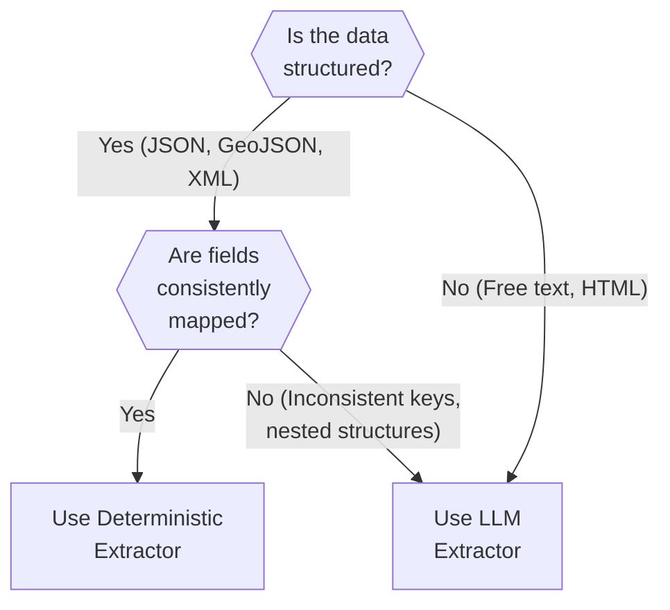

# Adding a New Extractor - Step-by-Step Guide

## Table of Contents

1. [Introduction](#introduction)
2. [Prerequisites](#prerequisites)
3. [Decision Tree: Deterministic vs LLM](#decision-tree-deterministic-vs-llm)
4. [Step-by-Step Guide](#step-by-step-guide)
5. [Template Code](#template-code)
6. [Example Walkthrough](#example-walkthrough)
7. [Testing Requirements](#testing-requirements)
8. [Common Pitfalls](#common-pitfalls)

---

## Introduction

This guide walks you through adding a new data source to the extraction engine. By the end, you'll have:

- A new extractor class implementing `BaseExtractor`
- Comprehensive test coverage (>80%)
- Integration with the CLI orchestrator
- Trust level configuration

**Time Estimate:** 2-4 hours for a deterministic extractor, 4-6 hours for an LLM extractor.

---

## Prerequisites

Before starting, ensure you have:

1. **Raw data ingested**: The new source must already have a connector in `engine/ingestion/connectors/`
   - Check: `RawIngestion` table contains records with your source name

2. **Sample data**: At least 3-5 representative examples of raw API responses
   - Save as fixtures: `engine/extraction/tests/fixtures/<source_name>_*.json`

3. **Development environment set up**:
   ```bash
   # Install dependencies
   pip install -r requirements.txt

   # Verify extraction tests pass
   pytest engine/extraction/tests -v
   ```

4. **Understanding of source data**:
   - What fields are available?
   - What format is the data in? (JSON, GeoJSON, XML, text)
   - Are there external IDs for deduplication?

---

## Decision Tree: Deterministic vs LLM

Before writing code, decide which extraction strategy to use:



### Deterministic Extraction

**Use when:**
- Data is structured (JSON, GeoJSON, XML)
- Fields have consistent keys (e.g., `displayName` always contains name)
- Minimal parsing logic required

**Examples:**
- Google Places API (clean JSON)
- Sport Scotland WFS (GeoJSON)
- Edinburgh Council (GeoJSON)

**Pros:**
- 100% success rate
- No AI costs
- Fast (60+ records/minute)

**Cons:**
- Brittle (breaks if API format changes)
- Can't handle edge cases well

### LLM Extraction

**Use when:**
- Data is unstructured (search results, descriptions, tags)
- Fields are inconsistent or nested unpredictably
- Requires interpretation (e.g., "open 24/7" → opening_hours JSON)

**Examples:**
- Serper (search result snippets)
- OpenStreetMap (free-text tags like `sport=padel;tennis`)

**Pros:**
- Flexible (handles edge cases)
- Self-healing (adapts to format changes)

**Cons:**
- Costs money (~£0.003 per extraction)
- Slower (~10 records/minute due to API latency)
- <100% success rate (~85-95%)

---

## Step-by-Step Guide

### Step 1: Create Fixture Files

Save 3-5 representative raw API responses as JSON fixtures.

**Location:** `engine/extraction/tests/fixtures/`

**Naming Convention:** `<source_name>_<description>.json`

**Example:**
```bash
engine/extraction/tests/fixtures/
├── strava_segments_mountain_bike_trail.json
├── strava_segments_road_cycling.json
├── strava_segments_with_hazards.json
```

**Fixture Content:**
```json
{
  "id": 12345678,
  "name": "Arthur's Seat Summit Climb",
  "activity_type": "Ride",
  "distance": 2400.5,
  "average_grade": 8.3,
  "maximum_grade": 15.2,
  "elevation_high": 251.0,
  "elevation_low": 50.0,
  "start_latlng": [55.9445, -3.1620],
  "end_latlng": [55.9533, -3.1617],
  "climb_category": 4,
  "city": "Edinburgh",
  "country": "United Kingdom"
}
```

**Pro Tip:** Use real data from your ingestion connector's test runs. Check `data/raw_ingestion/<source_name>/` for examples.

---

### Step 2: Write Tests First (TDD)

Create a test file **before** writing the extractor.

**Location:** `engine/extraction/tests/test_<source_name>_extractor.py`

**Template:**

```python
"""
Tests for <SourceName> Extractor
"""

import pytest
import json
from pathlib import Path
from engine.extraction.extractors.<source_name>_extractor import <SourceName>Extractor


@pytest.fixture
def sample_raw_data():
    """Load sample <SourceName> raw data from fixture"""
    fixture_path = Path(__file__).parent / "fixtures" / "<source_name>_<description>.json"
    with open(fixture_path, "r", encoding="utf-8") as f:
        return json.load(f)


def test_extractor_source_name():
    """Test that source_name property returns correct value"""
    extractor = <SourceName>Extractor()
    assert extractor.source_name == "<source_name>"


def test_extract_basic_fields(sample_raw_data):
    """Test extraction of basic fields (name, location)"""
    extractor = <SourceName>Extractor()
    extracted = extractor.extract(sample_raw_data)

    # Test required fields
    assert extracted["entity_name"] is not None
    assert extracted["latitude"] is not None
    assert extracted["longitude"] is not None

    # Test specific values from fixture
    assert extracted["entity_name"] == "Arthur's Seat Summit Climb"
    assert extracted["latitude"] == 55.9533
    assert extracted["longitude"] == -3.1617


def test_validate_formats_fields(sample_raw_data):
    """Test that validation normalizes data"""
    extractor = <SourceName>Extractor()
    extracted = extractor.extract(sample_raw_data)
    validated = extractor.validate(extracted)

    # Example: Ensure phone numbers formatted to E.164 (if applicable)
    if validated.get("phone"):
        assert validated["phone"].startswith("+44")


def test_split_attributes_correctly(sample_raw_data):
    """Test attribute splitting (schema-defined vs discovered)"""
    extractor = <SourceName>Extractor()
    extracted = extractor.extract(sample_raw_data)
    validated = extractor.validate(extracted)
    attributes, discovered = extractor.split_attributes(validated)

    # Schema-defined fields should be in attributes
    assert "entity_name" in attributes or "entity_name" in extracted  # Core field

    # Discovered fields should be in discovered_attributes
    # (Example: if your source has extra fields not in schema)
    assert isinstance(discovered, dict)


def test_external_id_extraction(sample_raw_data):
    """Test that external IDs are captured for deduplication"""
    extractor = <SourceName>Extractor()
    extracted = extractor.extract(sample_raw_data)

    # Check for source-specific external ID
    assert "external_ids" in extracted
    assert "<source_name>_id" in extracted["external_ids"]
    assert extracted["external_ids"]["<source_name>_id"] == "12345678"


def test_handles_missing_optional_fields():
    """Test that extractor gracefully handles missing optional fields"""
    extractor = <SourceName>Extractor()

    # Minimal data (only required fields)
    minimal_data = {
        "id": 999,
        "name": "Minimal Segment",
        "start_latlng": [55.9445, -3.1620],
        "end_latlng": [55.9533, -3.1617]
    }

    extracted = extractor.extract(minimal_data)

    # Should not crash, optional fields should be None or default
    assert extracted["entity_name"] == "Minimal Segment"
    assert extracted.get("phone") is None  # Optional field


def test_rich_text_extraction(sample_raw_data):
    """Test extraction of rich text for summary synthesis"""
    extractor = <SourceName>Extractor()
    rich_text = extractor.extract_rich_text(sample_raw_data)

    # If source has descriptions, verify they're extracted
    assert isinstance(rich_text, list)
    # Example: if your source has a "description" field
    # assert len(rich_text) > 0
    # assert "Arthur's Seat" in rich_text[0]
```

**Run tests (they should fail initially):**
```bash
pytest engine/extraction/tests/test_<source_name>_extractor.py -v
```

---

### Step 3: Implement the Extractor

Create the extractor class file.

**Location:** `engine/extraction/extractors/<source_name>_extractor.py`

**Deterministic Extractor Template:**

```python
"""
<SourceName> Extractor

Transforms raw <SourceName> API responses into structured listing fields.
Uses deterministic extraction (clean, structured API data).
"""

from typing import Dict, Tuple, List, Optional
from engine.extraction.base import BaseExtractor
from engine.extraction.schema_utils import get_extraction_fields, is_field_in_schema


class <SourceName>Extractor(BaseExtractor):
    """
    Extractor for <SourceName> data source.

    Data Format: <Describe the raw data format>
    External ID: <Field name for unique identifier>
    Trust Level: <What trust level should this have? See extraction.yaml>
    """

    @property
    def source_name(self) -> str:
        """Source identifier for this extractor"""
        return "<source_name>"  # Must match RawIngestion.source value

    def extract(self, raw_data: Dict) -> Dict:
        """
        Transform raw <SourceName> data into extracted listing fields.

        Args:
            raw_data: Raw API response from <SourceName>

        Returns:
            Dict: Extracted fields mapped to schema names

        Example Input:
            {
                "id": 12345,
                "name": "Arthur's Seat Summit Climb",
                "start_latlng": [55.9445, -3.1620],
                ...
            }

        Example Output:
            {
                "entity_name": "Arthur's Seat Summit Climb",
                "latitude": 55.9445,
                "longitude": -3.1620,
                "external_ids": {"strava_segment_id": "12345"},
                ...
            }
        """
        extracted = {}

        # Extract core fields
        extracted["entity_name"] = raw_data.get("name")

        # Extract location
        # Adjust based on your source's format
        if "start_latlng" in raw_data and raw_data["start_latlng"]:
            extracted["latitude"] = raw_data["start_latlng"][0]
            extracted["longitude"] = raw_data["start_latlng"][1]

        # Extract optional fields
        extracted["city"] = raw_data.get("city")
        extracted["country"] = raw_data.get("country")

        # Extract external ID for deduplication
        if "id" in raw_data:
            extracted["external_ids"] = {
                f"{self.source_name}_id": str(raw_data["id"])
            }

        # Extract source-specific attributes
        # These will be split into attributes vs discovered_attributes later
        extracted["distance_meters"] = raw_data.get("distance")
        extracted["elevation_gain"] = raw_data.get("elevation_high", 0) - raw_data.get("elevation_low", 0)
        extracted["average_grade"] = raw_data.get("average_grade")

        return extracted

    def validate(self, extracted: Dict) -> Dict:
        """
        Validate and normalize extracted fields.

        Args:
            extracted: Extracted fields to validate

        Returns:
            Dict: Validated (and possibly normalized) fields
        """
        validated = extracted.copy()

        # Example: Normalize distance to meters
        if "distance_meters" in validated and validated["distance_meters"]:
            # Ensure it's a number
            validated["distance_meters"] = float(validated["distance_meters"])

        # Example: Validate coordinates are in valid range
        if "latitude" in validated and validated["latitude"]:
            lat = validated["latitude"]
            if not (-90 <= lat <= 90):
                validated["latitude"] = None  # Invalid

        if "longitude" in validated and validated["longitude"]:
            lng = validated["longitude"]
            if not (-180 <= lng <= 180):
                validated["longitude"] = None  # Invalid

        return validated

    def split_attributes(self, extracted: Dict) -> Tuple[Dict, Dict]:
        """
        Split extracted fields into schema-defined and discovered attributes.

        Args:
            extracted: Extracted fields to split

        Returns:
            Tuple[Dict, Dict]: (attributes, discovered_attributes)
        """
        # Get schema-defined fields for the entity type
        # Adjust entity type based on what your source provides
        schema_fields = get_extraction_fields("venue")  # or "event", "coach", etc.

        attributes = {}
        discovered_attributes = {}

        for key, value in extracted.items():
            # Skip core fields (they go directly in Listing model, not attributes)
            if key in ["entity_name", "latitude", "longitude", "city", "country", "external_ids"]:
                continue

            if is_field_in_schema(key, schema_fields):
                attributes[key] = value
            else:
                discovered_attributes[key] = value

        return attributes, discovered_attributes

    def extract_rich_text(self, raw_data: Dict) -> List[str]:
        """
        Extract rich text descriptions for summary synthesis.

        Args:
            raw_data: Raw API response

        Returns:
            List[str]: List of text descriptions
        """
        rich_text = []

        # Example: Extract description field
        if "description" in raw_data and raw_data["description"]:
            rich_text.append(raw_data["description"])

        # Example: Extract notes or comments
        if "notes" in raw_data and raw_data["notes"]:
            rich_text.append(raw_data["notes"])

        return rich_text
```

**LLM Extractor Template:**

If your source requires LLM extraction, see **Serper Extractor** (`engine/extraction/extractors/serper_extractor.py`) as a reference. Key differences:

1. Import `llm_client` and Pydantic models
2. In `extract()`, call LLM:
   ```python
   from engine.extraction.llm_client import get_instructor_client
   from engine.extraction.models.entity_extraction import EntityExtraction

   def extract(self, raw_data: Dict) -> Dict:
       client = get_instructor_client()

       # Build prompt from raw data
       prompt = self._build_prompt(raw_data)

       # Call LLM with Pydantic schema
       result = client.chat.completions.create(
           model="claude-haiku-20250318",
           messages=[{"role": "user", "content": prompt}],
           response_model=EntityExtraction,
           max_retries=2
       )

       # Convert Pydantic model to dict
       return result.model_dump()
   ```

3. Create a prompt template in `engine/extraction/prompts/<source_name>_extraction.txt`

---

### Step 4: Register Extractor in Orchestrator

Add your extractor to the extractor map in `engine/extraction/run.py`.

**Edit:** `engine/extraction/run.py`

**Find the extractor map:**

```python
from engine.extraction.extractors.google_places_extractor import GooglePlacesExtractor
from engine.extraction.extractors.sport_scotland_extractor import SportScotlandExtractor
# ... existing imports

# ADD YOUR IMPORT
from engine.extraction.extractors.<source_name>_extractor import <SourceName>Extractor

# ...

EXTRACTOR_MAP = {
    "google_places": GooglePlacesExtractor(),
    "sport_scotland": SportScotlandExtractor(),
    "edinburgh_council": EdinburghCouncilExtractor(),
    "open_charge_map": OpenChargeMapExtractor(),
    "serper": SerperExtractor(),
    "osm": OsmExtractor(),
    # ADD YOUR EXTRACTOR
    "<source_name>": <SourceName>Extractor(),
}
```

**Also register in:** `engine/extraction/extractors/__init__.py`

```python
from .google_places_extractor import GooglePlacesExtractor
from .sport_scotland_extractor import SportScotlandExtractor
# ... existing imports

# ADD YOUR IMPORT
from .<source_name>_extractor import <SourceName>Extractor

__all__ = [
    "GooglePlacesExtractor",
    "SportScotlandExtractor",
    # ... existing exports
    "<SourceName>Extractor",  # ADD THIS
]
```

---

### Step 5: Configure Trust Level

Add your source to the trust hierarchy in `engine/config/extraction.yaml`.

**Edit:** `engine/config/extraction.yaml`

```yaml
llm:
  model: "claude-haiku-20250318"

trust_levels:
  manual_override: 100
  sport_scotland: 90
  edinburgh_council: 85
  google_places: 70
  <source_name>: 60  # ADD YOUR SOURCE (choose appropriate level)
  serper: 50
  osm: 40
  open_charge_map: 40
  unknown_source: 10
```

**Trust Level Guidelines:**
- **90-100**: Official government data, manual verification
- **70-85**: Commercial APIs (Google, Yelp, Tripadvisor)
- **50-65**: Search results, news articles, third-party aggregators
- **30-45**: Crowdsourced data (OSM, community databases)
- **10-25**: Scraped data, unverified sources

---

### Step 6: Run Tests

Verify all tests pass:

```bash
# Run your extractor tests
pytest engine/extraction/tests/test_<source_name>_extractor.py -v

# Run all extraction tests (ensure no regressions)
pytest engine/extraction/tests -v

# Check test coverage
pytest engine/extraction/tests --cov=engine.extraction.extractors.<source_name>_extractor --cov-report=term-missing
```

**Target:** >80% coverage

**If tests fail:**
1. Read error messages carefully
2. Check fixture data matches your code assumptions
3. Use `pytest -vv -s` for verbose output with print statements
4. Debug with `import pdb; pdb.set_trace()` in your code

---

### Step 7: Test CLI Integration

Test your extractor via CLI:

```bash
# Test single record extraction
python -m engine.extraction.run --source=<source_name> --limit=1

# Test batch extraction (5 records)
python -m engine.extraction.run --source=<source_name> --limit=5

# Test dry-run (don't commit to database)
python -m engine.extraction.run --source=<source_name> --limit=3 --dry-run
```

**Expected Output:**
```
[INFO] Starting extraction for source: <source_name>
[INFO] Found 5 unprocessed records
[INFO] Extracting record 1/5 (ID: abc123...)
[SUCCESS] Extracted 12 fields from record abc123
[INFO] Extracting record 2/5 (ID: def456...)
...
[SUMMARY] Processed 5 records in 3.2s
  Success: 5
  Failed: 0
  Fields extracted (avg): 11.8
```

---

### Step 8: Create Snapshot Tests (Optional but Recommended)

Create a "known-good" snapshot to prevent future regressions.

**Create snapshot:**

```bash
python -m engine.extraction.run --source=<source_name> --limit=1 --dry-run > snapshots/<source_name>_extraction_snapshot.json
```

**Add snapshot test:**

```python
def test_extraction_matches_snapshot(sample_raw_data):
    """Test that extraction output matches known-good snapshot"""
    extractor = <SourceName>Extractor()
    extracted = extractor.extract(sample_raw_data)
    validated = extractor.validate(extracted)

    # Load snapshot
    snapshot_path = Path(__file__).parent / "snapshots" / "<source_name>_extraction_snapshot.json"
    with open(snapshot_path, "r") as f:
        snapshot = json.load(f)

    # Compare (allow minor differences in timestamps, etc.)
    assert extracted["entity_name"] == snapshot["entity_name"]
    assert extracted["latitude"] == snapshot["latitude"]
    # ... compare all critical fields
```

---

### Step 9: Document Your Extractor

Add a docstring section to the top of your extractor file:

```python
"""
<SourceName> Extractor

Transforms raw <SourceName> API responses into structured listing fields.

**Data Source:** <URL or description of the API>
**Data Format:** <JSON, GeoJSON, XML, etc.>
**Extraction Strategy:** <Deterministic or LLM-based>
**Trust Level:** <XX (see extraction.yaml for rationale)>

**Fields Extracted:**
- entity_name: Required, from `name` field
- latitude/longitude: Required, from `start_latlng` array
- city: Optional, from `city` field
- country: Optional, from `country` field
- distance_meters: Optional, from `distance` field
- elevation_gain: Calculated from `elevation_high` - `elevation_low`
- average_grade: Optional, from `average_grade` field

**External ID:** `strava_segment_id` (from `id` field)

**Example Raw Data:**
```json
{
  "id": 12345678,
  "name": "Arthur's Seat Summit Climb",
  "start_latlng": [55.9445, -3.1620],
  "distance": 2400.5,
  "elevation_high": 251.0,
  "elevation_low": 50.0
}
```

**Author:** <Your Name>
**Date:** <YYYY-MM-DD>
"""
```

---

## Example Walkthrough

Let's walk through adding a **Strava Segments** extractor.

### Context

- **Source:** Strava API (cycling/running segments)
- **Data Format:** Structured JSON
- **Strategy:** Deterministic (clean API)
- **Trust Level:** 65 (verified commercial data, but user-generated boundaries)

### Step 1: Create Fixture

**File:** `engine/extraction/tests/fixtures/strava_segment_arthurs_seat.json`

```json
{
  "id": 12345678,
  "name": "Arthur's Seat Summit Climb",
  "activity_type": "Ride",
  "distance": 2400.5,
  "average_grade": 8.3,
  "start_latlng": [55.9445, -3.1620],
  "end_latlng": [55.9533, -3.1617],
  "city": "Edinburgh",
  "country": "United Kingdom"
}
```

### Step 2: Write Test

**File:** `engine/extraction/tests/test_strava_extractor.py`

```python
import pytest
import json
from pathlib import Path
from engine.extraction.extractors.strava_extractor import StravaExtractor


@pytest.fixture
def sample_strava_segment():
    fixture_path = Path(__file__).parent / "fixtures" / "strava_segment_arthurs_seat.json"
    with open(fixture_path, "r") as f:
        return json.load(f)


def test_extract_basic_fields(sample_strava_segment):
    extractor = StravaExtractor()
    extracted = extractor.extract(sample_strava_segment)

    assert extracted["entity_name"] == "Arthur's Seat Summit Climb"
    assert extracted["latitude"] == 55.9445
    assert extracted["longitude"] == -3.1620
    assert extracted["external_ids"]["strava_segment_id"] == "12345678"
```

### Step 3: Implement Extractor

**File:** `engine/extraction/extractors/strava_extractor.py`

```python
from typing import Dict, Tuple, List
from engine.extraction.base import BaseExtractor
from engine.extraction.schema_utils import get_extraction_fields, is_field_in_schema


class StravaExtractor(BaseExtractor):
    @property
    def source_name(self) -> str:
        return "strava"

    def extract(self, raw_data: Dict) -> Dict:
        extracted = {
            "entity_name": raw_data.get("name"),
            "latitude": raw_data.get("start_latlng", [None])[0],
            "longitude": raw_data.get("start_latlng", [None])[1],
            "city": raw_data.get("city"),
            "country": raw_data.get("country"),
            "distance_meters": raw_data.get("distance"),
            "average_grade": raw_data.get("average_grade"),
            "external_ids": {"strava_segment_id": str(raw_data["id"])}
        }
        return extracted

    def validate(self, extracted: Dict) -> Dict:
        # Add validation logic
        return extracted

    def split_attributes(self, extracted: Dict) -> Tuple[Dict, Dict]:
        schema_fields = get_extraction_fields("event")  # Segments are events
        attributes = {k: v for k, v in extracted.items() if k in schema_fields}
        discovered = {k: v for k, v in extracted.items() if k not in schema_fields and k not in ["entity_name", "latitude", "longitude", "city", "country", "external_ids"]}
        return attributes, discovered
```

### Step 4: Register

**Edit:** `engine/extraction/run.py`

```python
from engine.extraction.extractors.strava_extractor import StravaExtractor

EXTRACTOR_MAP = {
    # ... existing
    "strava": StravaExtractor(),
}
```

### Step 5: Configure Trust

**Edit:** `engine/config/extraction.yaml`

```yaml
trust_levels:
  # ... existing
  strava: 65
```

### Step 6: Test

```bash
pytest engine/extraction/tests/test_strava_extractor.py -v
# ✓ All tests pass

python -m engine.extraction.run --source=strava --limit=1
# ✓ Extraction successful
```

**Done!** Strava segments now extract successfully.

---

## Testing Requirements

All extractors must meet these testing standards:

### Minimum Test Coverage

- **>80% line coverage** for the extractor file
- **>90% coverage** for critical methods (`extract`, `validate`)

### Required Test Cases

1. **Basic extraction** (`test_extract_basic_fields`)
   - Verify required fields extracted
   - Verify field values match fixture

2. **Validation** (`test_validate_formats_fields`)
   - Verify formatting (phone, postcode, etc.)
   - Verify range validation (lat/lng, dates)

3. **Attribute splitting** (`test_split_attributes_correctly`)
   - Verify schema-defined fields → `attributes`
   - Verify discovered fields → `discovered_attributes`

4. **External ID extraction** (`test_external_id_extraction`)
   - Verify external IDs captured for deduplication

5. **Edge cases** (`test_handles_missing_optional_fields`)
   - Verify missing optional fields don't crash
   - Verify nulls vs defaults handled correctly

6. **Rich text extraction** (`test_rich_text_extraction`)
   - Verify descriptions captured for summary synthesis

### Optional but Recommended

7. **Snapshot test** (`test_extraction_matches_snapshot`)
   - Prevent regressions on known-good data

8. **Multiple fixtures** (different scenarios)
   - Test different entity types (venue, coach, event)
   - Test minimal vs complete data
   - Test edge cases (very long names, special characters)

---

## Common Pitfalls

### Pitfall 1: Not Handling Missing Fields

**Problem:**
```python
extracted["phone"] = raw_data["contact"]["phone"]  # KeyError if "contact" missing!
```

**Solution:**
```python
extracted["phone"] = raw_data.get("contact", {}).get("phone")  # Returns None if missing
```

### Pitfall 2: Forgetting External IDs

**Problem:** No external ID = can't deduplicate

**Solution:** Always capture source-specific ID:
```python
extracted["external_ids"] = {
    f"{self.source_name}_id": str(raw_data["id"])
}
```

### Pitfall 3: Wrong Entity Type in `split_attributes`

**Problem:**
```python
schema_fields = get_extraction_fields("venue")  # But this source provides events!
```

**Solution:** Use correct entity type:
```python
# For venues
schema_fields = get_extraction_fields("venue")

# For events/segments/tournaments
schema_fields = get_extraction_fields("event")

# For coaches/instructors
schema_fields = get_extraction_fields("coach")
```

### Pitfall 4: Not Testing with Real Data

**Problem:** Tests pass with fixtures, but real data fails

**Solution:**
1. Create fixtures from **actual** API responses (not hand-written JSON)
2. Test with 3-5 different examples (minimal, complete, edge cases)
3. Run `--dry-run` on real data before deploying

### Pitfall 5: Inconsistent Source Name

**Problem:**
- Extractor returns `source_name = "strava_segments"`
- But `RawIngestion.source = "strava"`
- **Result:** Orchestrator can't find extractor!

**Solution:** Ensure consistency across:
- `source_name` property in extractor
- `RawIngestion.source` in database
- Key in `EXTRACTOR_MAP` in `run.py`

### Pitfall 6: LLM Extraction Without Retries

**Problem:** LLM sometimes returns invalid JSON or violates schema

**Solution:** Use `instructor` library with retries:
```python
result = client.chat.completions.create(
    model="claude-haiku-20250318",
    messages=[{"role": "user", "content": prompt}],
    response_model=EntityExtraction,
    max_retries=2  # Retry on validation failures
)
```

---

## Next Steps

Once your extractor is complete:

1. **Run full test suite:**
   ```bash
   pytest engine/extraction/tests -v
   ```

2. **Run extraction on all records for your source:**
   ```bash
   python -m engine.extraction.run --source=<source_name>
   ```

3. **Check health dashboard:**
   ```bash
   python -m engine.extraction.health
   ```

4. **Update documentation:**
   - Add your source to `docs/extraction_engine_overview.md` (list of supported sources)
   - Update `docs/extraction_cli_reference.md` (add your source to examples)

5. **Commit your changes:**
   ```bash
   git add engine/extraction/extractors/<source_name>_extractor.py
   git add engine/extraction/tests/test_<source_name>_extractor.py
   git add engine/extraction/tests/fixtures/<source_name>_*.json
   git commit -m "feat(extraction): Add <SourceName> extractor"
   ```

---

## Further Reading

- **[Extraction Engine Overview](./extraction_engine_overview.md)**: Architecture and design decisions
- **[CLI Reference](./extraction_cli_reference.md)**: All available commands
- **[Troubleshooting Guide](./troubleshooting_extraction.md)**: Common errors and solutions
- **Prisma Schema**: `prisma/schema.prisma` (see `Listing`, `ExtractedListing` models)
- **Existing Extractors**: `engine/extraction/extractors/` (examples to reference)

---

**Document Version:** 1.0
**Last Updated:** 2026-01-17
**Estimated Time to Add Extractor:** 2-4 hours (deterministic), 4-6 hours (LLM)
