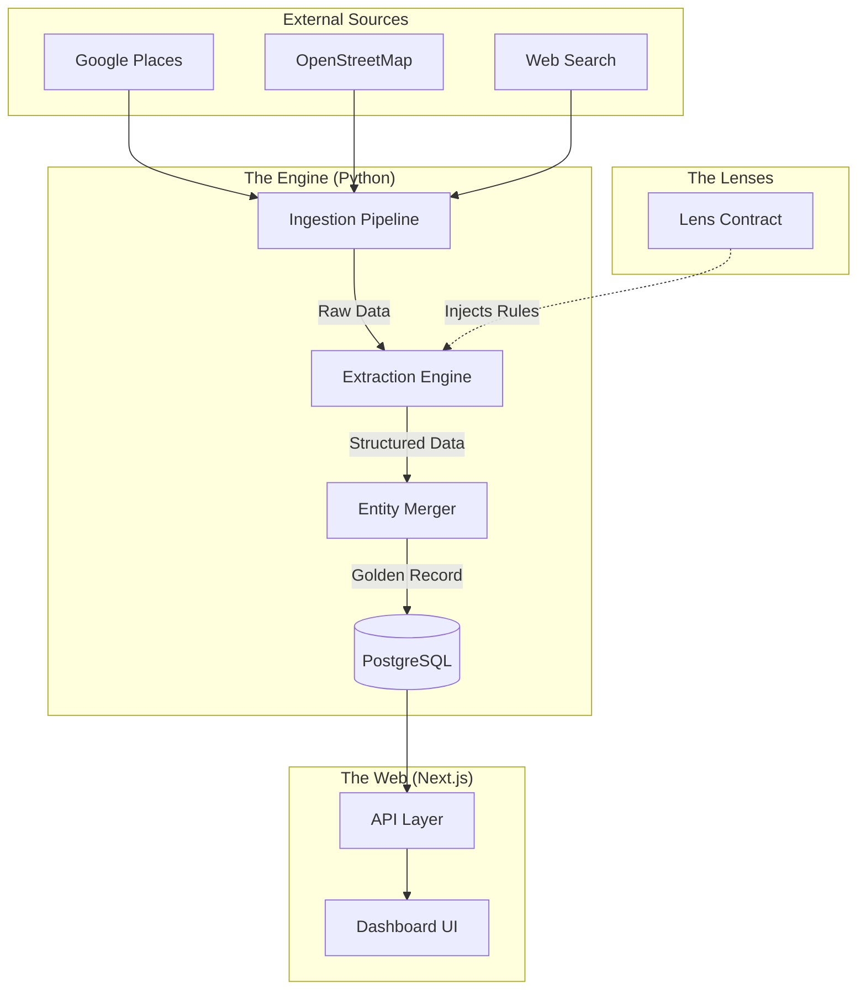

# Architecture Overview

The Edinburgh Finds platform is built on a modular architecture that separates the core data processing machinery from the domain-specific business logic.

## System Decomposition

The system consists of three main layers:

1.  **The Engine**: A vertical-agnostic data processing pipeline.
2.  **The Lenses**: Configuration bundles that define specific domains (Verticals).
3.  **The Web Interface**: A Next.js application for data visualization.

## Data Flow

1.  **Ingestion**: Raw data is fetched and stored as `RawIngestion` records.
2.  **Extraction**: The `Extraction Engine` uses LLMs and the `Lens Contract` to parse the raw data.
    - It identifies the `entity_class`.
    - It maps raw terms to `canonical_activities` and other dimensions.
3.  **Merging**: Extracted data is merged with existing entities to update the `Entity` table.
4.  **Presentation**: The Web UI queries the `Entity` table, filtering by `LensEntity` membership.

## Key Design Principles

- **Engine Purity**: The Engine code knows nothing about "Wine" or "Sports". It only knows about `canonical_activities` and generic "Modules".
- **Lens Driven**: All domain logic (e.g., "A wine bar has a wine list") is defined in the Lens configuration.
- **Golden Record**: We aim to have one single source of truth for every physical place.
