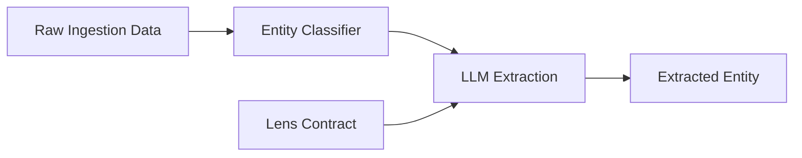

# Extraction Engine Subsystem

The **Extraction Engine** is the intelligent core of the platform. Its responsibility is to transform unstructured and semi-structured `RawIngestion` data into structured `ExtractedEntity` records that adhere to the universal entity model.

## Core Responsibilities

- **Entity Classification**: Determining if a raw record represents a `place`, `person`, `organization`, or `event`.
- **Attribute Extraction**: Using LLMs to parse names, addresses, contact details, and custom fields from raw JSON.
- **Dimension Mapping**: Translating raw source categories (e.g., "Padel Court" or "Bar à vin") into canonical, domain-agnostic keys.
- **Module Population**: Organizing data into namespaced JSONB modules (e.g., `location`, `contact`).

## Internal Architecture

The engine is built on a pipeline of specialized components:

1.  **Entity Classifier**: Uses a rule-based and LLM-assisted approach to resolve the `entity_class`.
    - Evidence: `engine/extraction/entity_classifier.py`
2.  **LLM Client**: A wrapper around the `Instructor` library and `Anthropic` API that provides type-safe extraction using Pydantic models.
    - Evidence: `engine/extraction/llm_client.py`
3.  **Lens Contract Processor**: Injects domain-specific mapping rules into the generic extraction logic.
    - Evidence: `engine/extraction/base.py` (`extract_with_lens_contract`)

## Data Flow

## Configuration & Customization

The engine is configured via `engine/config/extraction.yaml` which defines the models used, temperature settings, and retry logic. 

**Engine Purity Rule**: The code in `engine/extraction` must never contain logic specific to a single lens. It must operate purely on the abstractions defined in `entity_model.yaml` and the rules provided at runtime via the Lens Contract.
