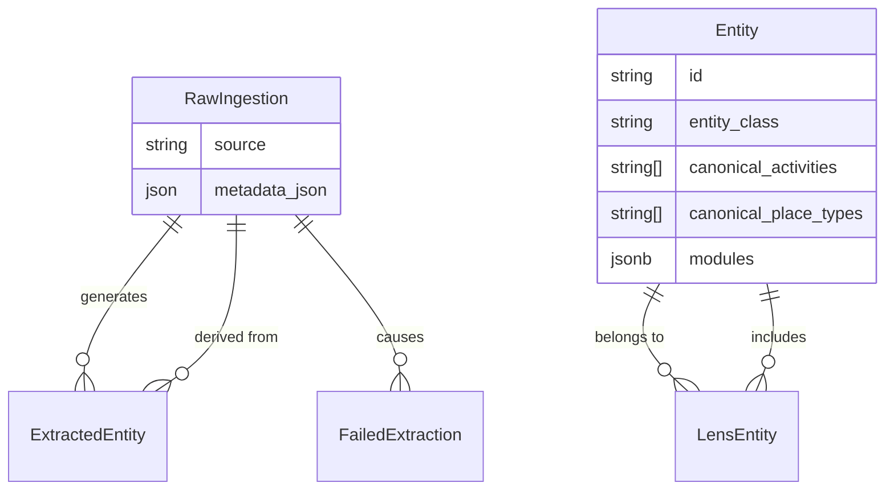

# Data Model Reference

The Edinburgh Finds data model is designed to support a "Golden Record" architecture, where multiple raw data points are merged into a single, high-quality `Entity`.

**Evidence**: `engine/schema.prisma`

## Core Concepts

### 1. RawIngestion
Represents the raw, untouched data fetched from an external source.
- **Purpose**: Audit trail and source of truth for re-extraction.
- **Key Fields**:
  - `source`: The origin (e.g., `google_places`).
  - `metadata_json`: The complete raw JSON payload.
  - `hash`: Used for deduplication.

### 2. ExtractedEntity
Represents the structured data extracted from a single `RawIngestion` record by the LLM.
- **Purpose**: Intermediate structured format before merging.
- **Key Fields**:
  - `entity_class`: The classification (e.g., `place`).
  - `attributes`: JSON structure matching the defined modules.

### 3. Entity (The Golden Record)
The final, consolidated representation of a real-world object.
- **Purpose**: The record served to the application.
- **Key Fields**:
  - `entity_class`: Fundamental type.
  - **Dimensions** (Opaque Arrays):
    - `canonical_activities`: e.g., `['tennis', 'padel']`.
    - `canonical_place_types`: e.g., `['sports_centre']`.
  - `modules`: JSONB column containing all rich data (Location, Contact, Hours).
  - `lensMemberships`: Relation to `LensEntity`.

### 4. LensEntity
A join table linking an `Entity` to a specific Lens (domain).
- **Purpose**: Defines which entities belong to which vertical.
- **Key Fields**:
  - `lensId`: e.g., `edinburgh_finds`.
  - `entityId`: FK to `Entity`.

## Database Diagram (ERD)

## Storage Strategy

- **Relational Columns**: Used for high-cardinality, indexed fields (IDs, Slugs, timestamps) and the "Dimensions" (Postgres Arrays) needed for filtering.
- **JSONB (`modules`)**: Used for the flexible, schema-driven attributes defined in `entity_model.yaml`. This allows schema evolution without heavy migrations.
