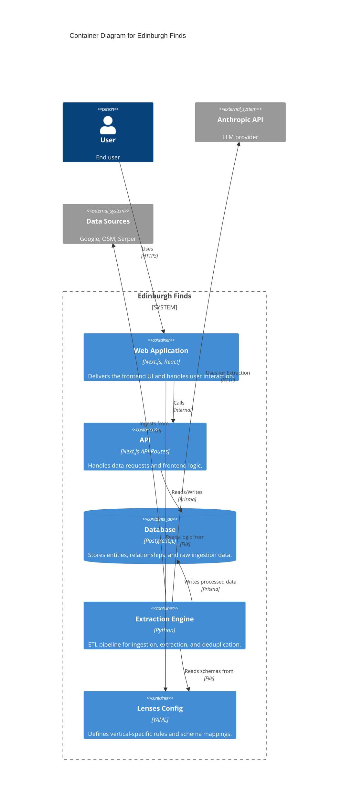

# C4 Container Diagram

```mermaid
C4Container
    title Container Diagram for Edinburgh Finds

    Person(user, "User", "End user")

    System_Boundary(c1, "Edinburgh Finds") {
        Container(webapp, "Web Application", "Next.js, React", "Delivers the frontend UI and handles user interaction.")
        Container(api, "API", "Next.js API Routes", "Handles data requests and frontend logic.")
        ContainerDb(db, "Database", "PostgreSQL", "Stores entities, relationships, and raw ingestion data.")
        Container(engine, "Extraction Engine", "Python", "ETL pipeline for ingestion, extraction, and deduplication.")
        Container(config, "Lenses Config", "YAML", "Defines vertical-specific rules and schema mappings.")
    }

    System_Ext(llm, "Anthropic API", "LLM provider")
    System_Ext(sources, "Data Sources", "Google, OSM, Serper")

    Rel(user, webapp, "Uses", "HTTPS")
    Rel(webapp, api, "Calls", "Internal")
    Rel(api, db, "Reads/Writes", "Prisma")
    
    Rel(engine, sources, "Ingests from", "HTTP")
    Rel(engine, llm, "Uses for Extraction", "HTTP")
    Rel(engine, db, "Writes processed data", "Prisma")
    Rel(engine, config, "Reads schemas from", "File")
    Rel(webapp, config, "Reads logic from", "File")
```
