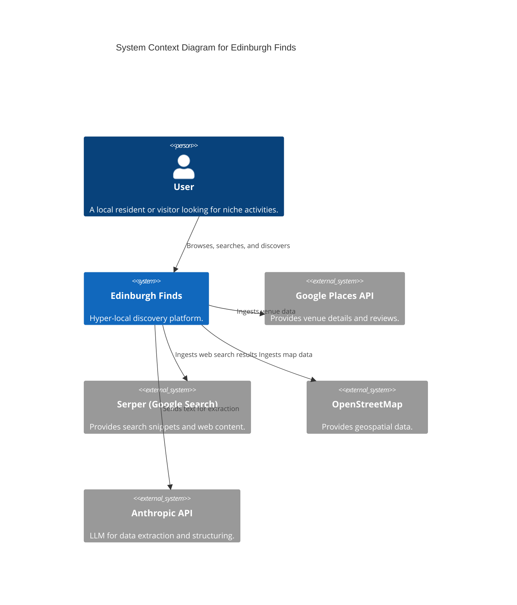

# C4 Context Diagram

```mermaid
C4Context
    title System Context Diagram for Edinburgh Finds

    Person(user, "User", "A local resident or visitor looking for niche activities.")
    
    System(edinburgh_finds, "Edinburgh Finds", "Hyper-local discovery platform.")

    System_Ext(google, "Google Places API", "Provides venue details and reviews.")
    System_Ext(serper, "Serper (Google Search)", "Provides search snippets and web content.")
    System_Ext(osm, "OpenStreetMap", "Provides geospatial data.")
    System_Ext(llm, "Anthropic API", "LLM for data extraction and structuring.")

    Rel(user, edinburgh_finds, "Browses, searches, and discovers")
    Rel(edinburgh_finds, google, "Ingests venue data")
    Rel(edinburgh_finds, serper, "Ingests web search results")
    Rel(edinburgh_finds, osm, "Ingests map data")
    Rel(edinburgh_finds, llm, "Sends text for extraction")
```
