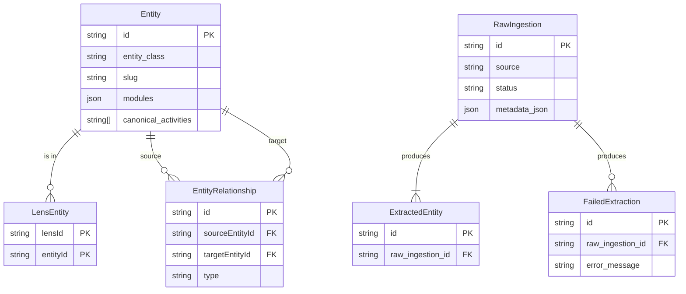

# Data Model Reference

Audience: Backend Developers and Data Engineers.

The data model is centered around the **Universal Entity Framework**, designed to be vertical-agnostic.

## Core Models

### Entity
The central record representing any Person, Place, Organization, Event, or Thing.

- **Table**: `Entity`
- **Key Fields**:
    - `entity_class`: The fundamental type (e.g., `place`, `person`).
    - `slug`: URL-friendly identifier.
    - `modules`: JSON field storing vertical-agnostic data (core, location, contact, etc.).
    - `canonical_activities`: Postgres array of opaque strings (interpreted by Lenses).
    - `canonical_roles`: Postgres array of opaque strings (e.g., `provides_facility`).

Evidence: `engine/schema.prisma` (model Entity), `engine/config/entity_model.yaml` (entity_classes)

### RawIngestion
Stores the raw data fetched from external sources before processing.

- **Table**: `RawIngestion`
- **Key Fields**:
    - `source`: The origin (e.g., `google_places`, `osm`).
    - `metadata_json`: The raw payload.
    - `hash`: For deduplication.

Evidence: `engine/schema.prisma` (model RawIngestion)

### LensEntity
Join table mapping Entities to specific Lenses (verticals).

- **Table**: `LensEntity`
- **Key Fields**:
    - `lensId`: The identifier of the lens (e.g., `padel_edinburgh`).
    - `entityId`: Reference to the `Entity`.

Evidence: `engine/schema.prisma` (model LensEntity)

## Configuration

The schema is generated from YAML configuration files, which serve as the source of truth.

- **Location**: `engine/config/schemas/*.yaml`
- **Process**: YAML -> Python FieldSpecs -> Prisma Schema.

Evidence: `engine/config/entity_model.yaml`

## Entity Relationship Diagram (ERD)

