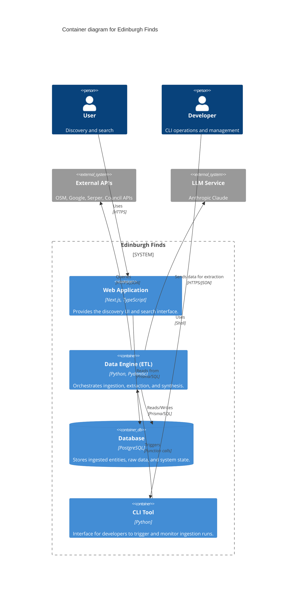

# C4 Container Diagram

The Container diagram shows the high-level technical architecture and how the various subsystems are partitioned.

## Containers
- **Web Application**: A Next.js 16 application that serves the frontend and handles user queries. It interacts with the database via Prisma.
- **Data Engine (ETL)**: The core Python logic responsible for the ingestion pipeline. It handles the complexity of multi-source merging and trust rules.
- **Database**: A PostgreSQL instance (managed via Supabase) that serves as the central storage for all discovery data and system configuration.
- **CLI Tool**: A set of scripts and entry points that allow developers to run ingestion tasks, validate schemas, and manage the system.

---
*Evidence: tech-stack.md and subsystem documentation.*
