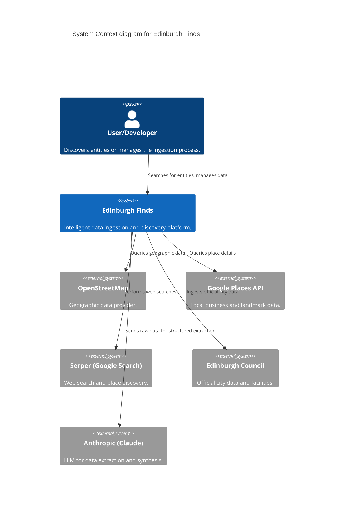

# C4 Context Diagram

The System Context diagram provides a high-level view of how Edinburgh Finds interacts with its users and external systems.

## External Systems
- **OpenStreetMap**: Primary source for geographic features and basic entity information.
- **Google Places**: High-quality source for business details, ratings, and opening hours.
- **Serper**: Used for broad discovery when specific IDs are unknown, and for gathering auxiliary web information.
- **Edinburgh Council**: Source for official government data, public facilities, and planning information.
- **Anthropic (Claude)**: Provides the intelligence for extracting structured information from raw, messy data sources.

---
*Evidence: engine-ingestion and engine-extraction subsystem analysis.*
