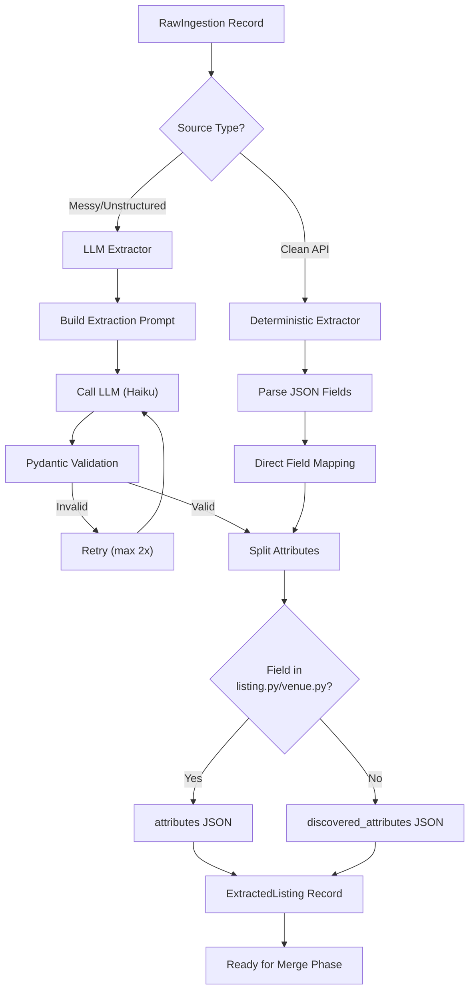

# Track: Data Extraction Engine

## Overview

Build a modular, intelligent extraction engine that transforms raw ingested data into structured, validated listings. This is Phase 2 of the overall data pipeline (Phase 1: Ingestion completed in track `data_ingestion_pipeline_20260114`).

The extraction engine complements the ingestion engine by parsing raw JSON/text from multiple sources, intelligently extracting structured data, and populating the Universal Entity Framework with high-quality, trustworthy information.

## Problem Statement

**Current State:**
- ✅ Ingestion pipeline successfully gathers raw data from 6 sources
- ✅ Raw data stored in `RawIngestion` table + filesystem
- ❌ No automated extraction from raw data to `Listing` table
- ❌ Manual transform exists only for Edinburgh Council (single source)
- ❌ No systematic handling of multi-source data merging
- ❌ No trust hierarchy enforcement
- ❌ Limited rich descriptive text capture for summary generation

**Desired State:**
- ✅ Automated extraction from ALL 6 ingestion sources
- ✅ Intelligent routing: deterministic for clean APIs, LLM for messy data
- ✅ Multi-source merging with field-level trust scoring
- ✅ Rich text capture (reviews, descriptions) for quality summaries
- ✅ Robust validation, error handling, and observability
- ✅ Extensible to any future source or data format

## Architecture Principles

Mirrors the ingestion pipeline design:

1. **Modular:** Each source has a dedicated extractor implementing common interface
2. **Intelligent:** Automatic routing between deterministic and LLM-based extraction
3. **Separation of Concerns:** Extract → Validate → Merge as distinct phases
4. **Portable:** Works with SQLite (dev) and future Supabase (prod)
5. **Extensible:** Easy to add new sources without changing core infrastructure
6. **Observable:** Comprehensive logging, health checks, and error tracking
7. **Cost-Conscious:** LLM usage only where necessary, with caching

## Extraction Strategy

### Source-Specific Routing

**Deterministic Extractors** (Clean, structured APIs):
- ✅ Google Places API - Well-defined JSON schema
- ✅ Sport Scotland WFS - GeoJSON with consistent structure
- ✅ Edinburgh Council - GeoJSON features
- ✅ OpenChargeMap API - Structured response

**LLM Extractors** (Unstructured, needs interpretation):
- 🤖 Serper (Google Search) - Varying snippets, needs semantic understanding
- 🤖 OpenStreetMap - Free-text tags, inconsistent formatting

**Future-Proof:**
- Any new source (PDFs, raw text dumps, scraped HTML) can be added
- Extractors decide strategy based on source characteristics

### Hybrid Extraction Process



## Field Extraction Rules

### Null Semantics (Critical for Data Quality)

**Text/String fields:**
- Extract verbatim if found in source
- Use `null` if field not mentioned or unclear
- Use `""` (empty string) ONLY if source explicitly says "N/A" or "None"

**Boolean fields** (wheelchair_accessible, parking_available, etc.):
- `true` = Clear evidence it exists ("wheelchair ramp available")
- `false` = Clear evidence it does NOT exist ("no wheelchair access")
- `null` = Not mentioned, uncertain, or ambiguous
- **CRITICAL:** Absence of mention ≠ false. Use null for unknown.

**Numeric fields** (capacity, price, rating):
- Extract exact number if stated
- `null` if not mentioned
- Do NOT guess or estimate

**Lists/Arrays** (amenities, sports_offered):
- `[]` (empty array) = Source explicitly says "none"
- `null` = Not mentioned or can't determine
- `["item1", "item2"]` = Found items (only include if confident)

**Coordinates** (latitude, longitude):
- Extract if present
- `null` if not found
- NEVER estimate or geocode (that's a separate enrichment step)

### Conflict Resolution

When raw text contains conflicting information:

1. **Recency wins:** If text indicates timeline ("recently expanded", "now has"), use newer value
2. **Specificity wins:** "4 glass-backed courts" > "several courts"
3. **Flag uncertainty:** If truly ambiguous, extract with conflict metadata:

```json
{
  "padel_total_courts": 5,
  "discovered_attributes": {
    "padel_courts_conflict_detected": true,
    "padel_courts_previous_value": 4,
    "extraction_note": "Text mentioned 4 courts initially, then 'recently expanded to 5'"
  },
  "field_confidence": {
    "padel_total_courts": 0.6
  }
}
```

## Schema-Driven Attribute Splitting

**Golden Source:** `engine/schema/listing.py` and `engine/schema/venue.py`

**Rule:** Any field defined in FieldSpec goes to `attributes`, everything else goes to `discovered_attributes`

**Example:**
```python
# LLM extracts this from raw data:
{
  "entity_name": "Game4Padel",  # In listing.py ✅
  "padel_total_courts": 4,      # In venue.py ✅
  "padel_court_surface": "artificial grass",  # NOT in venue.py ❌
  "booking_system": "ClubSpark"  # NOT in venue.py ❌
}

# Split into:
attributes = {
  "entity_name": "Game4Padel",
  "padel_total_courts": 4
}

discovered_attributes = {
  "padel_court_surface": "artificial grass",
  "booking_system": "ClubSpark"
}
```

**Promotion Path:**
1. User reviews `discovered_attributes` in admin panel
2. Adds useful field to `venue.py` FieldSpec
3. Re-runs extraction → field auto-promotes to `attributes`

## Special Field Handling

### Phone Number Formatting

**Library:** `phonenumbers` (Google's library, 99.9% accurate)

**Process:**
1. LLM extracts raw: `"phone": "0131 539 7071"`
2. Post-processing: `format_phone_uk()` → `"+441315397071"`
3. Save E.164 format to database
4. If parsing fails → `null`

### Postcode Formatting

**Library:** Python regex (UK postcode pattern, 100% accurate)

**Process:**
1. LLM extracts raw: `"postcode": "eh12 5aw"`
2. Post-processing: `format_postcode_uk()` → `"EH12 5AW"`
3. If invalid format → `null`

### Opening Hours

**Strategy:** LLM with strict JSON template + validation

**Template:**
```json
{
  "monday": {"open": "05:30", "close": "22:00"},
  "tuesday": {"open": "05:30", "close": "22:00"},
  "wednesday": {"open": "05:30", "close": "22:00"},
  "thursday": {"open": "05:30", "close": "22:00"},
  "friday": {"open": "05:30", "close": "22:00"},
  "saturday": {"open": "07:00", "close": "20:00"},
  "sunday": "CLOSED"
}
```

**Rules:**
- 24-hour format (00:00-23:59)
- If closed, use string `"CLOSED"`
- If unknown for a day, use `null`
- Validate with Pydantic, retry if malformed

### Summary Field Synthesis

**Multi-Stage Process:**

**Stage 1: Extract Structured Facts**
```python
# First extraction: structured data
{
  "padel": true,
  "padel_total_courts": 4,
  "indoor": true
}
```

**Stage 2: Capture Rich Descriptive Text**

New field in schema: `raw_descriptions` (separate from discovered_attributes)

```python
{
  "raw_descriptions": {
    "google_editorial": "Indoor padel facility with 4 glass courts, coaching available",
    "serper_snippet": "Edinburgh's premier padel venue with LED-lit courts",
    "reviews_excerpt": [
      "well-maintained courts",
      "excellent lighting for evening play",
      "professional coaching staff"
    ]
  }
}
```

**Stage 3: LLM Synthesis**

```python
# LLM generates summary using:
# - Structured facts (4 courts, indoor, LED)
# - Editorial summaries
# - Review themes

prompt = f"""
Generate a summary of padel facilities.

Structured data:
- padel_total_courts: 4
- indoor: true
- lighting: LED

Descriptions:
- Google: "Indoor padel facility with 4 glass courts, coaching available"
- Reviews mention: well-maintained, excellent lighting, professional coaching

Requirements:
- Length: 100-200 characters (strict)
- Voice: "Knowledgeable Local Friend" (see product-guidelines.md)
- Focus: Practical utility, no marketing fluff
- Include: Specific details that help users decide

If you exceed character limit, I will ask you to shorten. Count carefully.
"""
```

**Character Limit Enforcement:**

```python
for attempt in range(3):
    summary = llm.generate(prompt)
    char_count = len(summary)

    if min_chars <= char_count <= max_chars:
        return summary  # ✅

    # Retry with feedback
    if char_count > max_chars:
        prompt += f"\n\nToo long ({char_count} chars). Reduce to {max_chars} max."
    else:
        prompt += f"\n\nToo short ({char_count} chars). Expand to {min_chars} min."
```

**Configuration in FieldSpec:**

```python
# venue.py
FieldSpec(
    name="padel_summary",
    type_annotation="Optional[str]",
    description="A short overall description of the padel facilities",
    llm_extraction_config={
        "min_characters": 100,
        "max_characters": 200,
        "synthesis_mode": "post_extraction",  # Generate AFTER facts extracted
        "style": "knowledgeable_local"
    }
)
```

### Categories Handling

**Two-tier system:**

1. **`categories`** (LLM extraction, free-form):
   - LLM extracts anything it finds: `["indoor sports", "racquet sports", "padel courts"]`
   - Stored as-is in database
   - Visible in admin for review

2. **`canonical_categories`** (Manual curation, controlled taxonomy):
   - Defined in `engine/config/canonical_categories.yaml`
   - You manually promote `categories` → `canonical_categories`
   - Excluded from LLM extraction (`exclude=True`)
   - Used for site navigation and filtering

**Canonical Categories Config:**

```yaml
# engine/config/canonical_categories.yaml
venue:
  - slug: indoor-sports
    name: Indoor Sports
    maps_from: ["indoor", "inside", "covered sports"]

  - slug: racquet-sports
    name: Racquet Sports
    maps_from: ["tennis", "padel", "squash", "badminton"]

  - slug: swimming
    name: Swimming & Aquatics
    maps_from: ["pool", "swimming", "aquatics", "water sports"]
```

**Promotion Workflow:**
1. LLM extracts → `categories: ["indoor tennis", "padel courts"]`
2. Admin reviews, maps "indoor tennis" → canonical: `["indoor-sports", "racquet-sports"]`
3. Updates config YAML
4. Future extractions with "indoor tennis" auto-promote

## Multi-Source Merging & Deduplication

### Detection Strategy

**Multi-strategy matching with confidence scoring:**

**Strategy 1: External ID Matching (100% confidence)**
- Google Place ID, OSM ID, Sport Scotland ID
- If `external_ids.google_place_id` matches → same entity

**Strategy 2: Exact Slug Matching (95% confidence)**
- Slugs generated from normalized names
- `"game4padel-edinburgh"` → exact match

**Strategy 3: Fuzzy Name + Location Proximity (variable confidence)**
- Name similarity >85% (Levenshtein distance via `fuzzywuzzy`)
- Coordinates within 50 meters
- Confidence = `(name_similarity + location_proximity) / 2`

**Example:**
```python
# Discovery finds:
# Source 1 (Google): "Game4Padel Edinburgh", lat: 55.953, lng: -3.188
# Source 2 (Serper): "Game 4 Padel - Edinburgh", lat: 55.9531, lng: -3.1879

# Fuzzy match:
name_sim = 0.92  # 92% similar
location_sim = 0.98  # 6 meters apart
confidence = 0.95  # Match!
```

### Trust Hierarchy

**Field-Level Trust Scoring:**

```yaml
# engine/config/extraction.yaml
trust_levels:
  manual_override: 100      # Admin edits (Golden Data)
  sport_scotland: 90        # Official government source
  edinburgh_council: 85     # Official council data
  google_places: 70         # High-volume platform
  serper: 50               # Search aggregation
  osm: 40                  # Open crowdsourced
  open_charge_map: 40      # Open crowdsourced
  unknown_source: 10       # Raw text dumps, unverified
```

**Field Provenance Tracking:**

```python
# Listing record stores source per field
{
  "name": "Game4Padel",
  "phone": "+441315397071",
  "latitude": 55.953,

  "field_sources": {
    "name": {"source": "google_places", "trust": 70, "updated_at": "2026-01-15"},
    "phone": {"source": "manual_override", "trust": 100, "updated_at": "2026-01-10"},
    "latitude": {"source": "osm", "trust": 40, "updated_at": "2026-01-15"}
  }
}
```

**Merge Logic:**

```python
def merge_field(current_value, new_value, current_source, new_source):
    """Merge field value based on trust hierarchy."""
    current_trust = config.trust_levels[current_source]
    new_trust = config.trust_levels[new_source]

    if new_trust > current_trust:
        return new_value, new_source  # Higher trust wins
    else:
        return current_value, current_source  # Keep current
```

**Benefits:**
- ✅ Add new sources at any trust level
- ✅ Adjust trust dynamically (edit YAML, no DB migration)
- ✅ Audit trail per field
- ✅ Can demote source if quality degrades

## Error Handling & Quality Control

### Quarantine Pattern

**When extraction fails** (LLM timeout, validation error, API issues):

1. **Capture failure:**
```python
# Create FailedExtraction record
{
  "raw_ingestion_id": "abc-123",
  "source": "serper",
  "error_type": "ValidationError",
  "error_message": "Invalid coordinates: latitude out of range",
  "attempted_at": "2026-01-15T10:30:00Z",
  "retry_count": 2,
  "raw_data_snapshot": {...}  # For debugging
}
```

2. **Continue processing:** Don't halt entire batch

3. **Review interface:** CLI command shows failed extractions
```bash
$ python -m engine.extraction.health

Failed Extractions (Last 24h): 3
  1. Serper record abc-123: ValidationError (Invalid coordinates)
  2. OSM record def-456: LLM timeout after 3 retries
  3. Serper record ghi-789: Missing required field 'entity_name'
```

4. **Retry workflow:**
```bash
# Fix underlying issue (update prompt, fix validation schema)
# Retry specific failed record
$ python -m engine.extraction.run --raw-id=abc-123 --force-retry
```

### Validation Layers

**Layer 1: Pydantic Schema Validation**
- All extracted data must pass schema validation
- Uses Instructor library for auto-retry (max 2 attempts)
- Fields with wrong types rejected

**Layer 2: Business Logic Validation**
- Coordinates within valid ranges (lat: -90 to 90, lng: -180 to 180)
- Phone numbers valid E.164 format
- URLs well-formed
- Enum values match allowed types

**Layer 3: Confidence Thresholding**
- Fields with `confidence < 0.7` flagged for manual review
- Low-confidence data stored but marked for verification

## LLM Configuration

### Model Selection

**Simple, swappable config:**

```yaml
# engine/config/extraction.yaml
llm:
  model: "claude-haiku-20250318"  # Single config, easy to change

  # Future enhancement (not Phase 1):
  # source_overrides:
  #   serper: "claude-sonnet-4-20250514"  # If Haiku struggles
```

**No automatic model fallback** (cost protection)
- Manual override only
- Monitor extraction stats to identify sources needing upgrade

### Prompt Engineering

**Source-Specific Prompts:**

Each extractor has tailored system prompt:

```python
# serper_extractor.py
SYSTEM_PROMPT = """
You are extracting venue data from Google Search results (via Serper).

Input: Search result snippets, titles, URLs
Output: Structured venue data (JSON)

Null Semantics Rules:
- Text fields: null if not found, extract verbatim if present
- Booleans: true (confirmed yes), false (confirmed no), null (unknown)
- Numbers: exact value or null, never estimate

If you find conflicting information, use the most recent or specific value.
Flag conflicts in discovered_attributes.

Extract data conforming to this schema:
{VENUE_SCHEMA}
"""
```

**Instructor Integration:**

```python
from instructor import from_anthropic
from anthropic import Anthropic

client = from_anthropic(Anthropic(api_key=...))

# Guaranteed Pydantic output
venue_data = client.messages.create(
    model="claude-haiku-20250318",
    max_tokens=2000,
    messages=[{"role": "user", "content": raw_text}],
    response_model=VenueExtraction  # Pydantic model
)
```

### Cost Optimization

**LLM Caching:**

```python
# After successful LLM extraction, cache result
# Table: ExtractedListingCache
{
  "raw_ingestion_id": "abc-123",
  "extraction_hash": "sha256...",  # Hash of raw content
  "extracted_data": {...},
  "model_used": "claude-haiku-20250318",
  "created_at": "2026-01-15T10:30:00Z"
}

# Before calling LLM, check cache
cached = db.find_cached_extraction(content_hash)
if cached:
    return cached.extracted_data  # Skip LLM call, save cost
```

**Benefits:**
- Deduplication prevents redundant LLM calls
- Re-running extraction on same raw data = free
- Significant savings over time

## Observability & Monitoring

### Health Dashboard

```bash
$ python -m engine.extraction.health

Extraction Pipeline Health Report
==================================

Unprocessed Records: 47 RawIngestion records waiting
Processing Rate: 15 extractions/hour (last 24h)

Success Rates by Source:
  google_places: 98% (245/250)
  serper: 87% (174/200)  ⚠️ Lower than average
  osm: 92% (138/150)
  sport_scotland: 100% (50/50)
  edinburgh_council: 95% (38/40)
  open_charge_map: 100% (30/30)

Field Null Rates (Top 5 missing fields):
  phone: 65% null  ⚠️ Consider additional sources
  opening_hours: 45% null
  website_url: 32% null
  email: 78% null  ⚠️ Very sparse
  parking_available: 89% null

Recent Failures (Last 10):
  1. RawIngestion abc123 - Serper - ValidationError: Invalid coordinates
  2. RawIngestion def456 - OSM - LLM timeout after 3 retries
  ...

LLM Usage (Last 24h):
  Total tokens: 1.2M
  Estimated cost: $0.45
  Avg tokens per extraction: 850

Merge Conflicts Detected (Last 24h): 12
  - "Game4Padel" (3 sources): phone number mismatch (google vs manual)
  - "Powerleague Portobello" (2 sources): court count differs (osm vs google)
```

### Logging

**Structured logging for debugging:**

```python
logger.info(
    "Extraction completed",
    extra={
        "raw_ingestion_id": record.id,
        "source": record.source,
        "extractor_type": "llm",
        "model": "claude-haiku-20250318",
        "tokens_used": 850,
        "fields_extracted": 32,
        "fields_null": 8,
        "confidence_avg": 0.87,
        "duration_ms": 1250
    }
)
```

## CLI Interface

### Modes of Operation

**1. Single Record Extraction** (Testing/Debugging)
```bash
$ python -m engine.extraction.run --raw-id=abc-123

Extracting RawIngestion abc-123 (source: google_places)...
✓ Extraction completed
✓ Validation passed
✓ 32 fields extracted, 8 null
✓ Saved to ExtractedListing xyz-789

Summary:
  entity_name: Game4Padel Edinburgh
  entity_type: VENUE
  attributes: 24 fields
  discovered_attributes: 8 fields
```

**2. Per-Source Extraction** (Batch by source)
```bash
$ python -m engine.extraction.run --source=serper

Processing 47 unprocessed Serper records...
[========================================] 47/47 (100%)

Results:
  ✓ Successful: 42
  ⚠️ Failed: 5 (see logs for details)

Average processing time: 1.8s per record
LLM tokens used: 38,500 (~$0.15)
```

**3. Batch All Unprocessed** (Production run)
```bash
$ python -m engine.extraction.run_all

Scanning for unprocessed RawIngestion records...
Found 147 records across 6 sources

Processing:
  google_places: 45 records [========] ✓
  serper: 50 records [========] ✓ (3 failed)
  osm: 30 records [========] ✓
  sport_scotland: 12 records [========] ✓
  edinburgh_council: 8 records [========] ✓
  open_charge_map: 2 records [========] ✓

Overall Results:
  ✓ Successful: 144/147 (98%)
  ⚠️ Failed: 3 (quarantined for review)

Total LLM cost: $0.42
Total time: 4m 32s
```

**4. Force Retry Failed** (Retry quarantined records)
```bash
$ python -m engine.extraction.run --retry-failed

Found 3 failed extractions to retry...
  1. abc-123 (serper): ValidationError
     Retry attempt 3/3... ✓ Success!
  2. def-456 (osm): LLM timeout
     Retry attempt 3/3... ✗ Failed again (max retries reached)
  3. ghi-789 (serper): Missing required field
     Retry attempt 3/3... ✓ Success!

Results:
  ✓ Recovered: 2/3
  ⚠️ Still failing: 1 (manual intervention needed)
```

## Integration with Ingestion Pipeline

### Enhanced Ingestion for Rich Text

**Update Required:** Modify ingestion connectors to capture rich descriptive text for summary synthesis.

**Google Places:**

```yaml
# engine/config/sources.yaml
google_places:
  field_mask: >-
    places.id,
    places.displayName,
    places.formattedAddress,
    places.location,
    places.rating,
    places.userRatingCount,
    places.editorialSummary,          # NEW: AI-generated description
    places.reviews,                    # NEW: User reviews
    places.types,                      # NEW: Business categories
    places.regularOpeningHours,       # NEW: Structured hours
    places.websiteUri,
    places.internationalPhoneNumber,
    places.currentOpeningHours,
    places.primaryType,
    places.shortFormattedAddress,
    places.googleMapsUri
```

**Serper:**
- Already captures snippets in search results
- Update to extract meta descriptions from URLs

**OSM:**
- Capture `description` tag if present
- Extract notes and comments

**Storage:**

Add `raw_descriptions` field to RawIngestion or extract during processing:

```python
# During extraction, populate:
{
  "raw_descriptions": {
    "google_editorial": "Indoor padel facility with 4 glass courts...",
    "google_reviews_summary": ["well-maintained", "excellent lighting"],
    "serper_snippet": "Edinburgh's premier padel venue..."
  }
}
```

## Testing Strategy

### Test Coverage Goals

**Target:** >80% code coverage across all extraction modules

### Test Types

**1. Unit Tests with Fixtures**

```python
# tests/extraction/test_google_places_extractor.py
def test_extract_google_places_venue():
    """Test deterministic extraction from Google Places API response."""
    # Load fixture
    with open('tests/fixtures/google_places_padel_response.json') as f:
        raw_data = json.load(f)

    extractor = GooglePlacesExtractor()
    result = extractor.extract(raw_data)

    assert result['entity_name'] == "Game4Padel Edinburgh"
    assert result['latitude'] == 55.953
    assert result['phone'] == "+441315397071"  # E.164 formatted
```

**2. Validation Tests**

```python
# tests/extraction/test_validation.py
def test_invalid_coordinates_rejected():
    """Ensure out-of-range coordinates fail validation."""
    data = {
        "entity_name": "Test Venue",
        "latitude": 91.5,  # Invalid (> 90)
        "longitude": -3.188
    }

    with pytest.raises(ValidationError):
        VenueExtraction(**data)
```

**3. Snapshot Testing**

```python
# tests/extraction/test_snapshots.py
def test_serper_extraction_snapshot():
    """Ensure Serper extraction matches known-good output."""
    with open('tests/fixtures/serper_padel_edinburgh.json') as f:
        raw_data = json.load(f)

    extractor = SerperExtractor()
    result = extractor.extract(raw_data)

    # Compare to snapshot
    assert_matches_snapshot(result, 'serper_padel_edinburgh_v1.json')
```

**4. Null Semantics Tests**

```python
def test_boolean_null_semantics():
    """Test proper null handling for boolean fields."""
    # Mentioned as available
    assert extract_boolean("wheelchair accessible") == True

    # Mentioned as not available
    assert extract_boolean("no wheelchair access") == False

    # Not mentioned at all
    assert extract_boolean("parking available") == None  # Not in text
```

**5. Trust Hierarchy Tests**

```python
def test_field_level_trust_merge():
    """Test that higher trust source overwrites lower trust."""
    current = {"phone": "+441111111111", "source": "osm", "trust": 40}
    new = {"phone": "+442222222222", "source": "google_places", "trust": 70}

    merged = merge_field(current, new)

    assert merged['phone'] == "+442222222222"  # Higher trust wins
    assert merged['source'] == "google_places"
```

## Success Metrics

### Phase 1 Completion Criteria

- [ ] All 6 ingestion sources have working extractors
- [ ] Deterministic extractors: 100% success rate (Google Places, Sport Scotland, Edinburgh Council, OpenChargeMap)
- [ ] LLM extractors: >85% success rate (Serper, OSM)
- [ ] Test coverage >80% across all extraction modules
- [ ] Health dashboard shows extraction pipeline status
- [ ] Rich text capture enabled for Google Places and Serper
- [ ] Summary synthesis working for at least 3 `*_summary` fields
- [ ] Zero duplicate listings created (deduplication working)
- [ ] Field-level trust tracking functional
- [ ] CLI supports all 4 modes (single, per-source, batch, retry)

### Quality Metrics (Ongoing)

- [ ] Null rate <50% for core fields (name, location, contact)
- [ ] Conflict detection catches ambiguous data
- [ ] Failed extractions <5% of total volume
- [ ] LLM cost <£1 per 100 extractions
- [ ] Average extraction time <2s per record

## Future Enhancements (Not in Scope)

### Phase 2: Relationship Extraction
- Extract "teaches_at", "plays_at", "based_at" relationships
- Populate `ListingRelationship` table
- Build ecosystem graph for SEO pages

### Phase 3: Advanced Merging
- Cross-source entity resolution (fuzzy matching across all sources)
- Automated canonical category promotion
- Sentiment analysis from reviews

### Phase 4: Enrichment
- Geocoding for missing coordinates
- Reverse geocoding for addresses
- Image extraction and validation
- Social media profile discovery

### Phase 5: Real-Time
- Webhook triggers for extraction on new ingestion
- Streaming extraction pipeline
- Live dashboard updates

## Dependencies

**External Libraries (Python):**
- `instructor` - LLM structured output with Pydantic
- `anthropic` - Claude API client
- `phonenumbers` - Phone number parsing and formatting
- `fuzzywuzzy` - String similarity for fuzzy matching
- `pydantic` - Data validation and settings management

**Internal Dependencies:**
- Ingestion pipeline (`engine/ingestion/`) - must be complete
- Schema definitions (`engine/schema/listing.py`, `engine/schema/venue.py`)
- Prisma database client

## Risks & Mitigations

| Risk | Impact | Mitigation |
|------|--------|------------|
| LLM hallucination produces bad data | High | Pydantic validation, confidence scoring, manual review for low-confidence |
| LLM cost runaway | Medium | Caching, character limits, Haiku model, monitoring |
| Deduplication creates false positives | Medium | Multi-strategy matching, confidence thresholds, manual review for <85% matches |
| Extraction too slow for large batches | Low | Async processing, batch optimization, future: parallel workers |
| Schema changes break extractors | Medium | Comprehensive tests, schema versioning, migration scripts |

## Glossary

- **RawIngestion:** Database record tracking raw data file from ingestion pipeline
- **ExtractedListing:** Intermediate extraction result before merging (one per source per entity)
- **Listing:** Final merged entity in database (single record per venue/club/etc)
- **Deterministic Extractor:** Rule-based parser for structured data (no LLM)
- **LLM Extractor:** AI-powered parser for unstructured text
- **Quarantine:** Storage for failed extractions requiring manual review
- **Trust Level:** Numeric score (0-100) indicating source reliability
- **Field Provenance:** Metadata tracking which source provided each field value
- **Discovered Attributes:** Unvalidated, schema-less data awaiting review
- **Canonical Categories:** Controlled taxonomy for site navigation (vs free-form categories)
