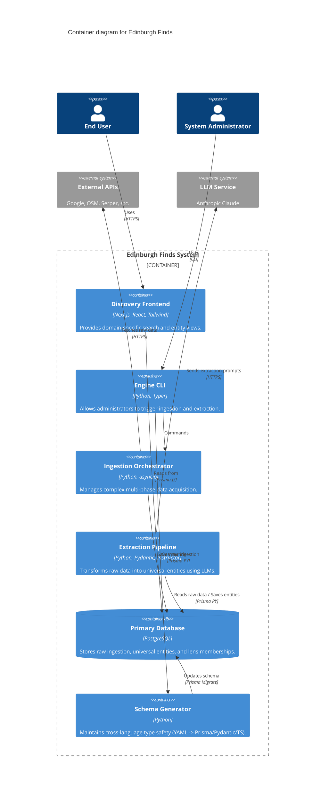

# C4 Container Diagram

The C4 Container diagram shows the high-level technical building blocks of the Edinburgh Finds system.

## Containers
- **Discovery Frontend**: A modern web application that applies "Lenses" to the data. It is read-heavy and uses Prisma for type-safe queries.
- **Ingestion Orchestrator**: The "brain" of data acquisition. It manages dependencies between connectors and ensures efficient data gathering.
- **Extraction Pipeline**: The core value-add component that turns messy JSON into a structured, queryable database.
- **Schema Generator**: An internal tool that ensures that a change in the data model is reflected across the entire stack.
- **Primary Database**: The central repository for all structured and semi-structured data.

---
*Evidence: docs/architecture/subsystems/engine.md, docs/architecture/subsystems/database.md, docs/architecture/subsystems/web.md*
