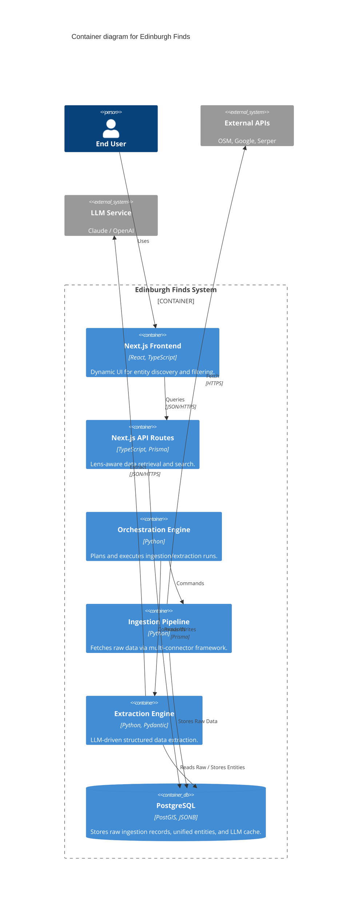

Audience: Developers

# C4 Container Diagram

The Container diagram shows the high-level software building blocks of the Edinburgh Finds system.

## Internal Components

- **PostgreSQL:** The central source of truth, utilizing `JSONB` for extensible module data and `PostGIS` for spatial queries.
- **Python Engine:** Handles the heavy lifting of data processing, LLM orchestration, and schema enforcement.
- **Next.js Frontend:** A modern, type-safe interface that leverages the shared schema for consistent data rendering.
