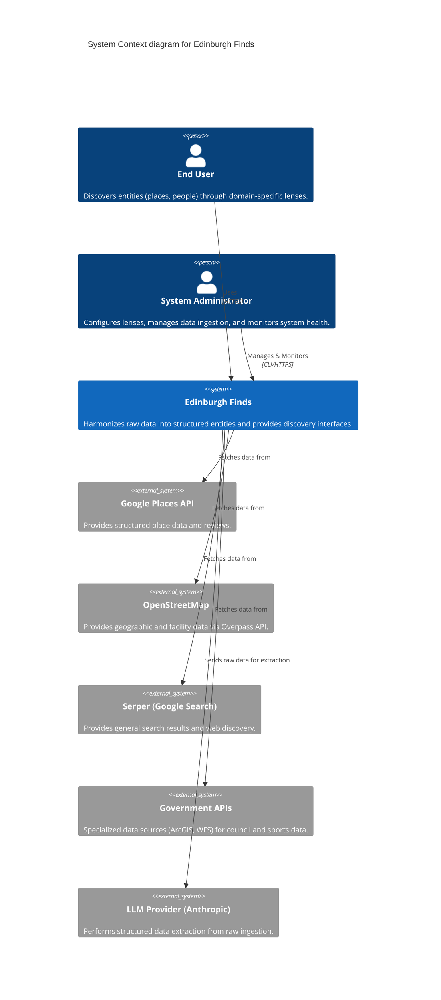

# C4 Context Diagram

The C4 Context diagram shows the Edinburgh Finds system and its relationship with users and external systems.

## External Actors
- **End User**: Primarily interacts with the Next.js web application to find specific types of entities (e.g., "padel courts" or "wine shops").
- **System Administrator**: Uses the Engine CLI to trigger ingestion jobs, check purity, and update schemas.

## External Systems
- **Data Providers**: Various APIs that provide the raw material for the engine.
- **LLM Provider**: The intelligence layer used for high-fidelity extraction of attributes from messy raw data.

---
*Evidence: docs/architecture/subsystems/engine.md, docs/architecture/subsystems/infrastructure.md*
