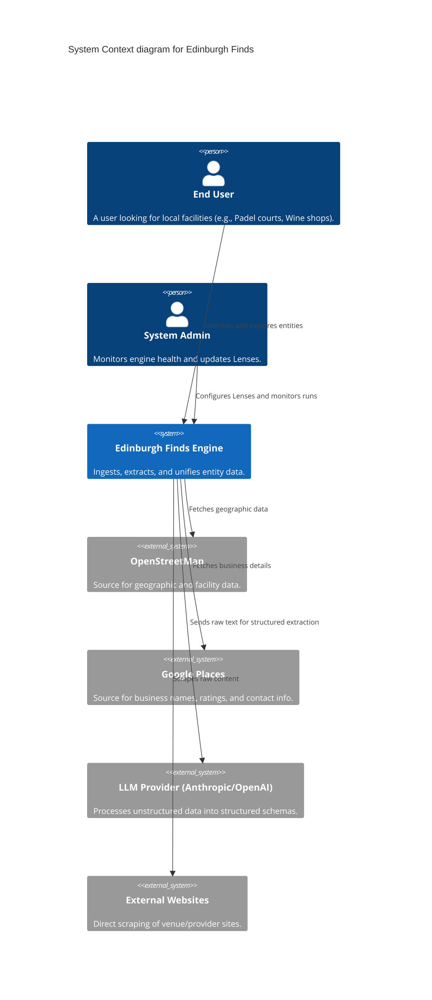

Audience: Developers

# C4 Context Diagram

The System Context diagram shows the Edinburgh Finds system and its relationship with users and external systems.

## External Dependencies

- **OpenStreetMap:** Primary source for physical locations and basic attributes.
- **Google Places / Serper:** High-fidelity source for business names and ratings.
- **LLM Provider:** Critical for turning noisy raw data into the Universal Entity Model.
- **Local Authorities:** (e.g., Edinburgh Council) Trusted sources for specific facility types.
