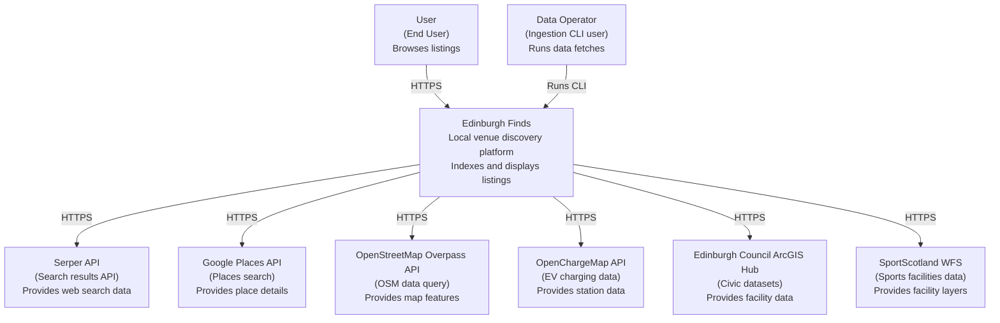

# C4 Level 1: System Context

**Generated:** 2026-01-15
**System:** Edinburgh Finds

## Purpose

This diagram shows how users and external systems interact with Edinburgh Finds.

## Diagram

## Key Actors

- **User:** Uses the web app to browse venue listings.
- **Data Operator:** Runs ingestion CLI to fetch external data sources.

## External Dependencies

| System | Purpose | Protocol |
|--------|---------|----------|
| Serper API | Search results ingestion | HTTPS |
| Google Places API | Places search ingestion | HTTPS |
| OpenStreetMap Overpass API | Map feature ingestion | HTTPS |
| OpenChargeMap API | EV charging data ingestion | HTTPS |
| Edinburgh Council ArcGIS Hub | Civic dataset ingestion | HTTPS |
| SportScotland WFS | Sports facility ingestion | HTTPS |
