# C4 Level 1: System Context

**Generated:** 2026-01-14
**System:** Edinburgh Finds

## Purpose

This diagram shows how users and external systems interact with Edinburgh Finds, a hyper-local directory platform connecting enthusiasts with venues, coaches, retailers, and clubs.

## Diagram

```mermaid
graph TB
    %% Users
    User["👤 User<br/>(End User)<br/>Browses and searches for local venues,<br/>coaches, retailers, and clubs"]
    Admin["👤 Admin<br/>(System Administrator)<br/>Runs data ingestion connectors<br/>to populate the directory"]

    %% System
    System["📦 Edinburgh Finds<br/>Hyper-local directory platform<br/>Connects enthusiasts with local<br/>venues, coaches, retailers, and events"]

    %% External Systems
    SerperAPI["⚙️ Serper API<br/>(Google Search Results)<br/>Provides search result data<br/>for venue discovery"]
    GooglePlaces["⚙️ Google Places API<br/>(Location Data)<br/>Provides venue details,<br/>reviews, and contact information"]
    OSM["⚙️ OpenStreetMap<br/>(Geographic Data)<br/>Provides geographic data<br/>for venue locations"]

    %% Relationships
    User -->|"Browses listings via HTTPS"| System
    Admin -->|"Runs ingestion CLI via Python"| System
    System -->|"Fetches search results / HTTPS"| SerperAPI
    System -->|"Fetches venue data / HTTPS"| GooglePlaces
    System -->|"Fetches geographic data / HTTP"| OSM
```

## Key Actors

- **User:** End users who browse and search for local venues, coaches, retailers, clubs, and events in Edinburgh
- **Admin:** System administrators who run data ingestion connectors via CLI to populate and update the directory

## External Dependencies

| System | Purpose | Protocol |
|--------|---------|----------|
| Serper API | Provides Google search results for discovering venues and entities | HTTPS |
| Google Places API | Provides detailed venue information, reviews, and contact data | HTTPS |
| OpenStreetMap | Provides geographic data and location information for venues | HTTP/HTTPS |

## System Boundary

The Edinburgh Finds system encompasses:
- Web application for end users to browse listings
- Data ingestion engine for collecting and validating venue data
- Database for storing validated listings
- Raw data storage for archiving source data

External to the system:
- Third-party data sources (Serper, Google Places, OSM)
- End user browsers
- Administrator workstations
