# C4 Level 1: System Context

**Generated:** 2026-01-14
**System:** Edinburgh Finds

## Purpose

This diagram shows how users and external systems interact with Edinburgh Finds.

## Diagram

```mermaid
graph TB
    %% Users
    User["👤 User<br/>(End User)<br/>Browses and searches for local venues"]
    Admin["👤 Admin<br/>(System Operator)<br/>Runs data ingestion CLI"]

    %% System
    System["📦 Edinburgh Finds<br/>Hyper-local directory platform<br/>Connects users with local venues"]

    %% External Systems
    GooglePlaces["⚙️ Google Places API<br/>(External Service)<br/>Provides venue details and location"]
    Serper["⚙️ Serper API<br/>(Google Search Wrapper)<br/>Provides search results"]
    OSM["⚙️ OpenStreetMap<br/>(External Service)<br/>Provides map data and POIs"]

    %% Relationships
    User -->|"Browses via HTTPS"| System
    Admin -->|"Executes CLI commands"| System
    System -->|"Fetches venue data / HTTPS"| GooglePlaces
    System -->|"Searches / HTTPS"| Serper
    System -->|"Fetches map data / HTTPS"| OSM
```

## Key Actors

- **User:** End users who browse the website to find local venues (e.g., padel courts, cafes).
- **Admin:** System operators who run the Python CLI scripts to ingest data from external sources.

## External Dependencies

| System | Purpose | Protocol |
|--------|---------|----------|
| Google Places API | Provides structured data about places (reviews, photos, details) | HTTPS / JSON |
| Serper API | Provides Google Search results for discovery | HTTPS / JSON |
| OpenStreetMap | Provides geospatial data and points of interest | HTTPS / JSON |