# C4 Level 1: System Context

**Generated:** 2026-01-15
**System:** Edinburgh Finds

## Purpose

This diagram shows how users and external systems interact with Edinburgh Finds, a hyper-local directory platform that aggregates venue and business data from multiple sources.

## Diagram

```mermaid
graph TB
    %% Users
    User["👤 End User<br/>(Public)<br/>Discovers and browses local venues,<br/>businesses, and activities"]
    Admin["👤 Data Administrator<br/>(System Admin)<br/>Runs data ingestion and<br/>manages data pipeline"]

    %% System
    System["📦 Edinburgh Finds<br/>(Hyper-local Directory Platform)<br/>Aggregates and displays local venue<br/>and business data from multiple sources"]

    %% External Systems
    Serper["⚙️ Serper API<br/>(Google Search Results)<br/>Provides search results data"]
    GooglePlaces["⚙️ Google Places API<br/>(Google Maps Platform)<br/>Provides venue details and metadata"]
    OSM["⚙️ OpenStreetMap API<br/>(Open Geo Data)<br/>Provides geographic and location data"]
    OpenChargeMap["⚙️ Open Charge Map API<br/>(EV Infrastructure)<br/>Provides EV charging station data"]
    SportScotland["⚙️ Sport Scotland API<br/>(Sports Facilities)<br/>Provides sports venue data"]
    EdinburghCouncil["⚙️ Edinburgh Council API<br/>(Public Services)<br/>Provides council facility data"]

    %% Relationships
    User -->|"Browses via HTTPS"| System
    Admin -->|"Runs ingestion via CLI"| System
    System -->|"Fetches search results / HTTPS"| Serper
    System -->|"Fetches venue data / HTTPS"| GooglePlaces
    System -->|"Fetches geo data / HTTPS"| OSM
    System -->|"Fetches charging stations / HTTPS"| OpenChargeMap
    System -->|"Fetches sports facilities / HTTPS"| SportScotland
    System -->|"Fetches council data / HTTPS"| EdinburghCouncil
```

## Key Actors

- **End User:** Public users who browse and discover local venues, businesses, sports facilities, and activities through the web interface
- **Data Administrator:** System administrators who run data ingestion pipelines via CLI to collect and process data from external sources

## External Dependencies

| System | Purpose | Protocol |
|--------|---------|----------|
| Serper API | Google search results for discovering venues | HTTPS/JSON |
| Google Places API | Detailed venue information (location, ratings, contact) | HTTPS/JSON |
| OpenStreetMap API | Geographic and location data | HTTPS/JSON |
| Open Charge Map API | EV charging station locations and details | HTTPS/JSON |
| Sport Scotland API | Sports facilities and venue data | HTTPS/JSON |
| Edinburgh Council API | Council-managed facilities and public services | HTTPS/JSON |

## System Boundary

The Edinburgh Finds system aggregates data from multiple external sources, processes and validates it through a data pipeline, stores it in a local database, and serves it to end users through a web application.
