# C4 Level 1: System Context

**Generated:** 2026-01-13
**System:** Edinburgh Finds

## Purpose

This diagram shows how users and external systems interact with Edinburgh Finds, a hyper-local directory platform connecting enthusiasts with venues, coaches, retailers, clubs, and events in Edinburgh.

## Diagram

```mermaid
graph TB
    %% Users
    User["👤 Enthusiast<br/>(End User)<br/>Discovers and explores local venues, coaches, events"]
    BusinessOwner["👤 Business Owner<br/>(Content Provider)<br/>Claims and manages listings for marketing visibility"]
    Admin["👤 Administrator<br/>(System Manager)<br/>Manages platform data and content quality"]

    %% System
    System["📦 Edinburgh Finds<br/>Hyper-local Discovery Platform<br/>Niche-focused directory starting with Padel, connecting enthusiasts with local businesses"]

    %% External Systems
    GoogleMaps["⚙️ Google Maps API<br/>(Location Service)<br/>Provides geocoding and map data"]
    DataSources["⚙️ External Data Sources<br/>(Web APIs & Scrapers)<br/>Supplies venue and business information"]

    %% Relationships
    User -->|"Browses and searches via HTTPS"| System
    BusinessOwner -->|"Claims listings via HTTPS (future)"| System
    Admin -->|"Manages data via Python CLI"| System
    System -->|"Geocoding API / HTTPS"| GoogleMaps
    DataSources -->|"Provides raw data / HTTP/JSON"| System
```

## Key Actors

- **Enthusiast:** End users discovering local venues, coaches, and events. Includes beginners ("where to start?"), active players ("how to improve?"), and problem-solvers ("where is available?").
- **Business Owner:** Venue operators, coaches, retailers seeking high-intent leads. Platform is a marketing channel, not a booking engine.
- **Administrator:** Platform operators managing data quality, running ingestion pipelines, and maintaining content standards.

## External Dependencies

| System | Purpose | Protocol |
|--------|---------|----------|
| Google Maps API | Geocoding addresses, providing map visualization | HTTPS / REST API |
| External Data Sources | Automated data collection from web APIs and scraping (e.g., Serper, OSM, Google Places) | HTTP/HTTPS / JSON |

## System Boundary

**Inside the system:**
- Web application for user discovery
- Data ingestion and processing engine
- Listing database with flexible attribute schema

**Outside the system:**
- Payment processing (future)
- Real-time booking systems (out of scope)
- Third-party analytics (potential future integration)

## Context Notes

- **MVP Focus:** Single niche (Padel in Edinburgh) with architecture designed for horizontal scaling to other hobbies
- **Trust Architecture:** Business-claimed data is the gold standard; tiered confidence system
- **Growth Strategy:** Free listings, SEO-first programmatic content, community trust building
- **Future Monetization:** Freemium model with premium listings, analytics, featured placement
