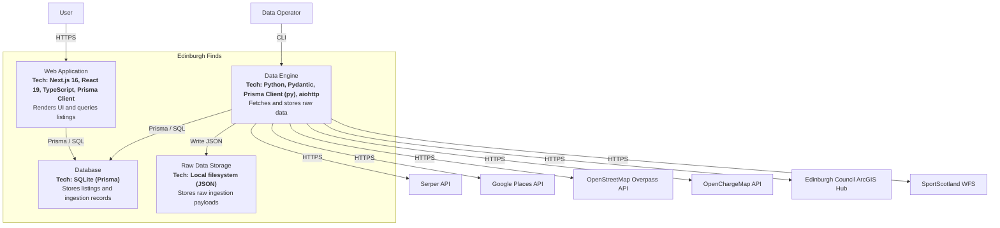

# C4 Level 2: Container Diagram

**Generated:** 2026-01-15
**System:** Edinburgh Finds

## Purpose

This diagram shows the high-level technical building blocks of Edinburgh Finds.

## Diagram

## Containers

| Container | Technology | Responsibility |
|-----------|------------|----------------|
| Web Application | Next.js, React, TypeScript, Prisma Client | Render UI and query listings |
| Data Engine | Python, Pydantic, Prisma Client (py), aiohttp | Fetch, deduplicate, and store raw data |
| Database | SQLite (via Prisma) | Persist listings and ingestion records |
| Raw Data Storage | Local filesystem (JSON) | Store raw ingestion payloads |

## Technology Stack Summary

- **Frontend:** Next.js 16, React 19, TypeScript
- **Backend:** Python, aiohttp, Prisma Client (py)
- **Database:** SQLite
- **Storage:** Local filesystem (JSON)
