# C4 Level 2: Container Diagram

**Generated:** 2026-01-14
**System:** Edinburgh Finds

## Purpose

This diagram shows the high-level technical building blocks of Edinburgh Finds.

## Diagram

```mermaid
graph TB
    %% Users
    User["👤 User"]
    Admin["👤 Admin"]

    %% System Boundary
    subgraph System["Edinburgh Finds"]
        WebApp["🌐 Web Application<br/><b>Tech: Next.js 16, React 19, TypeScript</b><br/>Delivers UI and handles server-side logic"]
        DataEngine["🔧 Data Engine<br/><b>Tech: Python, Pydantic, Aiohttp</b><br/>Ingests and processes raw data"]
        DB["🗄️ Database<br/><b>Tech: SQLite</b><br/>Stores listings, categories, and ingestion logs"]
        FileStore["📂 Raw Data Store<br/><b>Tech: File System (JSON)</b><br/>Stores raw API responses"]
    end

    %% External Systems
    GooglePlaces["⚙️ Google Places API"]
    Serper["⚙️ Serper API"]
    OSM["⚙️ OpenStreetMap"]

    %% Relationships
    User -->|"HTTPS"| WebApp
    Admin -->|"CLI Commands"| DataEngine
    
    WebApp -->|"Reads/Writes via Prisma (SQL)"| DB
    
    DataEngine -->|"Writes metadata via Prisma (SQL)"| DB
    DataEngine -->|"Writes raw JSON"| FileStore
    
    DataEngine -->|"HTTPS / JSON"| GooglePlaces
    DataEngine -->|"HTTPS / JSON"| Serper
    DataEngine -->|"HTTPS / JSON"| OSM
```

## Containers

| Container | Technology | Responsibility |
|-----------|-----------|----------------|
| Web Application | Next.js 16, React 19, TypeScript | Delivers the user interface and handles data access via Server Components. |
| Data Engine | Python, Pydantic, Aiohttp | Runs offline ingestion jobs, fetches data from APIs, and manages raw data storage. |
| Database | SQLite | Relational storage for structured data (Listings, Categories) and ingestion metadata. |
| Raw Data Store | File System (JSON) | Stores the original raw JSON responses from external APIs for audit and re-processing. |

## Technology Stack Summary

- **Frontend/App:** Next.js 16 (React 19, Tailwind CSS)
- **Backend/Ingestion:** Python (AsyncIO, Aiohttp, Pydantic)
- **Database:** SQLite (accessed via Prisma Client in both TS and Python)
- **Infrastructure:** Local filesystem for raw data blobs