# C4 Level 2: Container Diagram

**Generated:** 2026-01-14
**System:** Edinburgh Finds

## Purpose

This diagram shows the high-level technical building blocks of the Edinburgh Finds platform.

## Diagram

```mermaid
graph TB
    %% Actors
    User["👤 User"]
    Admin["👤 Admin"]

    %% System Boundary
    subgraph System["Edinburgh Finds"]
        Web["🌐 Web Application<br/><b>Tech: Next.js 16, React 19, TypeScript</b><br/>Delivers responsive UI and<br/>server-side data fetching"]

        DataEngine["🔧 Data Engine<br/><b>Tech: Python, Pydantic, Prisma</b><br/>Ingests, validates, and<br/>processes venue data"]

        DB["🗄️ Database<br/><b>Tech: SQLite (Prisma ORM)</b><br/>Stores listings, categories,<br/>and venue data"]

        RawStore["📂 Raw Data Storage<br/><b>Tech: File System (JSON)</b><br/>Archives raw API responses<br/>for data lineage"]
    end

    %% External Systems
    Serper["⚙️ Serper API"]
    GooglePlaces["⚙️ Google Places API"]
    OSM["⚙️ OpenStreetMap"]

    %% Relationships
    User -->|"HTTPS"| Web
    Web -->|"Prisma Client / SQL"| DB

    Admin -->|"Python CLI"| DataEngine

    DataEngine -->|"Prisma Client / SQL"| DB
    DataEngine -->|"Write JSON files"| RawStore

    DataEngine -->|"HTTPS / JSON"| Serper
    DataEngine -->|"HTTPS / JSON"| GooglePlaces
    DataEngine -->|"HTTPS / Overpass QL"| OSM
```

## Containers

| Container | Technology | Responsibility |
|-----------|-----------|----------------|
| Web Application | Next.js 16, React 19, TypeScript | Delivers the responsive user interface and handles server-side data fetching via Server Components. Uses Prisma Client to query the database. |
| Data Engine | Python, Pydantic, Prisma Client Python, aiohttp | Runs CLI-based data connectors to fetch, validate, deduplicate, and ingest venue data from external sources. Implements BaseConnector pattern for extensibility. |
| Database | SQLite (via Prisma ORM) | Relational database storing structured listing data, categories, entity types, and raw ingestion metadata. |
| Raw Data Storage | File System (JSON) | File-based storage for raw JSON responses from external APIs. Ensures data lineage and enables re-processing. |

## Technology Stack Summary

- **Frontend:** Next.js 16, React 19, TypeScript, Tailwind CSS 4, shadcn/ui, Lucide icons
- **Backend (Ingestion):** Python, Pydantic (validation), aiohttp (async HTTP), Prisma Client Python
- **Database:** SQLite (via Prisma ORM, pinned v5.22.0 for stability)
- **Infrastructure:** Local Filesystem for raw data storage and SQLite database
- **Styling:** Tailwind CSS 4, class-variance-authority, clsx, tailwind-merge

## Data Flow

1. **Admin triggers ingestion:** Runs Python CLI scripts (e.g., `run_serper.py`, `run_google_places.py`, `run_osm.py`)
2. **Connector fetches data:** Data Engine calls external APIs via aiohttp
3. **Raw data archived:** JSON responses saved to `engine/data/raw/<source>/` with content hash for deduplication
4. **Validation:** Pydantic models validate data against field specifications
5. **Database upsert:** Validated data written to SQLite via Prisma Client
6. **User browses:** Web application queries database via Prisma Client and renders Server Components
