# C4 Level 2: Container Diagram

**Generated:** 2026-01-15
**System:** Edinburgh Finds

## Purpose

This diagram shows the high-level technical building blocks of Edinburgh Finds, including the web application, data engine, database, and file storage.

## Diagram

```mermaid
graph TB
    %% Users
    User["👤 End User"]
    Admin["👤 Data Administrator"]

    %% System Boundary
    subgraph System["Edinburgh Finds Platform"]
        direction TB
        Web["🌐 Web Application<br/><b>Tech: Next.js 16, React 19, TypeScript 5</b><br/>Server-side rendered UI that displays<br/>listings and venue data to users"]

        DataEngine["🔧 Data Engine<br/><b>Tech: Python, Pydantic, aiohttp</b><br/>Ingests data from external APIs,<br/>validates, transforms, and stores<br/>raw and extracted listings"]

        DB["🗄️ Database<br/><b>Tech: SQLite (via Prisma)</b><br/>Stores listings, categories,<br/>raw ingestions, and extractions"]

        RawStorage["💾 Raw Data Storage<br/><b>Tech: File System (JSON)</b><br/>Stores raw JSON responses<br/>from external APIs"]
    end

    %% External Systems
    Serper["⚙️ Serper API"]
    GooglePlaces["⚙️ Google Places API"]
    OSM["⚙️ OpenStreetMap API"]
    OpenChargeMap["⚙️ Open Charge Map API"]
    SportScotland["⚙️ Sport Scotland API"]
    EdinburghCouncil["⚙️ Edinburgh Council API"]

    %% User Relationships
    User -->|"HTTPS"| Web
    Admin -->|"Runs CLI commands"| DataEngine

    %% Internal Relationships
    Web -->|"SQL queries via Prisma"| DB
    DataEngine -->|"Writes raw data / SQL"| DB
    DataEngine -->|"Saves JSON files"| RawStorage
    DataEngine -->|"Reads for processing"| RawStorage

    %% External API Relationships
    DataEngine -->|"Fetches search results / HTTPS"| Serper
    DataEngine -->|"Fetches venue data / HTTPS"| GooglePlaces
    DataEngine -->|"Fetches geo data / HTTPS"| OSM
    DataEngine -->|"Fetches charging data / HTTPS"| OpenChargeMap
    DataEngine -->|"Fetches sports data / HTTPS"| SportScotland
    DataEngine -->|"Fetches council data / HTTPS"| EdinburghCouncil
```

## Containers

| Container | Technology | Responsibility |
|-----------|-----------|----------------|
| Web Application | Next.js 16, React 19, TypeScript 5, Prisma Client 5, Tailwind CSS 4 | Delivers server-side rendered UI, fetches listings from database, displays venue data to end users |
| Data Engine | Python, Pydantic, PyYAML, aiohttp, Prisma (Python) | Runs data ingestion connectors, fetches from external APIs, validates data, transforms to schema, stores raw and processed data |
| Database | SQLite via Prisma ORM | Stores validated listings, categories, raw ingestions, extracted listings, failed extractions, and listing relationships |
| Raw Data Storage | File System (JSON files in `engine/data/raw/`) | Persists raw JSON responses from external APIs for auditing, reprocessing, and debugging |

## Data Flow

1. **Data Ingestion**: Data administrators run CLI commands to trigger data connectors in the Data Engine
2. **External API Calls**: Data Engine fetches data from external APIs (Serper, Google Places, OSM, etc.)
3. **Raw Storage**: Raw JSON responses are saved to the file system with content hashing for deduplication
4. **Database Persistence**: Raw ingestion records are stored in the SQLite database via Prisma
5. **Extraction & Validation**: Data Engine extracts structured data, validates against Pydantic models, and stores in database
6. **Web Display**: End users access the web application, which queries the database and renders listings

## Technology Stack Summary

- **Frontend:** Next.js 16, React 19, TypeScript 5, Tailwind CSS 4
- **Backend:** Python with Pydantic, aiohttp for async HTTP requests
- **Database:** SQLite with Prisma ORM (TypeScript and Python clients)
- **Storage:** Local file system for raw JSON data
- **Infrastructure:** CLI-based data pipeline, server-side rendering

## Key Architectural Patterns

- **Separation of Concerns**: Web application (read-only) is decoupled from data engine (write-heavy)
- **Raw Data Preservation**: All external API responses are stored as raw JSON for reprocessing and debugging
- **Schema Validation**: Pydantic models validate all incoming data before database insertion
- **Dual-Bucket Attributes**: Structured attributes (validated) vs discovered attributes (flexible)
- **Deduplication**: Content hashing prevents duplicate ingestions from external APIs
