# C4 Level 2: Container Diagram

**Generated:** 2026-01-13
**System:** Edinburgh Finds

## Purpose

This diagram shows the high-level technical building blocks of Edinburgh Finds, including the web application, data processing engine, and database infrastructure.

## Diagram

```mermaid
graph TB
    %% Users
    User["👤 Enthusiast"]
    Admin["👤 Administrator"]

    %% System Boundary
    subgraph System["Edinburgh Finds Platform"]
        Web["🌐 Web Application<br/><b>Tech: Next.js 16, React 19, TypeScript</b><br/>Server-rendered UI for discovering and browsing listings"]

        APIRoutes["⚙️ API Routes<br/><b>Tech: Next.js API Routes</b><br/>RESTful endpoints for data queries (future)"]

        DataEngine["🔧 Data Ingestion Engine<br/><b>Tech: Python, Pydantic</b><br/>Fetches, validates, deduplicates, and processes listing data"]

        DB["🗄️ Database<br/><b>Tech: SQLite (dev) / PostgreSQL (prod via Supabase)</b><br/>Stores listings with flexible attribute schema"]

        PrismaORM["📚 Prisma ORM<br/><b>Tech: Prisma Client (JS & Python)</b><br/>Type-safe database access layer"]

        RawStorage["📁 Raw Data Storage<br/><b>Tech: File System (JSON)</b><br/>Archives raw ingestion data for audit trail"]
    end

    %% External Systems
    GoogleMaps["⚙️ Google Maps API<br/>(Location Service)"]
    DataSources["⚙️ External Data Sources<br/>(Serper, Google Places, OSM)"]

    %% Relationships - User Flow
    User -->|"HTTPS / Server-Side Rendering"| Web
    Admin -->|"CLI Commands"| DataEngine

    %% Internal Container Relationships
    Web -->|"Prisma Client queries"| PrismaORM
    DataEngine -->|"Prisma Python Client"| PrismaORM
    PrismaORM -->|"SQL queries"| DB
    DataEngine -->|"Writes raw JSON files"| RawStorage
    DataEngine -->|"Reads RawIngestion records"| DB

    %% Future API Routes (dotted line for planned feature)
    APIRoutes -.->|"Future: JSON API responses"| PrismaORM
    Web -.->|"Future: API calls"| APIRoutes

    %% External Dependencies
    DataEngine -->|"HTTP/JSON data fetching"| DataSources
    DataEngine -->|"Geocoding API / HTTPS"| GoogleMaps
```

## Containers

| Container | Technology | Responsibility |
|-----------|-----------|----------------|
| **Web Application** | Next.js 16, React 19, TypeScript, Tailwind CSS, shadcn/ui | Server-rendered UI delivering responsive, mobile-first discovery experience. Queries database directly via Prisma Client. |
| **API Routes** | Next.js API Routes (TypeScript) | Future RESTful endpoints for client-side data queries. Currently unused (direct Prisma queries from server components). |
| **Data Ingestion Engine** | Python, Pydantic, Prisma Client Python | Autonomous ETL pipeline: fetches data from external sources, validates via Pydantic schemas, deduplicates via hash-based storage, and persists to database. |
| **Database** | SQLite (development) / PostgreSQL (production via Supabase) | Central data store with flexible schema: core columns + JSON `attributes` bucket for validated data + `discovered_attributes` for AI-extracted fields. |
| **Prisma ORM** | Prisma Client (JavaScript & Python) | Type-safe ORM layer providing unified database access for both web app and data engine. Pinned to v5 for SQLite stability. |
| **Raw Data Storage** | File System (JSON files organized by source) | Immutable archive of raw ingestion data (`engine/data/raw/<source>/`) with corresponding `RawIngestion` table entries for audit trail and deduplication. |

## Technology Stack Summary

### Frontend
- **Framework:** Next.js 16 (App Router, React Server Components)
- **Language:** TypeScript
- **UI Library:** React 19
- **Styling:** Tailwind CSS v4
- **Components:** shadcn/ui, lucide-react icons
- **Design Philosophy:** Mobile-first, progressive disclosure, "Local Expert" tone

### Backend
- **Framework:** Next.js API Routes (currently unused, planned for future client-side APIs)
- **ORM:** Prisma 5 (pinned for SQLite stability)
- **Language:** TypeScript

### Data Engine
- **Language:** Python
- **Validation:** Pydantic (schema-driven validation)
- **ORM:** Prisma Client Python
- **Architecture:** Connector-based ingestion with deduplication and storage abstractions

### Database
- **Development:** SQLite (temporary placeholder)
- **Production:** PostgreSQL via Supabase
- **Schema Design:** Universal Entity Framework with flexible attributes

### Infrastructure
- **Hosting:** TBD (Vercel for web, Supabase for database)
- **Data Storage:** Local file system for raw data (future: cloud storage)

## Data Flow

### Ingestion Pipeline (Data Engine)
1. **Fetch:** Connector pulls data from external source (Serper, Google Places, OSM)
2. **Store Raw:** Save JSON to `engine/data/raw/<source>/<timestamp>_<id>.json`
3. **Track:** Create `RawIngestion` record with content hash for deduplication
4. **Validate:** Pydantic models validate against field specs (`VENUE_FIELDS`, etc.)
5. **Separate:** Split into core columns (Prisma schema) + structured `attributes` (JSON)
6. **Persist:** Insert/update `Listing` records via Prisma Client Python

### User Discovery Flow (Web App)
1. **Request:** User navigates to page (e.g., `/`)
2. **Server Render:** Next.js server component queries Prisma Client
3. **Database Query:** Prisma executes SQL query against SQLite/PostgreSQL
4. **Render:** Server-side renders HTML with listing data
5. **Response:** Hydrated page sent to browser via HTTPS

## Quality Assurance

- **Deduplication:** Hash-based content deduplication prevents duplicate ingestion
- **Validation:** Pydantic schemas enforce data quality and type safety
- **Audit Trail:** Raw data files + `RawIngestion` table provide complete ingestion history
- **Type Safety:** Prisma generates TypeScript types; Pydantic enforces Python schemas
- **Test Coverage:** TDD workflow with >80% coverage target

## Future Enhancements

- **API Routes:** RESTful endpoints for client-side filtering and search
- **Authentication:** User accounts for business owners to claim listings
- **Caching:** Redis layer for query performance optimization
- **Search:** Full-text search with Elasticsearch or PostgreSQL FTS
- **Real-time Updates:** WebSocket notifications for new listings
- **Admin Dashboard:** Web-based interface for data management (currently CLI-only)
