# C4 Level 3: Component Diagram (Data Engine)

**Generated:** 2026-01-15
**System:** Edinburgh Finds
**Container:** Data Engine

## Purpose

This diagram breaks down the Data Engine container into its main components and their interactions.

## Diagram

```mermaid
graph TB
    Operator["Data Operator"]

    subgraph DataEngine["Data Engine"]
        direction TB
        CLI["CLI Runner<br/><b>Tech: Python</b><br/>Orchestrates ingestion and extraction"]

        subgraph Stage1["Stage 1: Ingestion"]
            direction TB
            Connectors["Connectors<br/><b>Tech: aiohttp</b><br/>Serper, Google Places, OSM,<br/>OpenChargeMap, Edinburgh Council, SportScotland"]
            Dedup["Deduplication<br/><b>Tech: SHA-256</b><br/>Compute and check hashes"]
            Storage["Raw Storage Helper<br/><b>Tech: JSON + filesystem</b><br/>Write raw payloads"]
            RateLimit["Rate Limiting<br/><b>Tech: Python</b><br/>Enforce request limits"]
            Retry["Retry Logic<br/><b>Tech: Python</b><br/>Exponential backoff"]
        end

        subgraph Stage2["Stage 2: Extraction"]
            direction TB
            Extractor["Extraction Orchestrator<br/><b>Tech: Python</b><br/>Process RawIngestions"]
            Transform["Transform Pipeline<br/><b>Tech: Python</b><br/>Parse and split attributes"]
            Schema["Schema + Model Generator<br/><b>Tech: Pydantic</b><br/>FieldSpecs and dynamic models"]
            ExtractTrack["Extraction Tracker<br/><b>Tech: Prisma</b><br/>Track success/failures"]
            Ingestor["Listing Ingestor<br/><b>Tech: Prisma Client (py)</b><br/>Upsert to Listing table"]
        end

        Logging["Structured Logging<br/><b>Tech: Python logging</b><br/>Pipeline events"]
        Health["Health Checks<br/><b>Tech: Prisma Client (py)</b><br/>Status metrics"]
        Summary["Summary Reports<br/><b>Tech: Prisma Client (py)</b><br/>Aggregates stats"]
    end

    DB["Database<br/><b>Tech: SQLite (Prisma)</b><br/>RawIngestion, ExtractedListing,<br/>FailedExtraction, Listing"]
    RawFS["Raw Data Storage<br/><b>Tech: Filesystem</b>"]

    Serper["Serper API"]
    GooglePlaces["Google Places API"]
    OSM["OpenStreetMap Overpass API"]
    OpenChargeMap["OpenChargeMap API"]
    EdinburghCouncil["Edinburgh Council ArcGIS Hub"]
    SportScotland["SportScotland WFS"]

    Operator -->|"CLI"| CLI
    CLI -->|"Run ingestion"| Connectors
    CLI -->|"Run extraction"| Extractor
    CLI -->|"Status"| Health
    CLI -->|"Report"| Summary

    Connectors -->|"Rate limit"| RateLimit
    Connectors -->|"Retry"| Retry
    Connectors -->|"Log events"| Logging
    Connectors -->|"Hash"| Dedup
    Connectors -->|"Save"| Storage
    Connectors -->|"Write RawIngestion"| DB

    Storage -->|"Write JSON"| RawFS

    Extractor -->|"Read RawIngestion"| DB
    Extractor -->|"Process"| Transform
    Transform -->|"Validate"| Schema
    Transform -->|"Track"| ExtractTrack
    ExtractTrack -->|"Success: ExtractedListing"| DB
    ExtractTrack -->|"Failure: FailedExtraction"| DB
    ExtractTrack -->|"Log events"| Logging

    DB -->|"Read ExtractedListing"| Ingestor
    Ingestor -->|"Upsert Listing"| DB

    Health -->|"Query"| DB
    Summary -->|"Query"| DB

    Connectors -->|"HTTPS"| Serper
    Connectors -->|"HTTPS"| GooglePlaces
    Connectors -->|"HTTPS"| OSM
    Connectors -->|"HTTPS"| OpenChargeMap
    Connectors -->|"HTTPS"| EdinburghCouncil
    Connectors -->|"HTTPS"| SportScotland
```

## Components

### Stage 1: Ingestion
| Component | Responsibility |
|-----------|----------------|
| CLI Runner | Orchestrates ingestion and extraction pipelines |
| Connectors | Fetch external data from APIs and persist raw ingestions |
| Deduplication | Prevents re-ingesting identical payloads via SHA-256 hashes |
| Raw Storage Helper | Writes raw JSON payloads to filesystem |
| Rate Limiting | Enforces request limits per source |
| Retry Logic | Handles transient failures with exponential backoff |

### Stage 2: Extraction
| Component | Responsibility |
|-----------|----------------|
| Extraction Orchestrator | Processes RawIngestion records through extraction pipeline |
| Transform Pipeline | Parses raw data and splits into attributes/discovered_attributes |
| Schema + Model Generator | Defines FieldSpecs and generates dynamic Pydantic models |
| Extraction Tracker | Creates ExtractedListing (success) or FailedExtraction (failure) records |
| Listing Ingestor | Upserts validated ExtractedListing data into Listing table with trust rules |

### Cross-Cutting Components
| Component | Responsibility |
|-----------|----------------|
| Structured Logging | Emits pipeline events with context across both stages |
| Health Checks | Computes ingestion and extraction health metrics |
| Summary Reports | Aggregates statistics from both pipeline stages |
