# C4 Level 3: Component Diagram (Data Engine)

**Generated:** 2026-01-15
**System:** Edinburgh Finds
**Container:** Data Engine

## Purpose

This diagram breaks down the Data Engine container into its main components and their interactions.

## Diagram

```mermaid
graph TB
    Operator["Data Operator"]

    subgraph DataEngine["Data Engine"]
        CLI["CLI Runner<br/><b>Tech: Python</b><br/>Runs connectors and status"]
        Connectors["Connectors<br/><b>Tech: aiohttp</b><br/>Serper, Google Places, OSM, OpenChargeMap, Edinburgh Council, SportScotland"]
        Dedup["Deduplication<br/><b>Tech: SHA-256</b><br/>Compute and check hashes"]
        Storage["Raw Storage Helper<br/><b>Tech: JSON + filesystem</b><br/>Write raw payloads"]
        Transform["Transform Pipeline<br/><b>Tech: Python</b><br/>Map raw data to venue schema"]
        Ingestor["Ingestor<br/><b>Tech: Prisma Client (py)</b><br/>Upsert listings"]
        Schema["Schema + Model Generator<br/><b>Tech: Pydantic</b><br/>FieldSpecs and dynamic models"]
        RateLimit["Rate Limiting<br/><b>Tech: Python</b><br/>Enforce request limits"]
        Retry["Retry Logic<br/><b>Tech: Python</b><br/>Exponential backoff"]
        Logging["Structured Logging<br/><b>Tech: Python logging</b><br/>Ingestion events"]
        Health["Health Checks<br/><b>Tech: Prisma Client (py)</b><br/>Ingestion status"]
        Summary["Summary Reports<br/><b>Tech: Prisma Client (py)</b><br/>Aggregates ingestion stats"]
    end

    DB["Database<br/><b>Tech: SQLite (Prisma)</b>"]
    RawFS["Raw Data Storage<br/><b>Tech: Filesystem</b>"]

    Serper["Serper API"]
    GooglePlaces["Google Places API"]
    OSM["OpenStreetMap Overpass API"]
    OpenChargeMap["OpenChargeMap API"]
    EdinburghCouncil["Edinburgh Council ArcGIS Hub"]
    SportScotland["SportScotland WFS"]

    Operator -->|"CLI"| CLI
    CLI -->|"Runs"| Connectors
    CLI -->|"Status"| Health
    CLI -->|"Report"| Summary

    Connectors -->|"Rate limit"| RateLimit
    Connectors -->|"Retry"| Retry
    Connectors -->|"Log events"| Logging
    Connectors -->|"Hash"| Dedup
    Connectors -->|"Save"| Storage
    Connectors -->|"Write metadata"| DB

    Storage -->|"Write JSON"| RawFS

    Transform -->|"Validate"| Schema
    Transform -->|"Ingest venues"| Ingestor
    Ingestor -->|"Upsert"| DB

    Health -->|"Query"| DB
    Summary -->|"Query"| DB

    Connectors -->|"HTTPS"| Serper
    Connectors -->|"HTTPS"| GooglePlaces
    Connectors -->|"HTTPS"| OSM
    Connectors -->|"HTTPS"| OpenChargeMap
    Connectors -->|"HTTPS"| EdinburghCouncil
    Connectors -->|"HTTPS"| SportScotland
```

## Components

| Component | Responsibility |
|-----------|----------------|
| CLI Runner | Runs connectors and status/report commands |
| Connectors | Fetch external data and persist raw ingestions |
| Deduplication | Prevents re-ingesting identical payloads |
| Raw Storage Helper | Writes raw JSON payloads to filesystem |
| Transform Pipeline | Maps raw data into venue dictionaries |
| Ingestor | Validates and upserts listings via Prisma |
| Schema + Model Generator | Defines FieldSpecs and Pydantic models |
| Rate Limiting | Enforces request limits per source |
| Retry Logic | Handles transient failures with backoff |
| Structured Logging | Emits ingestion events with context |
| Health Checks | Computes ingestion health metrics |
| Summary Reports | Aggregates ingestion statistics |
