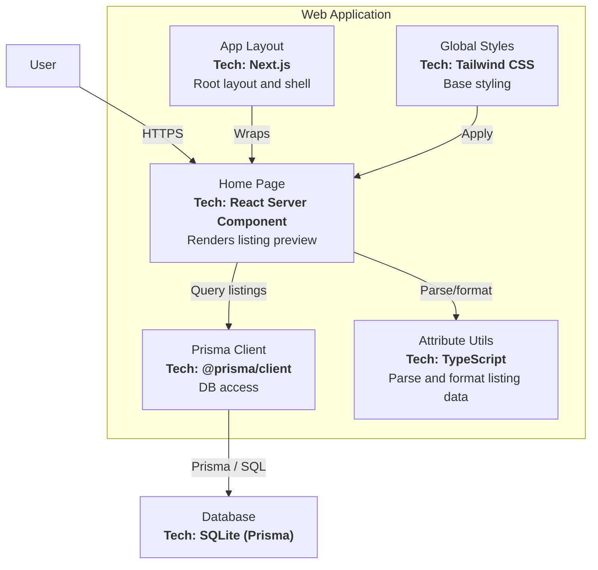

# C4 Level 3: Component Diagram (Web Application)

**Generated:** 2026-01-15
**System:** Edinburgh Finds
**Container:** Web Application

## Purpose

This diagram breaks down the Web Application container into its main components and their interactions.

## Diagram

## Components

| Component | Responsibility |
|-----------|----------------|
| App Layout | Defines page shell and document structure |
| Home Page | Fetches listings and renders summary view |
| Prisma Client | Database access layer |
| Attribute Utils | Parse and format JSON attributes for display |
| Global Styles | Base styling for the app |
