# C4 Level 3: Component Diagram

**Generated:** 2026-01-14
**System:** Edinburgh Finds

## Purpose

This document details the internal components of the core containers identified in the Level 2 diagram. It focuses on the **Data Engine** (complex logic) and the **Web Application** (user interface).

## 1. Data Engine Components

**Container:** Data Engine
**Technology:** Python, Pydantic, Aiohttp

```mermaid
graph TB
    %% Actors
    Admin["👤 Admin"]
    
    %% External Systems
    ExtSerper["⚙️ Serper API"]
    ExtGoogle["⚙️ Google Places API"]
    ExtOSM["⚙️ OpenStreetMap API"]
    
    %% Database & Storage
    DB["🗄️ Database<br/>(Prisma Client)"]
    FileSys["📂 File System<br/>(Raw JSON)"]

    %% Data Engine Boundary
    subgraph DataEngine["Data Engine Container"]
        CLI["💻 CLI Controller<br/><b>cli.py</b><br/>Parses args, orchestrates ingestion"]
        
        %% Connectors
        subgraph Connectors["Ingestion Connectors"]
            Serper["🔌 Serper Connector<br/><b>serper.py</b><br/>Fetches search results"]
            Google["🔌 Google Places Connector<br/><b>google_places.py</b><br/>Fetches venue details"]
            OSM["🔌 OSM Connector<br/><b>open_street_map.py</b><br/>Fetches map data"]
        end
        
        %% Services
        Dedup["🔍 Deduplication Service<br/><b>deduplication.py</b><br/>Computes content hashes"]
        Storage["💾 Storage Service<br/><b>storage.py</b><br/>Manages file I/O"]
        Base["🏗️ Base Connector<br/><b>base.py</b><br/>Abstract Interface"]
    end

    %% Relationships
    Admin -->|"Runs"| CLI
    
    CLI -->|"Instantiates"| Connectors
    Connectors -.->|"Inherits"| Base
    
    CLI -->|"1. Fetches data"| Connectors
    CLI -->|"2. Checks duplicates"| Connectors
    CLI -->|"3. Saves data"| Connectors
    
    Serper -->|"HTTPS"| ExtSerper
    Google -->|"HTTPS"| ExtGoogle
    OSM -->|"HTTPS"| ExtOSM
    
    Connectors -->|"Computes Hash"| Dedup
    Connectors -->|"Writes JSON"| Storage
    Storage -->|"Writes File"| FileSys
    
    Connectors -->|"Reads/Writes Metadata"| DB
    Connectors -->|"Checks Duplicate Hash"| DB
```

### Component Details

| Component | Type | Responsibility |
|-----------|------|----------------|
| **CLI Controller** | Module | Entry point for the ingestion pipeline. Parses command-line arguments (`connector`, `query`) and orchestrates the fetch-deduplicate-save workflow. |
| **Base Connector** | Abstract Class | Defines the standard interface (`fetch`, `save`, `is_duplicate`) that all source-specific connectors must implement. |
| **Serper/Google/OSM Connectors** | Classes | Implement the Base Connector interface for specific external APIs. Handle authentication, request formatting, and response parsing. |
| **Deduplication Service** | Module | Provides deterministic SHA-256 content hashing to identify duplicate data before ingestion. |
| **Storage Service** | Module | Handles low-level file system operations (path generation, JSON serialization) to store raw API responses. |

---

## 2. Web Application Components

**Container:** Web Application
**Technology:** Next.js 16, React 19, TypeScript

```mermaid
graph TB
    %% Actors
    User["👤 User"]
    
    %% Database
    DB["🗄️ Database<br/>(PostgreSQL/SQLite)"]

    %% Web App Boundary
    subgraph WebApp["Web Application Container"]
        %% Pages (Server Components)
        HomePage["📄 Home Page<br/><b>app/page.tsx</b><br/>Server Component<br/>Fetches and renders listings"]
        
        %% Libs
        PrismaLib["📚 Prisma Library<br/><b>lib/prisma.ts</b><br/>Database Client Singleton"]
        
        %% UI Components (Implied)
        ListingCard["🧩 Listing Card<br/>(Component)"]
    end

    %% Relationships
    User -->|"Visits /"| HomePage
    
    HomePage -->|"Fetches Data"| PrismaLib
    HomePage -->|"Renders"| ListingCard
    
    PrismaLib -->|"SQL Query"| DB
```

### Component Details

| Component | Type | Responsibility |
|-----------|------|----------------|
| **Home Page** | Server Component | The main landing page. Directly fetches listing data from the database during server-side rendering and displays it. |
| **Prisma Library** | Singleton | Manages the global instance of the Prisma Client to prevent multiple connection pools during development/HMR. |
