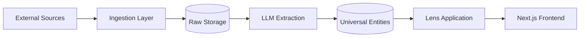

# Architecture Overview

The Edinburgh Finds platform is built on the principle of **High Purity Horizontal Orchestration**. It separates the "how" of data acquisition and extraction (Engine) from the "what" of domain-specific interpretation (Lenses).

## System Philosophy
1.  **Vertical Agnosticism**: The core engine must never know about specific domains (e.g., it shouldn't know what a "tennis court" or "vintage" is).
2.  **Mechanically Enforced Purity**: Boundaries between engine and lenses are enforced by automated tests (Import Boundary, Structural Purity).
3.  **Schema-First Evolution**: All data models originate from YAML definitions and are generated into multi-language targets (Prisma, Pydantic, TypeScript).

## High-Level Architecture
The system follows a three-tier architecture:

1.  **Ingestion & Orchestration (Engine)**: Fetches raw data from various sources (Google, OSM, etc.) using an intelligent orchestrator that manages rate limits, retries, and phase barriers.
2.  **Harmonization & Storage**: Uses LLMs to transform raw JSON into a "Universal Entity Model" stored in a PostgreSQL database.
3.  **Discovery & Presentation (Web + Lenses)**: A Next.js frontend that applies "Lenses" to the universal data to provide domain-specific discovery experiences.

## Core Data Flow

## Subsystem Map
- **[Engine](subsystems/engine.md)**: The heart of the system; handles ingestion, orchestration, and extraction.
- **[Database](subsystems/database.md)**: Schema-first management and ORM synchronization.
- **[Lenses](subsystems/lenses.md)**: Vertical-specific configurations and interpretation rules.
- **[Frontend](subsystems/frontend.md)**: The Next.js discovery interface.
- **[Infrastructure](subsystems/infrastructure.md)**: CI/CD pipelines and purity enforcement.
- **[Conductor](subsystems/conductor.md)**: Project workflow and style management.

## Integration Points
- **Async Processing**: The engine uses `asyncio` for high-throughput ingestion.
- **Cross-Language Types**: Shared Prisma schema ensures the Python backend and TypeScript frontend always agree on the data structure.
- **LLM Gateway**: Standardized prompts and structured output parsing (Instructor) ensure reliable data extraction from unstructured sources.

---
*Evidence: docs/architecture/subsystems/engine.md, docs/architecture/subsystems/database.md*
