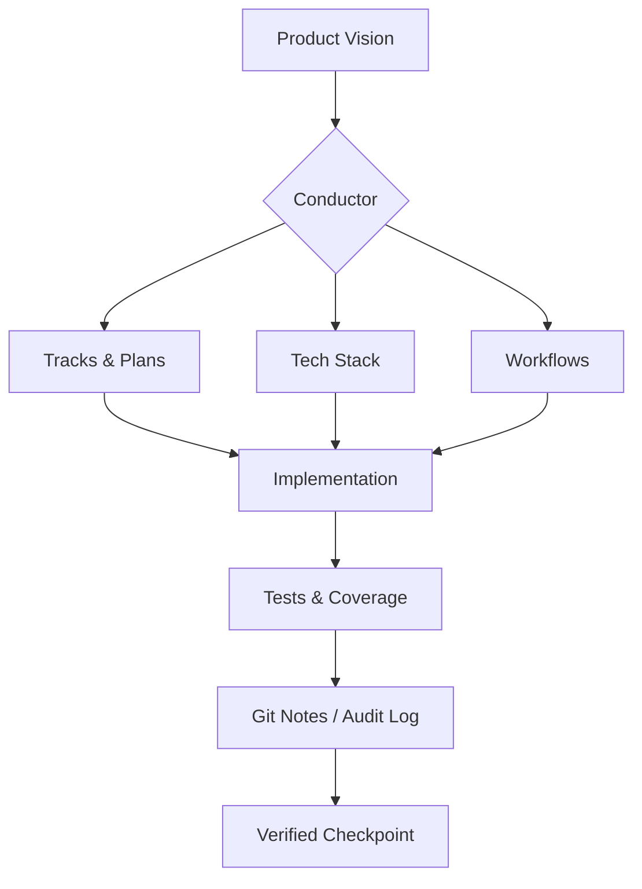
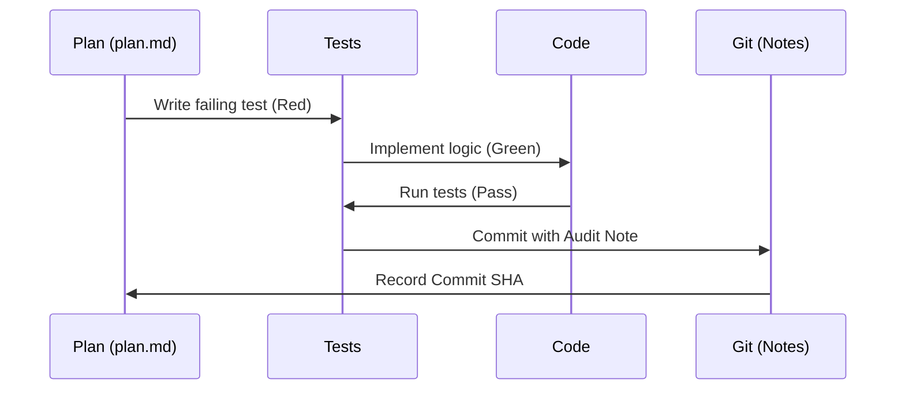

# Subsystem: Conductor

## Purpose
The `conductor` subsystem is the central orchestration and governance layer of the project. it serves as the authoritative source of truth for the product vision, technical standards, and development protocols. It is designed to ensure that both human developers and AI agents operate with consistent mental models, adhering to the "AI-Scale, Local Soul" mission while maintaining rigorous quality standards through disciplined workflows.

## Common Workflows

### 1. The Disciplined Task Lifecycle (TDD-First)
This is the core loop for any feature or bug fix:
1.  **Selection:** Identify the next task in the active `plan.md`.
2.  **Red Phase:** Write unit tests that define success for the task and verify they fail.
3.  **Green Phase:** Implement the minimum code required to pass the tests.
4.  **Verification:** Check code coverage (target >80%) and adherence to style guides.
5.  **Audit:** Commit changes with a descriptive message and attach a detailed "Git Note" summary for auditability.
6.  **Update:** Record the commit hash in `plan.md` and mark the task as complete.

### 2. Phase Checkpointing & Verification
Executed at the end of a major project phase:
1.  **Automated Audit:** Run the full test suite and verify coverage across all modified files.
2.  **Manual Verification:** Generate a step-by-step plan for the user to manually verify the user-facing outcomes.
3.  **User Approval:** Pause for explicit user confirmation that the phase meets expectations.
4.  **Checkpoint Commit:** Create a specialized checkpoint commit with a full verification report attached as a Git Note.

### 3. Schema-Driven Development
The Conductor enforces a "Single Source of Truth" for data models:
1.  **Define:** Update YAML schemas in `engine/config/schemas/`.
2.  **Generate:** Run `python -m engine.schema.generate` to auto-propagate changes.
3.  **Sync:** Changes flow to Python FieldSpecs (Engine), Prisma Schemas (DB), and TypeScript/Zod types (Web).

## Key Components

| Component | Description | Evidence |
| :--- | :--- | :--- |
| `product.md` | Core mission, Universal Entity Framework, and growth logic. | `conductor/product.md:1-40` |
| `workflow.md` | The "operating system" for development (TDD, Git Notes, Checkpoints). | `conductor/workflow.md:1-120` |
| `tech-stack.md` | Definitive architecture and tool choices. | `conductor/tech-stack.md:1-25` |
| `product-guidelines.md` | UX principles ("Slick Interaction") and Voice guidelines. | `conductor/product-guidelines.md:1-35` |
| `tracks.md` | Registry and historical log of major work streams. | `conductor/tracks.md:1-100` |
| `code_styleguides/` | Language-specific standards for Python, React, and TypeScript. | Directory: `conductor/code_styleguides/` |

## Architecture & Diagrams

### System Governance Flow


### Task Lifecycle (TDD)


## Dependencies

### Internal
- **All Subsystems:** Every line of code in `engine`, `web`, and `database` is a downstream dependency of `conductor` standards.
- **Engine Schema:** Relies on `conductor`'s YAML-first strategy for generation.

### External
- **Git & Git Notes:** Used for state tracking and the permanent audit log.
- **Next.js & Prisma:** The core frameworks defined in the Tech Stack.
- **LLMs (Claude/Gemini):** Act as the primary "executors" of the Conductor protocols.

## Configuration & Examples

### Example: Git Note Audit Format
Every completed task should be documented in the git history as follows:
```bash
git notes add -m "
Task: feat(auth): Add remember me functionality
Summary: Implemented secure cookie-based session persistence.
Files: 
  - web/lib/auth.ts
  - web/components/login-form.tsx
Why: Improves UX by reducing login friction for returning users.
" <commit_sha>
```

### Example: Product Tone Constraint
From `product-guidelines.md`:
> **Prohibited:** "Located at," "Features include," "A great place for," "Welcome to."
> **Required:** Contextual bridges like "Just a short walk from [Landmark]" or "Perfect for those who prefer [Specific Need]."

## Evidence
- `conductor/product.md`: Definition of Universal Entity Framework and "Local Soul" mission.
- `conductor/workflow.md`: Detailed protocols for TDD, Checkpointing, and Git Notes.
- `conductor/product-guidelines.md`: UX "Two-Click" rule and Design Philosophy.
- `conductor/tech-stack.md`: Specific version requirements for Next.js, Prisma, and Python.
- `conductor/setup_state.json`: Tracks the agent's internal progress through initial setup phases.
