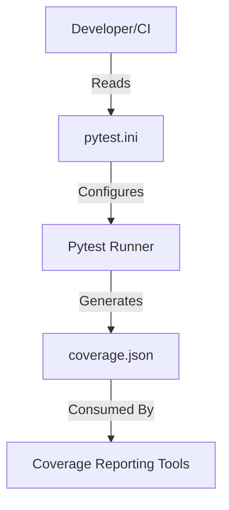

# Subsystem: config

## Purpose
This subsystem consists of root-level configuration files that define the environment, testing behavior, and project metadata. It serves as the control plane for developer tools and quality assurance processes.

## Common Workflows
1.  **Running Tests:** Developers invoke `pytest`, which reads `pytest.ini` to apply markers and default settings.
2.  **Coverage Reporting:** CI/CD pipelines or local scripts generate `coverage.json` to track code coverage metrics.

## Key Components
-   `pytest.ini`: Primary configuration file for the `pytest` framework. Defines markers and execution behavior.
-   `coverage.json`: JSON-formatted report containing code coverage statistics (generated artifact).

## Architecture & Diagrams



## Dependencies
### Internal
-   **Tests Subsystem:** The configuration directly controls how tests are executed.

### External
-   **pytest:** The testing framework that consumes `pytest.ini`.
-   **coverage.py:** The tool that generates `coverage.json`.

## Configuration & Examples

### Pytest Configuration
The `pytest.ini` file defines custom markers to categorize tests (e.g., distinguishing slow tests).

```ini
[pytest]
markers =
    slow: marks tests as slow (deselect with '-m "not slow"')
```

## Evidence
-   `pytest.ini`: Defines the `slow` marker.
-   `coverage.json`: Contains coverage data with timestamp and version metadata.
