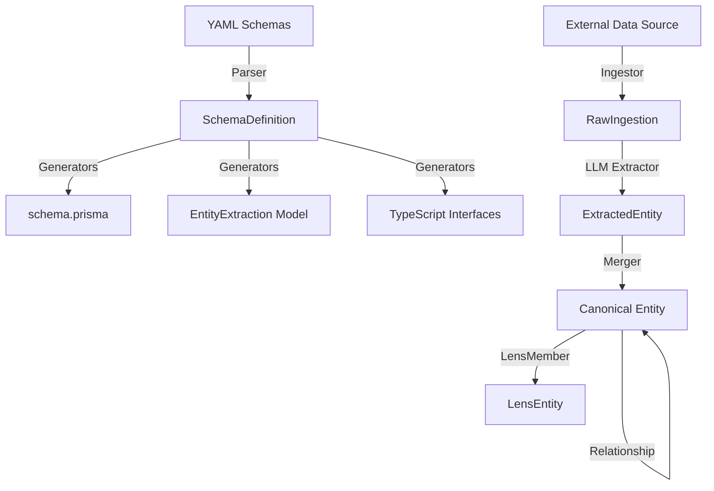
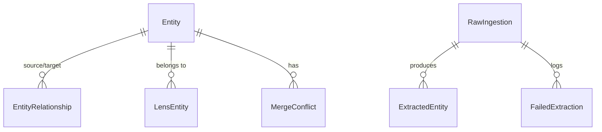

# Subsystem: Database

## Purpose
The database subsystem manages data persistence, schema definitions, and automated code generation for the entire project. It employs a **Schema-First** architecture where the "Source of Truth" resides in YAML files, which are then used to generate Prisma schemas, Pydantic models, and TypeScript interfaces, ensuring type safety across the Python engine and the Next.js web application.

### Cross-Project Synchronization
The schema is synchronized across two main areas:
- **`engine/`**: Uses `prisma-client-py` (asyncio) for Python-based ingestion and processing.
- **`web/`**: Uses `prisma-client-js` for the Next.js frontend and API routes.

Both projects share the same underlying PostgreSQL schema, ensuring that data written by the engine is immediately and correctly interpreted by the web application.

## Common Workflows

### 1. Schema Evolution
When a data model change is required:
1.  Modify the YAML schema definitions in `engine/config/schemas/*.yaml`.
2.  Run the generation script: `python -m engine.schema.generate`.
3.  This updates `engine/schema.prisma`, `engine/extraction/models/entity_extraction.py`, and other generated targets.
4.  Apply the changes to the database: `npx prisma migrate dev`.

### 2. LLM Extraction to DB
1.  LLM outputs data matching the `EntityExtraction` Pydantic model.
2.  Data is stored in `ExtractedEntity` linked to a `RawIngestion` record.
3.  The merger process then populates the `Entity` table, handling any `MergeConflict` records if multiple sources provide conflicting data.

### 3. Lens-Based Querying
1.  Entities are associated with Lenses via the `LensEntity` join table.
2.  Queries filter `Entity` records based on their membership in specific lenses (e.g., "Edinburgh Finds").

## Key Components

### Schema Management
- **`engine/schema/parser.py`**: Parses YAML definitions into internal `SchemaDefinition` objects.
- **`engine/schema/core.py`**: Defines the `FieldSpec` class used as a neutral intermediate representation.
- **`engine/schema/generators/`**: Contains specialized generators for Prisma, Pydantic, Python, and TypeScript.

### Data Models
- **`Entity`**: The central canonical record for any person, place, or thing.
- **`RawIngestion`**: Stores metadata about raw data source files (e.g., JSON from Google Places/OSM).
- **`ExtractedEntity`**: Stores the structured data extracted from a raw ingestion before it is merged into a canonical entity.
- **`EntityRelationship`**: Represents typed connections between entities (e.g., "teaches_at").
- **`LensEntity`**: Manages N:M membership of entities in different "Lenses" (views/filters).
- **`MergeConflict`**: Tracks conflicting data from different sources for manual or automated resolution.

## Architecture & Diagrams

### Data Flow Diagram


### Entity-Relationship Overview


## Dependencies

### Internal
- **`engine/config/schemas/`**: Source YAML files.
- **`engine/extraction/`**: Uses Pydantic models for structured data output.

### External
- **Prisma**: ORM and migration management.
- **Pydantic**: Data validation and LLM response parsing.
- **PostgreSQL**: Production database provider.
- **SQLite**: Used in some development/test contexts.

## Configuration & Examples

### Example: YAML Field Definition
```yaml
- name: entity_name
  type: string
  description: "Official name of the entity"
  required: true
  index: true
  search:
    category: "identity"
    keywords: ["name", "called"]
```

### Example: Generated Prisma Model
```prisma
model Entity {
  id           String     @id @default(cuid())
  entity_name  String
  slug         String     @unique
  // ... other fields
  createdAt    DateTime   @default(now())
  updatedAt    DateTime   @updatedAt
  
  @@index([entity_name])
}
```

## Evidence
- Evidence: engine/schema.prisma:1-125
- Evidence: web/prisma/schema.prisma:1-125
- Evidence: engine/schema/core.py:4-31
- Evidence: engine/schema/parser.py:65-170
- Evidence: engine/schema/generators/prisma.py:10-250
- Evidence: engine/extraction/models/entity_extraction.py:20-100
- Evidence: engine/migrations/20260121220929_engine_purity_v1/migration.sql:1-150
