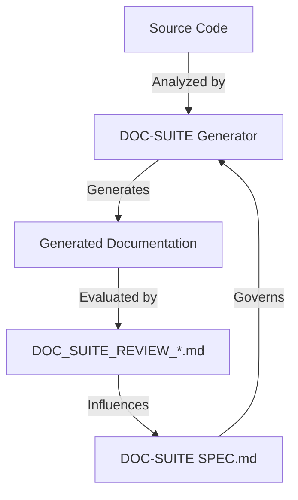

# Subsystem: docs-source

## Purpose
The `docs-source` subsystem encompasses the primary documentation files located at the root of the repository and within the web frontend. It serves as the source of truth for project-level documentation and includes critical meta-analysis files that evaluate the quality, depth, and utility of the documentation suite itself.

## Common Workflows

### Documentation Quality Review
Developers and architects use the `DOC_SUITE_REVIEW_*.md` files to assess the effectiveness of the automated documentation generation. This involves:
1. Identifying gaps in technical logic extraction.
2. Spotting missing CLI usage examples or configuration schemas.
3. Evaluating the need for more visual aids (Mermaid diagrams) to explain complex workflows.

### Project Orientation
New developers refer to the root-level README (if present) and `web/README.md` to understand the project's purpose, technology stack, and initial setup procedures.

## Key Components

| File | Description | Purpose |
| :--- | :--- | :--- |
| `DOC_SUITE_REVIEW.md` | Initial DOC-SUITE assessment | Identifies high-level gaps between generated summaries and deep technical needs. |
| `DOC_SUITE_REVIEW_V2.md` | Logic & Gap Analysis | Analyzes specific failures in capturing complex logic (DSL, CLI, Purity rules). |
| `DOC_SUITE_REVIEW_V3.md` | Visual & Workflow Audit | Focuses on the lack of diagrams, sequence flows, and "Life of a Request" narratives. |
| `web/README.md` | Frontend Documentation | Provides standard Next.js setup, development, and deployment instructions. |

## Architecture & Diagrams



## Dependencies

### Internal
- **infrastructure**: Deployment workflows documented in `web/README.md` relate to CI/CD setups.
- **engine**: The review docs specifically critique the documentation of the `engine` subsystem's orchestration and ingestion logic.

### External
- **Next.js**: The `web/README.md` is based on standard Next.js project structure and documentation patterns.
- **Mermaid**: Required for rendering the visualizations proposed in the review documents.

## Configuration & Examples

### Documentation Review Finding Example
The review files highlight specific missing details that should be in the docs:
> "IF CLI detected: List all commands, arguments, and provide 2 example invocations."
Evidence: `DOC_SUITE_REVIEW.md`

### Web Setup Example
```bash
# Running the development server for the web frontend
npm run dev
```
Evidence: `web/README.md`

## Evidence
- `DOC_SUITE_REVIEW.md`: Full content analyzed.
- `DOC_SUITE_REVIEW_V2.md`: Full content analyzed.
- `DOC_SUITE_REVIEW_V3.md`: Full content analyzed.
- `web/README.md`: Full content analyzed.
