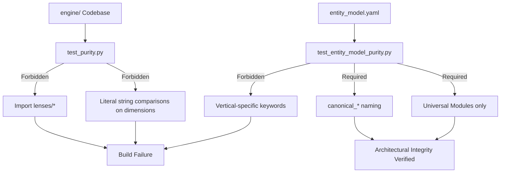
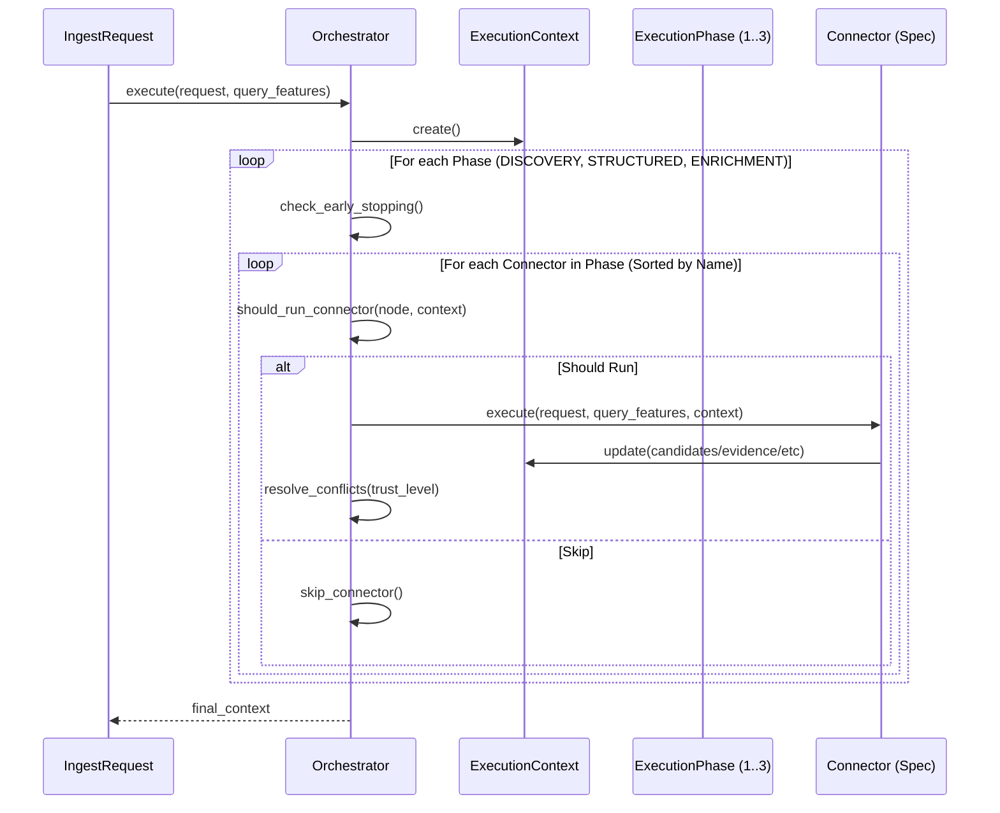
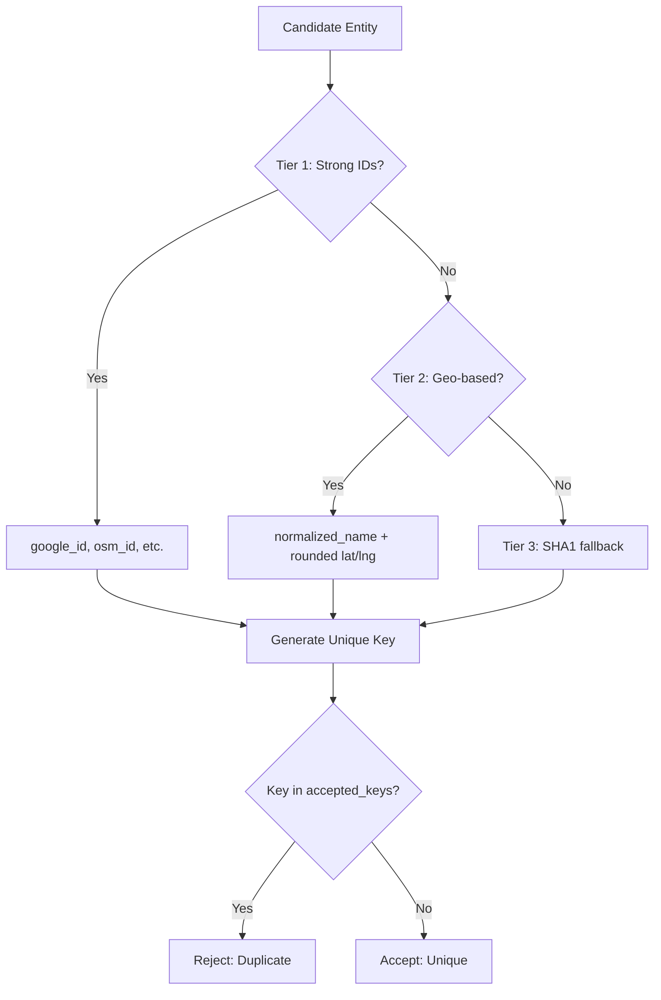
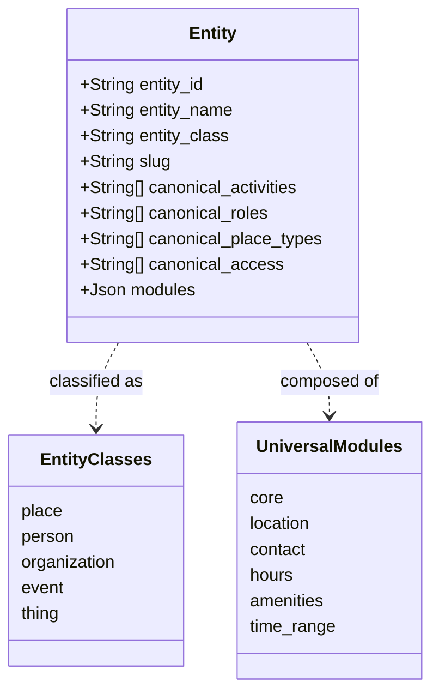
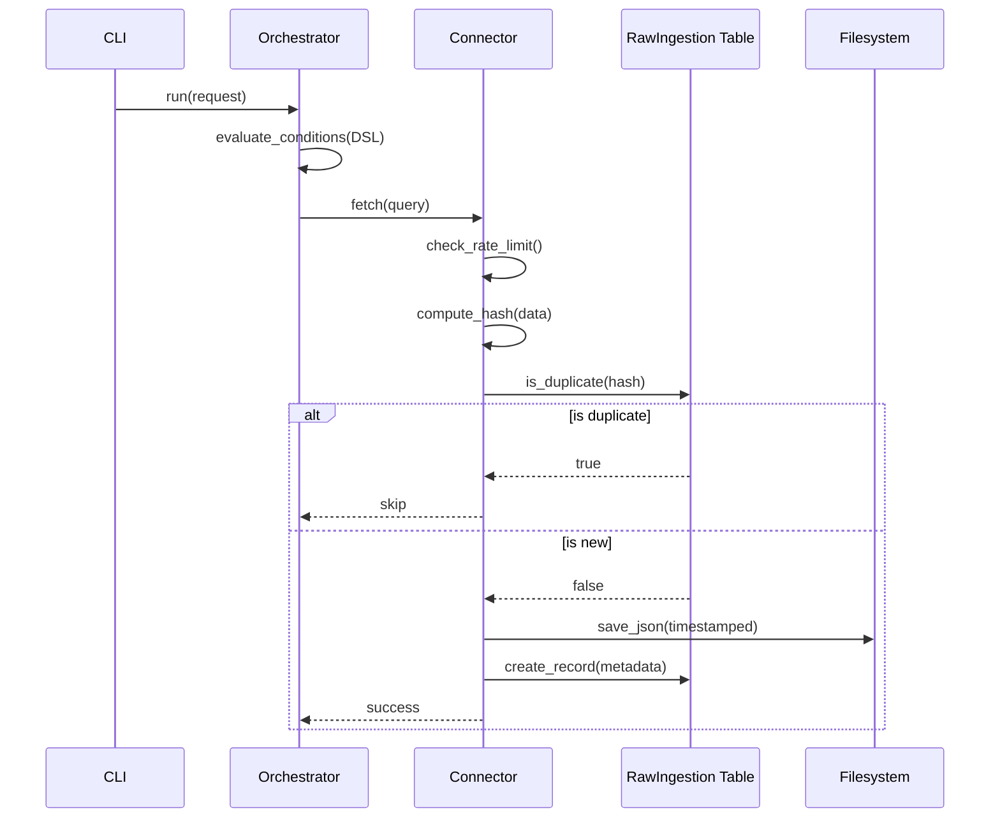
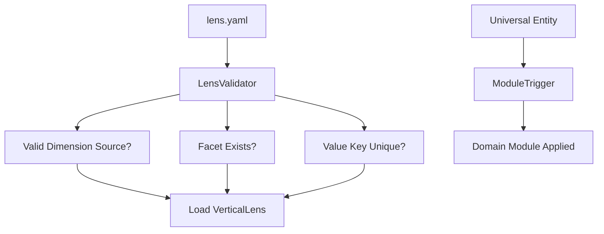

# Subsystem: Engine

## Purpose
The **Engine** is the core backend subsystem responsible for data ingestion, extraction, and harmonization. It serves as a **vertical-agnostic** platform that ingests raw data from various sources (Google Places, OSM, etc.), extracts structured information using LLMs, and stores it in a canonical "Universal Entity Model".

The Engine is designed to be completely independent of specific verticals (e.g., wine, sports). Vertical-specific logic, terminology, and display rules are delegated to the **Lens** layer.

## Architectural Purity & Enforcement
The Engine's "vertical-agnostic" nature is not just a convention but is **mechanically enforced** through automated tests.

*   **Lens Contract Enforcement** (`tests/engine/test_purity.py`):
    *   **Import Boundary**: Prevents any file in `engine/` from importing from the `lenses/` directory.
    *   **Structural Purity**: Uses regex to prevent literal string comparisons against dimension values (e.g., `if "padel" in canonical_activities`) within the engine. The engine must only perform set operations or pass these opaque strings through.
*   **Model Purity** (`tests/engine/config/test_entity_model_purity.py`):
    *   Validates `entity_model.yaml` against a "forbidden list" of domain-specific keywords (e.g., "wine", "tennis", "court").
    *   Ensures all dimensions use the `canonical_*` naming convention and are marked as `opaque` and `GIN` indexed.
    *   Restricts `modules` to a predefined set of Universal Modules.

## Key Components

### Configuration
The `engine/config/` directory contains the source of truth for the system's behavior and data model.

*   **`entity_model.yaml`**: Defines the Universal Entity Model. This is the "constitution" of the engine, enforcing strict separation of concerns. It defines entity classes (place, person, organization, etc.), universal modules, and opaque dimensions.
*   **`schemas/entity.yaml`**: The technical schema definition used to generate Pydantic models and Prisma schemas.
*   **`sources.yaml`**: Configures external data sources, including API keys, rate limits, and default parameters.
*   **`monitoring_alerts.yaml`**: Defines operational thresholds for alerts (e.g., high failure rates, low disk space, LLM cost overruns).

### Ingestion Layer (`engine/ingestion/`)
Responsible for fetching raw data from external sources.

*   **Connectors**: Standardized adapters for external APIs.
    *   **Primary**: `GooglePlacesConnector` (Places API v1), `OSMConnector` (Overpass QL), `SerperConnector` (Google Search).
    *   **Enrichment**: `EdinburghCouncilConnector` (ArcGIS), `SportScotlandConnector` (WFS), `OpenChargeMapConnector` (EV Charging).
*   **`BaseConnector`** (`engine/ingestion/base.py`): Abstract base class defining the `fetch` -> `save` -> `is_duplicate` contract.
*   **Deduplication** (`engine/ingestion/deduplication.py`): Prevents re-ingesting identical content using SHA-256 hashing.
*   **Storage** (`engine/ingestion/storage.py`): Raw data is saved to `engine/data/raw/<source>/` using a timestamped organization (`YYYYMMDD_<id>.json`).
*   **Rate Limiting** (`engine/ingestion/rate_limiting.py`): Enforces sliding time-window quotas (per-minute/per-hour) to prevent API exhaustion.
*   **Retry Logic** (`engine/ingestion/retry_logic.py`): Implements exponential backoff for transient failures (network, 429s).
*   **Health Checks** (`engine/ingestion/health_check.py`): Monitors failure rates, stale data, and API quotas.

### Orchestration System (`engine/orchestration/`)
The intelligent control plane for ingestion, managing the lifecycle of a request through multiple phases and connectors.

*   **`Orchestrator`** (`engine/orchestration/orchestrator.py`): The main control loop. It enforces strict **Phase Barriers** and manages early stopping based on budget and confidence thresholds.
*   **`ExecutionPlan`** (`engine/orchestration/execution_plan.py`): A DAG-lite structure that organizes connectors. It uses **Inferred Dependencies** by matching `context.*` keys in a connector's `requires` list against the `provides` list of previously added connectors.
*   **`ExecutionContext`** (`engine/orchestration/execution_context.py`): The mutable state container passed through all connectors. It holds `candidates`, `accepted_entities`, `evidence`, and `seeds`. It also owns the **Tiered Deduplication Strategy**.
*   **`ExecutionPhase`**: Defines the sequential pipeline:
    1.  `DISCOVERY`: High-coverage, low-specificity search (e.g., Serper).
    2.  `STRUCTURED`: High-quality data sources (e.g., Google Places, OSM).
    3.  `ENRICHMENT`: Specialized data (e.g., Edinburgh Council, SportScotland).
*   **`QueryFeatures`** (`engine/orchestration/query_features.py`): Extract deterministic signals from the query (e.g., `looks_like_category_search`, `has_geo_intent`) to guide connector gating.
*   **Conflict Resolution**: When multiple connectors write to the same scalar field in the context, the orchestrator applies trust-based resolution:
    1.  **Higher `trust_level` wins.**
    2.  On tie, the **last writer (alphabetically by connector name)** wins for determinism.

### Engine Scripts (`engine/scripts/`)
Utilities and manual integration tests for connectors and orchestration.

*   **Connector Runners**: Individual scripts (e.g., `run_serper_connector.py`, `run_sport_scotland_connector.py`) that test the full lifecycle of a single connector, from config loading to DB persistence.
*   **`run_seed.py`**: Populates the database with initial known entities.
*   **`run_osm_comprehensive.py`**: Executes complex OSM queries with geographic partitioning.
*   **`seed_data.py`**: Prisma-based utility for basic database seeding and connection verification.

### Extraction Core (`engine/extraction/`)
Transforms raw data into structured entities.

*   **`BaseExtractor`** (`engine/extraction/base.py`): Abstract base class standardizing the `extract`, `validate`, and `split_attributes` lifecycle.
*   **`EntityClassifier`** (`engine/extraction/entity_classifier.py`): Deterministic algorithm for assigning `entity_class` (Place, Person, etc.).
*   **`Deduplicator`** (`engine/extraction/deduplication.py`): Cascading entity resolution (External ID → Slug → Fuzzy).
*   **`AttributeSplitter`** (`engine/extraction/attribute_splitter.py`): Separates schema attributes from "discovered" attributes.
*   **`Lens Contract`** (`engine/extraction/__init__.py`): Bridge to the Lens layer, applying vertical-specific mapping.

### Lens Layer (`engine/lenses/`)
Owns vertical-specific interpretation and display rules.

*   **`VerticalLens`** (`engine/lenses/loader.py`): Configuration loader for `lens.yaml`. Enforces strict **Architectural Contracts**:
    1.  Facets must use allowed dimension columns (`canonical_activities`, `canonical_roles`, etc.).
    2.  Values must reference existing facets.
    3.  Mapping rules must reference existing canonical values.
    4.  Duplicate keys are strictly forbidden via `StrictYAMLLoader`.
*   **`ModuleTrigger`**: Automatically applies domain modules (e.g., `sports_facility`) based on canonical facet values.
*   **`DerivedGrouping`**: View-only groupings computed at query time (not stored in DB).
*   **Lens Membership** (`engine/lenses/ops.py`): Managed via the `LensEntity` table and explicit attach/detach API. Tested in `tests/engine/test_lens_membership.py`.

### Module Composition (`engine/modules/`)
*   **Namespacing** (`engine/modules/validator.py`): Enforces that the `modules` JSONB column is namespaced by module key. Flattened structures are rejected to prevent field collisions.

### Database Upsert (`engine/ingest.py`)
*   **`ingest_entity`**: Validates data against the Pydantic model, separates core columns from module JSON, and performs the database upsert via Prisma.

## Architecture & Diagrams

### Architectural Purity Enforcement


### Orchestration Execution Flow
The Orchestrator manages the sequential execution of phases, ensuring data from earlier phases is available to later ones.



### Tiered Deduplication Strategy
The `ExecutionContext` uses a 3-tier strategy to prevent duplicate entities from being accepted.



### Universal Entity Model
The Engine uses a "Universal Entity Model" where dimensions are stored as opaque arrays, interpreted only by the Lens layer.



### Ingestion & Orchestration Flow
Data flows from Connectors to Raw Storage, then to the Extraction Pipeline, controlled by Orchestration.



### Lens Layer Contract


## Common Workflows

### 1. Ingesting Raw Data
Use the unified CLI to fetch data from any connector:
```bash
# General syntax
python -m engine.ingestion.cli <connector> "<query>"

# Examples
python -m engine.ingestion.cli google_places "padel courts edinburgh"
python -m engine.ingestion.cli openstreetmap "tennis"
python -m engine.ingestion.cli serper "padel edinburgh"
```

### 2. Checking Ingestion Health
Monitor the status of ingestion jobs and data freshness:
```bash
# View comprehensive stats
python -m engine.ingestion.cli status
```

### 3. Checking Data Integrity
To verify the database connection and view a sample of stored entities:
```bash
python -m engine.check_data
```

### 4. Configuring a New Data Source
1.  Copy `engine/config/sources.yaml.example` to `engine/config/sources.yaml`.
2.  Add API keys and enable the source.
3.  Configure rate limits and retry policies.

### 5. Managing Lens Membership
Lenses are explicit. Entities must be attached to a lens to appear in its results:
```python
from engine.lenses.ops import attach_entity_to_lens
await attach_entity_to_lens(entity_id="...", lens_id="wine_discovery")
```

### 6. Verifying Architectural Purity
Run the specialized purity tests to ensure no vertical leaks:
```bash
pytest tests/engine/test_purity.py tests/engine/config/test_entity_model_purity.py
```

## Testing
The Engine uses a tiered testing strategy:
*   **Unit Tests**: Core logic validation (e.g., `orchestration/orchestrator_test.py`).
*   **Integration Tests**: Real-world connector verification (e.g., `engine/scripts/run_sport_scotland_connector.py`).
*   **Purity Tests**: Architectural boundary enforcement (e.g., `tests/engine/test_purity.py`).
*   **Lens Membership Tests**: API validation for entity-lens relationships (`tests/engine/test_lens_membership.py`).

## Evidence
*   `engine/check_data.py`: Data checking script.
*   `engine/config/entity_model.yaml`: Universal Entity Model definition.
*   `engine/config/monitoring_alerts.yaml`: Alert definitions.
*   `engine/config/schemas/entity.yaml`: Detailed field schema.
*   `engine/config/sources.yaml.example`: Source configuration template.
*   `engine/extraction/__init__.py`: Lens contract extraction logic.
*   `engine/extraction/attribute_splitter.py`: Attribute splitting utility.
*   `engine/extraction/base.py`: BaseExtractor interface.
*   `engine/extraction/cli.py`: Extraction maintenance CLI.
*   `engine/extraction/config.py`: Configuration loader.
*   `engine/extraction/cost_report.py`: LLM cost reporting.
*   `engine/extraction/deduplication.py`: Deduplication logic.
*   `engine/extraction/entity_classifier.py`: Classification rules.
*   `engine/extraction/schema_utils.py`: Schema helpers.
*   `engine/extraction/utils/category_mapper.py`: Category mapping logic.
*   `engine/extraction/utils/opening_hours.py`: Opening hours normalization.
*   `engine/extraction/utils/summary_synthesis.py`: Summary generation.
*   `engine/ingest.py`: Entity ingestion/upsert logic.
*   `engine/ingestion/base.py`: BaseConnector interface.
*   `engine/ingestion/cli.py`: Ingestion CLI.
*   `engine/ingestion/deduplication.py`: Ingestion deduplication.
*   `engine/ingestion/health_check.py`: Ingestion health checks.
*   `engine/ingestion/rate_limiting.py`: Rate limiting infrastructure.
*   `engine/ingestion/retry_logic.py`: Retry infrastructure.
*   `engine/ingestion/storage.py`: Filesystem storage organization.
*   `engine/lenses/loader.py`: Lens configuration loader.
*   `engine/lenses/ops.py`: Lens membership operations.
*   `engine/lenses/validator.py`: Lens architectural contract validation.
*   `engine/modules/validator.py`: Module composition and YAML strictness.
*   `engine/orchestration/execution_context.py`: Execution context and deduplication.
*   `engine/orchestration/execution_plan.py`: Dependency inference and phases.
*   `engine/orchestration/orchestrator.py`: Main control loop and conflict resolution.
*   `engine/orchestration/query_features.py`: Query feature extraction.
*   `engine/orchestration/types.py`: Core orchestration types.
*   `engine/scripts/README.md`: Documentation for engine scripts.
*   `engine/scripts/run_sport_scotland_connector.py`: SportScotland WFS integration test.
*   `engine/seed_data.py`: Database seeding skeleton.
*   `engine/run_osm_comprehensive.py`: Comprehensive OSM script.
*   `tests/engine/config/test_entity_model_purity.py`: Entity model purity enforcement.
*   `tests/engine/test_lens_membership.py`: Lens membership API tests.
*   `tests/engine/test_purity.py`: Architectural purity enforcement.