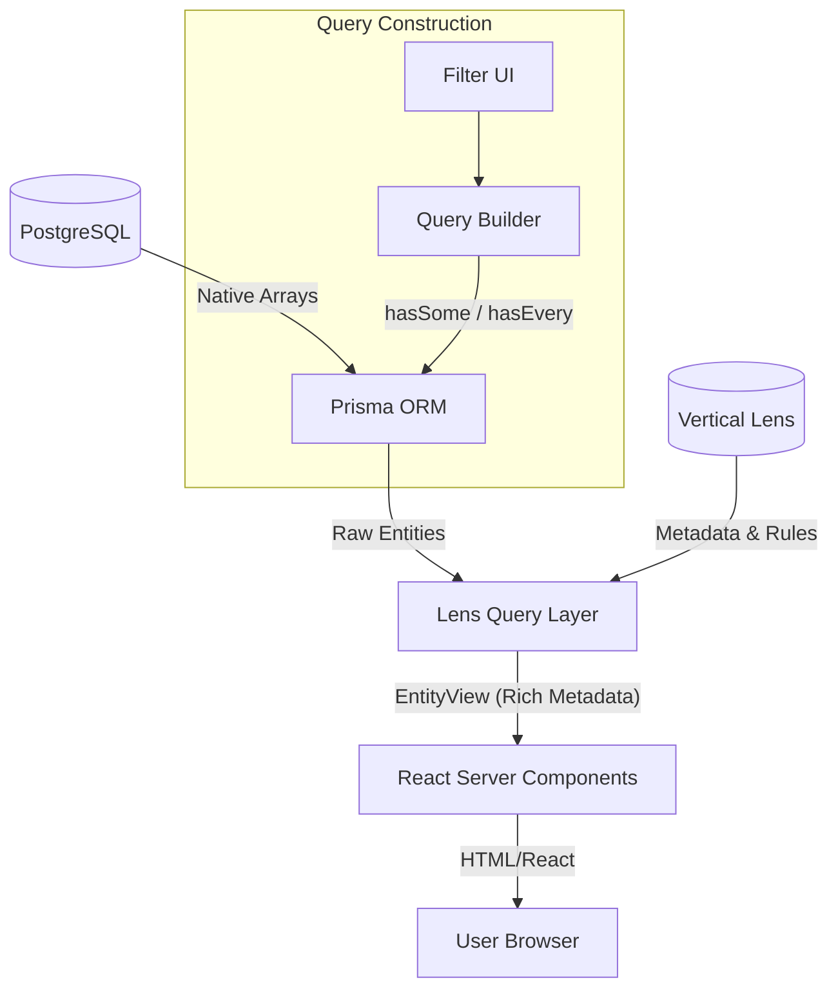

# Subsystem: Frontend

## Purpose
The `frontend` subsystem is a Next.js application that provides a web-based interface for exploring and filtering entities (places, people, organizations) in the Edinburgh Finds ecosystem. It implements a **lens-aware query layer** that translates user-facing filters into efficient PostgreSQL array queries via Prisma, and transforms raw database records into rich, human-readable views based on vertical lens configurations.

## Common Workflows

### Faceted Search & Filtering
The frontend implements standard faceted search semantics: **OR within a facet** and **AND across facets**.
1. User selects multiple values for a dimension (e.g., Activities: "Padel", "Tennis").
2. `buildFacetedWhere` creates a Prisma `where` clause using the `hasSome` operator (mapping to Postgres `&&`).
3. If multiple facets are selected (e.g., Activity="Padel" AND Role="Provider"), they are combined with an `AND` block.
4. The database executes an efficient array intersection query.

### Lens-Aware Entity Transformation
Raw entities stored in the database contain opaque canonical tags (e.g., `canonical_activities: ["padel"]`).
1. The frontend fetches raw entities using Prisma.
2. `transformEntityToView` is called with a specific Lens configuration.
3. The function maps opaque tags to rich metadata (labels, icons, colors) defined in the lens.
4. It computes **derived groupings** (e.g., "Is this a person or a place?") at runtime based on the entity class and roles.

### Life of a Request (Data Fetching)
1. **Request**: User navigates to a page or applies a filter.
2. **Query Building**: `buildComplexQuery` (in `web/lib/lens-query.ts`) constructs the Prisma `where` input.
3. **Execution**: React Server Component calls `prisma.entity.findMany()` with the constructed filter.
4. **Interpretation**: The resulting records are transformed using `transformEntityToView`.
5. **Render**: The UI renders the `EntityView` with Tailwind-styled components.

## Key Components

| Component | Path | Description |
|-----------|------|-------------|
| **Query Layer** | `web/lib/lens-query.ts` | Core logic for lens-based filtering and rich metadata transformation. |
| **Prisma Utilities** | `web/lib/entity-queries.ts` | Type-safe builders for Prisma array filters (`hasSome`, `hasEvery`). |
| **Main Page** | `web/app/page.tsx` | Main entry point demonstrating entity listing and faceted filtering. |
| **Prisma Client** | `web/lib/prisma.ts` | Singleton Prisma client instance for the web application. |
| **Type Definitions** | `web/types/index.ts` | Re-exports generated and custom types for entities and views. |

## Architecture & Diagrams

### Data Flow & Transformation


### Query Semantics (Prisma/Postgres)
- **OR within Facet**: Uses `hasSome: [values]` -> Postgres `&&` (overlap).
- **AND across Facets**: Uses Prisma `AND` block.
- **AND within Facet**: Uses `hasEvery: [values]` -> Postgres `@>` (contains).

## Dependencies

### Internal
- **Database**: Depends on the PostgreSQL schema managed by the `engine` and `database` subsystems.
- **Lenses**: Uses Lens configurations (via `VerticalLens` logic) to interpret canonical values.

### External
- **Next.js 15+**: React framework for Server Components and routing.
- **Prisma**: Object-Relational Mapper for TypeScript.
- **Tailwind CSS 4**: Utility-first CSS framework for styling.
- **Lucide React**: Icon library for UI elements.

## Configuration & Examples

### Faceted Query Example
Building a query for "Padel venues that offer pay-and-play access":
```typescript
const where = buildFacetedWhere({
  activities: ["padel"],
  roles: ["provides_facility"],
  access: ["pay_and_play"],
  entity_class: "place"
});

// Resulting Prisma call:
// prisma.entity.findMany({ where })
```

### Lens Transformation Example
Transforming a raw entity into a rich view:
```typescript
const view = transformEntityToView(rawEntity, activeLens);

console.log(view.activities); 
// Output: [{ key: "padel", label: "Padel", icon: "racket", color: "blue" }]
console.log(view.grouping);
// Output: "places" (derived from roles/class)
```

## Evidence
- **Tech Stack**: `web/package.json` lines 12-25
- **Query Logic**: `web/lib/lens-query.ts` lines 42-160
- **Prisma Integration**: `web/lib/entity-queries.ts` lines 64-118
- **UI Implementation**: `web/app/page.tsx` lines 7-60
- **Type Definitions**: `web/types/index.ts` lines 1-5
