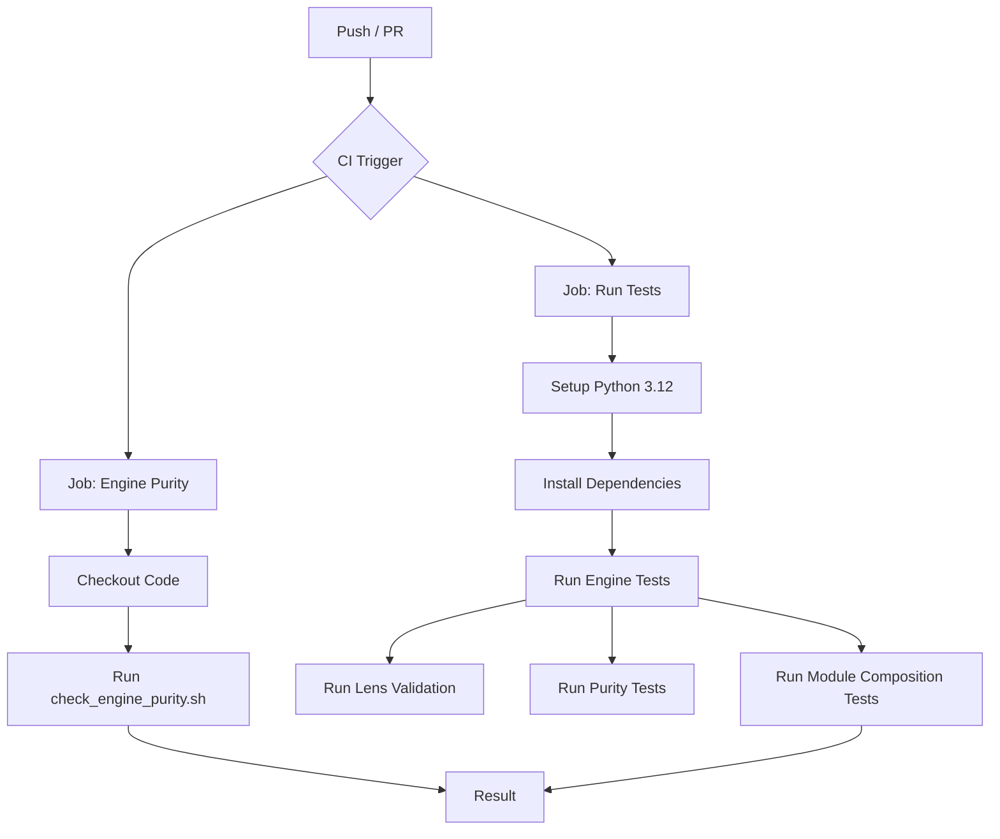

# Subsystem: Infrastructure

## Purpose
This subsystem manages the Continuous Integration (CI) and Continuous Deployment (CD) pipelines, as well as the contribution guidelines for the project. It ensures code quality, architectural integrity (specifically "Engine Purity"), and automated testing for every change introduced to the codebase.

## Common Workflows

### 1. Automated Testing (CI)
Every push or pull request to `main` or `develop` triggers the automated testing pipeline.
1.  **Engine Purity Check:** A specialized script (`scripts/check_engine_purity.sh`) verifies that the core engine remains decoupled from specific "lenses" (domain-specific logic).
2.  **Unit & Integration Tests:** Python 3.12 environment is set up, dependencies are installed, and a comprehensive suite of tests (Engine, Lens Validation, Deduplication, etc.) is executed.

### 2. Pull Request Submission
Developers must follow the `pull_request_template.md` which enforces a strict architectural validation checklist.
1.  **Self-Check:** Developers verify they haven't violated engine purity or lens contract rules.
2.  **Manual Verification:** Confirmation of manual testing and local verification of specific test commands (e.g., `pytest tests/lenses/test_validator.py`).

## Key Components

### GitHub Workflows
*   `.github/workflows/tests.yml`: The primary CI configuration.
    *   **Triggers:** Pushes and PRs to `main`, `develop`.
    *   **Jobs:**
        *   `engine-purity`: Runs the bash script to enforce architectural boundaries.
        *   `tests`: Runs the Python test suite using `pytest`.

### Contribution Templates
*   `.github/pull_request_template.md`: A markdown template populated in every new PR. It acts as a gatekeeper for architectural standards, specifically requiring checks for:
    *   Engine Purity (no lens imports in engine)
    *   Lens Contract Validation
    *   Module Composition

## Architecture & Diagrams

### CI Pipeline Flow


## Dependencies

### Internal
*   `scripts/check_engine_purity.sh`: Script used by the purity job (implied dependency).
*   `engine/requirements.txt`: Defines python dependencies installed during the test job.
*   `tests/`: Directory containing all test suites executed by the workflow.

### External
*   **GitHub Actions:** The platform runner.
*   **Python 3.12:** The runtime environment for tests.
*   **Pytest:** The testing framework.

## Configuration & Examples

### CI Job Configuration (`tests.yml`)
The `tests` job is configured to run on `ubuntu-latest` and sets up the Python environment before running tests.

```yaml
  tests:
    name: Run Tests
    runs-on: ubuntu-latest

    steps:
    - uses: actions/checkout@v4

    - name: Set up Python
      uses: actions/setup-python@v5
      with:
        python-version: '3.12'
```

### Pull Request Checklist
The PR template ensures developers verify key architectural constraints:

```markdown
### Engine Purity
- [ ] Engine does not import from lenses/ (receives LensContract dict only)
- [ ] No value-based branching on dimension values (structural purity)
...
- [ ] CI purity checks pass: `bash scripts/check_engine_purity.sh`
```

## Evidence
*   `.github/workflows/tests.yml`:1-64
*   `.github/pull_request_template.md`:1-64
