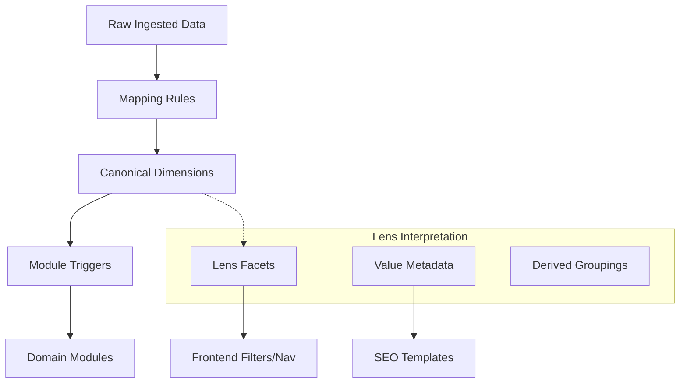

# Subsystem: Lenses

## Purpose
The Lenses subsystem provides domain-specific interpretations of the universal entity engine. It allows the same underlying data structure to support multiple "verticals" (e.g., Sports & Fitness, Wine Discovery) by mapping generic database dimensions to vertical-specific concepts, taxonomies, and behaviors.

## Common Workflows

### 1. Domain Classification
When raw data is ingested, the engine uses the Lens's `mapping_rules` (regex patterns) to identify canonical values for the entity's dimensions (`canonical_activities`, `canonical_roles`, etc.).
Evidence: `lenses/edinburgh_finds/lens.yaml:189-269`, `lenses/wine_discovery/lens.yaml:164-219`

### 2. Schema Dynamic Extension
As entities are processed, `module_triggers` evaluate the assigned facets and roles. If a match is found, domain-specific `modules` (additional data structures) are attached to the entity to store vertical-specific attributes (e.g., pitch inventory for sports, or vineyard acreage for wine).
Evidence: `lenses/edinburgh_finds/lens.yaml:350-424`, `lenses/wine_discovery/lens.yaml:298-326`

### 3. UI & SEO Orchestration
The Lens configuration provides metadata for the frontend, including UI labels, icons, display modes for filters, and `seo_templates` for generating SEO-friendly URLs and meta tags based on the domain's taxonomy.
Evidence: `lenses/edinburgh_finds/lens.yaml:29-73`, `lenses/edinburgh_finds/lens.yaml:426-440`

## Key Components

### Lens Configuration (`lens.yaml`)
A YAML specification defining the vertical's entire domain model.
- **Facets:** Maps lens concepts to DB columns (e.g., `wine_type` maps to `canonical_activities`).
- **Values:** Definitions for every canonical value (display name, SEO slug, keywords).
- **Mapping Rules:** Regex patterns for data extraction.
- **Derived Groupings:** Logical views (e.g., "Coaches & Instructors") built from classes and roles.
- **Modules:** Schema extensions for domain-specific fields.
- **Module Triggers:** Rules that activate modules based on facet values.

## Architecture & Diagrams



## Dependencies

### Internal
- **Engine (Ingestion/Extraction):** Uses Lens mapping rules during data processing.
- **Database:** Stores the canonical dimensions that Lenses interpret.
- **Frontend:** Consumes Lens metadata for rendering and routing.

## Configuration & Examples

### Example: Sports Facility Module Definition
```yaml
modules:
  sports_facility:
    description: "Sports-specific facility attributes with inventory structure"
    fields:
      inventory:
        type: json
        description: "Per-activity court/facility inventory structure"
      floodlit:
        type: boolean
```
Evidence: `lenses/edinburgh_finds/lens.yaml:295-309`

### Example: Module Trigger
```yaml
module_triggers:
  - when:
      facet: activity
      value: padel
    add_modules:
      - sports_facility
    conditions:
      - entity_class: "place"
```
Evidence: `lenses/edinburgh_finds/lens.yaml:351-358`

## Evidence
- `lenses/edinburgh_finds/lens.yaml`: Complete sports/fitness domain definition.
- `lenses/wine_discovery/lens.yaml`: Complete wine domain definition.
