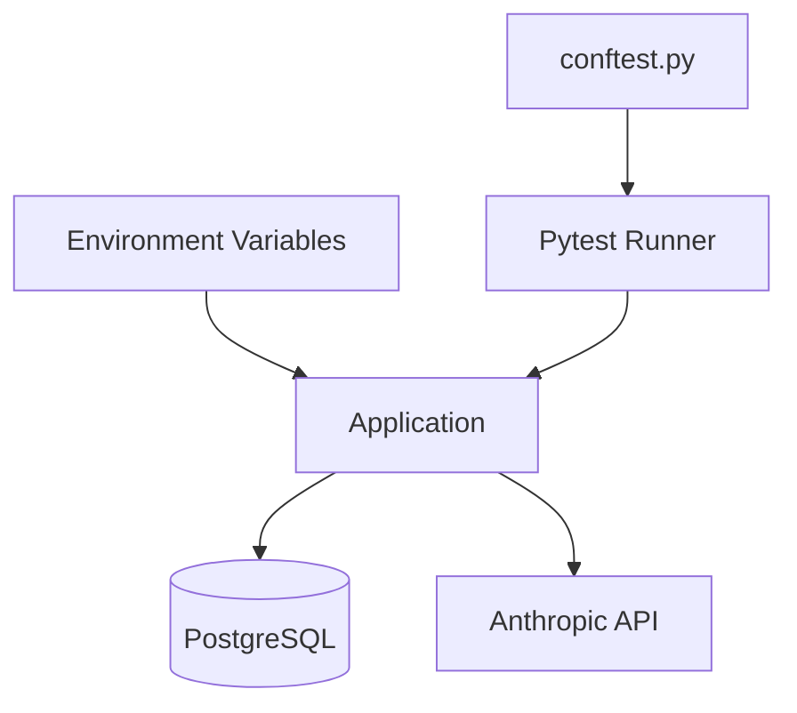

# Subsystem: Root Configuration

## Purpose
The Root subsystem contains project-wide configuration, environment settings, and basic tooling for the Edinburgh Finds repository. It defines the environment variables required for operation and ensures proper Python path resolution for testing and execution.

## Common Workflows

### 1. Environment Setup
Developers use `.env.example` as a template to create a `.env` file containing database credentials and API keys for third-party services (Anthropic, Google, Serper).
Evidence: `.env.example:1-35`

### 2. Testing Initialization
When running tests with `pytest`, `conftest.py` ensures the project root is added to the Python system path, allowing modules in `engine/` and `lenses/` to be imported correctly.
Evidence: `conftest.py:1-7`

## Key Components

### Environment Configuration (`.env.example`)
Defines the contract for environment variables:
- `DATABASE_URL`: Connection string for PostgreSQL.
- `ANTHROPIC_API_KEY`: Required for AI-powered entity extraction.
- `GOOGLE_PLACES_API_KEY`: Used for fetching place data.
- `SERPER_API_KEY`: Used for search-based data ingestion.

### Git Attributes (`.gitattributes`)
Manages how files are handled by Git, specifically marking auto-generated schema files as `linguist-generated` to improve diff readability.
Evidence: `.gitattributes:1-7`

### Python Test Configuration (`conftest.py`)
Standard `pytest` configuration file used to bootstrap the environment for testing.

## Architecture & Diagrams

## Configuration & Examples

### Required Environment Variables
| Variable | Description |
| --- | --- |
| `DATABASE_URL` | PostgreSQL connection string |
| `ANTHROPIC_API_KEY` | Key for Anthropic Claude API |
| `GOOGLE_PLACES_API_KEY` | Key for Google Places API |
| `SERPER_API_KEY` | Key for Serper.dev API |

## Evidence
- `.env.example`: Template for system configuration.
- `conftest.py`: Python path resolution logic.
- `.gitattributes`: Metadata for generated files.
