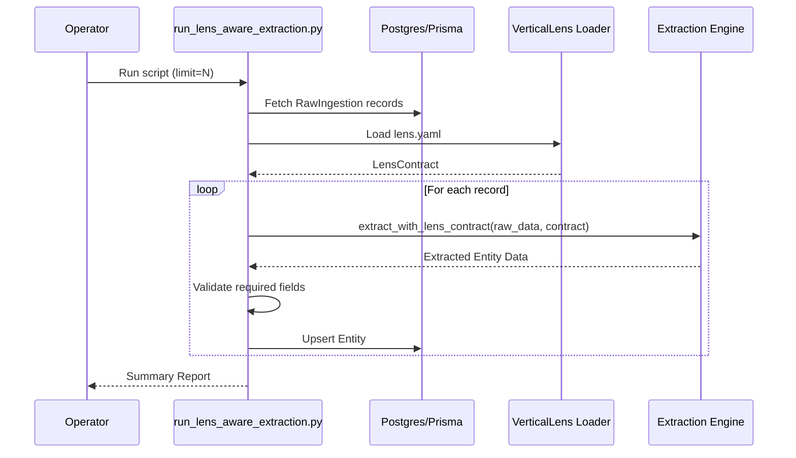

# Subsystem: scripts

## Purpose
The `scripts` subsystem contains standalone automation and validation tools for the Edinburgh Finds platform. These scripts are designed to be run manually by developers or operators to perform specific tasks such as re-running extraction pipelines, validating documentation integrity, and verifying lens configurations. They serve as the operational interface for maintenance and verification tasks that do not run as part of the core application server.

## Common Workflows

### 1. Re-running Lens-Aware Extraction
When the extraction logic or lens configuration changes, operators need to re-process existing raw data to update the standardized entities.
*   **Script:** `scripts/run_lens_aware_extraction.py`
*   **Action:** Loads the "Edinburgh Finds" lens, iterates through `RawIngestion` records, re-applies the extraction rules, and updates the `Entity` table in the database.
*   **Use Case:** Backfilling data after a schema change or improving extraction quality.

### 2. Validating Documentation Coverage
During the documentation generation process (using the Doc Suite), this script ensures that all intended work items are completed and outputs are generated.
*   **Script:** `scripts/validate_docs.py`
*   **Action:** Reads `temp/doc-manifest.json` and `temp/repo-map.json`, checks for "doing" items (which indicate stalled processes), verifies output file existence, and generates a coverage report.
*   **Use Case:** CI/CD pipeline check or manual verification after running `DOC-SUITE: BUILD`.

### 3. Validating Lens Configurations
When creating or modifying a vertical lens (like the "Wine Discovery" lens), developers need to ensure the configuration file (`lens.yaml`) is valid and adheres to the system's contract.
*   **Script:** `scripts/validate_wine_lens.py`
*   **Action:** Loads the specific lens configuration, validates facets, dimensions, mapping rules, and module triggers against the `VerticalLens` schema.
*   **Use Case:** Pre-commit check or testing new lens definitions.

## Key Components

| Script | Description | Key Dependencies |
| :--- | :--- | :--- |
| `run_lens_aware_extraction.py` | Re-runs the extraction pipeline on stored raw data using the active lens configuration. | `engine.lenses.loader`, `engine.extraction.base`, `prisma` |
| `validate_docs.py` | Checks the consistency and completion of the documentation suite generation state. | `json`, `os` |
| `validate_wine_lens.py` | Specifically validates the Wine Discovery lens configuration for correctness. | `engine.lenses.loader` |

## Architecture & Diagrams

### Extraction Workflow


## Dependencies

### Internal
*   **Engine:** heavily relies on `engine.lenses` for loading configurations and `engine.extraction` for the core processing logic.
*   **Database:** Uses the Prisma client configured in the `engine` subsystem to interact with the database.

### External
*   **Prisma Client:** For database access (`prisma`).
*   **Tqdm:** For progress bars during long-running batch operations (`tqdm`).
*   **Asyncio:** For managing asynchronous database operations.

## Configuration & Examples

### Re-running Extraction
Run the extraction script with a limit for testing, or dry-run to see what would happen without writing to the DB.

```bash
# Process 10 records and update the database
python scripts/run_lens_aware_extraction.py --limit 10

# Dry run (no DB writes) for all records from a specific source
python scripts/run_lens_aware_extraction.py --dry-run --source google_places
```

### Validating Docs
This script expects the `temp/` directory to contain the Doc Suite state files.

```bash
python scripts/validate_docs.py
```

### Validating a Lens
Validates the configuration at `lenses/wine_discovery/lens.yaml`.

```bash
python scripts/validate_wine_lens.py
```

## Evidence
*   `scripts/run_lens_aware_extraction.py`: Main extraction logic and CLI arguments.
*   `scripts/validate_docs.py`: Logic for checking manifest state and generating reports.
*   `scripts/validate_wine_lens.py`: Validation logic for lens structure and constraints.
