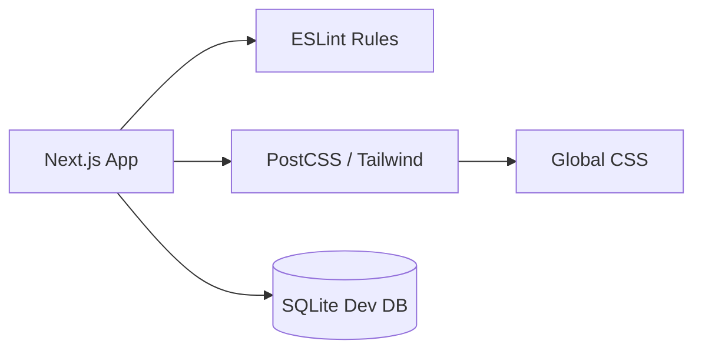

# Subsystem: Web Configuration

## Purpose
The Web subsystem provides the structural and tooling configuration for the Next.js frontend application. It manages code quality through ESLint, styling through PostCSS/Tailwind, and local development data via a SQLite database.

## Common Workflows

### 1. Code Quality Enforcement
Developers use ESLint to maintain code standards. The configuration integrates Next.js core web vitals and TypeScript rules.
Evidence: `web/eslint.config.mjs:1-20`

### 2. Styling Compilation
The PostCSS configuration enables Tailwind CSS processing for the application's visual design.
Evidence: `web/postcss.config.mjs:1-7`

## Key Components

### ESLint Configuration (`web/eslint.config.mjs`)
Uses the modern ESLint flat config format to combine:
- `eslint-config-next/core-web-vitals`
- `eslint-config-next/typescript`
- Custom global ignores for build artifacts.

### PostCSS Configuration (`web/postcss.config.mjs`)
Configured to use `@tailwindcss/postcss` for utility-first styling.

### Local Development Database (`web/dev.db`)
A SQLite database used for local development of the frontend, typically synced or seeded from the main engine.

### Static Assets (`web/public/`)
Contains SVG assets and icons used across the web application.

## Architecture & Diagrams

## Evidence
- `web/eslint.config.mjs`: Linting setup.
- `web/postcss.config.mjs`: Tailwind CSS integration.
