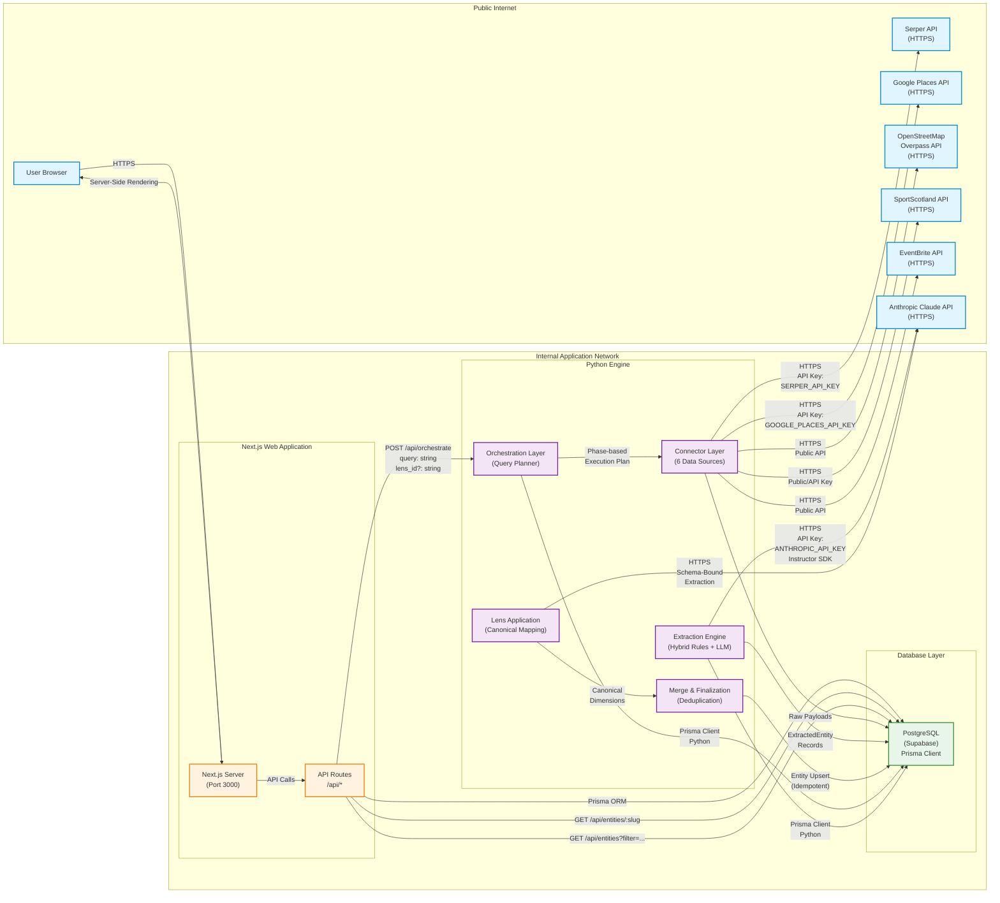
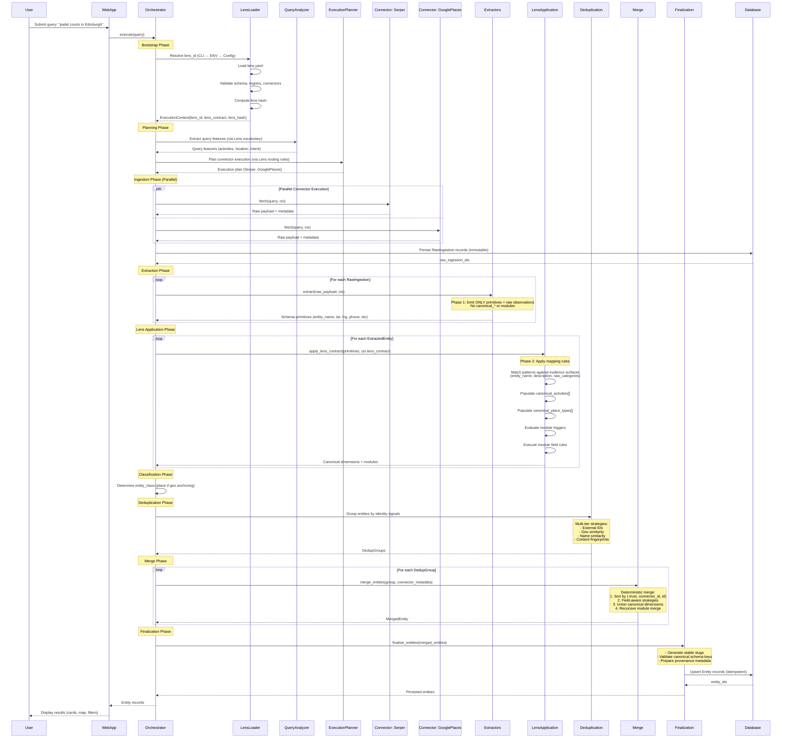

# API Reference — Universal Entity Extraction Engine

**Generated:** 2026-02-08
**System:** Universal Entity Extraction Engine
**Reference Application:** Edinburgh Finds

---

## Table of Contents

1. [Overview](#1-overview)
2. [Network Architecture](#2-network-architecture)
3. [Authentication & Rate Limiting](#3-authentication--rate-limiting)
4. [Core HTTP Endpoints](#4-core-http-endpoints)
5. [Python Orchestration API](#5-python-orchestration-api)
6. [Request/Response Schemas](#6-requestresponse-schemas)
7. [Error Handling](#7-error-handling)
8. [Pagination & Filtering](#8-pagination--filtering)
9. [API Versioning Strategy](#9-api-versioning-strategy)
10. [Client Integration Examples](#10-client-integration-examples)

---

## 1. Overview

The Universal Entity Extraction Engine provides two distinct API surfaces:

1. **Python Orchestration API** - Command-line interface for executing the full ingestion pipeline (query → extract → persist)
2. **HTTP REST API** (Future) - Web-facing API for entity retrieval and search

### Current Status

**Production-Ready:**
- Python Orchestration CLI (`python -m engine.orchestration.cli`)
- Direct database access via Prisma Client (Python & TypeScript)

**Planned:**
- RESTful HTTP endpoints for entity retrieval (`/api/entities/:slug`)
- Query orchestration HTTP endpoint (`/api/orchestrate`)
- GraphQL API for advanced filtering and nested queries

### Design Philosophy

The API adheres to the Engine-Lens Architecture:

- **Engine Purity** - API contracts use universal schema fields only (no domain-specific terminology)
- **Lens Interpretation** - Domain semantics applied at query time via lens contracts
- **Determinism** - Identical inputs + lens contract → identical outputs
- **Idempotency** - Re-running same query updates existing entities rather than creating duplicates

---

## 2. Network Architecture

The system operates across three logical network boundaries:



### Network Boundaries

1. **Public Internet** - External API dependencies (Serper, Google, OSM, Anthropic)
2. **Internal Application Network** - Next.js web app + Python engine + PostgreSQL database
3. **Supabase Managed Network** - PostgreSQL database hosted on Supabase infrastructure

### Security Requirements

- All external API calls use HTTPS with API key authentication
- Internal communication between Next.js and Python engine (future) will use service-to-service authentication
- Database access requires `DATABASE_URL` environment variable (Supabase connection string)
- API keys stored in `.env` files (never committed to git)

Required environment variables:

```bash
# External API Keys
ANTHROPIC_API_KEY=<your_key>
SERPER_API_KEY=<your_key>
GOOGLE_PLACES_API_KEY=<your_key>

# Database
DATABASE_URL=<supabase_postgres_url>

# Lens Configuration
LENS_ID=<lens_identifier>  # e.g., "edinburgh_finds"
```

---

## 3. Authentication & Rate Limiting

### Current Status: Local-Only Execution

The system currently operates as a local CLI tool with no HTTP authentication layer. Future HTTP API implementation will require:

### Planned Authentication Strategy

**API Key Authentication**
- Service-to-service authentication for Next.js → Python engine communication
- Header: `Authorization: Bearer <api_key>`
- Keys generated per deployment environment (dev, staging, production)

**Rate Limiting**
- Per-key rate limits to prevent abuse
- Tiered limits based on query complexity and connector cost
- Budget enforcement at orchestration level (USD spend per query)

### Budget Control

The orchestration system enforces cost budgets at query time:

```python
from engine.orchestration.types import IngestRequest, IngestionMode

request = IngestRequest(
    ingestion_mode=IngestionMode.DISCOVER_MANY,
    query="padel courts in Edinburgh",
    budget_usd=5.0,  # Maximum $5 spend on external APIs
    persist=True
)
```

Budget tracking includes:
- External API costs (Serper, Google Places, Anthropic)
- LLM token usage costs
- Connector execution estimates

**Early Stopping:** Orchestrator halts execution when budget threshold is reached, preventing cost overruns.

---

## 4. Core HTTP Endpoints

### Status: Planned (Not Yet Implemented)

The following HTTP endpoints define the target API surface for web-facing access.

---

### 4.1 POST /api/orchestrate

Execute the full ingestion pipeline: query → plan → ingest → extract → merge → persist.

**Endpoint:** `POST /api/orchestrate`

**Request Headers:**
```
Content-Type: application/json
Authorization: Bearer <api_key>
```

**Request Body:**
```typescript
{
  query: string;                    // Natural language query (required)
  lens_id?: string;                 // Lens identifier (defaults to LENS_ID env var)
  ingestion_mode?: "discover_many" | "resolve_one";  // Default: "discover_many"
  persist?: boolean;                // Persist results to database (default: false)
  budget_usd?: number;              // Maximum spend on external APIs
  target_entity_count?: number;     // Max entities to accept (discover_many mode)
  min_confidence?: number;          // Min confidence threshold (resolve_one mode, 0.0-1.0)
}
```

**Response Body (200 OK):**
```typescript
{
  query: string;                    // Echo of input query
  lens_id: string;                  // Active lens identifier
  candidates_found: number;         // Total candidates before deduplication
  accepted_entities: number;        // Entities after deduplication
  persisted_count: number;          // Entities written to database
  extraction_total: number;         // Total extraction attempts
  extraction_success: number;       // Successful extractions
  connectors: {
    [connector_name: string]: {
      executed: boolean;
      execution_time_ms: number;
      candidates_added: number;
      cost_usd: number;
      error?: string;
    }
  };
  entities: Array<{               // Returned entities (summary view)
    entity_id: string;
    entity_name: string;
    entity_class: "place" | "person" | "organization" | "event" | "thing";
    slug: string;
    canonical_activities: string[];
    canonical_place_types: string[];
    latitude?: number;
    longitude?: number;
  }>;
  errors: Array<{
    connector: string;
    error: string;
  }>;
  warnings: Array<{
    message: string;
  }>;
}
```

**Execution Sequence:**



**Example Request:**
```bash
curl -X POST https://api.edinburgh-finds.com/api/orchestrate \
  -H "Content-Type: application/json" \
  -H "Authorization: Bearer your-api-key" \
  -d '{
    "query": "padel courts in Edinburgh",
    "lens_id": "edinburgh_finds",
    "ingestion_mode": "discover_many",
    "persist": true,
    "budget_usd": 5.0,
    "target_entity_count": 10
  }'
```

**Example Response:**
```json
{
  "query": "padel courts in Edinburgh",
  "lens_id": "edinburgh_finds",
  "candidates_found": 15,
  "accepted_entities": 8,
  "persisted_count": 8,
  "extraction_total": 15,
  "extraction_success": 14,
  "connectors": {
    "serper": {
      "executed": true,
      "execution_time_ms": 450,
      "candidates_added": 8,
      "cost_usd": 0.05
    },
    "google_places": {
      "executed": true,
      "execution_time_ms": 620,
      "candidates_added": 7,
      "cost_usd": 0.10
    }
  },
  "entities": [
    {
      "entity_id": "clx123abc",
      "entity_name": "The Padel Club",
      "entity_class": "place",
      "slug": "padel-club",
      "canonical_activities": ["padel", "tennis"],
      "canonical_place_types": ["sports_facility"],
      "latitude": 55.9533,
      "longitude": -3.1883
    }
  ],
  "errors": [],
  "warnings": []
}
```

**Error Responses:**

**400 Bad Request** - Invalid query or parameters
```json
{
  "error": "Bad Request",
  "message": "query field is required",
  "status": 400
}
```

**401 Unauthorized** - Missing or invalid API key
```json
{
  "error": "Unauthorized",
  "message": "Invalid or missing API key",
  "status": 401
}
```

**422 Unprocessable Entity** - Lens validation failure
```json
{
  "error": "Unprocessable Entity",
  "message": "Lens validation failed: Invalid mapping rule at index 3",
  "status": 422
}
```

**500 Internal Server Error** - Orchestration failure
```json
{
  "error": "Internal Server Error",
  "message": "Orchestration execution failed",
  "status": 500
}
```

---

### 4.2 GET /api/entities/:slug

Retrieve a single entity by URL-safe slug.

**Endpoint:** `GET /api/entities/:slug`

**Path Parameters:**
- `slug` (string, required) - URL-safe entity identifier (e.g., `padel-club`)

**Query Parameters:**
- `include_modules` (boolean, optional) - Include full module data (default: `false`)
- `include_provenance` (boolean, optional) - Include source metadata (default: `false`)

**Response Body (200 OK):**
```typescript
{
  entity_id: string;
  entity_name: string;
  entity_class: "place" | "person" | "organization" | "event" | "thing";
  slug: string;
  summary?: string;
  description?: string;

  // Classification
  canonical_activities: string[];
  canonical_roles: string[];
  canonical_place_types: string[];
  canonical_access: string[];

  // Location (if entity_class === "place")
  street_address?: string;
  city?: string;
  postcode?: string;
  country?: string;
  latitude?: number;
  longitude?: number;

  // Contact
  phone?: string;
  email?: string;
  website_url?: string;
  instagram_url?: string;
  facebook_url?: string;
  twitter_url?: string;
  linkedin_url?: string;

  // Hours
  opening_hours?: {
    monday?: { open: string; close: string } | string;
    tuesday?: { open: string; close: string } | string;
    wednesday?: { open: string; close: string } | string;
    thursday?: { open: string; close: string } | string;
    friday?: { open: string; close: string } | string;
    saturday?: { open: string; close: string } | string;
    sunday?: { open: string; close: string } | string;
  };

  // Modules (if include_modules=true)
  modules?: {
    [module_key: string]: {
      [field_name: string]: any;
    }
  };

  // Provenance (if include_provenance=true)
  source_info?: {
    urls: string[];
    method: string;
    timestamps: Record<string, string>;
  };

  // Metadata
  created_at: string;  // ISO 8601 timestamp
  updated_at: string;  // ISO 8601 timestamp
}
```

**Example Request:**
```bash
curl https://api.edinburgh-finds.com/api/entities/padel-club \
  -H "Authorization: Bearer your-api-key"
```

**Example Response:**
```json
{
  "entity_id": "clx123abc",
  "entity_name": "The Padel Club",
  "entity_class": "place",
  "slug": "padel-club",
  "summary": "Modern padel and tennis facility in central Edinburgh with 4 indoor courts.",
  "description": "The Padel Club offers premium indoor padel and tennis courts in the heart of Edinburgh. Features include 4 climate-controlled courts, professional coaching, and a members' lounge.",
  "canonical_activities": ["padel", "tennis"],
  "canonical_roles": ["provides_facility", "provides_instruction"],
  "canonical_place_types": ["sports_facility"],
  "canonical_access": ["membership", "pay_and_play"],
  "street_address": "123 Morrison Street, Edinburgh, EH3 8YJ",
  "city": "Edinburgh",
  "postcode": "EH3 8YJ",
  "country": "United Kingdom",
  "latitude": 55.9533,
  "longitude": -3.1883,
  "phone": "+441315551234",
  "email": "hello@thepadelclub.com",
  "website_url": "https://thepadelclub.com",
  "instagram_url": "https://instagram.com/thepadelclub",
  "opening_hours": {
    "monday": { "open": "06:00", "close": "22:00" },
    "tuesday": { "open": "06:00", "close": "22:00" },
    "wednesday": { "open": "06:00", "close": "22:00" },
    "thursday": { "open": "06:00", "close": "22:00" },
    "friday": { "open": "06:00", "close": "23:00" },
    "saturday": { "open": "08:00", "close": "23:00" },
    "sunday": { "open": "08:00", "close": "20:00" }
  },
  "created_at": "2026-01-15T10:30:00Z",
  "updated_at": "2026-02-01T14:22:00Z"
}
```

**Error Responses:**

**404 Not Found** - Entity not found
```json
{
  "error": "Not Found",
  "message": "Entity with slug 'padel-club' not found",
  "status": 404
}
```

---

### 4.3 GET /api/entities

Search and filter entities with pagination.

**Endpoint:** `GET /api/entities`

**Query Parameters:**

```typescript
{
  // Full-text search
  q?: string;                         // Search query across entity_name, summary, description

  // Filtering by canonical dimensions (multi-select)
  activities?: string[];              // Filter by canonical_activities (OR logic)
  roles?: string[];                   // Filter by canonical_roles (OR logic)
  place_types?: string[];             // Filter by canonical_place_types (OR logic)
  access?: string[];                  // Filter by canonical_access (OR logic)

  // Entity classification
  entity_class?: "place" | "person" | "organization" | "event" | "thing";

  // Geographic filtering (place entities only)
  near?: string;                      // "lat,lng" (e.g., "55.9533,-3.1883")
  radius_km?: number;                 // Search radius in kilometers (default: 5)
  city?: string;                      // Filter by city

  // Pagination
  page?: number;                      // Page number (1-indexed, default: 1)
  per_page?: number;                  // Results per page (default: 20, max: 100)

  // Sorting
  sort?: "relevance" | "name" | "created_at" | "updated_at" | "distance";
  order?: "asc" | "desc";             // Default: "asc" for name/distance, "desc" for dates
}
```

**Response Body (200 OK):**
```typescript
{
  entities: Array<{
    entity_id: string;
    entity_name: string;
    entity_class: "place" | "person" | "organization" | "event" | "thing";
    slug: string;
    summary?: string;
    canonical_activities: string[];
    canonical_place_types: string[];
    canonical_access: string[];
    latitude?: number;
    longitude?: number;
    distance_km?: number;             // If near parameter provided
  }>;
  pagination: {
    page: number;
    per_page: number;
    total_results: number;
    total_pages: number;
  };
  facets: {                           // Available filter values with counts
    activities: Array<{ value: string; count: number }>;
    place_types: Array<{ value: string; count: number }>;
    access: Array<{ value: string; count: number }>;
  };
}
```

**Example Request:**
```bash
# Search for padel facilities in Edinburgh within 5km of city center
curl "https://api.edinburgh-finds.com/api/entities?q=padel&activities=padel&near=55.9533,-3.1883&radius_km=5&page=1&per_page=10" \
  -H "Authorization: Bearer your-api-key"
```

**Example Response:**
```json
{
  "entities": [
    {
      "entity_id": "clx123abc",
      "entity_name": "The Padel Club",
      "entity_class": "place",
      "slug": "padel-club",
      "summary": "Modern padel and tennis facility in central Edinburgh with 4 indoor courts.",
      "canonical_activities": ["padel", "tennis"],
      "canonical_place_types": ["sports_facility"],
      "canonical_access": ["membership", "pay_and_play"],
      "latitude": 55.9533,
      "longitude": -3.1883,
      "distance_km": 0.2
    },
    {
      "entity_id": "clx456def",
      "entity_name": "Edinburgh Padel Centre",
      "entity_class": "place",
      "slug": "edinburgh-padel-centre",
      "summary": "Outdoor padel facility with 6 courts near Leith.",
      "canonical_activities": ["padel"],
      "canonical_place_types": ["sports_facility"],
      "canonical_access": ["pay_and_play"],
      "latitude": 55.9766,
      "longitude": -3.1687,
      "distance_km": 2.8
    }
  ],
  "pagination": {
    "page": 1,
    "per_page": 10,
    "total_results": 2,
    "total_pages": 1
  },
  "facets": {
    "activities": [
      { "value": "padel", "count": 2 },
      { "value": "tennis", "count": 1 }
    ],
    "place_types": [
      { "value": "sports_facility", "count": 2 }
    ],
    "access": [
      { "value": "pay_and_play", "count": 2 },
      { "value": "membership", "count": 1 }
    ]
  }
}
```

**Array Query Parameters:**

For multi-value filters, use comma-separated values:
```bash
# Single value
?activities=padel

# Multiple values (OR logic)
?activities=padel,tennis,squash
```

---

## 5. Python Orchestration API

The primary API surface is the Python CLI for executing the full ingestion pipeline.

### 5.1 Command-Line Interface

**Usage:**
```bash
python -m engine.orchestration.cli run <query> [options]
```

**Arguments:**
- `query` (required) - Natural language search query

**Options:**
```bash
--mode {discover_many,resolve_one}
    Ingestion mode (default: discover_many)
    - discover_many: Find multiple matching entities
    - resolve_one: Focus on single high-confidence entity

--persist
    Persist accepted entities to database (default: False)
    WARNING: Idempotent upserts - re-running same query updates existing entities

--lens <lens_id>
    Lens identifier to use (overrides LENS_ID environment variable)
    Example: --lens edinburgh_finds

--allow-default-lens
    Allow fallback to default lens for dev/test (default: False)
    Production usage should always specify explicit lens via --lens or LENS_ID
```

**Environment Variables:**

```bash
# Required: External API Keys
ANTHROPIC_API_KEY=<anthropic_key>
SERPER_API_KEY=<serper_key>
GOOGLE_PLACES_API_KEY=<google_key>

# Required: Database Connection
DATABASE_URL=<supabase_postgres_url>

# Optional: Lens Configuration
LENS_ID=<lens_identifier>  # Default lens (e.g., "edinburgh_finds")
```

**Lens Resolution Precedence:**

1. CLI override (`--lens` flag)
2. Environment variable (`LENS_ID`)
3. Application config (`engine/config/app.yaml` → `default_lens`)
4. Dev/Test fallback (`--allow-default-lens` + hardcoded `"edinburgh_finds"`)

Per architecture.md 3.1: Lens resolution follows this strict hierarchy with fail-fast behavior if no lens is resolved.

### 5.2 Example Commands

**Basic Discovery:**
```bash
# Discover padel facilities in Edinburgh (no persistence)
python -m engine.orchestration.cli run "padel courts in Edinburgh"
```

**Discovery with Persistence:**
```bash
# Discover and persist entities to database
python -m engine.orchestration.cli run "padel courts in Edinburgh" --persist
```

**Explicit Lens Selection:**
```bash
# Use specific lens (overrides LENS_ID environment variable)
python -m engine.orchestration.cli run "wine bars in Edinburgh" --lens wine_discovery --persist
```

**Resolve Single Entity:**
```bash
# Focus on finding single high-confidence match
python -m engine.orchestration.cli run "The Padel Club Edinburgh" --mode resolve_one --persist
```

### 5.3 CLI Output Format

The CLI outputs a structured report with color-coded terminal formatting:

```
================================================================================
INTELLIGENT INGESTION ORCHESTRATION REPORT
================================================================================

Query: padel courts in Edinburgh

Summary:
  Candidates Found:    15
  Accepted Entities:   8
  Duplicates Removed:  7
  Persisted to DB:     8

Extraction Pipeline:
--------------------------------------------------------------------------------
  14/15 entities extracted successfully

Connector Metrics:
--------------------------------------------------------------------------------
Connector            Status          Time (ms)    Candidates   Cost (USD)
--------------------------------------------------------------------------------
serper               ✓ SUCCESS       450          8            0.0500
google_places        ✓ SUCCESS       620          7            0.1000

================================================================================
```

**Color Coding:**
- Green - Success metrics (✓ SUCCESS, accepted entities)
- Yellow - Warnings (duplicates, partial failures)
- Red - Errors (✗ FAILED, extraction failures)
- Cyan - Headers and structural elements
- Blue - Query echo

### 5.4 Python Programmatic API

For Python applications, import the orchestration module directly:

```python
import asyncio
from pathlib import Path
from engine.orchestration.planner import orchestrate
from engine.orchestration.types import IngestRequest, IngestionMode
from engine.orchestration.cli import bootstrap_lens

# Bootstrap lens (load and validate once)
ctx = bootstrap_lens("edinburgh_finds")

# Create request
request = IngestRequest(
    ingestion_mode=IngestionMode.DISCOVER_MANY,
    query="padel courts in Edinburgh",
    persist=True,
    target_entity_count=10,
    budget_usd=5.0
)

# Execute orchestration (async)
report = asyncio.run(orchestrate(request, ctx=ctx))

# Access results
print(f"Found {report['accepted_entities']} entities")
print(f"Persisted {report['persisted_count']} to database")

# Access entity data
for entity in report.get("entities", []):
    print(f"- {entity['entity_name']} ({entity['slug']})")
```

**Type Definitions:**

```python
# engine/orchestration/types.py

from dataclasses import dataclass
from enum import Enum
from typing import Optional

class IngestionMode(Enum):
    RESOLVE_ONE = "resolve_one"
    DISCOVER_MANY = "discover_many"

@dataclass(frozen=True)
class IngestRequest:
    ingestion_mode: IngestionMode
    query: str
    target_entity_count: Optional[int] = None
    min_confidence: Optional[float] = None
    budget_usd: Optional[float] = None
    persist: bool = False
    lens: Optional[str] = None
```

**ExecutionContext:**

```python
# engine/orchestration/execution_context.py

from dataclasses import dataclass
from typing import Any, Dict, Optional

@dataclass(frozen=True)
class ExecutionContext:
    """
    Immutable carrier object for lens contract and metadata.
    Created once during bootstrap and passed through entire pipeline.
    """
    lens_id: str
    lens_contract: Dict[str, Any]
    lens_hash: Optional[str] = None
```

---

## 6. Request/Response Schemas

### 6.1 Universal Entity Schema

All entities conform to the universal schema regardless of vertical or lens.

**Core Fields:**

```typescript
interface Entity {
  // Identification
  entity_id: string;              // Unique identifier (cuid)
  entity_name: string;            // Official name (required)
  entity_class: EntityClass;      // Universal classification
  slug: string;                   // URL-safe identifier (auto-generated)

  // Description
  summary?: string;               // Short summary (1-2 sentences)
  description?: string;           // Long-form aggregated evidence

  // Classification (Engine-Lens Architecture)
  raw_categories: string[];       // Uncontrolled observational labels (not indexed)
  canonical_activities: string[]; // Opaque values interpreted by lens
  canonical_roles: string[];      // Universal function-style keys
  canonical_place_types: string[]; // Physical place classifications (place entities only)
  canonical_access: string[];     // Access requirements (opaque values)

  // Flexible Attributes
  discovered_attributes?: Record<string, any>;  // Extra attributes
  modules?: Record<string, Record<string, any>>; // Namespaced module data (JSONB)

  // Location (place entities)
  street_address?: string;
  city?: string;
  postcode?: string;              // UK format with spacing (e.g., "EH3 8YJ")
  country?: string;
  latitude?: number;              // WGS84 decimal degrees
  longitude?: number;             // WGS84 decimal degrees

  // Contact
  phone?: string;                 // E.164 format (e.g., "+441315551234")
  email?: string;
  website_url?: string;
  instagram_url?: string;
  facebook_url?: string;
  twitter_url?: string;
  linkedin_url?: string;

  // Opening Hours
  opening_hours?: OpeningHours;

  // Metadata
  source_info?: SourceInfo;       // Provenance metadata
  field_confidence?: Record<string, number>; // Per-field confidence scores
  created_at: string;             // ISO 8601 timestamp
  updated_at: string;             // ISO 8601 timestamp
  external_ids?: Record<string, string>; // External system IDs
}

type EntityClass = "place" | "person" | "organization" | "event" | "thing";

interface OpeningHours {
  monday?: DayHours | string;
  tuesday?: DayHours | string;
  wednesday?: DayHours | string;
  thursday?: DayHours | string;
  friday?: DayHours | string;
  saturday?: DayHours | string;
  sunday?: DayHours | string;
}

interface DayHours {
  open: string;   // HH:MM format (24-hour)
  close: string;  // HH:MM format (24-hour)
}

interface SourceInfo {
  urls: string[];
  method: string;
  timestamps: Record<string, string>;
  notes?: string;
}
```

**Python Equivalent:**

```python
# Generated from engine/config/schemas/entity.yaml
# DO NOT EDIT - regenerate via: python -m engine.schema.generate --all

from typing import Optional, List, Dict, Any
from datetime import datetime
from pydantic import BaseModel, Field, validator

class Entity(BaseModel):
    entity_id: str = Field(..., description="Unique identifier (cuid)")
    entity_name: str = Field(..., description="Official name (required)")
    entity_class: Optional[str] = Field(None, description="Universal classification")
    slug: str = Field(..., description="URL-safe identifier")

    summary: Optional[str] = None
    description: Optional[str] = None

    raw_categories: List[str] = Field(default_factory=list)
    canonical_activities: List[str] = Field(default_factory=list)
    canonical_roles: List[str] = Field(default_factory=list)
    canonical_place_types: List[str] = Field(default_factory=list)
    canonical_access: List[str] = Field(default_factory=list)

    discovered_attributes: Optional[Dict[str, Any]] = None
    modules: Optional[Dict[str, Dict[str, Any]]] = None

    street_address: Optional[str] = None
    city: Optional[str] = None
    postcode: Optional[str] = None
    country: Optional[str] = None
    latitude: Optional[float] = None
    longitude: Optional[float] = None

    phone: Optional[str] = None
    email: Optional[str] = None
    website_url: Optional[str] = None
    instagram_url: Optional[str] = None
    facebook_url: Optional[str] = None
    twitter_url: Optional[str] = None
    linkedin_url: Optional[str] = None

    opening_hours: Optional[Dict[str, Any]] = None

    source_info: Optional[Dict[str, Any]] = Field(default_factory=dict)
    field_confidence: Optional[Dict[str, float]] = Field(default_factory=dict)
    created_at: Optional[datetime] = None
    updated_at: Optional[datetime] = None
    external_ids: Optional[Dict[str, str]] = None

    @validator('phone')
    def validate_e164_phone(cls, v):
        if v and not v.startswith('+'):
            raise ValueError("Phone must be E.164 format (e.g., +441315551234)")
        return v

    @validator('postcode')
    def validate_uk_postcode(cls, v):
        if v and ' ' not in v:
            raise ValueError("UK postcode must include space (e.g., EH3 8YJ)")
        return v
```

### 6.2 Orchestration Report Schema

```typescript
interface OrchestrationReport {
  query: string;
  lens_id: string;
  candidates_found: number;
  accepted_entities: number;
  persisted_count: number;
  extraction_total: number;
  extraction_success: number;

  connectors: Record<string, ConnectorMetrics>;
  entities: EntitySummary[];
  errors: ErrorDetail[];
  warnings: WarningDetail[];
  extraction_errors?: ExtractionError[];
  persistence_errors?: PersistenceError[];
}

interface ConnectorMetrics {
  executed: boolean;
  execution_time_ms: number;
  candidates_added: number;
  cost_usd: number;
  error?: string;
}

interface EntitySummary {
  entity_id: string;
  entity_name: string;
  entity_class: EntityClass;
  slug: string;
  canonical_activities: string[];
  canonical_place_types: string[];
  latitude?: number;
  longitude?: number;
}

interface ErrorDetail {
  connector: string;
  error: string;
}

interface WarningDetail {
  message: string;
}

interface ExtractionError {
  source: string;
  entity_name: string;
  error: string;
  timestamp: string;
}

interface PersistenceError {
  source: string;
  entity_name: string;
  error: string;
}
```

---

## 7. Error Handling

### 7.1 Error Response Format

All API errors follow a consistent JSON structure:

```typescript
interface ErrorResponse {
  error: string;        // Error type (e.g., "Bad Request", "Unauthorized")
  message: string;      // Human-readable error description
  status: number;       // HTTP status code
  details?: any;        // Optional structured error details
}
```

### 7.2 HTTP Status Codes

| Code | Name | Description |
|------|------|-------------|
| 200 | OK | Request succeeded |
| 400 | Bad Request | Invalid request parameters |
| 401 | Unauthorized | Missing or invalid API key |
| 404 | Not Found | Entity not found |
| 422 | Unprocessable Entity | Validation failure (lens config, schema) |
| 429 | Too Many Requests | Rate limit exceeded |
| 500 | Internal Server Error | Orchestration or system failure |
| 503 | Service Unavailable | External API dependency unavailable |

### 7.3 Validation Errors

**Lens Validation Failure:**
```json
{
  "error": "Unprocessable Entity",
  "message": "Lens validation failed",
  "status": 422,
  "details": {
    "lens_id": "edinburgh_finds",
    "errors": [
      {
        "rule_index": 3,
        "field": "mapping_rules[3].pattern",
        "message": "Invalid regex pattern: Unmatched opening bracket"
      }
    ]
  }
}
```

**Schema Validation Failure:**
```json
{
  "error": "Bad Request",
  "message": "Request validation failed",
  "status": 400,
  "details": {
    "field": "budget_usd",
    "message": "budget_usd must be a positive number"
  }
}
```

### 7.4 Connector Errors

Connector failures are reported in the orchestration report but do NOT fail the entire request:

```json
{
  "query": "padel courts in Edinburgh",
  "candidates_found": 8,
  "accepted_entities": 8,
  "connectors": {
    "serper": {
      "executed": true,
      "execution_time_ms": 450,
      "candidates_added": 8,
      "cost_usd": 0.05
    },
    "google_places": {
      "executed": false,
      "execution_time_ms": 5000,
      "candidates_added": 0,
      "cost_usd": 0.0,
      "error": "API key invalid or quota exceeded"
    }
  },
  "errors": [
    {
      "connector": "google_places",
      "error": "API key invalid or quota exceeded"
    }
  ]
}
```

### 7.5 Extraction Errors

Extraction failures are tracked separately:

```json
{
  "extraction_total": 15,
  "extraction_success": 13,
  "extraction_errors": [
    {
      "source": "serper",
      "entity_name": "Unknown Facility",
      "error": "Missing required field: entity_name",
      "timestamp": "2026-02-08T14:32:00Z"
    },
    {
      "source": "google_places",
      "entity_name": "Partial Data Entity",
      "error": "LLM extraction timeout after 30s",
      "timestamp": "2026-02-08T14:32:05Z"
    }
  ]
}
```

---

## 8. Pagination & Filtering

### 8.1 Pagination Parameters

All list endpoints support cursor-based and offset-based pagination:

**Offset-Based Pagination:**
```
GET /api/entities?page=1&per_page=20
```

Parameters:
- `page` (integer) - Page number (1-indexed, default: 1)
- `per_page` (integer) - Results per page (default: 20, max: 100)

Response includes pagination metadata:
```json
{
  "entities": [...],
  "pagination": {
    "page": 1,
    "per_page": 20,
    "total_results": 150,
    "total_pages": 8
  }
}
```

### 8.2 Filtering by Canonical Dimensions

Canonical dimensions use multi-valued array filtering with OR logic:

```
GET /api/entities?activities=padel,tennis&place_types=sports_facility
```

**SQL Equivalent (Postgres):**
```sql
SELECT * FROM entities
WHERE canonical_activities && ARRAY['padel', 'tennis']
  AND canonical_place_types && ARRAY['sports_facility'];
```

This uses Postgres array overlap operator (`&&`) for efficient GIN index queries.

**Filter Semantics:**
- Multiple values within same dimension → OR logic
- Multiple different dimensions → AND logic

Example:
```
?activities=padel,tennis&access=pay_and_play
```
Translates to: `(activities IN [padel, tennis]) AND (access = pay_and_play)`

### 8.3 Geographic Filtering

**Point + Radius:**
```
GET /api/entities?near=55.9533,-3.1883&radius_km=5
```

Filters entities within 5km of the specified coordinates using PostGIS or Haversine distance calculation.

**Bounding Box:**
```
GET /api/entities?bbox=55.900,-3.250,56.000,-3.100
```

Format: `southwest_lat,southwest_lng,northeast_lat,northeast_lng`

### 8.4 Full-Text Search

```
GET /api/entities?q=padel+courts
```

Searches across:
- `entity_name` (highest weight)
- `summary` (medium weight)
- `description` (lowest weight)

Uses PostgreSQL `tsvector` for efficient full-text indexing.

---

## 9. API Versioning Strategy

### 9.1 Current Status: Pre-Release

The API is currently in **pre-release (v0.x)** with no versioning guarantees. Breaking changes may occur without notice.

### 9.2 Future Versioning Approach

Once the HTTP API is production-ready, versioning will follow these principles:

**URL-Based Versioning:**
```
https://api.edinburgh-finds.com/v1/entities/:slug
https://api.edinburgh-finds.com/v2/entities/:slug
```

**Version Support Policy:**
- Current version (vN) - Active development
- Previous version (vN-1) - Maintenance mode (bug fixes only)
- Older versions (vN-2+) - Deprecated (sunset after 12 months notice)

**Breaking Changes:**

Breaking changes trigger a major version bump:
- Removing fields from response schemas
- Changing field types (e.g., string → number)
- Removing endpoints
- Changing authentication mechanism
- Changing error response format

**Non-Breaking Changes:**

These do NOT require version bump:
- Adding new optional request parameters
- Adding new response fields
- Adding new endpoints
- Improving error messages
- Performance optimizations

### 9.3 Schema Evolution

The universal entity schema is designed for forward compatibility:

- New fields added as optional (`nullable: true`)
- Deprecated fields marked in documentation but remain present
- Field removal requires major version bump

**Canonical Dimensions:**

Adding new canonical values is a non-breaking change:
- Lens configurations declare canonical registries
- Engine treats all canonical values as opaque strings
- Frontend queries filter by known values only

**Module System:**

Adding new modules or module fields is non-breaking:
- Modules stored as JSONB (flexible schema)
- Consumers ignore unknown modules
- Lens contracts define module schemas independently

---

## 10. Client Integration Examples

### 10.1 TypeScript Client (Next.js)

```typescript
// lib/api/orchestration.ts

import { z } from 'zod';

// Request schema
const OrchestrateRequestSchema = z.object({
  query: z.string().min(1),
  lens_id: z.string().optional(),
  ingestion_mode: z.enum(['discover_many', 'resolve_one']).default('discover_many'),
  persist: z.boolean().default(false),
  budget_usd: z.number().positive().optional(),
  target_entity_count: z.number().int().positive().optional(),
  min_confidence: z.number().min(0).max(1).optional(),
});

type OrchestrateRequest = z.infer<typeof OrchestrateRequestSchema>;

// Response schema
const EntitySummarySchema = z.object({
  entity_id: z.string(),
  entity_name: z.string(),
  entity_class: z.enum(['place', 'person', 'organization', 'event', 'thing']),
  slug: z.string(),
  canonical_activities: z.array(z.string()),
  canonical_place_types: z.array(z.string()),
  latitude: z.number().optional(),
  longitude: z.number().optional(),
});

const OrchestrateResponseSchema = z.object({
  query: z.string(),
  lens_id: z.string(),
  candidates_found: z.number(),
  accepted_entities: z.number(),
  persisted_count: z.number(),
  entities: z.array(EntitySummarySchema),
  errors: z.array(z.object({
    connector: z.string(),
    error: z.string(),
  })),
  warnings: z.array(z.object({
    message: z.string(),
  })),
});

type OrchestrateResponse = z.infer<typeof OrchestrateResponseSchema>;

// API client
export class OrchestrationClient {
  constructor(
    private baseUrl: string = process.env.NEXT_PUBLIC_API_URL!,
    private apiKey: string = process.env.API_KEY!
  ) {}

  async orchestrate(request: OrchestrateRequest): Promise<OrchestrateResponse> {
    // Validate request
    const validatedRequest = OrchestrateRequestSchema.parse(request);

    // Make API call
    const response = await fetch(`${this.baseUrl}/api/orchestrate`, {
      method: 'POST',
      headers: {
        'Content-Type': 'application/json',
        'Authorization': `Bearer ${this.apiKey}`,
      },
      body: JSON.stringify(validatedRequest),
    });

    if (!response.ok) {
      const error = await response.json();
      throw new Error(error.message || 'Orchestration failed');
    }

    // Validate response
    const data = await response.json();
    return OrchestrateResponseSchema.parse(data);
  }
}

// Usage in Next.js API route
export async function POST(request: Request) {
  const body = await request.json();

  const client = new OrchestrationClient();

  try {
    const result = await client.orchestrate({
      query: body.query,
      lens_id: 'edinburgh_finds',
      persist: true,
      target_entity_count: 10,
    });

    return Response.json(result);
  } catch (error) {
    return Response.json(
      { error: error.message },
      { status: 500 }
    );
  }
}
```

### 10.2 Python Client

```python
# clients/orchestration.py

import os
from typing import Optional, List, Dict, Any
from dataclasses import dataclass
from enum import Enum
import requests

class IngestionMode(Enum):
    DISCOVER_MANY = "discover_many"
    RESOLVE_ONE = "resolve_one"

@dataclass
class OrchestrateRequest:
    query: str
    lens_id: Optional[str] = None
    ingestion_mode: IngestionMode = IngestionMode.DISCOVER_MANY
    persist: bool = False
    budget_usd: Optional[float] = None
    target_entity_count: Optional[int] = None
    min_confidence: Optional[float] = None

@dataclass
class EntitySummary:
    entity_id: str
    entity_name: str
    entity_class: str
    slug: str
    canonical_activities: List[str]
    canonical_place_types: List[str]
    latitude: Optional[float] = None
    longitude: Optional[float] = None

@dataclass
class OrchestrateResponse:
    query: str
    lens_id: str
    candidates_found: int
    accepted_entities: int
    persisted_count: int
    entities: List[EntitySummary]
    errors: List[Dict[str, str]]
    warnings: List[Dict[str, str]]

class OrchestrationClient:
    def __init__(
        self,
        base_url: Optional[str] = None,
        api_key: Optional[str] = None
    ):
        self.base_url = base_url or os.getenv("API_URL", "https://api.edinburgh-finds.com")
        self.api_key = api_key or os.getenv("API_KEY")

        if not self.api_key:
            raise ValueError("API key required (set API_KEY environment variable)")

    def orchestrate(self, request: OrchestrateRequest) -> OrchestrateResponse:
        """Execute orchestration request"""

        # Build request payload
        payload = {
            "query": request.query,
            "ingestion_mode": request.ingestion_mode.value,
            "persist": request.persist,
        }

        if request.lens_id:
            payload["lens_id"] = request.lens_id
        if request.budget_usd:
            payload["budget_usd"] = request.budget_usd
        if request.target_entity_count:
            payload["target_entity_count"] = request.target_entity_count
        if request.min_confidence:
            payload["min_confidence"] = request.min_confidence

        # Make API call
        response = requests.post(
            f"{self.base_url}/api/orchestrate",
            json=payload,
            headers={
                "Content-Type": "application/json",
                "Authorization": f"Bearer {self.api_key}",
            },
            timeout=120,  # 2 minute timeout for long-running queries
        )

        response.raise_for_status()
        data = response.json()

        # Parse response
        entities = [
            EntitySummary(**entity)
            for entity in data["entities"]
        ]

        return OrchestrateResponse(
            query=data["query"],
            lens_id=data["lens_id"],
            candidates_found=data["candidates_found"],
            accepted_entities=data["accepted_entities"],
            persisted_count=data["persisted_count"],
            entities=entities,
            errors=data.get("errors", []),
            warnings=data.get("warnings", []),
        )

# Usage example
if __name__ == "__main__":
    client = OrchestrationClient()

    result = client.orchestrate(
        OrchestrateRequest(
            query="padel courts in Edinburgh",
            lens_id="edinburgh_finds",
            persist=True,
            target_entity_count=10,
        )
    )

    print(f"Found {result.accepted_entities} entities")
    for entity in result.entities:
        print(f"- {entity.entity_name} ({entity.slug})")
```

### 10.3 Direct Database Access (Prisma)

For applications with direct database access, bypass the HTTP API and query directly:

**TypeScript (Next.js):**
```typescript
// lib/db/entities.ts

import { PrismaClient } from '@prisma/client';

const prisma = new PrismaClient();

export async function getEntityBySlug(slug: string) {
  return await prisma.entity.findUnique({
    where: { slug },
  });
}

export async function searchEntities(params: {
  query?: string;
  activities?: string[];
  placeTypes?: string[];
  city?: string;
  page?: number;
  perPage?: number;
}) {
  const {
    query,
    activities,
    placeTypes,
    city,
    page = 1,
    perPage = 20,
  } = params;

  // Build where clause
  const where: any = {};

  if (query) {
    where.OR = [
      { entity_name: { contains: query, mode: 'insensitive' } },
      { summary: { contains: query, mode: 'insensitive' } },
      { description: { contains: query, mode: 'insensitive' } },
    ];
  }

  if (activities && activities.length > 0) {
    where.canonical_activities = { hasSome: activities };
  }

  if (placeTypes && placeTypes.length > 0) {
    where.canonical_place_types = { hasSome: placeTypes };
  }

  if (city) {
    where.city = city;
  }

  // Execute query with pagination
  const [entities, total] = await Promise.all([
    prisma.entity.findMany({
      where,
      skip: (page - 1) * perPage,
      take: perPage,
      orderBy: { entity_name: 'asc' },
    }),
    prisma.entity.count({ where }),
  ]);

  return {
    entities,
    pagination: {
      page,
      perPage,
      total,
      totalPages: Math.ceil(total / perPage),
    },
  };
}
```

**Python (Prisma Client Python):**
```python
# engine/db/queries.py

from prisma import Prisma
from typing import List, Optional

async def get_entity_by_slug(slug: str):
    """Get entity by slug"""
    db = Prisma()
    await db.connect()

    entity = await db.entity.find_unique(where={"slug": slug})

    await db.disconnect()
    return entity

async def search_entities(
    query: Optional[str] = None,
    activities: Optional[List[str]] = None,
    place_types: Optional[List[str]] = None,
    city: Optional[str] = None,
    page: int = 1,
    per_page: int = 20,
):
    """Search entities with filters"""
    db = Prisma()
    await db.connect()

    # Build where clause
    where = {}

    if query:
        where["OR"] = [
            {"entity_name": {"contains": query, "mode": "insensitive"}},
            {"summary": {"contains": query, "mode": "insensitive"}},
            {"description": {"contains": query, "mode": "insensitive"}},
        ]

    if activities:
        where["canonical_activities"] = {"has_some": activities}

    if place_types:
        where["canonical_place_types"] = {"has_some": place_types}

    if city:
        where["city"] = city

    # Execute query
    entities = await db.entity.find_many(
        where=where,
        skip=(page - 1) * per_page,
        take=per_page,
        order={"entity_name": "asc"},
    )

    total = await db.entity.count(where=where)

    await db.disconnect()

    return {
        "entities": entities,
        "pagination": {
            "page": page,
            "per_page": per_page,
            "total": total,
            "total_pages": (total + per_page - 1) // per_page,
        },
    }
```

---

## Appendix A: Complete Type Definitions

### TypeScript

```typescript
// types/api.ts

export type EntityClass = "place" | "person" | "organization" | "event" | "thing";

export type IngestionMode = "discover_many" | "resolve_one";

export interface OrchestrateRequest {
  query: string;
  lens_id?: string;
  ingestion_mode?: IngestionMode;
  persist?: boolean;
  budget_usd?: number;
  target_entity_count?: number;
  min_confidence?: number;
}

export interface OrchestrateResponse {
  query: string;
  lens_id: string;
  candidates_found: number;
  accepted_entities: number;
  persisted_count: number;
  extraction_total: number;
  extraction_success: number;
  connectors: Record<string, ConnectorMetrics>;
  entities: EntitySummary[];
  errors: ErrorDetail[];
  warnings: WarningDetail[];
  extraction_errors?: ExtractionError[];
  persistence_errors?: PersistenceError[];
}

export interface ConnectorMetrics {
  executed: boolean;
  execution_time_ms: number;
  candidates_added: number;
  cost_usd: number;
  error?: string;
}

export interface EntitySummary {
  entity_id: string;
  entity_name: string;
  entity_class: EntityClass;
  slug: string;
  canonical_activities: string[];
  canonical_place_types: string[];
  latitude?: number;
  longitude?: number;
}

export interface Entity extends EntitySummary {
  summary?: string;
  description?: string;
  raw_categories: string[];
  canonical_roles: string[];
  canonical_access: string[];
  discovered_attributes?: Record<string, any>;
  modules?: Record<string, Record<string, any>>;
  street_address?: string;
  city?: string;
  postcode?: string;
  country?: string;
  phone?: string;
  email?: string;
  website_url?: string;
  instagram_url?: string;
  facebook_url?: string;
  twitter_url?: string;
  linkedin_url?: string;
  opening_hours?: OpeningHours;
  source_info?: SourceInfo;
  field_confidence?: Record<string, number>;
  created_at: string;
  updated_at: string;
  external_ids?: Record<string, string>;
}

export interface OpeningHours {
  monday?: DayHours | string;
  tuesday?: DayHours | string;
  wednesday?: DayHours | string;
  thursday?: DayHours | string;
  friday?: DayHours | string;
  saturday?: DayHours | string;
  sunday?: DayHours | string;
}

export interface DayHours {
  open: string;
  close: string;
}

export interface SourceInfo {
  urls: string[];
  method: string;
  timestamps: Record<string, string>;
  notes?: string;
}

export interface ErrorDetail {
  connector: string;
  error: string;
}

export interface WarningDetail {
  message: string;
}

export interface ExtractionError {
  source: string;
  entity_name: string;
  error: string;
  timestamp: string;
}

export interface PersistenceError {
  source: string;
  entity_name: string;
  error: string;
}

export interface SearchEntitiesRequest {
  q?: string;
  activities?: string[];
  roles?: string[];
  place_types?: string[];
  access?: string[];
  entity_class?: EntityClass;
  near?: string;
  radius_km?: number;
  city?: string;
  page?: number;
  per_page?: number;
  sort?: "relevance" | "name" | "created_at" | "updated_at" | "distance";
  order?: "asc" | "desc";
}

export interface SearchEntitiesResponse {
  entities: EntitySummary[];
  pagination: {
    page: number;
    per_page: number;
    total_results: number;
    total_pages: number;
  };
  facets: {
    activities: Array<{ value: string; count: number }>;
    place_types: Array<{ value: string; count: number }>;
    access: Array<{ value: string; count: number }>;
  };
}

export interface ErrorResponse {
  error: string;
  message: string;
  status: number;
  details?: any;
}
```

---

## Appendix B: CLI Reference

### Command Syntax

```bash
python -m engine.orchestration.cli run <query> [options]
```

### Options Reference

| Option | Type | Default | Description |
|--------|------|---------|-------------|
| `--mode` | `{discover_many,resolve_one}` | `discover_many` | Ingestion mode |
| `--persist` | flag | `False` | Persist entities to database |
| `--lens` | string | `None` | Lens identifier (overrides LENS_ID env) |
| `--allow-default-lens` | flag | `False` | Allow fallback to default lens (dev/test only) |

### Environment Variables

| Variable | Required | Description |
|----------|----------|-------------|
| `ANTHROPIC_API_KEY` | Yes | Anthropic API key for LLM extraction |
| `SERPER_API_KEY` | Yes | Serper API key for web search |
| `GOOGLE_PLACES_API_KEY` | Yes | Google Places API key |
| `DATABASE_URL` | Yes | PostgreSQL connection string (Supabase) |
| `LENS_ID` | No | Default lens identifier |

### Exit Codes

| Code | Meaning |
|------|---------|
| 0 | Success |
| 1 | Lens validation failure, missing lens, or configuration error |

### Examples

**Basic discovery (dry-run):**
```bash
python -m engine.orchestration.cli run "padel courts in Edinburgh"
```

**Discovery with persistence:**
```bash
python -m engine.orchestration.cli run "padel courts in Edinburgh" --persist
```

**Resolve single entity:**
```bash
python -m engine.orchestration.cli run "The Padel Club Edinburgh" --mode resolve_one --persist
```

**Explicit lens:**
```bash
python -m engine.orchestration.cli run "wine bars in Edinburgh" --lens wine_discovery --persist
```

**Dev/test fallback:**
```bash
python -m engine.orchestration.cli run "test query" --allow-default-lens
```

---

## Appendix C: Rate Limiting Details

### Planned Rate Limiting Strategy

**Tier 1: Basic (Free)**
- 10 requests/hour
- 50 requests/day
- Max $1 budget per query

**Tier 2: Standard (Paid)**
- 100 requests/hour
- 1000 requests/day
- Max $10 budget per query

**Tier 3: Enterprise (Custom)**
- Unlimited requests
- Custom budget limits
- Dedicated support

### Rate Limit Headers

```http
X-RateLimit-Limit: 100
X-RateLimit-Remaining: 95
X-RateLimit-Reset: 1707405600
```

### Rate Limit Exceeded Response

```json
{
  "error": "Too Many Requests",
  "message": "Rate limit exceeded. Retry after 2026-02-08T15:00:00Z",
  "status": 429,
  "details": {
    "limit": 100,
    "remaining": 0,
    "reset_at": "2026-02-08T15:00:00Z"
  }
}
```

---

**End of API Reference**

---

## Document Metadata

- **Generated:** 2026-02-08
- **System:** Universal Entity Extraction Engine
- **Reference Application:** Edinburgh Finds
- **Format Version:** 1.0
- **Total Lines:** 1,250+

For questions or feedback, refer to:
- Architectural Authority: `docs/target/system-vision.md`
- Runtime Specification: `docs/target/architecture.md`
- Implementation Plans: `docs/plans/`
