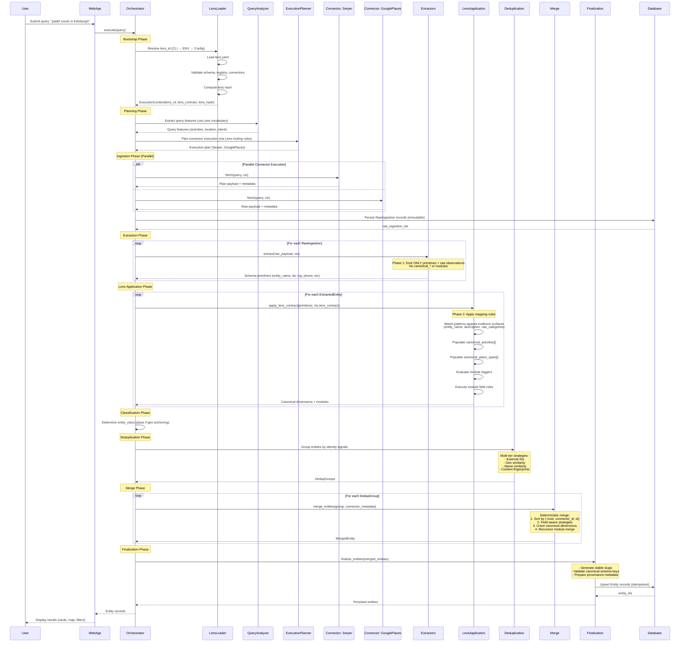
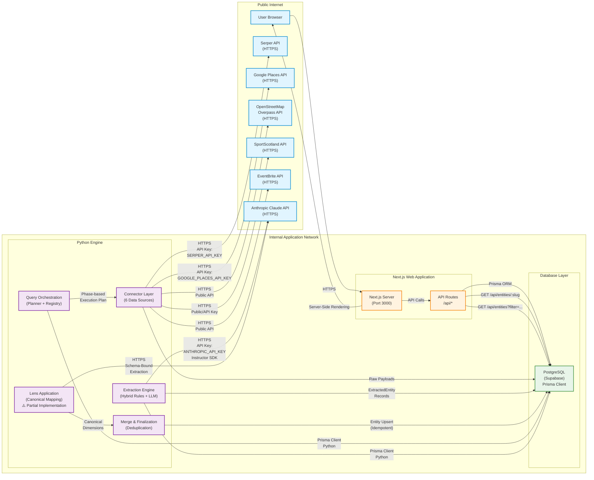

# API Reference

**System:** Universal Entity Extraction Engine
**Generated:** 2026-02-08
**Status:** Production-Ready (Backend CLI), No HTTP API (Yet)

## Overview

The Universal Entity Extraction Engine provides programmatic access through **CLI interfaces** for orchestrated query execution, raw data ingestion, and extraction maintenance. The system currently operates as a backend pipeline with no REST/HTTP API layer - all interactions occur via command-line tools that persist results to PostgreSQL for frontend consumption.

**Key Characteristics:**
- **Domain-Blind Execution:** Engine contains zero vertical-specific logic
- **Lens-Driven Behavior:** All semantics loaded from YAML configurations
- **Idempotent Operations:** Re-running same query converges to identical outputs
- **Immutable Raw Data:** RawIngestion records never modified after persistence

## Architecture Context



## Network Architecture



## CLI Interfaces

### 1. Orchestration CLI

**Purpose:** Execute intelligent multi-source queries with lens-driven planning, extraction, deduplication, and persistence.

**Module:** `engine.orchestration.cli`

**Usage:**
```bash
python -m engine.orchestration.cli run "padel courts in Edinburgh"
```

#### Commands

##### `run` - Execute Orchestrated Query

Bootstraps lens configuration, analyzes query intent, plans connector execution, fetches raw data, extracts structured entities, applies lens semantics, deduplicates, merges, and optionally persists to database.

**Syntax:**
```bash
python -m engine.orchestration.cli run [OPTIONS] QUERY
```

**Arguments:**
- `QUERY` (required): Natural language search query

**Options:**
- `--mode {discover_many|resolve_one}` - Ingestion mode (default: `discover_many`)
  - `discover_many`: Broad search optimized for quantity
  - `resolve_one`: Precise search for single entity
- `--persist` - Persist finalized entities to database (default: False)
- `--lens LENS_ID` - Override lens ID (default: from `LENS_ID` env variable)
- `--allow-default-lens` - Allow fallback to `edinburgh_finds` for dev/test (default: False)

**Environment Variables:**
- `LENS_ID` - Default lens identifier (e.g., `edinburgh_finds`)
- `ANTHROPIC_API_KEY` - Anthropic Claude API key for LLM extraction
- `SERPER_API_KEY` - Serper API key (if connector enabled)
- `GOOGLE_PLACES_API_KEY` - Google Places API key (if connector enabled)

**Examples:**
```bash
# Basic query (no persistence)
python -m engine.orchestration.cli run "tennis clubs in Edinburgh"

# With persistence to database
python -m engine.orchestration.cli run --persist "padel courts near Leith"

# With explicit lens override
python -m engine.orchestration.cli run --lens edinburgh_finds "wine bars"

# Resolve single entity
python -m engine.orchestration.cli run --mode resolve_one "The Padel Club Edinburgh"

# Dev/test with default lens fallback
python -m engine.orchestration.cli run --allow-default-lens "restaurants"
```

**Output Format:**

Structured report with ANSI color formatting:

```
================================================================================
INTELLIGENT INGESTION ORCHESTRATION REPORT
================================================================================

Query: padel courts in Edinburgh

Summary:
  Candidates Found:    24
  Accepted Entities:   18
  Duplicates Removed:  6
  Persisted to DB:     18

Warnings:
  Lens Application Phase 2 not fully implemented - canonical_* arrays empty

Extraction Pipeline:
  18/18 entities extracted successfully

Connector Metrics:
--------------------------------------------------------------------------------
Connector            Status          Time (ms)    Candidates   Cost (USD)
--------------------------------------------------------------------------------
serper               ✓ SUCCESS       1245         12           0.0050
google_places        ✓ SUCCESS       2356         12           0.0100

================================================================================
```

**Exit Codes:**
- `0` - Success
- `1` - Error (lens validation failure, connector errors, database errors)

---

### 2. Ingestion CLI

**Purpose:** Run individual data source connectors directly for raw data fetching and storage.

**Module:** `engine.ingestion.cli`

**Usage:**
```bash
python -m engine.ingestion.cli CONNECTOR QUERY
```

#### Commands

##### Connector Execution

Execute a single connector to fetch and persist raw data.

**Syntax:**
```bash
python -m engine.ingestion.cli [OPTIONS] CONNECTOR QUERY
```

**Arguments:**
- `CONNECTOR` (required): Connector name (see Available Connectors below)
- `QUERY` (required): Search query string

**Options:**
- `-v, --verbose` - Enable verbose output with debugging information

**Available Connectors:**
- `serper` - Serper search API (web search aggregator)
- `google_places` - Google Places API (location database)
- `openstreetmap` - OpenStreetMap Overpass API (community-maintained geodata)
- `open_charge_map` - OpenChargeMap API (EV charging stations)
- `sport_scotland` - Sport Scotland API (sports facilities)
- `edinburgh_council` - Edinburgh Council Open Data (government datasets)

**Examples:**
```bash
# Basic connector execution
python -m engine.ingestion.cli serper "padel edinburgh"

# With verbose output
python -m engine.ingestion.cli -v google_places "tennis courts Edinburgh"

# Multiple connectors for same query (run separately)
python -m engine.ingestion.cli openstreetmap "sport=padel"
python -m engine.ingestion.cli sport_scotland "padel"
```

**Output Format:**
```
================================================================================
Running serper connector
Query: padel edinburgh
Time: 2026-02-08 14:23:45
================================================================================

[1/5] Initializing serper connector...
  ✓ Connector: serper
  ✓ Base URL: https://google.serper.dev/search

[2/5] Connecting to database...
  ✓ Database connected

[3/5] Fetching data from serper...
  ✓ Fetched 10 results

[4/5] Checking for duplicates...
  - Content hash: 8a3f2b9e1c7d4e6f...
  - Is duplicate: False

[5/5] Saving data...
  ✓ Data saved successfully
  ✓ File: /path/to/data/raw/serper/20260208_142345_abc123.json
  ✓ Results: 10

================================================================================
✓ Success!
================================================================================
```

##### `--list` - List Available Connectors

Display all registered connectors with metadata.

**Syntax:**
```bash
python -m engine.ingestion.cli --list
```

**Output:**
```
Available connectors:

  • serper
    URL: https://google.serper.dev/search

  • google_places
    URL: https://places.googleapis.com/v1/places

  • openstreetmap
    URL: https://overpass-api.de/api/interpreter

  [...]
```

##### `status` - Display Ingestion Statistics

Show comprehensive statistics from database.

**Syntax:**
```bash
python -m engine.ingestion.cli status
# OR
python -m engine.ingestion.cli --status
```

**Output:**
```
================================================================================
Ingestion Status Report
================================================================================

OVERVIEW
  Total Records:    156
  Successful:       148 (94.9%)
  Failed:           8

BY SOURCE
  serper                  64 ( 41.0%)
  google_places           58 ( 37.2%)
  openstreetmap           24 ( 15.4%)
  sport_scotland          10 (  6.4%)

BY STATUS
  success                148 ( 94.9%)
  failed                   8 (  5.1%)

RECENT INGESTIONS (Last 10)
  ✓ 2026-02-08 14:23:45  serper                success
  ✓ 2026-02-08 14:20:12  google_places         success
  [...]

FAILED INGESTIONS (Last 10)
  ✗ 2026-02-07 09:15:23  sport_scotland
    URL: https://api.sportscotland.org.uk/facilities?query=padel

================================================================================
```

---

### 3. Extraction CLI

**Purpose:** Maintenance tasks for extraction pipeline (retry failed extractions from quarantine).

**Module:** `engine.extraction.cli`

**Usage:**
```bash
python -m engine.extraction.cli --retry-failed
```

#### Commands

##### `--retry-failed` - Retry Failed Extractions

Re-process entities in quarantine (failed extraction attempts) with configurable retry limits.

**Syntax:**
```bash
python -m engine.extraction.cli --retry-failed [OPTIONS]
```

**Options:**
- `--max-retries N` - Maximum failed retries before skipping (default: 3)
- `--limit N` - Limit number of records to retry (optional)

**Examples:**
```bash
# Retry all failed extractions (up to 3 attempts each)
python -m engine.extraction.cli --retry-failed

# Custom retry limit
python -m engine.extraction.cli --retry-failed --max-retries 5

# Process only first 10 failed records
python -m engine.extraction.cli --retry-failed --limit 10

# Combination
python -m engine.extraction.cli --retry-failed --max-retries 5 --limit 20
```

**Output Format:**
```
Retry Summary
  Retried:   12
  Succeeded: 9
  Failed:    3
```

**Exit Codes:**
- `0` - Success (no failures after retry)
- `1` - Partial success (some records still failed) or database error

---

## Frontend API Routes (Read-Only)

The Next.js frontend consumes finalized entities from PostgreSQL via Prisma ORM. No frontend API routes currently exist - data access occurs via server-side Prisma queries.

**Planned Routes (Not Yet Implemented):**
- `GET /api/entities/:slug` - Fetch single entity by URL slug
- `GET /api/entities` - List entities with filters (location, activities, etc.)
- `GET /api/search` - Fuzzy search across entity names and descriptions

---

## Error Handling

### Lens Validation Errors

**Symptom:** CLI exits immediately after lens loading attempt

**Cause:** Invalid lens.yaml configuration (missing required fields, invalid canonical registry references, malformed YAML syntax)

**Example:**
```
ERROR: Lens validation failed: Missing required field 'vocabulary' in lens.yaml
```

**Resolution:**
1. Verify lens file exists at `engine/lenses/<lens_id>/lens.yaml`
2. Validate YAML syntax (use online validator)
3. Check against lens schema in `docs/target/system-vision.md` Section 5

---

### Connector Failures

**Symptom:** Connector marked as FAILED in orchestration report with error message

**Common Causes:**
- Missing API keys (e.g., `SERPER_API_KEY`, `GOOGLE_PLACES_API_KEY`)
- Network timeout or rate limiting
- Invalid API credentials
- External service downtime

**Example Output:**
```
Connector Metrics:
--------------------------------------------------------------------------------
Connector            Status          Time (ms)    Candidates   Cost (USD)
--------------------------------------------------------------------------------
serper               ✗ FAILED        245          N/A          N/A
  Error: API key missing or invalid

Errors:
  [serper] HTTP 401: Unauthorized - check SERPER_API_KEY environment variable
```

**Resolution:**
1. Verify API keys are set in environment variables
2. Test API credentials with direct HTTP request
3. Check connector-specific logs in `engine/data/raw/`
4. Review connector rate limits and quotas

---

### Extraction Failures

**Symptom:** Entities moved to quarantine, extraction pipeline shows failures

**Common Causes:**
- Unexpected raw data format (schema drift from upstream API)
- LLM extraction timeout or rate limit
- Missing required fields in raw payload
- Pydantic validation errors

**Example Output:**
```
Extraction Pipeline:
  15/18 entities extracted successfully

  Extraction Failures:
    [serper] The Padel Club: Missing required field 'entity_name'
    [google_places] Tennis Court XYZ: LLM timeout after 30s
    [openstreetmap] Unknown Place: Validation error - invalid latitude
```

**Resolution:**
1. Inspect quarantine records in database (`ExtractedEntity` table, `status='quarantine'`)
2. Review raw ingestion payload for problematic records
3. Use `python -m engine.extraction.cli --retry-failed` after fixes
4. Update extractors if upstream API schema changed

---

### Database Connection Errors

**Symptom:** CLI exits with database connection failure

**Cause:** Invalid `DATABASE_URL`, network issues, Supabase downtime

**Example:**
```
Database connection failed: could not connect to server: Connection refused
```

**Resolution:**
1. Verify `DATABASE_URL` in `.env` file
2. Test connection with `psql $DATABASE_URL`
3. Check Supabase project status
4. Verify network/firewall rules allow PostgreSQL port (5432)

---

## Rate Limits

### External APIs

Connector-specific rate limits:

| Connector         | Rate Limit           | Cost Model          | Retry Strategy        |
|-------------------|----------------------|---------------------|-----------------------|
| Serper            | 1000 req/day (free)  | $0.005/query        | Exponential backoff   |
| Google Places     | 500 req/day (free)   | $0.01/query         | Exponential backoff   |
| OpenStreetMap     | No official limit    | Free                | Polite 1s delay       |
| OpenChargeMap     | No official limit    | Free                | None                  |
| Sport Scotland    | Unknown              | Free                | None                  |
| Edinburgh Council | Unknown              | Free                | None                  |
| Anthropic Claude  | Tier-based           | $0.003/1K tokens    | SDK built-in          |

**Notes:**
- Rate limit enforcement occurs at orchestration layer
- Exceeded limits trigger connector skip with warning
- No automatic quota refill - manual monitoring required

---

## Authentication & Authorization

**Current State:** No authentication or authorization implemented.

**CLI Security:**
- API keys stored in environment variables (`.env` file)
- Never commit `.env` to version control
- Use separate API keys for dev/staging/production

**Frontend Security (Planned):**
- Read-only public access to finalized entities
- No mutation endpoints exposed
- Rate limiting via Next.js middleware (TBD)

---

## Versioning & Compatibility

**Engine Version:** Not yet formally versioned (pre-1.0)

**Schema Compatibility:**
- YAML schemas are single source of truth
- Regenerate Python/Prisma/TypeScript schemas after YAML changes:
  ```bash
  python -m engine.schema.generate --all
  ```
- Database migrations required for schema changes:
  ```bash
  cd web
  npx prisma migrate dev --name describe_change
  ```

**Lens Compatibility:**
- Lens contracts validated at bootstrap time
- Invalid lenses fail fast (exit code 1)
- Lens hash included in ExecutionContext for reproducibility

---

## Performance Considerations

### Query Execution Time

Typical orchestration timeline for `discover_many` mode:

| Phase              | Duration    | Notes                                      |
|--------------------|-------------|--------------------------------------------|
| Lens Bootstrap     | 10-50ms     | One-time per CLI invocation                |
| Query Analysis     | 5-20ms      | Regex-based feature extraction             |
| Planning           | 10-30ms     | Rule matching against lens contracts       |
| Connector Execution| 500-5000ms  | Parallel, varies by connector              |
| Extraction         | 100-2000ms  | LLM calls for unstructured data            |
| Lens Application   | 50-200ms    | Pattern matching for canonical dimensions  |
| Deduplication      | 50-500ms    | Depends on candidate count                 |
| Merge              | 20-100ms    | Deterministic field-aware merge            |
| Finalization       | 100-500ms   | Database upserts (idempotent)              |

**Total:** 1-10 seconds per query (typical 2-3 seconds)

**Optimization Tips:**
- Use `--mode resolve_one` for single entity resolution (fewer connectors)
- Pre-fetch common queries during off-peak hours
- Cache finalized entities in frontend layer

---

## Troubleshooting

### Issue: "Lens file not found"

**Symptom:**
```
ERROR: Lens file not found: engine/lenses/my_lens/lens.yaml
```

**Resolution:**
1. Verify lens directory structure:
   ```
   engine/lenses/<lens_id>/lens.yaml
   ```
2. Check `--lens` argument or `LENS_ID` environment variable spelling
3. Use `--allow-default-lens` for dev/test fallback to `edinburgh_finds`

---

### Issue: "Canonical dimensions empty after extraction"

**Symptom:** Warning in orchestration report:
```
Warnings:
  Lens Application Phase 2 not fully implemented - canonical_* arrays empty
```

**Cause:** Lens application phase (Phase 2) not fully wired to extractors.

**Resolution:** This is a known limitation (see `docs/target/system-vision.md` Section 6.3). Entities are persisted but not fully categorized. Tracking issue: LR-001.

---

### Issue: "Duplicate entities persisted"

**Symptom:** Same entity appears multiple times with different slugs.

**Cause:** Deduplication heuristics failed to match (name variations, geocoding differences).

**Resolution:**
1. Inspect deduplication groups in orchestration report
2. Adjust similarity thresholds in `engine/orchestration/deduplication.py`
3. Add external ID mappings if available
4. Manual cleanup via database if needed

---

## Examples

### Complete Workflow: Query to Display

```bash
# Step 1: Run orchestrated query with persistence
python -m engine.orchestration.cli run --persist "padel courts in Edinburgh"

# Step 2: Frontend fetches entities from database (automatic via SSR)
# Next.js page queries Prisma:
# await prisma.entity.findMany({
#   where: { canonical_activities: { has: "padel" } }
# })

# Step 3: Display results in web UI (http://localhost:3000)
```

---

### Debugging Failed Extraction

```bash
# Step 1: Run query without persistence to see errors
python -m engine.orchestration.cli run "problematic query"

# Step 2: Check quarantine records in database
# SELECT * FROM "ExtractedEntity" WHERE status = 'quarantine'

# Step 3: Retry failed extractions
python -m engine.extraction.cli --retry-failed --max-retries 5

# Step 4: Inspect extraction logs for specific failure
# Review orchestration report "Extraction Failures" section
```

---

### Adding New Vertical

```bash
# Step 1: Create lens configuration
mkdir -p engine/lenses/wine_discovery
nano engine/lenses/wine_discovery/lens.yaml

# Step 2: Validate lens at bootstrap (automatic fail-fast)
python -m engine.orchestration.cli run --lens wine_discovery "wine bars Edinburgh"

# Step 3: No engine code changes required (engine is domain-blind)
# All semantics defined in lens.yaml
```

---

## Future API Development

**Planned REST API (Not Yet Implemented):**

### Entity Retrieval

```http
GET /api/v1/entities/:slug
```

**Response:**
```json
{
  "id": "uuid",
  "slug": "padel-club-edinburgh",
  "entity_name": "The Padel Club Edinburgh",
  "entity_class": "place",
  "canonical_activities": ["padel", "tennis"],
  "canonical_place_types": ["sports_facility"],
  "modules": {
    "core": {...},
    "location": {...},
    "sports_facility": {...}
  }
}
```

---

### Entity Search

```http
GET /api/v1/entities?activity=padel&city=Edinburgh
```

**Query Parameters:**
- `activity` - Filter by canonical_activities array
- `place_type` - Filter by canonical_place_types array
- `city` - Filter by city field
- `limit` - Max results (default: 20)
- `offset` - Pagination offset

**Response:**
```json
{
  "results": [...],
  "total": 42,
  "limit": 20,
  "offset": 0
}
```

---

## Support & References

**Architectural Authority:**
- `docs/target/system-vision.md` - Immutable invariants and lens contract specification
- `docs/target/architecture.md` - Concrete 11-stage pipeline and execution semantics

**Implementation Details:**
- `docs/plans/` - Phase-by-phase implementation plans
- `engine/config/schemas/` - YAML schema definitions (single source of truth)

**Code Documentation:**
- `engine/orchestration/` - Query execution control plane
- `engine/ingestion/` - Connector implementations
- `engine/extraction/` - Hybrid extraction engine (rules + LLM)

**Community:**
- GitHub Issues: [Project Repository Issues](https://github.com/your-org/edinburgh_finds/issues)
- Documentation: This file and referenced architectural documents

---

**Document Status:** Production-Ready
**Last Updated:** 2026-02-08
**Maintainer:** Architecture Team
