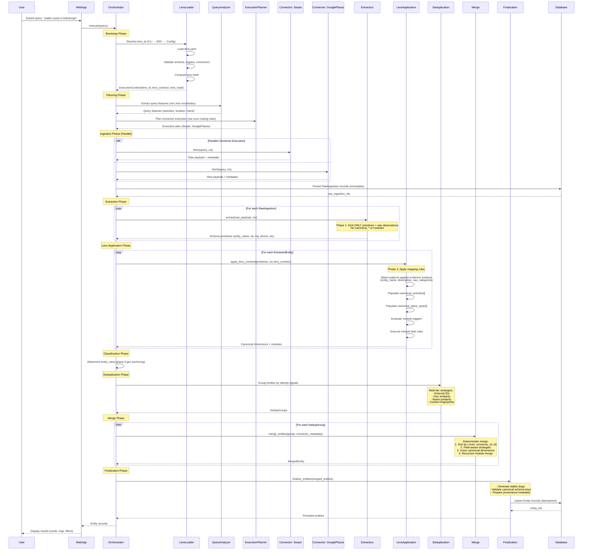
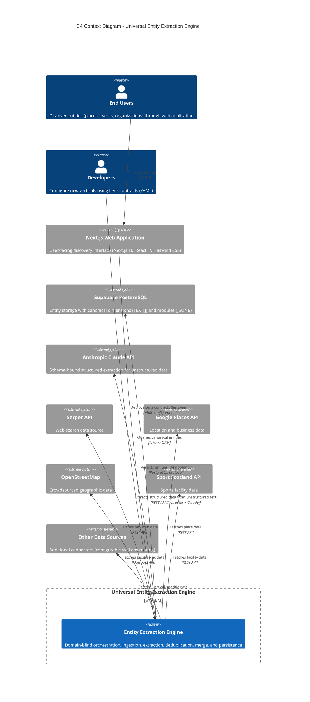
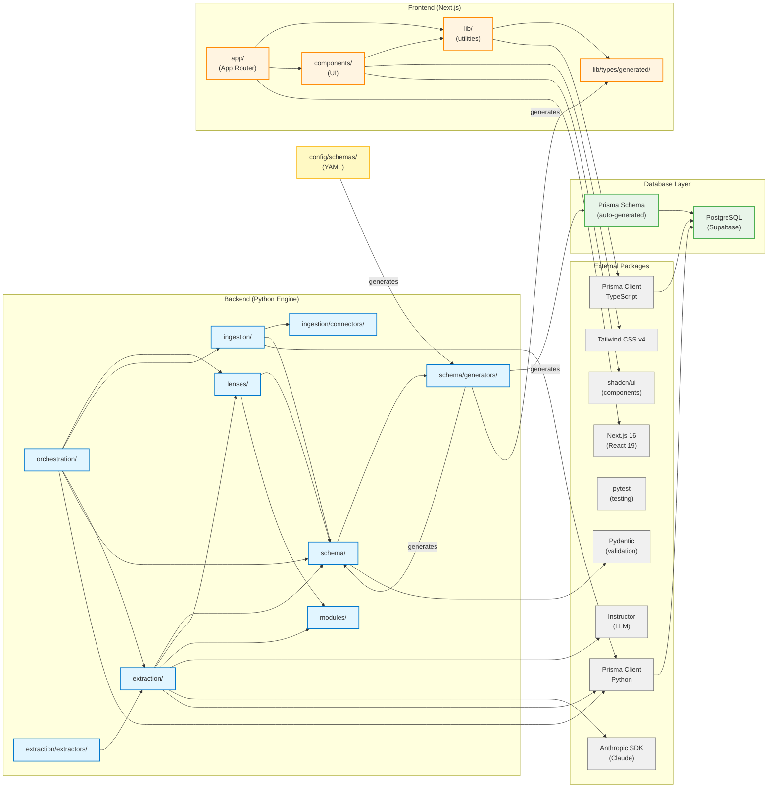

# Architecture Documentation

> **Auto-generated documentation** — Do not edit manually
> **Generated:** 2026-02-08
> **System:** Universal Entity Extraction Engine

---

## Table of Contents

1. [System Overview](#system-overview)
2. [Architectural Layers](#architectural-layers)
3. [Runtime Architecture](#runtime-architecture)
4. [Data Flow Pipeline](#data-flow-pipeline)
5. [Engine-Lens Separation](#engine-lens-separation)
6. [Canonical Data Model](#canonical-data-model)
7. [Module Architecture](#module-architecture)
8. [Extraction Pipeline](#extraction-pipeline)
9. [Multi-Source Merge](#multi-source-merge)
10. [Connector Architecture](#connector-architecture)
11. [Validation and Enforcement](#validation-and-enforcement)
12. [Diagrams](#diagrams)

---

## System Overview

### Mission

The Universal Entity Extraction Engine transforms natural language queries into complete, accurate entity records through AI-powered multi-source orchestration. The system is vertical-agnostic, storing and processing entities using generic classifications, opaque canonical dimensions, and namespaced structured modules.

### Core Principle: Engine vs Lens Separation

The architecture enforces a strict boundary between two layers:

- **Engine** — A universal, domain-blind execution platform responsible for orchestration, extraction, normalization, deduplication, merge, persistence, and lifecycle guarantees. The engine contains zero domain knowledge.

- **Lens** — Pluggable vertical interpretation layers that define all domain semantics, vocabulary, mapping logic, display metadata, and vertical behavior through YAML configuration files.

This separation is absolute and must be preserved over time. Any domain logic in engine code is an architectural defect.

### Design Philosophy

**Universal Structure, Opaque Semantics**

The engine operates on a universal structural model:
- Stable entity identity
- Universal entity classes (place, person, organization, event, thing)
- Fixed canonical dimensions as multi-valued arrays
- Namespaced structured modules for detailed attributes
- Explicit provenance and external identifiers

The engine treats all domain values as opaque identifiers. All semantic meaning, labeling, grouping, and presentation is defined exclusively by lens contracts.

**Determinism and Idempotency**

Given the same inputs and lens contract, the system must always produce identical outputs. Re-running the same query updates existing entities rather than creating duplicates. All processing stages avoid non-deterministic behavior.

**Rich Data Over Shallow Listings**

The system prioritizes completeness and depth of information over superficial coverage. High-quality entities capture quantitative, structured detail through modules, enabling users to understand what an entity actually offers.

---

## Architectural Layers

```mermaid
graph TB
    %% Applications Layer (Top)
    subgraph Applications["<b>APPLICATIONS LAYER</b><br/>(Vertical-Specific)"]
        EF["Edinburgh Finds<br/>(Reference Lens)"]
        Wine["Wine Discovery<br/>(Future)"]
        Rest["Restaurant Finder<br/>(Future)"]
        Events["Events Platform<br/>(Future)"]
    end

    %% Lens Layer
    subgraph LensLayer["<b>LENS LAYER</b><br/>(Domain-Aware Interpretation)"]
        direction TB
        Vocab["<b>Vocabulary</b><br/>• Activity Keywords<br/>• Location Indicators<br/>• Role Keywords"]
        ConnRules["<b>Connector Routing Rules</b><br/>• Priority Triggers<br/>• Phase Assignment<br/>• Budget Control"]
        MapRules["<b>Mapping Rules</b><br/>• Pattern → Canonical<br/>• Confidence Scoring<br/>• Evidence-Based"]
        ModTriggers["<b>Module Triggers</b><br/>• Conditional Attachment<br/>• Domain-Specific Logic"]
        CanonRegistry["<b>Canonical Registry</b><br/>• Display Names<br/>• SEO Slugs<br/>• Icons & Metadata"]
    end

    %% Engine Layer (Domain-Blind Universal Platform)
    subgraph EngineLayer["<b>ENGINE LAYER</b><br/>(Domain-Blind Universal Platform)"]
        direction TB

        subgraph Orch["<b>1. ORCHESTRATION</b>"]
            Planner["Query Planner<br/>(Feature Detection)"]
            ConnRouter["Connector Router<br/>(Execution Plan)"]
            BudgetMgr["Budget Manager<br/>(Rate Limits)"]
        end

        subgraph Ingest["<b>2. INGESTION</b>"]
            Adapters["Connector Adapters<br/>(Interface Bridge)"]
            RawFetch["Raw Data Fetching<br/>(Parallel Execution)"]
            DedupRaw["Ingestion Dedup<br/>(Artifact Identity)"]
        end

        subgraph Extract["<b>3. EXTRACTION</b>"]
            P1Extract["Phase 1: Primitives<br/>(Schema Primitives + Raw Observations)"]
            P2Lens["Phase 2: Lens Application<br/>(Canonical Dimension Population)"]
        end

        subgraph Classification["<b>4. CLASSIFICATION</b>"]
            EntityClass["Entity Class Assignment<br/>(place/person/organization/event/thing)"]
        end

        subgraph Modules["<b>5. MODULE ATTACHMENT</b>"]
            ModuleTrigger["Module Trigger Evaluation<br/>(Lens Contract-Driven)"]
            ModulePopulate["Module Field Population<br/>(Field Rules Engine)"]
        end

        subgraph Dedup["<b>6. DEDUPLICATION & MERGE</b>"]
            CrossDedup["Cross-Source Dedup<br/>(Grouping by Identity)"]
            DetMerge["Deterministic Merge<br/>(Connector-Blind, Metadata-Driven)"]
            Provenance["Provenance Tracking<br/>(Multi-Source)"]
        end

        subgraph Persist["<b>7. PERSISTENCE</b>"]
            Finalizer["Entity Finalizer<br/>(Slug Generation)"]
            Upsert["Idempotent Upsert<br/>(Schema-Aligned)"]
            IndexMgr["Index Manager<br/>(GIN Arrays)"]
        end

        subgraph LensEngine["<b>LENS ENGINE</b><br/>(Configuration Runtime)"]
            LensLoader["Lens Loader<br/>(Bootstrap Only)"]
            LensValidator["Contract Validator<br/>(Fail-Fast)"]
            ExecContext["Execution Context<br/>(Immutable Carrier)"]
        end
    end

    %% Data Storage Layer
    subgraph Storage["<b>DATA STORAGE LAYER</b><br/>(PostgreSQL via Supabase)"]
        direction LR
        RawIngestion["<b>RawIngestion</b><br/>• source<br/>• payload<br/>• hash<br/>• timestamp"]
        ExtractedEntity["<b>ExtractedEntity</b><br/>• primitives<br/>• raw_observations<br/>• confidence"]
        Entity["<b>Entity</b><br/>• entity_class<br/>• canonical_*[]<br/>• modules (JSONB)<br/>• provenance"]
    end

    %% External Sources Layer
    subgraph Sources["<b>EXTERNAL DATA SOURCES</b><br/>(6 Connectors)"]
        direction LR
        Serper["Serper<br/>(Web Search)"]
        GPlaces["Google Places<br/>(Places API)"]
        OSM["OpenStreetMap<br/>(Geo Data)"]
        SportScot["Sport Scotland<br/>(Facilities)"]
        Custom1["Custom Scrapers<br/>(Vertical-Specific)"]
        Future["Future Connectors<br/>(Unlimited)"]
    end

    %% Data Flow Connections
    Applications --> LensLayer
    LensLayer --> Orch

    Orch --> Ingest
    Sources --> RawFetch

    Ingest --> RawIngestion
    RawIngestion --> Extract

    Extract --> Classification
    Classification --> Modules

    LensEngine --> P2Lens
    LensEngine --> ModuleTrigger
    LensEngine --> ModulePopulate

    Modules --> ExtractedEntity
    ExtractedEntity --> Dedup

    Dedup --> Persist
    Persist --> Entity

    %% Key Boundaries
    LensLayer -.->|"Configuration Only<br/>(No Code Changes)"| EngineLayer

    %% Styling
    classDef appLayer fill:#e1f5ff,stroke:#0066cc,stroke-width:2px,color:#000
    classDef lensLayer fill:#fff4e6,stroke:#ff9800,stroke-width:2px,color:#000
    classDef engineLayer fill:#e8f5e9,stroke:#4caf50,stroke-width:2px,color:#000
    classDef storageLayer fill:#f3e5f5,stroke:#9c27b0,stroke-width:2px,color:#000
    classDef sourceLayer fill:#fce4ec,stroke:#e91e63,stroke-width:2px,color:#000

    class Applications appLayer
    class LensLayer lensLayer
    class EngineLayer engineLayer
    class Storage storageLayer
    class Sources sourceLayer
```



### Layer Responsibilities

#### Applications Layer

User-facing applications built on top of the engine. Each application configures a lens to define its vertical domain. Edinburgh Finds is the reference implementation validating the architecture.

#### Lens Layer

Domain-aware interpretation provided through YAML configuration files. Lenses define:
- **Vocabulary** — Activity keywords, location indicators, role keywords for query understanding
- **Connector Routing Rules** — Priority triggers, phase assignment, budget control for intelligent source selection
- **Mapping Rules** — Pattern-based transformation of raw observations into canonical dimensions
- **Module Triggers** — Conditional attachment of domain-specific data structures
- **Canonical Registry** — Display names, SEO slugs, icons, and presentation metadata

#### Engine Layer

Domain-blind universal platform executing a deterministic pipeline:

1. **Orchestration** — Query analysis, connector selection, execution planning
2. **Ingestion** — Parallel data fetching, raw artifact persistence, deduplication
3. **Extraction** — Two-phase extraction (primitives then lens application)
4. **Classification** — Universal entity class determination
5. **Module Attachment** — Conditional module population via lens rules
6. **Deduplication & Merge** — Cross-source grouping and deterministic conflict resolution
7. **Persistence** — Slug generation, idempotent upsert, provenance tracking

#### Data Storage Layer

PostgreSQL database (Supabase) storing three artifact types:
- **RawIngestion** — Immutable raw payloads from connectors
- **ExtractedEntity** — Structured primitives and observations
- **Entity** — Canonical merged entities with dimensions and modules

#### External Sources Layer

Six connectors (Serper, Google Places, OpenStreetMap, Sport Scotland, custom scrapers, future extensions) integrated through a stable interface. Connectors are pluggable and self-describing through registry metadata.

---

## Runtime Architecture

### Execution Model

A single execution processes an input through a strictly ordered pipeline producing immutable artifacts at each stage:

```
Input (Query or Entity ID)
        ↓
Lens Resolution + Validation
        ↓
Planning / Orchestration
        ↓
Connector Execution
        ↓
Raw Ingestion Persistence
        ↓
Source Extraction (Phase 1)
        ↓
Lens Application (Phase 2)
        ↓
Classification + Module Attachment
        ↓
Cross-Source Deduplication
        ↓
Deterministic Merge
        ↓
Finalization + Persistence
```

Each stage:
- Consumes immutable inputs
- Produces immutable outputs
- Performs no hidden mutation of upstream artifacts
- Behaves deterministically over captured inputs

### Artifact Model

| Stage | Artifact | Mutability |
|-------|----------|------------|
| Connector Execution | Raw Payload | Immutable once persisted |
| Raw Ingestion | RawIngestion Record | Immutable |
| Source Extraction | ExtractedEntity | Immutable |
| Deduplication | DedupGroup | Immutable |
| Merge | MergedEntity | Immutable |
| Finalization | Persisted Entity | Mutable only via idempotent upsert |

### Execution Boundaries

**Lens Loading Boundary**
- Lens contracts loaded and validated only during bootstrap
- No runtime component may load, reload, or mutate lens configuration
- Lens contracts enter runtime exclusively through ExecutionContext

**Artifact Boundary**
- Raw payloads persisted before extraction begins
- Extracted entities are immutable inputs to deduplication and merge
- Merged entities are immutable inputs to finalization

**Determinism Boundary**
- External systems (APIs, LLMs) may be probabilistic
- Once captured as raw artifacts, all downstream processing is fully deterministic

**Purity Boundary**
- Engine code contains no domain semantics
- All interpretation flows through lens contracts only

### Statelessness and Reproducibility

Each execution is fully determined by:
- Input query or entity identifier
- Validated lens contract (content hash)
- Connector registry metadata
- Persisted raw artifacts

No hidden global state, implicit defaults, mutable singletons, or runtime mutation is permitted. This enables idempotent re-execution, deterministic replay, auditable provenance, and environment-independent behavior.

---

## Data Flow Pipeline

### 11-Stage Pipeline (Canonical Order)

A single execution progresses through the following stages in strict order:

**1. Input**
- Accept natural-language query or explicit entity identifier

**2. Lens Resolution and Validation**
- Resolve lens_id by precedence (CLI → environment → config → fallback)
- Load lens configuration exactly once at bootstrap
- Validate schema, references, and invariants
- Compute lens hash for reproducibility
- Inject validated lens contract into ExecutionContext

**3. Planning**
- Derive query features deterministically using lens vocabulary
- Select connector execution plan from lens routing rules
- Establish execution phases, budgets, ordering, and constraints

**4. Connector Execution**
- Execute connectors according to plan
- Enforce rate limits, timeouts, and budgets
- Collect raw payloads and connector metadata

**5. Raw Ingestion Persistence**
- Persist raw payload artifacts and metadata (source, timestamp, hash)
- Perform ingestion-level deduplication of identical payloads
- Raw artifacts become immutable inputs for downstream stages

**6. Source Extraction (Phase 1)**
- For each raw artifact, run source-specific extractor
- Extractors emit ONLY schema-aligned universal primitives (entity_name, latitude, street_address, phone, website_url) and raw observations (raw_categories, description, connector-native fields)
- Extractors MUST NOT emit canonical dimensions or modules
- No lens interpretation occurs at this stage

**7. Lens Application (Phase 2)**
- Apply lens mapping rules to populate canonical dimensions
- Evaluate module triggers
- Execute module field rules using generic module extraction engine
- Deterministic rules execute before schema-bound LLM extraction
- Default evidence surfaces: entity_name, summary, description, raw_categories, street_address

**8. Classification**
- Determine entity_class using deterministic universal rules
- A candidate is a place if any geographic anchoring is present (coordinates, street address, city, postcode)

**9. Cross-Source Deduplication Grouping**
- Group extracted entities believed to represent same real-world entity
- Multi-tier strategies: external identifiers, geo similarity, normalized name similarity, content fingerprints

**10. Deterministic Merge**
- Merge each deduplication group into single canonical entity
- Metadata-driven, field-aware deterministic rules
- Inputs pre-sorted by (-trust, connector_id, extracted_entity.id)
- Explicit missingness semantics

**11. Finalization and Persistence**
- Generate stable slugs and derived identifiers
- Upsert merged entities idempotently
- Persist provenance and external identifiers
- Use canonical schema keys only (legacy keys forbidden)

Stages execute in this order without reordering or shortcutting.

### Sequence Diagram



---

## Engine-Lens Separation

### Architectural Boundaries

The system enforces strict separation between engine (universal) and lens (domain-specific) layers.

**Engine Responsibilities:**
- Universal entity classification (place, person, organization, event, thing)
- Storage and indexing of canonical dimensions as opaque values
- Storage and validation of namespaced structured modules
- Deterministic orchestration of ingestion, extraction, deduplication, merging, persistence
- Execution of generic extraction, normalization, and merge logic
- Enforcement of validation gates, determinism guarantees, purity constraints
- Provenance tracking and reproducibility guarantees

**Lens Responsibilities:**
- Domain vocabulary and query interpretation semantics
- Connector routing rules and vertical-specific orchestration intent
- Mapping rules from raw observations to canonical dimension values
- Canonical value registries and display metadata
- Domain module schemas and extraction rules
- Module attachment rules and derived groupings
- Presentation semantics (labels, icons, SEO metadata)

### Lens as Compiled Runtime Contract

A lens is a compiled, deterministic runtime contract fully validated before any execution begins.

**Contract Properties:**
- **Deterministic** — Identical inputs produce identical outputs
- **Fully Validated** — All references, schemas, and rules verified at load time
- **Versioned** — Content hash enables reproducibility and debugging
- **Hashable** — Content-addressable for cache invalidation
- **Test-backed** — Every rule justified by real fixtures

**Lens Loading Lifecycle:**
```
Load lens.yaml from disk
    ↓
Schema validation
    ↓
Canonical registry validation
    ↓
Connector reference validation
    ↓
Identifier uniqueness validation
    ↓
Regex compilation validation
    ↓
Content hash computation
    ↓
Materialize runtime contract
    ↓
Inject into ExecutionContext
```

Any validation failure aborts execution immediately. No partially valid lens is admitted into runtime.

### ExecutionContext Contract

The ExecutionContext is an immutable carrier object passed through the entire runtime pipeline.

**Structure:**
```python
@dataclass(frozen=True)
class ExecutionContext:
    lens_id: str
    lens_contract: dict
    lens_hash: Optional[str]
```

**Properties:**
- Created exactly once during bootstrap
- Never mutated
- Contains only plain serializable data
- Safe for logging, persistence, and replay
- No live loaders, registries, or mutable references

**Context Propagation:**
```
CLI / Bootstrap
    ↓
Planner / Orchestrator
    ↓
Ingestion Coordination
    ↓
Extraction Integration
    ↓
Extractor Implementations
    ↓
Deduplication and Merge Pipelines
```

Direct imports of lens loaders or registries outside bootstrap are forbidden.

### Enforcement Mechanisms

**Import Boundary Tests**
- Engine code must not import lens loaders, registries, or lens packages

**Literal Detection Tests**
- Prevent hardcoded canonical values or domain literals in engine code

**Context Presence Validation**
- Missing or malformed ExecutionContext raises immediate error

**Bootstrap Validation Gates**
- All lens validation must complete before any ingestion or extraction begins

**Runtime Assertions**
- Boundary violations fail fast and surface diagnostics

Violations are treated as architectural defects.

---

## Canonical Data Model

### Universal Entity Schema

All entities conform to a universal schema stable across all verticals:

**Core Structural Components:**
- **Stable entity identity**
- **entity_class** — One of: place, person, organization, event, thing (determined deterministically by engine rules)
- **Canonical dimensions** — Multi-valued arrays of opaque identifiers
- **Namespaced structured modules** — JSON structures for detailed attributes
- **Provenance and external identifiers**

The universal schema is authoritative end-to-end. No permanent translation layers are permitted between pipeline stages or storage layers.

### Canonical Dimensions (Universal Structure)

The engine maintains exactly four canonical dimensions. Adding, removing, or redefining canonical dimensions requires explicit architectural review and amendment to `docs/target/system-vision.md`.

**Structure:**
```
canonical_activities     TEXT[]
canonical_roles          TEXT[]
canonical_place_types    TEXT[]
canonical_access         TEXT[]
```

**Engine Guarantees:**
- Arrays always present (never null)
- Empty array represents absence of observed values
- Values treated as opaque identifiers
- No semantic interpretation in engine code
- No duplicate values within a dimension
- Ordering is stable and deterministic

**Lens Responsibilities:**
- Declare allowed values in canonical registry
- Populate values through mapping rules
- Provide grouping, labeling, and presentation semantics

### Structural Semantics (Engine Perspective Only)

These descriptions are human mnemonics only; the engine must not implement logic depending on these meanings.

**Structural Intent (Not Semantic Meaning):**
- **canonical_activities** — What activities occur
- **canonical_roles** — What functional role the entity serves
- **canonical_place_types** — What physical type a place is
- **canonical_access** — How users engage or access

The engine does not validate semantic correctness of values. Only registry existence and structural integrity are enforced.

### Storage and Indexing Guarantees

Canonical dimensions stored as Postgres text arrays with GIN indexes.

**Storage Guarantees:**
- Efficient containment queries
- Stable deterministic ordering after merge
- No duplicate values persisted
- Arrays always materialized (no nulls)

Indexing strategy is owned by the engine and must not leak semantics.

### Namespaced Modules (Structural Contract)

Modules store structured attributes that do not belong in the universal schema.

**Structural Characteristics:**
- Each module is a top-level namespace inside a JSON structure
- Module schemas defined exclusively by lenses
- Universal modules always available (core, location, contact, hours, amenities, time_range)
- "Always available" means structurally reserved namespaces; lenses still own schemas/fields and all population rules
- Domain modules conditionally attached via lens rules

**Engine Guarantees:**
- Namespaced structure enforcement
- No flattened module fields into universal schema
- No cross-module field collisions
- Structural validation of module payloads where applicable
- No semantic interpretation of module fields

### Module Storage Format

Persisted module payloads follow a stable nested structure.

**Example Shape:**
```json
{
  "modules": {
    "sports_facility": {
      "tennis_courts": {
        "total": 12,
        "indoor": 8,
        "outdoor": 4,
        "surfaces": ["hard_court", "clay"]
      },
      "padel_courts": {
        "total": 3,
        "indoor": 3,
        "covered": true,
        "heated": true
      },
      "booking": {
        "online_booking_available": true,
        "advance_booking_days": 7,
        "booking_url": "https://example.com/book"
      },
      "coaching_available": true,
      "equipment_rental": true
    },
    "amenities": {
      "parking": {
        "available": true,
        "spaces": 50,
        "cost": "free"
      },
      "accessibility": {
        "wheelchair_accessible": true,
        "accessible_parking": true,
        "accessible_changing_rooms": true
      },
      "facilities": ["changing_rooms", "showers", "cafe", "pro_shop"]
    }
  }
}
```

The engine treats module payloads as opaque structured data with only structural validation applied.

### Provenance and External Identifiers

Every entity retains explicit provenance information.

**Provenance Includes:**
- Contributing sources
- Source identifiers
- Extraction timestamps
- Confidence metadata where applicable

**Engine Guarantees:**
- Provenance never silently discarded
- Provenance survives merges deterministically
- Conflicting provenance preserved rather than overwritten

**Provenance Supports:**
- Debugging and traceability
- Trust evaluation and conflict resolution
- Incremental enrichment strategies
- Long-term data quality monitoring

---

## Module Architecture

### Core Principle

Module field extraction is:
- **Declarative** — Rules defined in lens contracts
- **Lens-owned** — All semantics in YAML configuration
- **Schema-driven** — Structured validation
- **Executed by generic engine interpreter** — Domain-blind implementation
- **Fully domain-blind inside engine code** — No module-specific logic

All semantics live exclusively in lens contracts.

### Module Definitions

Each lens defines its domain modules declaratively.

**A Module Definition Includes:**
- Module name
- Human-readable description
- Structured schema (field hierarchy and types)
- Field extraction rules

Modules are namespaced and attached conditionally via module triggers.

**Universal Modules:** Always available
**Domain Modules:** Lens-defined and conditional

The engine validates module structure but does not interpret field meaning.

### Field Rule Structure

Each module declares field_rules describing how values are extracted.

**Representative Structure:**
```yaml
modules:
  sports_facility:
    field_rules:
      - rule_id: extract_pitch_count
        target_path: football_pitches.five_a_side.total
        source_fields: [NumPitches, pitches_total]
        extractor: numeric_parser
        confidence: 0.90
        applicability:
          source: [sport_scotland]
          entity_class: [place]
        normalizers: [round_integer]

      - rule_id: extract_surface_type
        target_path: football_pitches.five_a_side.surface
        source_fields: [Surface, surface_type]
        extractor: regex_capture
        pattern: "(?i)(3G|4G|grass|artificial)"
        confidence: 0.85
        normalizers: [lowercase, list_wrap]
```

**Required Fields:**
- **rule_id** — Unique identifier
- **target_path** — JSON path inside module namespace
- **source_fields** — Raw fields inspected
- **extractor** — Generic extractor type
- **confidence** — Extraction confidence

**Optional Fields:**
- **applicability** — Source and entity constraints
- **normalizers** — Ordered post-processing pipeline
- **conditions** — Conditional execution guards
- **pattern / schema** — Extractor-specific parameters

### Extractor Vocabulary

The engine maintains a small, stable vocabulary of generic extractors.

**Deterministic Extractors:**
- numeric_parser
- regex_capture
- json_path
- boolean_coercion
- coalesce
- normalize
- array_builder
- string_template

These extractors operate only on structure and generic transformation logic. No extractor may encode domain semantics.

**LLM Extractors:**
- llm_structured

**Constraints:**
- Schema-bound only (validated output)
- Evidence anchored where possible
- Deterministic rules always run first
- At most one LLM call per module per payload

Adding new extractor types requires architectural review, purity validation, documentation, and test coverage.

### Execution Semantics

For each entity and each attached module:

1. Select applicable rules based on source and entity_class
2. Execute deterministic rules first
3. Populate fields when values extracted successfully
4. Evaluate conditions for remaining LLM rules
5. Build schema covering only remaining fields
6. Execute single batched LLM call if required
7. Validate and normalize LLM outputs
8. Write results to target paths
9. Do not resolve cross-source conflicts here

Module extraction never mutates raw inputs. Partial population is permitted.

---

## Extraction Pipeline

### Boundary Contracts

The extraction stage is split into two explicit phases with a hard contract.

### Phase 1 — Source Extraction (Connector Adapters)

**Contract:**
```
extractor.extract(raw_payload, ctx) → primitives + raw_observations
```

**Outputs Limited To:**
- Schema primitives (entity_name, latitude, street_address, phone, website_url)
- Raw observations required for downstream interpretation (raw_categories, description, connector-native fields)

**Forbidden Outputs:**
- Any canonical_* dimensions
- Any modules or module fields
- Any lens-derived interpretation or domain semantics

Source extractors must remain strictly domain-blind.

### Phase 2 — Lens Application (Engine-Owned Interpreters)

**Contract:**
```
apply_lens_contract(primitives, ctx.lens_contract) → canonical_* + modules
```

**This Phase:**
- Applies mapping rules
- Evaluates module triggers
- Executes module field rules
- Enforces deterministic ordering and validation
- Remains domain-blind and metadata-driven

### Why This Contract Exists

- Makes extractor purity mechanically testable
- Prevents vertical semantics leaking into extractor implementations
- Centralizes interpretation logic for auditability and evolution
- Prevents contributors from treating extractors as semantic layers

### Mapping Rule Execution Semantics

The engine executes mapping rules generically and deterministically.

**Execution Guarantees:**
- Rules execute over union of declared source_fields
- When source_fields omitted, engine searches all available text fields (entity_name, description, raw_categories, summary, street_address)
- First match wins per rule
- Multiple rules may contribute to same dimension
- Duplicate values deduplicated
- Ordering stabilized deterministically
- Confidence metadata preserved for merge and provenance

Mapping never mutates raw inputs. Mapping produces only canonical dimension values.

### Evidence-Driven Vocabulary Expansion

Canonical values and mapping rules must be justified by observed real data.

**Requirements:**
- Every new rule must reference real raw payload fixture
- Fixtures must be recorded from actual connector responses
- Rules without evidence are forbidden
- Speculative taxonomy expansion is prohibited

**Expansion Workflow:**
```
Capture real payload
    ↓
Create fixture
    ↓
Add canonical value to registry
    ↓
Add mapping rule
    ↓
Add validation test
    ↓
Commit together
```

This preserves correctness and prevents drift.

---

## Multi-Source Merge

### Core Principle

Multi-source merge is:
- **Deterministic** — Identical inputs produce identical outputs
- **Field-aware** — Different strategies for different field types
- **Metadata-driven** — Trust and confidence from connector registry
- **Domain-blind** — No connector names or domain logic in merge
- **Idempotent** — Repeated execution converges to stable state

**Normative Merge Requirements:**
- Missingness definition must be explicit and shared across all merge strategies
- Inputs must be pre-sorted by (-trust, connector_id, extracted_entity.id) before field-level merge logic executes

### Trust Model (Metadata-Driven)

Trust expressed through connector registry metadata.

**Representative Attributes:**
- **trust_tier** — high | medium | low
- **default_priority** — Lower value wins

Merge logic consumes metadata values only. Connector names must never appear in merge logic.

### Field-Group Merge Strategies

Different field classes use different deterministic strategies.

**Identity and Display Fields** (entity_name, summary, address fields):
- Prefer higher trust_tier unless empty or unusable
- Prefer more complete values deterministically
- Tie-break by default_priority then lexicographic stable source identifier (e.g., connector_id)

**Geo Fields** (latitude, longitude):
- Prefer explicit precision metadata if available
- Else higher trust_tier
- Else greater decimal precision
- Never compute centroids
- Tie-break by priority then lexicographic stable source identifier

**Contact and Presence Fields** (phone, email, website_url, social URLs):
- Deterministic quality scoring based on structure only
- Allow higher-quality crowdsourced values to win over sparse official values
- Tie-break by quality → trust → priority → lexicographic stable source identifier
- Quality scoring never uses external validation or network calls

**Canonical Dimension Arrays** (canonical_activities, canonical_roles, canonical_place_types, canonical_access):
- Union all values
- Normalize values
- Deduplicate
- Lexicographically sort
- No weighting or ranking

**Modules JSON Structures:**
- Recursive merge algorithm
- Object vs object → recursive merge
- Array vs array:
  - Scalar arrays → concatenate, deduplicate, sort
  - Object arrays → select wholesale from winning source
- Type mismatch → higher trust wins wholesale
- Per-leaf selection: trust → confidence (if present) → completeness
- Confidence normalized to 0.0–1.0 when present

**Provenance and External Identifiers:**
- Always union
- Never overwrite
- Track all contributors
- Determine primary source via trust metadata

### Deterministic Tie-Break Cascade

When conflicts remain:

1. trust_tier
2. quality score (if applicable)
3. confidence (if applicable)
4. completeness
5. default_priority
6. lexicographic stable source identifier (e.g., connector_id)

All merges must resolve deterministically.

### Idempotency Guarantees

Given identical inputs:
- Merge output must be identical across runs
- Ordering must remain stable
- No randomness or iteration-order dependence permitted

Repeated execution converges to stable state.

---

## Connector Architecture

### Connector Interface Contract

All connectors implement a common abstract interface.

**Representative Responsibilities:**
- Fetch raw data from external source
- Detect ingestion-level duplicates
- Return raw payloads and connector metadata to engine for persistence as immutable raw artifacts

**Interface Shape:**
```python
class BaseConnector(ABC):
    async def fetch(self, query: str) -> RawData
    async def is_duplicate(self, data: RawData) -> bool
```

Raw artifact persistence owned by engine ingestion stage; connectors must not directly write canonical entities.

The interface is intentionally minimal and domain-blind.

### Connector Registry Metadata

Each connector registers a ConnectorSpec with metadata.

**Representative Attributes:**
- **name**
- **cost_tier** — free | paid | premium
- **trust_tier** — high | medium | low
- **default_priority** — Deterministic tie-breaker
- **phase** — discovery | enrichment
- **timeout_seconds**
- **rate_limit**
- **capabilities**

Registry metadata consumed generically by orchestration and merge. No connector-specific logic may appear outside connector implementations.

### Pluggable Integration Model

Adding a connector requires:

1. Implementing BaseConnector interface
2. Registering metadata in connector registry
3. Referencing connector from lens routing rules

No orchestration changes required.

### Horizontal and Vertical Scaling

**Horizontal Scaling (New Verticals):**
- New verticals introduce specialized connectors via lens configuration
- Engine code remains unchanged

**Vertical Enrichment (Existing Verticals):**
- Existing verticals continuously add enrichment connectors
- Orchestration adapts automatically based on metadata and lens routing rules

### Cross-Vertical Reuse

Some connectors may serve multiple lenses. Each lens configures routing behavior independently. The engine does not couple connectors to any vertical.

---

## Validation and Enforcement

### Validation Layers

Validation operates at multiple layers.

**Design-Time Validation:**
- Lens schema validation
- Canonical registry integrity
- Connector reference validation
- Module schema validation
- Rule structure validation
- Extractor vocabulary validation

Failures block merge to main branch.

**Bootstrap Validation:**
- Lens loading validation
- Regex compilation
- Registry integrity
- Connector registry resolution
- Module schema validation

Failures abort execution immediately.

**Runtime Validation:**
- ExecutionContext presence
- Schema primitive validation
- Field naming validation
- Extraction boundary enforcement
- Merge contract enforcement
- Finalization enforces canonical schema keys only
- Legacy keys (e.g., location_lat) forbidden

Runtime validation may fail fast or degrade gracefully depending on severity.

**Persistence Validation:**
- Schema conformity
- Referential integrity
- Idempotency constraints
- Index consistency

Persistence failures abort execution.

### Fail-Fast vs Graceful Degradation

**Fail-Fast Conditions:**
- Invalid lens schema or registry
- Missing connector references
- Schema violations
- Contract boundary violations
- Corrupt module schemas

Execution aborts immediately.

**Graceful Degradation Conditions:**
- Individual rule failures
- Partial connector failures
- LLM extraction failures
- Non-critical normalization errors

Execution continues with partial results and explicit logging.

### Data Integrity Guarantees

The system guarantees:
- No silent data loss
- No silent fallback behavior
- No implicit defaults
- No hidden mutation of artifacts
- Deterministic output over captured inputs
- Idempotent persistence

Violations are treated as defects.

### Observability and Auditability

The system must expose sufficient telemetry to support:
- Traceability of field origins
- Rule execution visibility
- Connector performance analysis
- Merge decision auditing
- Regression detection

**Minimum Artifacts:**
- Execution identifier
- Lens hash
- Artifact identifiers
- Connector metrics
- Validation events

---

## Diagrams

### C4 Context Diagram



### Dependency Graph



---

## Summary

The Universal Entity Extraction Engine provides a deterministic, vertical-agnostic platform for transforming natural language queries into complete, accurate entity records. The strict separation between engine (universal structure) and lens (domain semantics) enables unlimited vertical scaling without engine code changes.

**Key Architectural Principles:**
- **Engine Purity** — Zero domain knowledge in engine code
- **Lens Ownership** — All semantics in YAML configuration
- **Determinism** — Identical inputs produce identical outputs
- **Idempotency** — Re-execution updates rather than duplicates
- **Fail-Fast Validation** — Invalid contracts abort at bootstrap
- **Schema Authority** — YAML schemas are single source of truth

**Validation Gates:**
- One Perfect Entity (OPE) end-to-end proof required
- Multi-source merge validation required
- All canonical dimensions populated where evidence exists
- At least one module field populated
- Provenance preserved

The architecture supports hundreds of connectors, multiple simultaneous verticals, and deterministic conflict resolution while maintaining engine purity and long-term maintainability.

---

**Document Status:** Auto-generated from architectural sources
**Last Updated:** 2026-02-08
**Version:** 1.0
