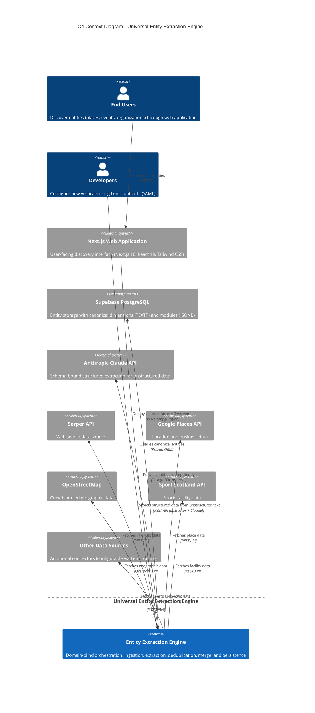
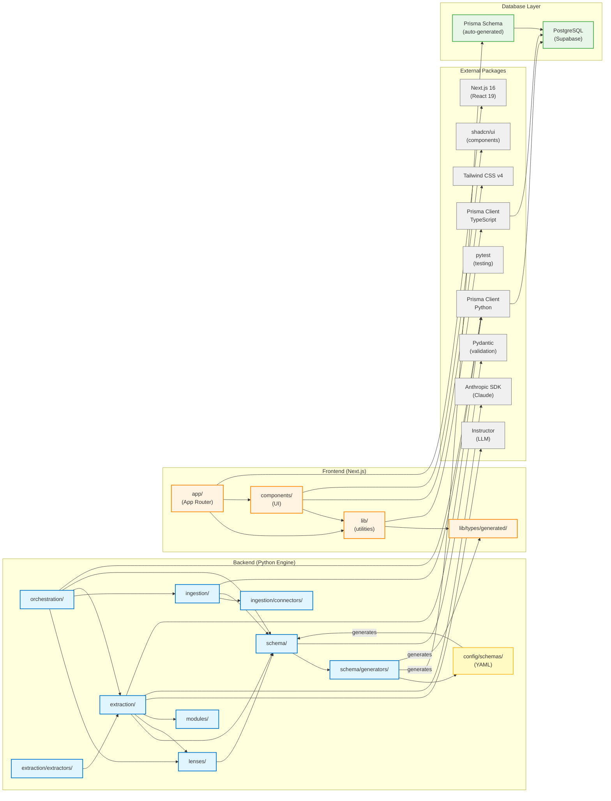

# System Architecture — Universal Entity Extraction Engine

**Project:** Edinburgh Finds
**System:** Universal Entity Extraction Engine
**Generated:** 2026-02-08
**Status:** Living Documentation

---

## Table of Contents

1. [Overview](#1-overview)
2. [Architectural Layers](#2-architectural-layers)
3. [10 Immutable Invariants](#3-10-immutable-invariants)
4. [Engine Subsystems](#4-engine-subsystems)
5. [Data Pipeline (11 Stages)](#5-data-pipeline-11-stages)
6. [System Boundaries (C4 Context)](#6-system-boundaries-c4-context)
7. [Module Dependencies](#7-module-dependencies)
8. [Lens System](#8-lens-system)
9. [Data Model](#9-data-model)
10. [Determinism & Idempotency](#10-determinism--idempotency)
11. [Extensibility](#11-extensibility)

---

## 1. Overview

### System Purpose

The **Universal Entity Extraction Engine** is a vertical-agnostic entity discovery platform that transforms natural language queries into complete, structured entity records through AI-powered multi-source orchestration.

Unlike traditional domain-specific scrapers or single-vertical platforms, this engine operates as a horizontal infrastructure layer that can serve unlimited verticals (sports discovery, wine discovery, restaurants, events, etc.) without requiring engine code changes.

### Core Principle: Engine vs Lens Separation

The architecture enforces a strict separation between:

- **Engine Layer (Domain-Blind)** — A universal execution platform that orchestrates ingestion, extraction, normalization, deduplication, merge, and persistence. The engine contains zero domain knowledge and operates only on generic structures and opaque values.

- **Lens Layer (Domain-Aware)** — Pluggable vertical interpretation contracts that define all semantics: vocabulary, mapping rules, canonical registries, module schemas, routing behavior, and display metadata.

This separation is absolute and must be preserved over time. The engine never interprets the meaning of domain values; it operates solely on structure, metadata, and generic contracts.

### Reference Application

**Edinburgh Finds** is the first reference lens and application built on the engine. It validates the architecture by demonstrating:

- Discovery of sports facilities (padel courts, tennis clubs, etc.) in Edinburgh
- Multi-source data aggregation (Serper, Google Places, OpenStreetMap, Sport Scotland)
- Rich entity records with canonical dimensions and domain modules
- End-to-end proof of architectural purity (no domain semantics in engine code)

Edinburgh Finds exists to validate the engine, not to define or constrain it. The engine remains independently valuable without any specific vertical.

### Key Architectural Guarantees

1. **Zero Engine Changes for New Verticals** — Adding wine discovery, restaurant finder, or events platform requires only a new Lens YAML configuration file.

2. **Determinism and Idempotency** — Given the same inputs and lens contract, the system always produces identical outputs. Re-running queries updates entities rather than creating duplicates.

3. **Rich Data Over Shallow Listings** — The system captures structured modules (court counts, surface types, booking details, amenities) rather than commodity listing data (name, address, phone).

4. **Multi-Source Intelligence** — Entities merge data from multiple independent sources with deterministic conflict resolution driven by trust metadata.

5. **Reality-Based Validation** — System correctness is measured by inspecting the entity database, not by test coverage alone. The persisted entity data is the ultimate validation signal.

### Tech Stack Summary

| Layer | Technology |
|-------|-----------|
| **Backend (Engine)** | Python 3.x, Pydantic, Instructor + Anthropic Claude, Prisma Client Python, pytest |
| **Frontend (Web)** | Next.js 16 (React 19), Tailwind CSS v4, shadcn/ui, TypeScript, Prisma 7.3+ |
| **Database** | Supabase PostgreSQL with GIN indexes (TEXT[] arrays) and JSONB modules |
| **Schema Generation** | YAML → Python FieldSpecs → Prisma → TypeScript (single source of truth) |

### Document Authority

This document operationalizes the immutable architectural intent defined in `docs/target/system-vision.md`. For any architectural decision or boundary enforcement question, consult the System Vision first.

## 2. Architectural Layers

The system is composed of three strictly separated layers: Applications, Lens Layer, and Engine Layer. This architecture enables unlimited vertical scaling without modifying core engine code.

```mermaid
graph TB
    %% Applications Layer (Top)
    subgraph Applications["<b>APPLICATIONS LAYER</b><br/>(Vertical-Specific)"]
        EF["Edinburgh Finds<br/>(Reference Lens)"]
        Wine["Wine Discovery<br/>(Future)"]
        Rest["Restaurant Finder<br/>(Future)"]
        Events["Events Platform<br/>(Future)"]
    end

    %% Lens Layer
    subgraph LensLayer["<b>LENS LAYER</b><br/>(Domain-Aware Interpretation)"]
        direction TB
        Vocab["<b>Vocabulary</b><br/>• Activity Keywords<br/>• Location Indicators<br/>• Role Keywords"]
        ConnRules["<b>Connector Routing Rules</b><br/>• Priority Triggers<br/>• Phase Assignment<br/>• Budget Control"]
        MapRules["<b>Mapping Rules</b><br/>• Pattern → Canonical<br/>• Confidence Scoring<br/>• Evidence-Based"]
        ModTriggers["<b>Module Triggers</b><br/>• Conditional Attachment<br/>• Domain-Specific Logic"]
        CanonRegistry["<b>Canonical Registry</b><br/>• Display Names<br/>• SEO Slugs<br/>• Icons & Metadata"]
    end

    %% Engine Layer (6 Subsystems)
    subgraph EngineLayer["<b>ENGINE LAYER</b><br/>(Domain-Blind Universal Platform)"]
        direction TB

        subgraph Orch["<b>1. ORCHESTRATION</b>"]
            Planner["Query Planner<br/>(Feature Detection)"]
            ConnRouter["Connector Router<br/>(Execution Plan)"]
            BudgetMgr["Budget Manager<br/>(Rate Limits)"]
        end

        subgraph Ingest["<b>2. INGESTION</b>"]
            Adapters["Connector Adapters<br/>(Interface Bridge)"]
            RawFetch["Raw Data Fetching<br/>(Parallel Execution)"]
            DedupRaw["Ingestion Dedup<br/>(Artifact Identity)"]
        end

        subgraph Extract["<b>3. EXTRACTION</b>"]
            P1Extract["Phase 1: Source Extraction<br/>(Primitives Only)"]
            P2Lens["Phase 2: Lens Application<br/>(Canonical Population)"]
            ModExtract["Module Extraction<br/>(Field Rules Engine)"]
        end

        subgraph LensEngine["<b>4. LENSES</b>"]
            LensLoader["Lens Loader<br/>(Bootstrap Only)"]
            LensValidator["Contract Validator<br/>(Fail-Fast)"]
            ExecContext["Execution Context<br/>(Immutable Carrier)"]
        end

        subgraph Dedup["<b>5. DEDUPLICATION & MERGE</b>"]
            CrossDedup["Cross-Source Dedup<br/>(Grouping)"]
            DetMerge["Deterministic Merge<br/>(Metadata-Driven)"]
            Provenance["Provenance Tracking<br/>(Multi-Source)"]
        end

        subgraph Persist["<b>6. PERSISTENCE</b>"]
            Finalizer["Entity Finalizer<br/>(Slug Generation)"]
            Upsert["Idempotent Upsert<br/>(Schema-Aligned)"]
            IndexMgr["Index Manager<br/>(GIN Arrays)"]
        end
    end

    %% Data Storage Layer
    subgraph Storage["<b>DATA STORAGE LAYER</b><br/>(PostgreSQL via Supabase)"]
        direction LR
        RawIngestion["<b>RawIngestion</b><br/>• source<br/>• payload<br/>• hash<br/>• timestamp"]
        ExtractedEntity["<b>ExtractedEntity</b><br/>• primitives<br/>• raw_observations<br/>• confidence"]
        Entity["<b>Entity</b><br/>• entity_class<br/>• canonical_*[]<br/>• modules (JSONB)<br/>• provenance"]
    end

    %% External Sources Layer
    subgraph Sources["<b>EXTERNAL DATA SOURCES</b><br/>(6 Connectors)"]
        direction LR
        Serper["Serper<br/>(Web Search)"]
        GPlaces["Google Places<br/>(Places API)"]
        OSM["OpenStreetMap<br/>(Geo Data)"]
        SportScot["Sport Scotland<br/>(Facilities)"]
        Custom1["Custom Scrapers<br/>(Vertical-Specific)"]
        Future["Future Connectors<br/>(Unlimited)"]
    end

    %% Data Flow Connections
    Applications --> LensLayer
    LensLayer --> Orch

    Orch --> Ingest
    Sources --> RawFetch

    Ingest --> RawIngestion
    RawIngestion --> Extract

    Extract --> ExtractedEntity
    ExtractedEntity --> Dedup

    LensEngine --> P2Lens
    LensEngine --> ModExtract

    Dedup --> Persist
    Persist --> Entity

    %% Key Boundaries
    LensLayer -.->|"Configuration Only<br/>(No Code Changes)"| EngineLayer

    %% Styling
    classDef appLayer fill:#e1f5ff,stroke:#0066cc,stroke-width:2px,color:#000
    classDef lensLayer fill:#fff4e6,stroke:#ff9800,stroke-width:2px,color:#000
    classDef engineLayer fill:#e8f5e9,stroke:#4caf50,stroke-width:2px,color:#000
    classDef storageLayer fill:#f3e5f5,stroke:#9c27b0,stroke-width:2px,color:#000
    classDef sourceLayer fill:#fce4ec,stroke:#e91e63,stroke-width:2px,color:#000

    class Applications appLayer
    class LensLayer lensLayer
    class EngineLayer engineLayer
    class Storage storageLayer
    class Sources sourceLayer
```



### Layer Responsibilities

#### Applications Layer (Vertical-Specific)
User-facing discovery interfaces that consume canonical entity data from the engine.

**Responsibilities:**
- User experience and interface design
- Search and filtering logic
- Presentation and SEO optimization
- Analytics and user tracking
- Vertical-specific business logic (above the Lens layer)

**Current Application:** Edinburgh Finds (Next.js 16, React 19, Tailwind CSS v4)

**Future Applications:** Wine Discovery, Restaurant Finder, Events Platform (unlimited)

---

#### Lens Layer (Domain-Aware Interpretation)
Pluggable runtime contracts that define all domain semantics without writing engine code.

**Responsibilities:**
- **Vocabulary:** Define activity keywords, location indicators, role keywords that characterize queries
- **Connector Routing Rules:** Specify which connectors to invoke for different query patterns
- **Mapping Rules:** Convert raw observations (e.g., "tennis club", "padel court") into canonical dimension values
- **Module Triggers:** Define when to attach domain-specific modules (e.g., `sports_facility`)
- **Canonical Registry:** Declare all allowed canonical values with display metadata (labels, icons, SEO slugs)

**Key Properties:**
- Expressed entirely in YAML configuration files (`engine/lenses/<lens_id>/lens.yaml`)
- Validated at bootstrap before execution begins
- Versioned via content hash for reproducibility
- Consumed as immutable runtime contract by engine

**Boundary Enforcement:** Engine code must never import Lens implementation modules or embed domain logic. All semantic interpretation flows through Lens contracts only.

---

#### Engine Layer (Domain-Blind Universal Platform)
A horizontal execution platform composed of six subsystems (detailed in Section 4).

**Responsibilities:**
- Orchestration of multi-source queries
- Raw data ingestion and artifact persistence
- Extraction of schema primitives and raw observations
- Application of Lens mapping rules to populate canonical dimensions
- Module field extraction using generic field rules engine
- Cross-source deduplication and deterministic merge
- Idempotent persistence and provenance tracking

**Key Properties:**
- Contains zero domain knowledge (no "Padel", "Wine", "Tennis" in code)
- Operates on generic structures: `entity_class`, `canonical_*[]`, `modules` (JSONB)
- Deterministic over captured inputs (no randomness or time-based behavior)
- Lens-agnostic (does not assume existence of any specific vertical)

**Boundary Enforcement:** Engine code must never contain domain-specific terms, taxonomies, or conditional logic. All domain behavior must flow through Lens contracts.

---

#### Data Storage Layer (PostgreSQL via Supabase)
Three primary artifact tables with immutability and idempotency guarantees.

**Tables:**

1. **RawIngestion** — Immutable raw data artifacts from connectors
   - `source` (connector identifier)
   - `payload` (JSON response from external API)
   - `hash` (content-based deduplication)
   - `timestamp` (ingestion time)

2. **ExtractedEntity** — Immutable extracted primitives (Phase 1 output)
   - Schema primitives (`entity_name`, `latitude`, `street_address`, `phone`, etc.)
   - Raw observations (`raw_categories`, `description`, connector-native fields)
   - NO `canonical_*` fields (populated in Phase 2 by Lens Application)
   - NO `modules` (populated in Phase 2 after module triggers)

3. **Entity** — Canonical merged entities (mutable only via idempotent upsert)
   - `entity_class` (place, person, organization, event, thing)
   - `canonical_activities[]`, `canonical_roles[]`, `canonical_place_types[]`, `canonical_access[]` (TEXT arrays with GIN indexes)
   - `modules` (JSONB with namespaced domain data)
   - `provenance` (contributing sources and external identifiers)

---

#### External Data Sources Layer
Six current connectors with unlimited extensibility.

**Current Connectors:**
- **Serper** — Web search aggregation
- **Google Places** — Business and location data
- **OpenStreetMap** — Crowdsourced geographic data
- **Sport Scotland** — Official sports facility registry

**Future Connectors (Planned):**
- **Edinburgh Council** — Municipal data
- **OpenChargeMap** — EV charging stations

**Connector Interface:** All connectors implement `BaseConnector` with `fetch(query)` and `is_duplicate(data)` methods. Connectors register metadata (trust_tier, cost_tier, phase, timeout) in the Connector Registry for metadata-driven orchestration.

**Extensibility:** New connectors require only interface implementation and registry metadata. No orchestration or merge logic changes.

## 3. 10 Immutable Invariants

These invariants are architectural laws that must remain true for the lifetime of the system. They are defined in `docs/target/system-vision.md` and govern all implementation decisions. Violations are architectural defects regardless of whether functionality appears to work.

### 1. Engine Purity
**The engine contains zero domain knowledge.**

- No domain-specific terms ("Padel", "Wine", "Tennis", "Restaurant") may appear in engine code.
- No domain taxonomies, heuristics, or conditional logic based on vertical semantics.
- The engine operates only on generic structures (`entity_class`, opaque canonical values, namespaced modules).

**Enforcement:**
- Import boundary tests prevent engine code from importing lens modules
- Literal detection tests prevent hardcoded domain terms
- Purity tests validate that all domain logic flows through Lens contracts

**Example Violation:**
```python
# ❌ WRONG (hardcoded domain logic in engine)
if "padel" in entity_name.lower():
    canonical_activities.append("padel")

# ✅ CORRECT (domain logic in Lens mapping rule)
# lens.yaml:
mapping_rules:
  - pattern: "(?i)padel"
    dimension: canonical_activities
    value: padel
    confidence: 0.95
```

---

### 2. Lens Ownership of Semantics
**All domain semantics live exclusively in Lens contracts.**

- Lenses define vocabulary, mapping rules, canonical registries, module schemas, routing behavior, and display metadata.
- The engine treats Lens content as opaque configuration and never embeds interpretation logic.
- Lens contracts are validated at bootstrap and consumed as immutable runtime configuration.

**What Lives in Lenses:**
- Activity keywords: `["tennis", "padel", "squash", "racket sports"]`
- Mapping rules: `pattern: "(?i)tennis court" → canonical_activities: tennis`
- Module triggers: `when canonical_activities contains tennis → attach sports_facility module`
- Canonical registry: `tennis: {display_name: "Tennis", icon: "racquet", seo_slug: "tennis"}`

**What Does NOT Live in Engine:**
- Interpretation of what "tennis" means
- Display labels or icons for canonical values
- Conditional logic for module attachment
- Connector selection based on activity type

---

### 3. Zero Engine Changes for New Verticals
**Adding a new vertical requires zero engine code changes, refactoring, or structural modification.**

New behavior must be achieved solely through Lens configuration and contracts.

**Adding Wine Discovery Vertical:**
```yaml
# engine/lenses/wine_discovery/lens.yaml
vocabulary:
  activity_keywords: [wine, tasting, vineyard, winery]
  location_indicators: [bordeaux, napa, tuscany]

mapping_rules:
  - pattern: "(?i)wine tasting|vineyard tour"
    dimension: canonical_activities
    value: wine_tasting
    confidence: 0.95

modules:
  wine_venue:
    field_rules:
      - rule_id: extract_wine_varieties
        target_path: varieties_available
        source_fields: [description, wine_list]
        extractor: regex_capture
```

**No engine code changes required.** The engine generically executes mapping rules, module field rules, and routing logic defined in the Lens.

---

### 4. Determinism and Idempotency
**Given the same inputs and lens contract, the system always produces identical outputs.**

- Determinism applies to all processing after inputs are captured (raw ingestion onwards).
- All tie-breaking and merge behavior uses deterministic cascades (trust → priority → connector_id).
- No randomness, iteration-order dependence, or time-based behavior in core processing.

**Re-running the same query updates existing entities rather than creating duplicates.**

- Entities are upserted using stable identifiers (slug, external IDs).
- Merge outcomes converge to stable state across repeated executions.
- Historical executions remain reproducible given the same lens hash and raw artifacts.

**Enforcement:**
- All merge strategies define deterministic tie-break rules
- Execution hash includes lens content hash for traceability
- Regression tests validate identical outputs on repeated runs

---

### 5. Canonical Registry Authority
**All canonical values must be declared explicitly in a canonical registry.**

- No undeclared or ad-hoc canonical values may exist in the system.
- Orphaned references (mapping rule references value not in registry) fail fast at bootstrap.
- Registry is the single source of truth for allowed identifiers.

**Registry Structure:**
```yaml
canonical_values:
  tennis:
    display_name: "Tennis"
    seo_slug: "tennis"
    icon: "racquet"
    synonyms: ["lawn tennis", "tennis courts"]
  padel:
    display_name: "Padel"
    seo_slug: "padel"
    icon: "padel-racket"
    synonyms: ["padel tennis"]
```

**Validation at Bootstrap:**
- Every mapping rule `value` must exist in registry
- Every module trigger condition must reference valid canonical values
- Duplicate identifiers across registries are rejected

---

### 6. Fail-Fast Validation
**Invalid Lens contracts must fail at load time before execution begins.**

Silent fallback behavior is forbidden. Make errors visible, never hide them.

**What Fails Fast:**
- Lens schema validation failures
- Canonical registry integrity violations (orphaned references, duplicates)
- Connector reference validation (missing connectors)
- Module schema validation (type errors, field collisions)
- Regex compilation failures

**What Does NOT Fail Fast (Graceful Degradation):**
- Individual field rule failures (log and skip field)
- Single connector failures (continue with remaining connectors)
- Partial LLM extraction failures (continue with deterministic data)

---

### 7. Schema-Bound LLM Usage
**LLMs may only produce schema-validated structured output.**

Free-form or unvalidated LLM output is forbidden. Deterministic extraction must always be preferred when possible.

**Correct Usage (Instructor + Pydantic):**
```python
from instructor import from_anthropic
from pydantic import BaseModel, Field

class SportsModule(BaseModel):
    tennis_courts: Optional[CourtDetails] = Field(None)
    coaching_available: Optional[bool] = Field(None)

client = from_anthropic(Anthropic())
result = client.messages.create(
    model="claude-3-5-sonnet-20241022",
    response_model=SportsModule,  # ✅ Schema-bound
    messages=[...]
)
```

**Prohibited Usage:**
```python
# ❌ WRONG (free-form text generation)
response = client.messages.create(
    model="claude-3-5-sonnet-20241022",
    messages=[{"role": "user", "content": "Describe this sports facility"}]
)
description = response.content[0].text  # Unstructured, not validated
```

**LLM Constraints:**
- At most one LLM call per module per payload (batched extraction)
- Deterministic rules execute before LLM rules
- LLM failures degrade gracefully (preserve partial results)

---

### 8. No Permanent Translation Layers
**Universal schema field names are authoritative end-to-end.**

No permanent mapping or translation layers may exist between pipeline stages.

**Prohibited Pattern:**
```python
# ❌ WRONG (translation layer between stages)
def translate_to_legacy_names(extracted_entity):
    return {
        "location_lat": extracted_entity["latitude"],
        "location_lng": extracted_entity["longitude"],
        "contact_phone": extracted_entity["phone"]
    }
```

**Correct Pattern:**
- Extractors emit canonical schema names directly: `latitude`, `longitude`, `phone`
- Finalization consumes canonical schema names directly
- Legacy naming is eliminated through migration, not accommodated indefinitely

**Migration Strategy:**
- Phase 1: Warn on legacy names, allow execution
- Phase 2: Reject legacy names, enforce canonical schema

---

### 9. Engine Independence
**The engine must remain independently useful without any specific vertical.**

No architectural decision may assume the existence of a particular lens or application.

**Engine Usefulness Without Verticals:**
- Generic orchestration of multi-source data ingestion
- Deterministic extraction and merge infrastructure
- Schema-driven module population engine
- Provenance tracking and reproducibility guarantees

**Prohibited Assumptions:**
- "The engine is for sports discovery" — No, it's for entity discovery (any vertical).
- "Canonical activities means sports" — No, it's an opaque multi-valued dimension (interpreted by Lenses).
- "Everyone uses Google Places" — No, connector selection is lens-driven (routing rules).

---

### 10. No Reference-Lens Exceptions
**The reference lens (Edinburgh Finds) must never receive special treatment in engine code.**

Any behavior that cannot be expressed through a Lens contract is an architectural defect.

**Prohibited Patterns:**
```python
# ❌ WRONG (special case for reference lens)
if ctx.lens_id == "edinburgh_finds":
    # Use custom merge logic for sports facilities
    ...

# ❌ WRONG (hardcoded reference-lens vocabulary)
if "padel" in raw_categories:
    entity_class = "place"
```

**Correct Pattern:**
- All lens-specific behavior flows through Lens contracts (mapping rules, module triggers, routing rules).
- Engine code operates generically on contract data structures.
- If Edinburgh Finds needs special behavior, it must be expressible through Lens contracts (which any other vertical could also use).

**Validation:**
- Import tests ensure engine doesn't import reference lens modules
- Purity tests validate no hardcoded reference-lens logic
- Contract tests verify identical behavior for equivalent Lens configs

## 4. Engine Subsystems

The Engine Layer is composed of six strictly separated subsystems, each with clear responsibilities and contracts. This component diagram shows the internal structure and dependencies.

```mermaid
graph TD
    %% Orchestration Layer
    subgraph Orchestration["Orchestration Layer"]
        ExecutionContext["ExecutionContext<br/>(Immutable context carrier)"]
        QueryFeatures["QueryFeatureExtractor<br/>(Vocabulary-based analysis)"]
        ExecutionPlanner["ExecutionPlanner<br/>(Connector selection)"]
        Orchestrator["Orchestrator<br/>(Pipeline coordinator)"]
        EntityFinalizer["EntityFinalizer<br/>(Slug generation & persistence)"]
    end

    %% Lens Layer
    subgraph LensLayer["Lens Layer"]
        LensLoader["LensLoader<br/>(YAML → runtime contract)"]
        LensValidator["LensValidator<br/>(Bootstrap validation)"]
        MappingEngine["MappingEngine<br/>(Pattern → canonical values)"]
        ModuleTriggerEngine["ModuleTriggerEngine<br/>(Conditional module attachment)"]
    end

    %% Ingestion Layer
    subgraph IngestionLayer["Ingestion Layer"]
        ConnectorRegistry["ConnectorRegistry<br/>(Metadata: trust, cost, phase)"]
        ConnectorAdapters["ConnectorAdapters<br/>(Async bridge & normalization)"]
        RawIngestionStorage["RawIngestionStorage<br/>(Immutable artifact persistence)"]

        subgraph Connectors["Connectors"]
            Serper["Serper"]
            GooglePlaces["GooglePlaces"]
            OSM["OpenStreetMap"]
            SportScotland["SportScotland"]
            EdinburghCouncil["EdinburghCouncil"]
            OpenChargeMap["OpenChargeMap"]
        end
    end

    %% Extraction Layer
    subgraph ExtractionLayer["Extraction Layer"]
        ValidationEngine["ValidationEngine<br/>(Pydantic schemas)"]
        LLMExtractionEngine["LLMExtractionEngine<br/>(Instructor + Claude)"]

        subgraph SourceExtractors["Source Extractors"]
            SerperExtractor["SerperExtractor<br/>(Primitives only)"]
            GooglePlacesExtractor["GooglePlacesExtractor<br/>(Primitives only)"]
            OSMExtractor["OSMExtractor<br/>(Primitives only)"]
            SportScotlandExtractor["SportScotlandExtractor<br/>(Primitives only)"]
            EdinburghCouncilExtractor["EdinburghCouncilExtractor<br/>(Primitives only)"]
            OpenChargeMapExtractor["OpenChargeMapExtractor<br/>(Primitives only)"]
        end

        EntityClassifier["EntityClassifier<br/>(Geographic anchoring rules)"]
        ModuleExtractor["ModuleExtractor<br/>(Generic field rule executor)"]
    end

    %% Deduplication & Merge Layer
    subgraph MergeLayer["Deduplication & Merge"]
        DeduplicationEngine["DeduplicationEngine<br/>(Cross-source grouping)"]
        MergeEngine["MergeEngine<br/>(Metadata-driven conflict resolution)"]
    end

    %% Persistence Layer
    subgraph PersistenceLayer["Persistence Layer"]
        EntityRepository["EntityRepository<br/>(Idempotent upsert)"]
        ProvenanceTracker["ProvenanceTracker<br/>(Source metadata)"]
    end

    %% Schema Generation System
    subgraph SchemaGeneration["Schema Generation"]
        SchemaParser["SchemaParser<br/>(YAML reader)"]
        PythonGenerator["PythonGenerator<br/>(FieldSpecs)"]
        PrismaGenerator["PrismaGenerator<br/>(Database schema)"]
        TypeScriptGenerator["TypeScriptGenerator<br/>(Frontend types)"]
    end

    %% Dependencies - Orchestration
    LensLoader --> ExecutionContext
    LensValidator --> LensLoader
    ExecutionContext --> QueryFeatures
    ExecutionContext --> ExecutionPlanner
    QueryFeatures --> ExecutionPlanner
    ConnectorRegistry --> ExecutionPlanner
    ExecutionPlanner --> Orchestrator
    Orchestrator --> ConnectorAdapters
    Orchestrator --> EntityFinalizer

    %% Dependencies - Lens Layer
    LensLoader --> LensValidator
    LensLoader --> MappingEngine
    LensLoader --> ModuleTriggerEngine
    MappingEngine --> EntityClassifier
    ModuleTriggerEngine --> ModuleExtractor

    %% Dependencies - Ingestion
    ConnectorAdapters --> Serper
    ConnectorAdapters --> GooglePlaces
    ConnectorAdapters --> OSM
    ConnectorAdapters --> SportScotland
    ConnectorAdapters --> EdinburghCouncil
    ConnectorAdapters --> OpenChargeMap
    ConnectorAdapters --> RawIngestionStorage
    ConnectorRegistry --> ConnectorAdapters

    %% Dependencies - Extraction
    RawIngestionStorage --> SerperExtractor
    RawIngestionStorage --> GooglePlacesExtractor
    RawIngestionStorage --> OSMExtractor
    RawIngestionStorage --> SportScotlandExtractor
    RawIngestionStorage --> EdinburghCouncilExtractor
    RawIngestionStorage --> OpenChargeMapExtractor

    SerperExtractor --> ValidationEngine
    GooglePlacesExtractor --> ValidationEngine
    OSMExtractor --> ValidationEngine
    SportScotlandExtractor --> ValidationEngine
    EdinburghCouncilExtractor --> ValidationEngine
    OpenChargeMapExtractor --> ValidationEngine

    SerperExtractor --> LLMExtractionEngine
    GooglePlacesExtractor --> LLMExtractionEngine
    OSMExtractor --> LLMExtractionEngine
    SportScotlandExtractor --> LLMExtractionEngine
    EdinburghCouncilExtractor --> LLMExtractionEngine
    OpenChargeMapExtractor --> LLMExtractionEngine

    %% Dependencies - Lens Application
    SerperExtractor --> MappingEngine
    GooglePlacesExtractor --> MappingEngine
    OSMExtractor --> MappingEngine
    SportScotlandExtractor --> MappingEngine
    EdinburghCouncilExtractor --> MappingEngine
    OpenChargeMapExtractor --> MappingEngine

    MappingEngine --> ModuleExtractor
    ModuleExtractor --> EntityClassifier

    %% Dependencies - Merge & Persistence
    EntityClassifier --> DeduplicationEngine
    DeduplicationEngine --> MergeEngine
    ConnectorRegistry --> MergeEngine
    MergeEngine --> EntityFinalizer
    EntityFinalizer --> EntityRepository
    EntityFinalizer --> ProvenanceTracker

    %% Dependencies - Schema Generation
    SchemaParser --> PythonGenerator
    SchemaParser --> PrismaGenerator
    SchemaParser --> TypeScriptGenerator
    PythonGenerator --> ValidationEngine
    PrismaGenerator --> EntityRepository

    %% Styling
    classDef orchestration fill:#e1f5ff,stroke:#01579b,stroke-width:2px
    classDef lens fill:#fff3e0,stroke:#e65100,stroke-width:2px
    classDef ingestion fill:#f3e5f5,stroke:#4a148c,stroke-width:2px
    classDef extraction fill:#e8f5e9,stroke:#1b5e20,stroke-width:2px
    classDef merge fill:#fff8e1,stroke:#f57f17,stroke-width:2px
    classDef persistence fill:#fce4ec,stroke:#880e4f,stroke-width:2px
    classDef schema fill:#e0f2f1,stroke:#004d40,stroke-width:2px

    class ExecutionContext,QueryFeatures,ExecutionPlanner,Orchestrator,EntityFinalizer orchestration
    class LensLoader,LensValidator,MappingEngine,ModuleTriggerEngine lens
    class ConnectorRegistry,ConnectorAdapters,RawIngestionStorage,Serper,GooglePlaces,OSM,SportScotland,EdinburghCouncil,OpenChargeMap ingestion
    class ValidationEngine,LLMExtractionEngine,SerperExtractor,GooglePlacesExtractor,OSMExtractor,SportScotlandExtractor,EdinburghCouncilExtractor,OpenChargeMapExtractor,EntityClassifier,ModuleExtractor extraction
    class DeduplicationEngine,MergeEngine merge
    class EntityRepository,ProvenanceTracker persistence
    class SchemaParser,PythonGenerator,PrismaGenerator,TypeScriptGenerator schema
```



### Subsystem 1: Orchestration

**Purpose:** Runtime control plane for multi-source query execution.

**Components:**

- **ExecutionContext** — Immutable carrier object that flows through the entire pipeline
  - Contains validated Lens contract, lens_id, lens_hash
  - Created once at bootstrap, never mutated
  - Prevents implicit state or hidden dependencies

- **QueryFeatureExtractor** — Analyzes queries using Lens vocabulary
  - Detects activity keywords: `["tennis", "padel", "squash"]`
  - Identifies location indicators: `["edinburgh", "leith", "stockbridge"]`
  - Extracts role keywords for entity classification

- **ExecutionPlanner** — Intelligent connector selection
  - Applies Lens routing rules to determine which connectors to invoke
  - Establishes execution phases (discovery vs enrichment)
  - Enforces budget constraints and rate limits

- **Orchestrator** — Pipeline coordinator
  - Executes connectors in parallel within phases
  - Coordinates ingestion, extraction, lens application, merge, persistence
  - Handles partial failures and degradation

- **EntityFinalizer** — Slug generation and final persistence
  - Generates stable URL-safe slugs: `"The Padel Club"` → `"padel-club"`
  - Upserts entities idempotently using slug as key
  - Persists provenance and external identifiers

**Location:** `engine/orchestration/`

---

### Subsystem 2: Ingestion

**Purpose:** Fetch raw data from external sources and persist as immutable artifacts.

**Components:**

- **ConnectorRegistry** — Central metadata for all connectors
  - Trust tier (high, medium, low) for merge prioritization
  - Cost tier (free, paid, premium) for budget control
  - Phase assignment (discovery, enrichment) for execution ordering
  - Timeout and rate limit configuration

- **ConnectorAdapters** — Bridge async connectors to orchestrator
  - Normalize responses into standard artifact structure
  - Handle connector-specific error codes and retries
  - Enforce timeout and rate limit policies

- **Connectors** — Four current data sources (extensible to hundreds)
  - **Serper:** Web search aggregation
  - **Google Places:** Business and location data (official)
  - **OpenStreetMap:** Crowdsourced geographic data
  - **Sport Scotland:** Official sports facility registry

- **RawIngestionStorage** — Persist immutable artifacts
  - Content-based hash for deduplication
  - Timestamp for freshness tracking
  - Source identifier for provenance

**Connector Interface:**
```python
class BaseConnector(ABC):
    async def fetch(self, query: str) -> RawData
    async def is_duplicate(self, data: RawData) -> bool
```

**Location:** `engine/ingestion/`

---

### Subsystem 3: Extraction

**Purpose:** Transform raw payloads into structured entities using hybrid deterministic + LLM extraction.

**Components:**

- **Source Extractors (Per-Connector)** — Phase 1 extraction (primitives only)
  - Extract schema primitives: `entity_name`, `latitude`, `longitude`, `street_address`, `phone`, `website_url`
  - Extract raw observations: `raw_categories`, `description`, connector-native fields
  - **MUST NOT emit** `canonical_*` fields or `modules` (boundary contract)

- **ValidationEngine** — Pydantic schema validation
  - Validates extracted primitives against universal schema
  - Detects legacy naming patterns (warns or rejects)
  - Ensures type correctness and required fields

- **LLMExtractionEngine** — Schema-bound Claude extraction
  - Uses Instructor + Anthropic Claude for unstructured text
  - Always validates output against Pydantic schemas
  - Batches requests to minimize API calls (≤1 per module per payload)

- **MappingEngine** — Phase 2 lens application (canonical population)
  - Applies Lens mapping rules to populate `canonical_activities`, `canonical_roles`, `canonical_place_types`, `canonical_access`
  - Executes regex patterns over evidence surfaces (entity_name, description, raw_categories)
  - Preserves confidence metadata for merge decisions

- **ModuleExtractor** — Generic field rule executor
  - Executes module field rules declaratively (no module-specific logic)
  - Deterministic rules execute before LLM rules
  - Populates namespaced JSONB modules: `sports_facility`, `amenities`, `contact`, etc.

- **EntityClassifier** — Deterministic entity class assignment
  - **Place:** Any geographic anchoring (coordinates, street_address, city, postcode)
  - **Person/Organization/Event/Thing:** No geographic anchoring

**Extraction Boundary (Locked Contract):**
- **Phase 1 (Extractors):** Primitives + raw observations only
- **Phase 2 (Lens Application):** Canonical dimensions + modules
- Extractors MUST NOT solicit or emit canonical fields (including in LLM prompts)

**Location:** `engine/extraction/`

---

### Subsystem 4: Lenses

**Purpose:** Load, validate, and provide lens contracts to the engine at runtime.

**Components:**

- **LensLoader** — YAML → runtime contract
  - Loads `engine/lenses/<lens_id>/lens.yaml`
  - Parses vocabulary, routing rules, mapping rules, module schemas, canonical registry
  - Computes content hash for versioning

- **LensValidator** — Bootstrap validation (fail-fast)
  - Schema validation (structure correctness)
  - Canonical registry integrity (no orphaned references, no duplicates)
  - Connector reference validation (all connectors exist in registry)
  - Module schema validation (type correctness, no field collisions)
  - Regex compilation validation

- **MappingEngine** — Pattern → canonical value execution
  - Executes mapping rules generically (no hardcoded domain logic)
  - Searches evidence surfaces (entity_name, description, raw_categories, summary, street_address)
  - Preserves confidence scores for merge

- **ModuleTriggerEngine** — Conditional module attachment
  - Evaluates trigger conditions: `when canonical_activities contains tennis → attach sports_facility`
  - Deterministic evaluation (no randomness or ordering dependencies)

**Lens Resolution Precedence:**
1. CLI override (`--lens wine_discovery`)
2. Environment variable (`LENS_ID`)
3. Application config (`engine/config/app.yaml`)
4. Dev/Test fallback (with warning, non-production only)

**Location:** `engine/lenses/`

---

### Subsystem 5: Deduplication & Merge

**Purpose:** Group cross-source entities and deterministically merge into single canonical records.

**Components:**

- **DeduplicationEngine** — Cross-source grouping
  - **Tier 1:** External identifier matching (Google Place ID, OSM ID, etc.)
  - **Tier 2:** Geo similarity (coordinates within threshold)
  - **Tier 3:** Normalized name similarity (Levenshtein distance)
  - **Tier 4:** Content fingerprint matching (description, categories)

- **MergeEngine** — Metadata-driven conflict resolution
  - **Identity fields:** Trust tier → completeness → priority → connector_id
  - **Geo fields:** Precision → trust → decimal places → priority → connector_id
  - **Contact fields:** Quality score → trust → priority → connector_id
  - **Canonical arrays:** Union all, deduplicate, sort lexicographically
  - **Modules:** Recursive merge with trust-driven per-leaf selection

**Key Property:** Connector names never appear in merge logic. All decisions driven by trust_tier, priority, and quality metadata from Connector Registry.

**Location:** `engine/orchestration/` (merge components)

---

### Subsystem 6: Persistence

**Purpose:** Idempotent upsert of canonical entities to PostgreSQL.

**Components:**

- **EntityRepository** — Idempotent upsert
  - Uses stable slug as primary upsert key
  - Preserves existing data where new data is missing (merge semantics)
  - Enforces canonical schema names only (no legacy `location_lat`, `contact_phone`)

- **ProvenanceTracker** — Source metadata persistence
  - Records contributing sources per entity
  - Tracks external identifiers (Google Place ID, OSM ID, etc.)
  - Preserves extraction timestamps and confidence scores

**Storage Format:**
- `entity_class` — TEXT (place, person, organization, event, thing)
- `canonical_activities`, `canonical_roles`, `canonical_place_types`, `canonical_access` — TEXT[] with GIN indexes
- `modules` — JSONB with namespaced structure
- `provenance` — JSONB with source metadata

**Location:** `engine/orchestration/persistence.py`, `engine/orchestration/entity_finalizer.py`

---

### Cross-Subsystem Contracts

**Key Interfaces:**

1. **ExecutionContext Propagation** — All subsystems receive ExecutionContext explicitly (no global state)
2. **Artifact Immutability** — Upstream artifacts never mutated by downstream stages
3. **Fail-Fast Bootstrap** — Lens validation failures abort execution before ingestion begins
4. **Graceful Degradation** — Individual rule/connector failures preserve partial results
5. **Deterministic Tie-Breaks** — All conflicts resolved using metadata cascades (no randomness)

## 5. Data Pipeline (11 Stages)

The engine processes queries through an 11-stage pipeline with strict ordering and immutable artifacts at each stage. This pipeline diagram shows the complete flow from input to persisted entities.

```mermaid
graph TD
    %% Input Stage
    Input[Input: Query or Entity Identifier]

    %% Stage 1: Lens Resolution & Validation
    Input --> LensResolution[Lens Resolution & Validation]
    LensResolution --> LensLoad[Load lens.yaml]
    LensLoad --> LensValidate[Validate Schema, Registry, Rules]
    LensValidate --> LensHash[Compute Content Hash]
    LensHash --> ExecContext[Create ExecutionContext]

    %% Stage 2: Planning
    ExecContext --> Planning[Planning: Connector Selection]
    Planning --> QueryFeatures[Derive Query Features]
    QueryFeatures --> LensRouting[Apply Lens Routing Rules]
    LensRouting --> ExecPlan[Generate Execution Plan]

    %% Stage 3: Connector Execution
    ExecPlan --> ConnectorExec[Connector Execution: Parallel Ingestion]
    ConnectorExec --> Conn1[Connector 1<br/>Serper]
    ConnectorExec --> Conn2[Connector 2<br/>GooglePlaces]
    ConnectorExec --> Conn3[Connector 3<br/>OSM]
    ConnectorExec --> Conn4[Connector 4<br/>SportScotland]
    ConnectorExec --> Conn5[Connector 5<br/>...]

    %% Stage 4: Raw Ingestion
    Conn1 --> RawIngestion[Raw Ingestion Persistence]
    Conn2 --> RawIngestion
    Conn3 --> RawIngestion
    Conn4 --> RawIngestion
    Conn5 --> RawIngestion
    RawIngestion --> RawArtifacts[(RawIngestion Records<br/>Immutable Artifacts)]

    %% Stage 5: Source Extraction
    RawArtifacts --> SourceExtraction[Source Extraction]
    SourceExtraction --> ExtractPrimitives[Extract Schema Primitives<br/>entity_name, lat, lng, address, phone, etc.]
    ExtractPrimitives --> ExtractRaw[Extract Raw Observations<br/>raw_categories, description, etc.]
    ExtractRaw --> ExtractedEntity[(ExtractedEntity Records<br/>NO canonical_* or modules)]

    %% Stage 6: Lens Application
    ExtractedEntity --> LensApp[Lens Application]
    LensApp --> MappingRules[Apply Mapping Rules<br/>Pattern → canonical_*]
    MappingRules --> ModuleTriggers[Evaluate Module Triggers]
    ModuleTriggers --> ModuleExtraction[Execute Module Field Rules]
    ModuleExtraction --> CanonicalPopulated[(Canonical Dimensions<br/>+ Modules Populated)]

    %% Stage 7: Classification
    CanonicalPopulated --> Classification[Classification: Entity Class Assignment]
    Classification --> GeoCheck{Geographic<br/>Anchoring?}
    GeoCheck -->|Yes: coords, address,<br/>city, or postcode| ClassPlace[entity_class = place]
    GeoCheck -->|No| ClassOther[entity_class = person,<br/>organization, event, thing]
    ClassPlace --> Classified[(Classified Entities)]
    ClassOther --> Classified

    %% Stage 8: Deduplication
    Classified --> Dedup[Cross-Source Deduplication Grouping]
    Dedup --> MatchExternal[Match External Identifiers]
    MatchExternal --> MatchGeo[Geo Similarity Matching]
    MatchGeo --> MatchName[Normalized Name Matching]
    MatchName --> MatchContent[Content Fingerprint Matching]
    MatchContent --> DedupGroups[(Deduplication Groups)]

    %% Stage 9: Merge
    DedupGroups --> Merge[Deterministic Merge]
    Merge --> MergeIdentity[Merge Identity Fields<br/>trust → priority → connector_id]
    MergeIdentity --> MergeGeo[Merge Geo Fields<br/>precision → trust → decimal]
    MergeGeo --> MergeContact[Merge Contact Fields<br/>quality → trust → priority]
    MergeContact --> MergeCanonical[Merge Canonical Arrays<br/>union, dedupe, sort]
    MergeCanonical --> MergeModules[Merge Modules<br/>recursive, trust-driven]
    MergeModules --> MergedEntity[(Merged Entities<br/>Single Canonical Record)]

    %% Stage 10: Finalization
    MergedEntity --> Finalization[Finalization & Persistence]
    Finalization --> SlugGen[Generate Stable Slugs]
    SlugGen --> Provenance[Persist Provenance Metadata]
    Provenance --> Upsert[Idempotent Upsert]
    Upsert --> EntityTable[(Entity Table<br/>Canonical Schema Only)]

    %% Stage 11: Output
    EntityTable --> Output[Output: Persisted Entities<br/>Ready for Display]

    %% Styling
    classDef inputClass fill:#e1f5ff,stroke:#0066cc,stroke-width:2px
    classDef processClass fill:#fff4e6,stroke:#ff8c00,stroke-width:2px
    classDef artifactClass fill:#e8f5e9,stroke:#2e7d32,stroke-width:2px
    classDef decisionClass fill:#f3e5f5,stroke:#7b1fa2,stroke-width:2px
    classDef outputClass fill:#fce4ec,stroke:#c2185b,stroke-width:2px

    class Input,ExecContext inputClass
    class LensResolution,LensLoad,LensValidate,LensHash,Planning,QueryFeatures,LensRouting,ExecPlan,ConnectorExec,SourceExtraction,ExtractPrimitives,ExtractRaw,LensApp,MappingRules,ModuleTriggers,ModuleExtraction,Classification,Dedup,MatchExternal,MatchGeo,MatchName,MatchContent,Merge,MergeIdentity,MergeGeo,MergeContact,MergeCanonical,MergeModules,Finalization,SlugGen,Provenance,Upsert processClass
    class RawArtifacts,ExtractedEntity,CanonicalPopulated,Classified,DedupGroups,MergedEntity,EntityTable artifactClass
    class GeoCheck decisionClass
    class Conn1,Conn2,Conn3,Conn4,Conn5,ClassPlace,ClassOther,Output outputClass
```



### Stage 1: Input

**Input:** Natural language query or explicit entity identifier

**Examples:**
- `"padel courts in Edinburgh"`
- `"tennis clubs near Leith"`
- `entity_id: "google:ChIJXxJr6LPFh0gRx9SxjY4zYyA"`

**Output:** Raw query string passed to Lens Resolution

---

### Stage 2: Lens Resolution & Validation

**Purpose:** Load and validate the active Lens contract before execution begins.

**Steps:**

1. **Resolve Lens ID** (precedence order):
   - CLI override: `--lens wine_discovery`
   - Environment variable: `LENS_ID`
   - Application config: `engine/config/app.yaml → default_lens`
   - Dev/Test fallback: Explicit opt-in with warning (non-production only)

2. **Load Lens Definition** from `engine/lenses/<lens_id>/lens.yaml`

3. **Validate Lens Schema:**
   - Vocabulary structure correctness
   - Routing rules well-formed
   - Mapping rules well-formed
   - Module schemas valid

4. **Validate Canonical Registry Integrity:**
   - All mapping rule values exist in registry
   - No duplicate canonical identifiers
   - No orphaned references

5. **Validate Connector References:**
   - All connectors referenced in routing rules exist in Connector Registry
   - No missing or invalid connector IDs

6. **Compile and Validate Regex Patterns:**
   - All mapping rule patterns compile successfully
   - Module field rule patterns compile successfully

7. **Compute Content Hash:**
   - Deterministic hash of Lens YAML content
   - Enables reproducibility and cache invalidation

8. **Create ExecutionContext:**
   - Immutable carrier object with `lens_id`, `lens_contract`, `lens_hash`
   - Flows through entire pipeline

**Failure Behavior:** Any validation error aborts execution immediately (fail-fast).

**Output:** Validated `ExecutionContext`

---

### Stage 3: Planning

**Purpose:** Analyze query and select connectors to execute based on Lens routing rules.

**Steps:**

1. **Derive Query Features** (using Lens vocabulary):
   ```python
   # Example Lens vocabulary
   activity_keywords: ["tennis", "padel", "squash", "racket sports"]
   location_indicators: ["edinburgh", "leith", "stockbridge", "portobello"]

   # Query: "padel courts in Edinburgh"
   detected_activities: ["padel"]
   detected_locations: ["edinburgh"]
   ```

2. **Apply Lens Routing Rules:**
   ```yaml
   # Example routing rule
   connector_rules:
     sport_scotland:
       priority: high
       triggers:
         - type: any_keyword_match
           keywords: [tennis, padel, squash]
         - type: location_match
           locations: [edinburgh, scotland]
   ```

3. **Generate Execution Plan:**
   - Phase 1 (Discovery): Serper, Google Places, OpenStreetMap
   - Phase 2 (Enrichment): Sport Scotland
   - Enforce budget constraints (cost tier limits)
   - Establish timeout policies per connector

**Output:** `ExecutionPlan` with ordered connector invocations

---

### Stage 4: Connector Execution

**Purpose:** Execute connectors in parallel (within phases) to fetch raw data.

**Execution Model:**
- Connectors within a phase execute in parallel (async)
- Phases execute sequentially (discovery → enrichment)
- Individual connector failures do not abort entire pipeline

**Per-Connector Flow:**
```python
async def fetch_connector(connector_id: str, query: str) -> RawData:
    connector = registry.get_connector(connector_id)
    timeout = connector.timeout_seconds

    try:
        raw_data = await connector.fetch(query, timeout=timeout)
        return raw_data
    except TimeoutError:
        log_warning(f"Connector {connector_id} timed out")
        return None  # Continue with remaining connectors
```

**Output:** List of `RawData` payloads (one per successful connector)

---

### Stage 5: Raw Ingestion Persistence

**Purpose:** Persist raw connector responses as immutable artifacts.

**Storage Structure:**
```python
@dataclass
class RawIngestion:
    id: str
    source: str  # Connector identifier (e.g., "serper", "google_places")
    payload: dict  # Raw JSON response from connector
    hash: str  # Content-based hash for deduplication
    timestamp: datetime
    query: str
    lens_hash: Optional[str]
```

**Deduplication:** Content-based hash prevents duplicate persistence of identical payloads (idempotency).

**Immutability Guarantee:** Once persisted, RawIngestion records are never mutated.

**Output:** Persisted `RawIngestion` records (database table)

---

### Stage 6: Source Extraction (Phase 1 - Primitives Only)

**Purpose:** Transform raw connector payloads into structured primitives and raw observations.

**Extraction Boundary Contract (CRITICAL):**

**MUST EMIT:**
- Schema primitives: `entity_name`, `latitude`, `longitude`, `street_address`, `city`, `postcode`, `phone`, `email`, `website_url`
- Raw observations: `raw_categories`, `description`, connector-native fields

**MUST NOT EMIT:**
- `canonical_activities`, `canonical_roles`, `canonical_place_types`, `canonical_access` (boundary violation)
- `modules` or any module fields (boundary violation)
- Any lens-derived interpretation or domain semantics

**Per-Source Extractor Example:**
```python
class SerperExtractor:
    def extract(self, raw_payload: dict, *, ctx: ExecutionContext) -> dict:
        """Phase 1 extraction - primitives only."""
        return {
            "entity_name": raw_payload.get("title"),
            "raw_categories": raw_payload.get("type"),
            "description": raw_payload.get("snippet"),
            "website_url": raw_payload.get("link"),
            # NO canonical_* fields
            # NO modules
        }
```

**Hybrid Extraction (Deterministic + LLM):**
- Deterministic rules extract structured fields from known payload keys
- LLM extraction (Instructor + Claude) processes unstructured text (descriptions, snippets)
- **LLM prompts MUST NOT solicit canonical fields** (boundary enforcement)

**Output:** `ExtractedEntity` records with primitives + raw observations only

---

### Stage 7: Lens Application (Phase 2 - Canonical Population)

**Purpose:** Apply Lens mapping rules to populate canonical dimensions and modules.

**Sub-Stage 7a: Apply Mapping Rules**

Execute Lens mapping rules to populate canonical dimension arrays:

```yaml
# Example mapping rules from lens.yaml
mapping_rules:
  - id: detect_tennis
    pattern: "(?i)tennis|racket sports"
    dimension: canonical_activities
    value: tennis
    source_fields: [entity_name, description, raw_categories]
    confidence: 0.95

  - id: detect_indoor_facility
    pattern: "(?i)indoor|covered|heated"
    dimension: canonical_place_types
    value: indoor_facility
    source_fields: [description, raw_categories]
    confidence: 0.90
```

**Execution Semantics:**
- Search union of declared `source_fields` (if omitted, search all text fields: entity_name, description, raw_categories, summary, street_address)
- First match wins per rule (no duplicate application)
- Multiple rules may contribute to same dimension
- Deduplicate values within dimension
- Preserve confidence metadata

**Sub-Stage 7b: Evaluate Module Triggers**

Determine which modules to attach based on canonical dimensions:

```yaml
# Example module triggers
module_triggers:
  - when:
      dimension: canonical_activities
      values: [tennis, padel, squash]
    add_modules: [sports_facility]

  - when:
      dimension: canonical_place_types
      values: [indoor_facility, outdoor_facility]
    add_modules: [amenities]
```

**Sub-Stage 7c: Execute Module Field Rules**

For each attached module, execute field extraction rules:

```yaml
# Example module field rules
modules:
  sports_facility:
    field_rules:
      - rule_id: extract_court_count
        target_path: tennis_courts.total
        source_fields: [NumCourts, courts_total]
        extractor: numeric_parser
        confidence: 0.90

      - rule_id: extract_surface_type
        target_path: tennis_courts.surfaces
        source_fields: [Surface, surface_type]
        extractor: regex_capture
        pattern: "(?i)(hard court|clay|grass|carpet)"
        normalizers: [lowercase, list_wrap]
```

**Generic Execution (No Domain Logic in Engine):**
- Engine executes rules generically (no module-specific branching)
- Deterministic rules execute before LLM rules
- LLM extraction batched (≤1 call per module per payload)
- Failures degrade gracefully (preserve partial results)

**Output:** Entities with populated `canonical_*` arrays and `modules` JSONB

---

### Stage 8: Classification

**Purpose:** Assign `entity_class` using deterministic universal rules.

**Classification Rules:**

**Place** — Any geographic anchoring is present:
- `latitude` AND `longitude` (coordinates)
- OR `street_address` (street-level address)
- OR `city` (city name)
- OR `postcode` (postal code)

**Person / Organization / Event / Thing** — No geographic anchoring

**Example:**
```python
def classify_entity(entity: dict) -> str:
    """Deterministic classification - no domain logic."""
    has_coords = entity.get("latitude") and entity.get("longitude")
    has_address = entity.get("street_address")
    has_city = entity.get("city")
    has_postcode = entity.get("postcode")

    if has_coords or has_address or has_city or has_postcode:
        return "place"

    # Additional classification logic for person/org/event/thing
    # based on generic patterns, not domain semantics
    return "thing"
```

**Output:** Entities with assigned `entity_class`

---

### Stage 9: Cross-Source Deduplication Grouping

**Purpose:** Group extracted entities believed to represent the same real-world entity.

**Multi-Tier Strategy:**

**Tier 1: External Identifier Matching** (highest confidence)
- Match Google Place ID, OSM ID, Sport Scotland facility_id
- Exact match → same entity

**Tier 2: Geo Similarity Matching**
- Coordinates within threshold (e.g., 50 meters)
- AND name similarity > 0.8 (Levenshtein)

**Tier 3: Normalized Name Similarity**
- Remove "The", "Ltd", "Club", punctuation
- Lowercase normalization
- Levenshtein distance > 0.85

**Tier 4: Content Fingerprint Matching**
- Hash of (normalized_name, city, postcode, first_category)
- Exact match → likely same entity

**Deduplication Does NOT Resolve Conflicts:**
- Only groups entities (no field-level merge)
- Merge happens in next stage

**Output:** `DedupGroup` records (list of entity IDs per group)

---

### Stage 10: Deterministic Merge

**Purpose:** Merge each deduplication group into a single canonical entity.

**Pre-Merge Sorting:**
Inputs sorted by `(-trust_tier, connector_id, extracted_entity.id)` for deterministic tie-breaks.

**Field-Group Strategies:**

**Identity Fields (entity_name, summary, address):**
- Trust tier → Completeness → Priority → connector_id

**Geo Fields (latitude, longitude):**
- Precision metadata → Trust tier → Decimal places → Priority → connector_id
- Never compute centroids (prohibited)

**Contact Fields (phone, email, website_url):**
- Quality score (structure-based, no network calls) → Trust → Priority → connector_id

**Canonical Dimension Arrays:**
- Union all values
- Deduplicate
- Sort lexicographically (deterministic)

**Modules (JSONB):**
- Recursive merge algorithm
- Object vs object → recursive merge per key
- Array vs array:
  - Scalar arrays → concatenate, deduplicate, sort
  - Object arrays → select wholesale from winning source
- Type mismatch → higher trust wins wholesale
- Per-leaf selection: trust → confidence → completeness

**Missingness Semantics:**
- Empty string, empty array, null all treated as "missing"
- Missing values never overwrite present values
- Explicit missingness definition shared across strategies

**Deterministic Tie-Break Cascade:**
1. trust_tier
2. quality_score (if applicable)
3. confidence (if applicable)
4. completeness
5. default_priority
6. lexicographic connector_id

**Key Property:** No connector names in merge logic (only metadata from Connector Registry).

**Output:** `MergedEntity` records (one per deduplication group)

---

### Stage 11: Finalization & Persistence

**Purpose:** Generate stable identifiers and persist canonical entities idempotently.

**Sub-Stage 11a: Slug Generation**

```python
def generate_slug(entity_name: str, city: Optional[str] = None) -> str:
    """
    Generate URL-safe slug.

    Examples:
    - "The Padel Club" → "padel-club"
    - "Royal Commonwealth Pool" + "Edinburgh" → "royal-commonwealth-pool-edinburgh"
    """
    slug = entity_name.lower()
    slug = re.sub(r"^(the|a|an)\s+", "", slug)  # Remove articles
    slug = re.sub(r"[^\w\s-]", "", slug)  # Remove punctuation
    slug = re.sub(r"[\s_]+", "-", slug)  # Spaces to hyphens
    if city:
        city_slug = re.sub(r"[^\w\s-]", "", city.lower()).replace(" ", "-")
        slug = f"{slug}-{city_slug}"
    return slug
```

**Sub-Stage 11b: Provenance Persistence**

```python
@dataclass
class EntityProvenance:
    contributing_sources: List[str]  # ["serper", "google_places", "osm"]
    external_ids: Dict[str, str]  # {"google_place_id": "ChIJ...", "osm_id": "W123"}
    primary_source: str  # Highest trust tier
    extraction_timestamp: datetime
    lens_hash: str
```

**Sub-Stage 11c: Idempotent Upsert**

```python
# Upsert using stable slug
INSERT INTO entities (
    slug, entity_class, entity_name,
    canonical_activities, canonical_roles, canonical_place_types, canonical_access,
    modules, provenance,
    latitude, longitude, street_address, city, postcode,
    phone, email, website_url,
    created_at, updated_at
) VALUES (...)
ON CONFLICT (slug) DO UPDATE SET
    entity_name = COALESCE(EXCLUDED.entity_name, entities.entity_name),
    latitude = COALESCE(EXCLUDED.latitude, entities.latitude),
    canonical_activities = EXCLUDED.canonical_activities,  # Always overwrite arrays
    modules = jsonb_merge(entities.modules, EXCLUDED.modules),  # Deep merge
    updated_at = NOW()
```

**Schema Enforcement:** Finalization MUST use canonical schema keys only (no `location_lat`, `contact_phone`).

**Output:** Persisted `Entity` records in production database

---

### Pipeline Guarantees

1. **Determinism:** Same inputs + lens contract → identical outputs
2. **Idempotency:** Re-running same query updates entities (no duplicates)
3. **Artifact Immutability:** Upstream stages never mutated by downstream
4. **Fail-Fast Bootstrap:** Lens validation failures abort before ingestion
5. **Graceful Degradation:** Individual failures preserve partial results
6. **Provenance Tracking:** All contributing sources recorded
7. **Reproducibility:** Lens hash enables historical replay

### Validation Gates

**Architecture Validation Requirements (from `docs/target/system-vision.md`):**

1. **One Perfect Entity (OPE)** — At least one entity flows end-to-end with:
   - Correct `entity_class`
   - Non-empty canonical dimensions (where evidence exists)
   - At least one module attached with ≥1 populated field
   - Accurate universal primitives
   - Provenance preserved

2. **Multi-Source Merge** — At least one entity produced by merging ≥2 sources:
   - Multiple RawIngestion records for same real-world entity
   - Correct deduplication grouping
   - Deterministic merge producing single canonical entity
   - Idempotent re-runs converging to same output

## 6. System Boundaries (C4 Context)

This C4 Context Diagram shows the Universal Entity Extraction Engine in its external environment, including users, applications, data sources, and infrastructure dependencies.



### Actors

#### End Users
**Role:** Consumers of entity discovery applications

**Activities:**
- Search for entities using natural language queries
- Browse and filter entities by canonical dimensions
- View detailed entity pages with rich module data
- Navigate via SEO-optimized URLs (slugs)

**Current Application:** Edinburgh Finds (padel courts, tennis clubs, sports facilities)

**Future Applications:** Wine discovery, restaurant finder, events platform, etc.

**Interaction:** HTTPS requests to Next.js web application

---

#### Developers
**Role:** Configure new verticals and extend system capabilities

**Activities:**
- Create Lens YAML contracts for new verticals
- Define vocabulary, mapping rules, module schemas, canonical registries
- Configure connector routing rules for optimal data sourcing
- Test and validate Lens contracts against real fixtures
- Deploy Lens configurations (no engine code changes required)

**Tools:**
- Lens YAML schema (`engine/lenses/<lens_id>/lens.yaml`)
- Schema validation CLI (`python -m engine.schema.generate --validate`)
- Connector registry (`engine/orchestration/registry.py`)

**Interaction:** YAML configuration deployment (version control + CI/CD)

---

### Systems

#### Universal Entity Extraction Engine (System Boundary)

**Responsibilities:**
- Orchestrate multi-source data ingestion
- Extract structured primitives from raw payloads
- Apply Lens mapping rules to populate canonical dimensions
- Execute module field extraction using generic rule engine
- Deduplicate and merge cross-source entities deterministically
- Persist canonical entities with provenance tracking

**Technology Stack:**
- Python 3.x
- Pydantic (validation)
- Instructor + Anthropic Claude (structured LLM extraction)
- Prisma Client Python (database ORM)
- pytest (>80% coverage target)

**Key Properties:**
- Domain-blind (zero hardcoded vertical logic)
- Deterministic (same inputs → same outputs)
- Idempotent (re-runs update, not duplicate)
- Lens-driven (all semantics in YAML contracts)

---

### External Systems

#### Next.js Web Application
**Type:** Frontend application (vertical-specific)

**Purpose:** User-facing discovery interface built on canonical entity data.

**Technology:**
- Next.js 16 (App Router)
- React 19
- Tailwind CSS v4
- shadcn/ui components
- TypeScript
- Prisma 7.3+ (database client)

**Interaction with Engine:**
- Queries `Entity` table via Prisma ORM
- Reads canonical dimensions (`canonical_activities[]`, `canonical_roles[]`, etc.)
- Reads modules JSONB for rich display
- Uses slugs for SEO-optimized URLs

**Current Instance:** Edinburgh Finds

**Future Instances:** Wine Discovery app, Restaurant Finder app, Events Platform app (unlimited)

---

#### Supabase PostgreSQL
**Type:** Database (managed PostgreSQL)

**Purpose:** Persistent storage for raw artifacts, extracted entities, and canonical entities.

**Schema:**
- **RawIngestion** — Immutable raw connector responses
- **ExtractedEntity** — Extracted primitives before canonical population
- **Entity** — Canonical merged entities (idempotent upserts)

**Indexes:**
- GIN indexes on TEXT[] arrays (`canonical_activities`, `canonical_roles`, etc.)
- JSONB indexes on `modules` for efficient querying
- B-tree indexes on `slug`, `entity_class`, `city`

**Interaction:**
- Engine persists via Prisma Client Python
- Frontend queries via Prisma Client TypeScript
- Connection pooling via Supabase connection pool

---

#### Anthropic Claude API
**Type:** LLM provider

**Purpose:** Schema-bound structured extraction for unstructured text.

**Usage Constraints:**
- Always validated via Instructor + Pydantic
- At most 1 LLM call per module per payload (batched)
- Deterministic rules execute before LLM rules
- LLM failures degrade gracefully (preserve partial results)

**Model:** claude-3-5-sonnet-20241022 (structured output support)

**Interaction:**
- REST API via Anthropic SDK
- Instructor wrapper for Pydantic schema enforcement
- Async batch processing where possible

---

#### Serper API
**Type:** Data connector (web search)

**Purpose:** Aggregated web search results for entity discovery.

**Trust Tier:** Medium (crowdsourced, aggregated)

**Cost Tier:** Paid (API credits)

**Phase:** Discovery (Phase 1 connector)

**Interaction:** REST API (async HTTP requests)

---

#### Google Places API
**Type:** Data connector (official business data)

**Purpose:** Authoritative place data from Google's business registry.

**Trust Tier:** High (official, verified)

**Cost Tier:** Paid (per-request pricing)

**Phase:** Discovery (Phase 1 connector)

**Interaction:** REST API (async HTTP requests with API key)

---

#### OpenStreetMap
**Type:** Data connector (crowdsourced geographic data)

**Purpose:** Open-source geographic and facility data.

**Trust Tier:** Medium-High (crowdsourced, community-verified)

**Cost Tier:** Free (rate-limited)

**Phase:** Discovery (Phase 1 connector)

**Interaction:** Overpass API (HTTPS query interface)

---

#### Sport Scotland API
**Type:** Data connector (official sports facility registry)

**Purpose:** Verified sports facility data from national governing body.

**Trust Tier:** High (official, government-verified)

**Cost Tier:** Free (public data)

**Phase:** Enrichment (Phase 2 connector)

**Interaction:** REST API (public endpoint)

---

#### Other Data Sources
**Type:** Extensible connector ecosystem

**Purpose:** Unlimited vertical-specific and enrichment connectors.

**Examples:**
- Edinburgh Council (municipal facility data)
- OpenChargeMap (EV charging stations)
- Wine APIs (for wine discovery vertical)
- Restaurant APIs (for restaurant finder vertical)
- Event APIs (for events platform vertical)

**Extensibility:** New connectors require only:
1. Implement `BaseConnector` interface
2. Register metadata in Connector Registry
3. Reference from Lens routing rules

**No orchestration or merge code changes required.**

---

### Boundary Enforcement

#### Engine ↔ External Systems

**Inbound:**
- Engine accepts raw payloads from connectors (JSON)
- Engine consumes Lens YAML contracts from developers
- Engine queries database for historical artifacts (replay/refresh)

**Outbound:**
- Engine persists canonical entities to database (idempotent upserts)
- Engine logs metrics and telemetry (observability)
- Engine makes LLM API calls (schema-bound structured extraction)

**Security:**
- API keys stored in environment variables (never in code)
- Database credentials via connection strings (Supabase managed)
- HTTPS for all external communication

---

#### Applications ↔ Engine

**Clear Separation:**
- Applications query canonical entity data (read-only)
- Applications never directly invoke engine orchestration
- Applications display data using vertical-specific presentation logic
- Engine remains agnostic to application presentation

**Shared Contract:** Canonical schema (entity_class, canonical_*, modules)

**Independent Evolution:** Applications can change UI/UX without engine changes; Engine can optimize extraction without application changes.

## 7. Module Dependencies

This dependency diagram shows the internal module structure and import relationships across backend (Python engine) and frontend (Next.js) layers.



### Backend Module Structure

#### `engine/orchestration/`
**Purpose:** Runtime control plane for multi-source query execution.

**Key Files:**
- `orchestrator.py` — Main pipeline coordinator
- `execution_context.py` — Immutable context carrier
- `planner.py` — Connector selection based on Lens routing rules
- `query_features.py` — Vocabulary-based query analysis
- `registry.py` — Connector metadata registry
- `adapters.py` — Connector interface adapters
- `entity_finalizer.py` — Slug generation and persistence
- `persistence.py` — Idempotent upsert logic

**Dependencies:**
- `lenses/` — Loads Lens contracts via ExecutionContext
- `ingestion/` — Invokes connectors via adapters
- `extraction/` — Coordinates extraction pipeline
- `schema/` — Validates against universal schema

**Import Boundary:** MUST NOT import lens implementation modules directly (only via ExecutionContext).

---

#### `engine/extraction/`
**Purpose:** Transform raw payloads into structured entities.

**Key Files:**
- `extraction/extractors/` — Per-source extractors (Serper, GooglePlaces, OSM, etc.)
- `extraction/extraction.py` — Generic extraction orchestration
- `extraction/validation.py` — Pydantic schema validation

**Dependencies:**
- `schema/` — Universal schema definitions (Pydantic models)
- `lenses/` — Mapping rules and module triggers (via ExecutionContext)
- `modules/` — Module field extraction logic
- `instructor` + `anthropic` — LLM-based structured extraction

**Extraction Boundary Contract:**
- Extractors emit primitives + raw observations only
- NO canonical_* fields or modules in extractor output
- Lens application happens in orchestration layer (Phase 2)

---

#### `engine/ingestion/`
**Purpose:** Fetch raw data from external sources.

**Key Files:**
- `ingestion/connectors/` — Six connector implementations
  - `serper_connector.py`
  - `google_places_connector.py`
  - `osm_connector.py`
  - `sport_scotland_connector.py`
  - `edinburgh_council_connector.py` (future)
  - `opencharge_map_connector.py` (future)
- `ingestion/base_connector.py` — Abstract connector interface
- `ingestion/raw_storage.py` — RawIngestion persistence

**Dependencies:**
- `schema/` — Validates connector output structure
- External APIs (REST, Overpass, etc.)

**Connector Interface:**
```python
class BaseConnector(ABC):
    @abstractmethod
    async def fetch(self, query: str) -> RawData:
        """Fetch raw data from external source."""
        pass

    @abstractmethod
    async def is_duplicate(self, data: RawData) -> bool:
        """Check if data is duplicate of existing artifact."""
        pass
```

---

#### `engine/lenses/`
**Purpose:** Load, validate, and provide Lens contracts to engine.

**Key Files:**
- `loader.py` — YAML → runtime contract materialization
- `validator.py` — Bootstrap validation (fail-fast)
- `mapping_engine.py` — Execute mapping rules generically
- `query_lens.py` — Lens-driven query routing

**Dependencies:**
- `schema/` — Universal schema for validation
- YAML parsing libraries

**Key Property:** Lenses are loaded ONLY at bootstrap (never reloaded or mutated during execution).

---

#### `engine/schema/`
**Purpose:** Single source of truth for data model definitions.

**Key Files:**
- `schema/generators/` — Auto-generate Python, Prisma, TypeScript from YAML
  - `python_generator.py` — Pydantic FieldSpecs
  - `prisma_generator.py` — Prisma schema files
  - `typescript_generator.py` — Frontend TypeScript interfaces
- `schema/__init__.py` — Exports generated Python schemas

**Source of Truth:** `engine/config/schemas/*.yaml`

**Generated Files (DO NOT EDIT):**
- `engine/schema/entity.py` — Pydantic models
- `web/prisma/schema.prisma` — Database schema
- `web/lib/types/generated/*.ts` — Frontend types

**Regeneration Command:**
```bash
python -m engine.schema.generate --all
```

---

#### `engine/modules/`
**Purpose:** Generic module extraction logic.

**Key Files:**
- `modules/field_extractor.py` — Generic field rule executor
- `modules/normalizers.py` — Pure normalizer functions
- `modules/extractors.py` — Generic extractor vocabulary

**Key Property:** NO module-specific logic (e.g., no `if module == "sports_facility"`). All logic driven by declarative field rules from Lens contracts.

---

### Frontend Module Structure

#### `web/app/`
**Purpose:** Next.js App Router pages and layouts.

**Structure:**
```
app/
├── page.tsx                 # Home page
├── layout.tsx               # Root layout
├── [slug]/
│   └── page.tsx            # Dynamic entity page
├── search/
│   └── page.tsx            # Search results page
└── api/
    └── entities/
        └── route.ts        # API endpoints (if needed)
```

**Dependencies:**
- `lib/` — Database queries, utilities
- `components/` — Reusable UI components

---

#### `web/lib/`
**Purpose:** Shared utilities and database access.

**Key Files:**
- `lib/prisma.ts` — Prisma client singleton
- `lib/queries/entities.ts` — Entity queries (using Prisma)
- `lib/types/generated/` — Auto-generated TypeScript interfaces

**Dependencies:**
- `@prisma/client` (TypeScript)
- Auto-generated types from schema generation

---

#### `web/components/`
**Purpose:** Reusable React UI components.

**Structure:**
```
components/
├── ui/                     # shadcn/ui components
│   ├── button.tsx
│   ├── card.tsx
│   └── ...
├── EntityCard.tsx          # Entity display card
├── SearchFilters.tsx       # Canonical dimension filters
└── ModuleDisplay.tsx       # Render module JSONB dynamically
```

**Dependencies:**
- `lib/` — Type definitions
- shadcn/ui, Tailwind CSS

---

### External Package Dependencies

#### Backend Packages
- **Pydantic** — Data validation and schema enforcement
- **Prisma Client Python** — Type-safe database ORM
- **Instructor** — Pydantic-based LLM structured output
- **Anthropic SDK** — Claude API integration
- **pytest** — Testing framework (>80% coverage target)

#### Frontend Packages
- **Next.js 16** — React framework (App Router)
- **React 19** — UI library
- **Prisma Client TypeScript** — Type-safe database ORM
- **Tailwind CSS v4** — Utility-first CSS
- **shadcn/ui** — Pre-built accessible components

---

### Schema Generation Flow (Critical)

**YAML schemas are the single source of truth.** All derived schemas are auto-generated.

```
engine/config/schemas/*.yaml
        ↓ (python -m engine.schema.generate --all)
        ├─→ engine/schema/*.py (Pydantic FieldSpecs)
        ├─→ web/prisma/schema.prisma (Database schema)
        └─→ web/lib/types/generated/*.ts (Frontend types)
```

**Workflow:**
1. Edit YAML schema: `engine/config/schemas/entity.yaml`
2. Regenerate: `python -m engine.schema.generate --all`
3. Push Prisma schema: `cd web && npx prisma db push`
4. Commit all generated files together

**Never manually edit generated files** — they have "DO NOT EDIT" headers.

---

### Import Boundaries and Purity Enforcement

#### Prohibited Imports (Engine Code)
```python
# ❌ WRONG (engine imports lens implementation)
from engine.lenses.edinburgh_finds import vocabulary

# ❌ WRONG (engine imports application code)
from web.lib.queries import fetch_entities

# ❌ WRONG (extractor imports lens loader directly)
from engine.lenses.loader import load_lens
```

#### Correct Patterns
```python
# ✅ CORRECT (lens contract via ExecutionContext)
def extract(raw_data: dict, *, ctx: ExecutionContext) -> dict:
    mapping_rules = ctx.lens_contract["mapping_rules"]
    ...

# ✅ CORRECT (engine imports universal schema)
from engine.schema.entity import EntitySchema

# ✅ CORRECT (frontend imports generated types)
from "@/lib/types/generated/entity" import Entity
```

**Enforcement:**
- Import boundary tests (`tests/engine/test_purity.py`)
- CI validation gates
- Linting rules (future)

## 8. Lens System

The Lens System is the mechanism through which all domain semantics enter the engine. A Lens is a comprehensive YAML configuration file that defines vocabulary, routing rules, mapping rules, module schemas, and canonical registries for a specific vertical.

### Core Principle

**Engine:** Knows NOTHING about domains (Padel, Wine, Restaurants)
**Lenses:** Provide complete domain-specific interpretation without writing code

**Extensibility:** Adding a new vertical requires ZERO engine code changes — only a new `lens.yaml` file.

---

### Lens Structure

Each Lens is defined in `engine/lenses/<lens_id>/lens.yaml` with five major sections:

#### 1. Vocabulary
Defines keywords that characterize queries and entities for this vertical.

```yaml
vocabulary:
  activity_keywords:
    - tennis
    - padel
    - squash
    - racket sports
    - table tennis

  location_indicators:
    - edinburgh
    - leith
    - stockbridge
    - portobello
    - bruntsfield

  role_keywords:
    - club
    - facility
    - center
    - venue
    - court
```

**Usage:** Query feature extraction (`orchestration/query_features.py`) analyzes queries using Lens vocabulary to detect activities, locations, and roles.

---

#### 2. Connector Routing Rules
Specifies which connectors to invoke for different query patterns.

```yaml
connector_rules:
  sport_scotland:
    priority: high
    triggers:
      - type: any_keyword_match
        keywords: [tennis, padel, squash]
      - type: location_match
        locations: [edinburgh, scotland]
    phase: enrichment  # Execute after discovery phase

  google_places:
    priority: high
    triggers:
      - type: always  # Always invoke for discovery
    phase: discovery

  openstreetmap:
    priority: medium
    triggers:
      - type: any_keyword_match
        keywords: [tennis, padel, sports]
    phase: discovery
```

**Usage:** Execution planner (`orchestration/planner.py`) selects connectors based on detected query features and routing rules.

---

#### 3. Mapping Rules
Convert raw observations into canonical dimension values.

```yaml
mapping_rules:
  - id: detect_tennis
    pattern: "(?i)tennis|lawn tennis|tennis club"
    dimension: canonical_activities
    value: tennis
    source_fields: [entity_name, description, raw_categories]
    confidence: 0.95
    applicability:
      sources: [serper, google_places, osm, sport_scotland]

  - id: detect_padel
    pattern: "(?i)padel|padel tennis"
    dimension: canonical_activities
    value: padel
    source_fields: [entity_name, description, raw_categories]
    confidence: 0.95

  - id: detect_indoor_facility
    pattern: "(?i)indoor|covered|heated|climate controlled"
    dimension: canonical_place_types
    value: indoor_facility
    source_fields: [description, amenities]
    confidence: 0.90

  - id: detect_membership_access
    pattern: "(?i)members only|membership required|private club"
    dimension: canonical_access
    value: membership_required
    source_fields: [description, access_notes]
    confidence: 0.85
```

**Execution:**
- Mapping engine searches union of `source_fields` (or default text fields if omitted)
- First match wins per rule (no duplicate application)
- Multiple rules may contribute to same dimension
- Values deduplicated within dimension
- Confidence preserved for merge decisions

---

#### 4. Module Triggers
Define when to attach domain-specific modules based on canonical dimensions.

```yaml
module_triggers:
  - when:
      dimension: canonical_activities
      values: [tennis, padel, squash, badminton]
    add_modules: [sports_facility]

  - when:
      dimension: canonical_place_types
      values: [indoor_facility, outdoor_facility]
    add_modules: [amenities]

  - when:
      dimension: canonical_access
      values: [membership_required, booking_required]
    add_modules: [booking_info]
```

**Usage:** Module trigger engine evaluates conditions after canonical dimensions are populated.

---

#### 5. Canonical Registry
Declares all allowed canonical values with display metadata.

```yaml
canonical_values:
  tennis:
    display_name: "Tennis"
    seo_slug: "tennis"
    icon: "racquet"
    synonyms: ["lawn tennis", "tennis courts"]
    description: "Traditional racquet sport played on various surfaces"

  padel:
    display_name: "Padel"
    seo_slug: "padel"
    icon: "padel-racket"
    synonyms: ["padel tennis"]
    description: "Fast-paced racquet sport played on enclosed courts"

  indoor_facility:
    display_name: "Indoor Facility"
    seo_slug: "indoor"
    icon: "building"
    description: "Climate-controlled indoor venue"

  membership_required:
    display_name: "Membership Required"
    seo_slug: "members-only"
    icon: "id-card"
    description: "Access requires club membership"
```

**Validation:** All mapping rule values and module trigger conditions MUST exist in registry (fail-fast at bootstrap).

**Usage:**
- Frontend displays canonical values using `display_name` and `icon`
- SEO uses `seo_slug` for URL construction
- Synonyms inform search/autocomplete

---

### Module Field Rules

Modules declare structured schemas and extraction rules:

```yaml
modules:
  sports_facility:
    description: "Structured data for sports facilities"

    field_rules:
      # Deterministic extraction
      - rule_id: extract_tennis_court_count
        target_path: tennis_courts.total
        source_fields: [NumCourts, TotalCourts, courts_total]
        extractor: numeric_parser
        confidence: 0.90
        applicability:
          sources: [sport_scotland, osm]

      - rule_id: extract_court_surface
        target_path: tennis_courts.surfaces
        source_fields: [Surface, SurfaceType, court_surface]
        extractor: regex_capture
        pattern: "(?i)(hard court|clay|grass|carpet|artificial)"
        normalizers: [lowercase, list_wrap]
        confidence: 0.85

      # LLM extraction (batched, schema-bound)
      - rule_id: llm_extract_facility_details
        target_path: tennis_courts
        extractor: llm_structured
        schema:
          indoor: Optional[int]
          outdoor: Optional[int]
          surfaces: List[str]
          lighting: Optional[bool]
        conditions:
          - type: field_not_populated
            fields: [tennis_courts.indoor, tennis_courts.outdoor]
        confidence: 0.75
```

**Execution Semantics:**
- Deterministic rules execute first
- LLM rules execute only if conditions met (e.g., fields missing)
- At most 1 LLM call per module per payload
- Generic execution (no module-specific branching in engine)

---

### Lens Validation Gates

All Lens contracts validated at bootstrap (fail-fast):

1. **Schema Validation** — Structure correctness (vocabulary, rules, registry)
2. **Canonical Integrity** — All mapping rule values exist in registry, no duplicates
3. **Connector References** — All connectors in routing rules exist in registry
4. **Regex Compilation** — All patterns compile successfully
5. **Module Schemas** — Type correctness, no field collisions
6. **Identifier Uniqueness** — No duplicate rule_ids, canonical value ids

**Failure Behavior:** Any validation error aborts execution immediately. No partially valid Lens admitted into runtime.

---

### Lens Resolution Precedence

1. **CLI override:** `--lens wine_discovery`
2. **Environment variable:** `LENS_ID=wine_discovery`
3. **Application config:** `engine/config/app.yaml → default_lens`
4. **Dev/Test fallback:** Explicit opt-in with warning (non-production only)

**Reproducibility:** Lens hash (content-based) recorded per execution for historical replay.

---

### Adding a New Vertical (Example: Wine Discovery)

**Step 1:** Create Lens YAML at `engine/lenses/wine_discovery/lens.yaml`

```yaml
vocabulary:
  activity_keywords: [wine, tasting, vineyard, winery, sommelier]
  location_indicators: [bordeaux, napa, tuscany, champagne]

canonical_values:
  wine_tasting:
    display_name: "Wine Tasting"
    seo_slug: "wine-tasting"
    icon: "wine-glass"

mapping_rules:
  - id: detect_wine_tasting
    pattern: "(?i)wine tasting|tasting room|vineyard tour"
    dimension: canonical_activities
    value: wine_tasting
    confidence: 0.95

modules:
  wine_venue:
    field_rules:
      - rule_id: extract_wine_varieties
        target_path: varieties_available
        source_fields: [wine_list, description]
        extractor: regex_capture
        pattern: "(?i)(cabernet|merlot|chardonnay|pinot noir)"
```

**Step 2:** Validate Lens

```bash
python -m engine.lenses.validator --lens wine_discovery
```

**Step 3:** Deploy (no engine code changes)

```bash
# Run orchestrator with wine lens
python -m engine.orchestration.cli run "wine tasting in Bordeaux" --lens wine_discovery
```

**ZERO engine code changes required.** The engine generically executes mapping rules, module extraction, and routing logic.

## 9. Data Model

The Universal Entity Schema separates universal structure (owned by engine) from domain interpretation (owned by Lenses).

### Entity Schema

All entities conform to a universal schema with three primary components:

#### 1. Universal Primitives (Engine-Owned Structure)

```sql
-- Core identity
entity_id          UUID PRIMARY KEY
slug               TEXT UNIQUE NOT NULL  -- URL-safe identifier
entity_class       TEXT NOT NULL         -- place | person | organization | event | thing

-- Display fields
entity_name        TEXT NOT NULL
summary            TEXT
description        TEXT

-- Geographic fields (for entity_class = place)
latitude           DECIMAL(10, 8)
longitude          DECIMAL(11, 8)
street_address     TEXT
city               TEXT
postcode           TEXT
country            TEXT DEFAULT 'GB'

-- Contact fields
phone              TEXT
email              TEXT
website_url        TEXT

-- Time fields
created_at         TIMESTAMPTZ NOT NULL
updated_at         TIMESTAMPTZ NOT NULL
verified_at        TIMESTAMPTZ
```

**Engine Guarantees:**
- Schema primitives remain stable across all verticals
- Field names are authoritative end-to-end (no translation layers)
- Universal schema evolution requires explicit migration strategy

---

#### 2. Canonical Dimensions (Opaque Multi-Valued Arrays)

Four fixed dimensions with TEXT[] storage and GIN indexes:

```sql
canonical_activities     TEXT[] NOT NULL DEFAULT '{}'
canonical_roles          TEXT[] NOT NULL DEFAULT '{}'
canonical_place_types    TEXT[] NOT NULL DEFAULT '{}'
canonical_access         TEXT[] NOT NULL DEFAULT '{}'
```

**Structural Semantics (Engine Perspective Only):**
- `canonical_activities` — What activities occur
- `canonical_roles` — What functional role entity serves
- `canonical_place_types` — What physical type a place is
- `canonical_access` — How users engage or access

**Key Properties:**
- Engine treats values as opaque identifiers (no interpretation)
- All semantic meaning defined by Lens canonical registry
- Arrays always present (empty array = no observed values)
- No duplicate values within dimension
- Lexicographic ordering (deterministic)
- Efficient containment queries via GIN indexes

**Example:**
```json
{
  "canonical_activities": ["tennis", "padel", "coaching"],
  "canonical_roles": ["sports_club", "training_facility"],
  "canonical_place_types": ["indoor_facility", "outdoor_facility"],
  "canonical_access": ["membership_available", "public_access", "booking_required"]
}
```

**Adding New Dimensions:** Requires explicit architectural review and amendment to `docs/target/system-vision.md` (not a casual change).

---

#### 3. Namespaced Modules (Structured JSONB)

Modules store detailed attributes that don't belong in universal schema:

```sql
modules  JSONB NOT NULL DEFAULT '{}'
```

**Universal Modules (Always Available):**
- `core` — Foundational metadata
- `location` — Extended geographic data
- `contact` — Extended contact information
- `hours` — Opening hours
- `amenities` — Facility amenities
- `time_range` — Event/organization time ranges

**Domain Modules (Lens-Defined, Conditionally Attached):**
- `sports_facility` — Court counts, surfaces, equipment
- `hospitality_venue` — Capacity, cuisine, ambiance
- `wine_venue` — Varieties, tastings, vineyard details
- `arts_venue` — Exhibitions, performances, collections

**Module Storage Format:**
```json
{
  "sports_facility": {
    "tennis_courts": {
      "total": 12,
      "indoor": 8,
      "outdoor": 4,
      "surfaces": ["hard_court", "clay"]
    },
    "padel_courts": {
      "total": 3,
      "indoor": 3,
      "covered": true,
      "heated": true
    },
    "coaching_available": true,
    "equipment_rental": true,
    "booking": {
      "online_booking_available": true,
      "advance_booking_days": 7,
      "booking_url": "https://example.com/book"
    }
  },
  "amenities": {
    "parking": {
      "available": true,
      "spaces": 50,
      "cost": "free"
    },
    "accessibility": {
      "wheelchair_accessible": true,
      "accessible_parking": true
    },
    "facilities": ["changing_rooms", "showers", "cafe", "pro_shop"]
  }
}
```

**Engine Guarantees:**
- Namespaced structure enforcement (no flattening)
- No cross-module field collisions
- Structural validation where schemas provided
- No semantic interpretation of module fields
- Recursive merge during multi-source merge

---

### Provenance and External Identifiers

**Provenance Structure:**
```json
{
  "contributing_sources": ["serper", "google_places", "sport_scotland"],
  "external_ids": {
    "google_place_id": "ChIJXxJr6LPFh0gRx9SxjY4zYyA",
    "osm_id": "W12345678",
    "sport_scotland_facility_id": "12345"
  },
  "primary_source": "google_places",
  "extraction_timestamp": "2026-02-08T10:30:00Z",
  "lens_hash": "abc123..."
}
```

**Guarantees:**
- Provenance never silently discarded
- Provenance survives merges (union)
- External IDs preserved for deduplication
- Primary source determined by trust tier

---

### Entity Classification Rules

**Deterministic classification based on geographic anchoring:**

```python
def classify_entity(entity: dict) -> str:
    """Deterministic entity class assignment (no domain logic)."""
    # Place: Any geographic anchoring
    has_coords = entity.get("latitude") and entity.get("longitude")
    has_address = entity.get("street_address")
    has_city = entity.get("city")
    has_postcode = entity.get("postcode")

    if has_coords or has_address or has_city or has_postcode:
        return "place"

    # Person/Organization/Event/Thing: No geographic anchoring
    # (Additional heuristics based on generic patterns)
    return "thing"
```

**Key Property:** Classification uses ONLY universal primitives (no domain semantics like "is it a sports venue?").

---

### Data Quality Expectations

**Complete Entities Include:**
- Correct entity classification
- Meaningful canonical dimensions populated where evidence exists
- Relevant domain modules attached and populated with structured detail
- Accurate universal primitives (identity, location, contact, time)
- Explicit provenance and external identifiers

**Acceptable Incompleteness:**
- Attribute does not exist in reality
- Data not available from any current source

**Unacceptable Incompleteness (System Defects):**
- Extraction failures (available data not captured)
- Classification errors (misclassified entities)
- Mapping gaps (observed data fails to populate canonical dimensions)
- Merge errors (correct data lost or overridden)
- Silent data loss

**Validation:** Entity database is the ultimate correctness signal. Tests that pass but produce incorrect persisted data are considered failures.

---

### Schema Evolution Strategy

**Single Source of Truth:** `engine/config/schemas/*.yaml`

**Auto-Generated Artifacts:**
- `engine/schema/*.py` — Pydantic FieldSpecs
- `web/prisma/schema.prisma` — Database schema
- `web/lib/types/generated/*.ts` — Frontend TypeScript types

**Evolution Workflow:**
```bash
# 1. Edit YAML schema
vim engine/config/schemas/entity.yaml

# 2. Validate schema
python -m engine.schema.generate --validate

# 3. Regenerate all derived schemas
python -m engine.schema.generate --all

# 4. Push to database (development)
cd web && npx prisma db push

# 5. Create migration (production)
cd web && npx prisma migrate dev
```

**Backward Compatibility:**
- Additive changes preferred (new fields optional)
- Deprecated fields require migration window
- Breaking changes require explicit migration tooling
- No permanent translation layers

## 10. Determinism & Idempotency

The system guarantees deterministic and idempotent behavior across the entire pipeline. These guarantees enable safe reprocessing, confident debugging, and stable long-term operation.

### Determinism Guarantees

**Definition:** Given the same inputs, configuration, and lens contract, the system always produces identical outputs.

**Scope:** Determinism applies to ALL processing after inputs are captured. External systems (APIs, LLMs) may be probabilistic, but once their outputs are captured as raw artifacts, all downstream processing must be fully deterministic.

---

#### What Is Deterministic

**Pipeline Stages:**
- Query feature extraction (vocabulary-based)
- Connector selection (routing rule-based)
- Source extraction (rule-based or schema-bound LLM)
- Lens mapping rule execution (regex matching)
- Module field extraction (deterministic extractors + schema-bound LLM)
- Entity classification (geographic anchoring rules)
- Deduplication grouping (external ID, geo, name, content matching)
- Merge conflict resolution (metadata-driven cascades)
- Slug generation (name normalization rules)

**Tie-Break Cascades:**
All ambiguity resolved using explicit deterministic rules:

```python
# Example: Merge identity fields
def merge_identity_fields(entities: List[Entity]) -> dict:
    """Deterministic merge using metadata cascade."""
    # Pre-sorted by (-trust_tier, connector_id, entity_id)
    for entity in entities:
        if entity.entity_name and entity.entity_name.strip():
            return {
                "entity_name": entity.entity_name,
                "source": entity.source,
                "confidence": entity.confidence
            }

    # Tie-break cascade:
    # 1. trust_tier (already sorted)
    # 2. connector_id (already sorted)
    # 3. entity_id (already sorted)
    return entities[0].entity_name  # Deterministic fallback
```

**Ordering Stability:**
- Inputs sorted before processing (no iteration-order dependence)
- Canonical arrays sorted lexicographically
- Merge strategies pre-sort by metadata before selection

---

#### What Is NOT Deterministic (By Design)

**External System Responses:**
- Connector API responses may change over time (reality evolves)
- LLM outputs may vary on repeated calls (temperature > 0)

**Mitigation:** Capture outputs as immutable artifacts before deterministic processing begins.

**Replay vs Refresh:**
- **Replay:** Reuse captured raw artifacts → deterministic outputs
- **Refresh:** Re-invoke external systems → capture new artifacts → deterministic processing

---

### Idempotency Guarantees

**Definition:** Re-running the same query or ingestion process updates existing entities rather than creating duplicates.

**Key Property:** Repeated execution converges toward stable, correct representation of real-world entity.

---

#### Idempotent Raw Ingestion

```python
# Content-based hash prevents duplicate persistence
def persist_raw_ingestion(source: str, payload: dict, query: str) -> RawIngestion:
    payload_hash = hashlib.sha256(json.dumps(payload, sort_keys=True).encode()).hexdigest()

    # Check for existing artifact with same hash
    existing = db.query(RawIngestion).filter_by(
        source=source,
        hash=payload_hash,
        query=query
    ).first()

    if existing:
        return existing  # Idempotent: return existing artifact

    # Persist new artifact
    return db.insert(RawIngestion(
        source=source,
        payload=payload,
        hash=payload_hash,
        query=query,
        timestamp=datetime.now(UTC)
    ))
```

---

#### Idempotent Entity Persistence

```python
# Upsert using stable slug as key
INSERT INTO entities (
    slug, entity_class, entity_name,
    canonical_activities, canonical_roles, canonical_place_types, canonical_access,
    modules, provenance,
    latitude, longitude, street_address,
    created_at, updated_at
) VALUES (
    'padel-club-edinburgh',
    'place',
    'The Padel Club',
    '{"padel", "coaching"}',
    '{"sports_club"}',
    '{"indoor_facility"}',
    '{"membership_available", "booking_required"}',
    '{"sports_facility": {...}}',
    '{"contributing_sources": [...], ...}',
    55.9533, -3.1883, '123 Example St',
    NOW(), NOW()
)
ON CONFLICT (slug) DO UPDATE SET
    entity_name = COALESCE(EXCLUDED.entity_name, entities.entity_name),
    latitude = COALESCE(EXCLUDED.latitude, entities.latitude),
    canonical_activities = EXCLUDED.canonical_activities,  -- Always overwrite arrays
    modules = jsonb_deep_merge(entities.modules, EXCLUDED.modules),
    updated_at = NOW()
```

**Merge Semantics:**
- Non-empty values overwrite empty values
- Arrays replaced wholesale (not appended)
- Modules deep-merged recursively
- Timestamps updated on modification

---

### Reproducibility and Traceability

**Reproducibility Requirements:**
- Same inputs + lens contract → same outputs
- Lens hash recorded per execution
- Execution metadata persisted alongside entities

**Traceability Requirements:**
- Field origins traceable via provenance
- Rule execution logged (which rules fired)
- Merge decisions auditable (why this value won)

**Execution Metadata:**
```json
{
  "execution_id": "exec-20260208-103000-abc123",
  "query": "padel courts in Edinburgh",
  "lens_id": "edinburgh_finds",
  "lens_hash": "abc123def456...",
  "timestamp": "2026-02-08T10:30:00Z",
  "connectors_executed": ["serper", "google_places", "sport_scotland"],
  "entities_created": 5,
  "entities_updated": 12
}
```

---

### Enforcement Mechanisms

#### 1. Pre-Merge Sorting (Normative Requirement)

**From `docs/target/architecture.md` Section 9.1:**
> Inputs must be pre-sorted by `(-trust, connector_id, extracted_entity.id)` before field-level merge logic executes.

**Implementation:**
```python
def merge_dedup_group(entities: List[ExtractedEntity]) -> Entity:
    """Deterministic merge with pre-sorted inputs."""
    # REQUIRED: Sort before merge
    sorted_entities = sorted(
        entities,
        key=lambda e: (
            -get_trust_tier_value(e.source),  # High trust first
            e.source,  # Deterministic tie-break
            e.id
        )
    )

    return execute_merge_strategies(sorted_entities)
```

**Rationale:** Prevents iteration-order dependence and ensures consistent merge outcomes.

---

#### 2. Explicit Missingness Definition (Normative Requirement)

**From `docs/target/architecture.md` Section 9.1:**
> Missingness definition must be explicit and shared across all merge strategies.

**Implementation:**
```python
def is_missing(value: Any) -> bool:
    """Explicit missingness semantics (shared across all merge strategies)."""
    if value is None:
        return True
    if isinstance(value, str) and not value.strip():
        return True
    if isinstance(value, list) and len(value) == 0:
        return True
    if isinstance(value, dict) and len(value) == 0:
        return True
    return False
```

**Rationale:** Prevents ambiguity in merge logic (is empty string "missing" or "explicitly empty"?).

---

#### 3. No Connector-Specific Logic in Merge (Constitutional Constraint)

**From `docs/target/system-vision.md` Section 5:**
> Merge must not contain connector-specific conditions; only trust metadata may influence outcomes.

**Prohibited Pattern:**
```python
# ❌ WRONG (connector name in merge logic)
if entity.source == "google_places":
    return entity.latitude  # Hardcoded preference
```

**Correct Pattern:**
```python
# ✅ CORRECT (metadata-driven)
trust_tier = registry.get_connector(entity.source).trust_tier
if trust_tier == "high":
    return entity.latitude
```

**Rationale:** Keeps merge logic generic, testable, and independent of connector implementations.

---

### Testing Strategies

#### Determinism Tests

```python
def test_deterministic_merge():
    """Verify same inputs produce same outputs."""
    entities = [entity_a, entity_b, entity_c]

    result_1 = merge_dedup_group(entities)
    result_2 = merge_dedup_group(entities)

    assert result_1 == result_2  # Exact equality

def test_deterministic_slug_generation():
    """Verify slug generation is stable."""
    slug_1 = generate_slug("The Padel Club", "Edinburgh")
    slug_2 = generate_slug("The Padel Club", "Edinburgh")

    assert slug_1 == slug_2
    assert slug_1 == "padel-club-edinburgh"
```

---

#### Idempotency Tests

```python
def test_idempotent_entity_persistence():
    """Verify repeated upserts converge to stable state."""
    entity_v1 = {
        "slug": "padel-club-edinburgh",
        "entity_name": "Padel Club",
        "latitude": 55.9533
    }

    # First upsert
    persist_entity(entity_v1)
    result_1 = db.get_entity_by_slug("padel-club-edinburgh")

    # Second upsert (same data)
    persist_entity(entity_v1)
    result_2 = db.get_entity_by_slug("padel-club-edinburgh")

    assert result_1 == result_2  # Idempotent

    # Third upsert (enriched data)
    entity_v2 = {**entity_v1, "phone": "+44 131 555 1234"}
    persist_entity(entity_v2)
    result_3 = db.get_entity_by_slug("padel-club-edinburgh")

    assert result_3["entity_name"] == "Padel Club"  # Preserved
    assert result_3["latitude"] == 55.9533  # Preserved
    assert result_3["phone"] == "+44 131 555 1234"  # Enriched
```

---

### Operational Benefits

**Safe Reprocessing:**
- Backfills do not create duplicate entities
- Schema migrations can replay historical artifacts
- Lens changes can reprocess with same raw data

**Confident Debugging:**
- Deterministic behavior enables binary search debugging
- Reproducibility guarantees allow historical analysis
- Traceability reveals decision provenance

**Stable Production Behavior:**
- No drift over time due to iteration-order changes
- No surprises from hidden randomness
- Predictable outcomes enable trust and quality monitoring

## 11. Extensibility

The architecture is designed for unlimited extensibility across three dimensions: verticals (new domains), connectors (new data sources), and enrichment (deeper data capture). All three dimensions scale without engine code changes.

### Dimension 1: Vertical Extensibility (New Domains)

**Principle:** Adding a new vertical requires ZERO engine code changes — only a new Lens YAML configuration.

---

#### Example: Adding Wine Discovery Vertical

**Step 1: Create Lens YAML**

Create `engine/lenses/wine_discovery/lens.yaml`:

```yaml
vocabulary:
  activity_keywords:
    - wine
    - tasting
    - vineyard
    - winery
    - sommelier
    - cellar door
    - wine bar

  location_indicators:
    - bordeaux
    - napa
    - tuscany
    - champagne
    - burgundy
    - rioja

canonical_values:
  wine_tasting:
    display_name: "Wine Tasting"
    seo_slug: "wine-tasting"
    icon: "wine-glass"

  vineyard_tour:
    display_name: "Vineyard Tour"
    seo_slug: "vineyard-tour"
    icon: "grape"

  wine_bar:
    display_name: "Wine Bar"
    seo_slug: "wine-bar"
    icon: "wine-bottle"

mapping_rules:
  - id: detect_wine_tasting
    pattern: "(?i)wine tasting|tasting room|cellar door"
    dimension: canonical_activities
    value: wine_tasting
    confidence: 0.95

  - id: detect_vineyard_tour
    pattern: "(?i)vineyard tour|wine tour|estate tour"
    dimension: canonical_activities
    value: vineyard_tour
    confidence: 0.95

  - id: detect_wine_bar
    pattern: "(?i)wine bar|wine lounge"
    dimension: canonical_roles
    value: wine_bar
    confidence: 0.90

connector_rules:
  wine_searcher_api:
    priority: high
    triggers:
      - type: any_keyword_match
        keywords: [wine, vineyard, winery]
    phase: enrichment

modules:
  wine_venue:
    field_rules:
      - rule_id: extract_wine_varieties
        target_path: varieties_available
        source_fields: [wine_list, description]
        extractor: regex_capture
        pattern: "(?i)(cabernet|merlot|chardonnay|pinot noir|syrah|riesling)"
        normalizers: [lowercase, deduplicate, sort]

      - rule_id: extract_tasting_price
        target_path: tasting.price
        source_fields: [pricing, tasting_info]
        extractor: numeric_parser
        confidence: 0.85

module_triggers:
  - when:
      dimension: canonical_activities
      values: [wine_tasting, vineyard_tour]
    add_modules: [wine_venue]
```

**Step 2: Validate Lens**

```bash
python -m engine.lenses.validator --lens wine_discovery
```

**Step 3: Test with Real Query**

```bash
python -m engine.orchestration.cli run "wine tasting in Bordeaux" --lens wine_discovery
```

**Step 4: Deploy to Production**

```bash
# Set environment variable
export LENS_ID=wine_discovery

# Or configure in app.yaml
echo "default_lens: wine_discovery" >> engine/config/app.yaml

# No engine code changes, no deployments
```

**Result:** Fully functional wine discovery vertical with zero engine modifications.

---

### Dimension 2: Connector Extensibility (New Data Sources)

**Principle:** Adding a new connector requires implementing the `BaseConnector` interface and registering metadata. No orchestration or merge logic changes.

---

#### Example: Adding Wine Searcher API Connector

**Step 1: Implement Connector Interface**

Create `engine/ingestion/connectors/wine_searcher_connector.py`:

```python
from engine.ingestion.base_connector import BaseConnector, RawData
import aiohttp

class WineSearcherConnector(BaseConnector):
    """Connector for Wine Searcher API (hypothetical)."""

    async def fetch(self, query: str) -> RawData:
        """Fetch wine venue data from Wine Searcher API."""
        async with aiohttp.ClientSession() as session:
            async with session.get(
                "https://api.wine-searcher.com/search",
                params={"q": query, "type": "venue"},
                headers={"Authorization": f"Bearer {self.api_key}"}
            ) as response:
                payload = await response.json()
                return RawData(
                    source="wine_searcher",
                    payload=payload,
                    query=query
                )

    async def is_duplicate(self, data: RawData) -> bool:
        """Check for duplicate via content hash."""
        from hashlib import sha256
        content_hash = sha256(
            json.dumps(data.payload, sort_keys=True).encode()
        ).hexdigest()
        return db.exists(RawIngestion, hash=content_hash, source="wine_searcher")
```

**Step 2: Register Connector Metadata**

Add to `engine/orchestration/registry.py`:

```python
CONNECTOR_SPECS = {
    # Existing connectors...
    "wine_searcher": ConnectorSpec(
        name="wine_searcher",
        cost_tier="paid",
        trust_tier="high",  # Official wine database
        default_priority=20,
        phase="enrichment",
        timeout_seconds=10,
        rate_limit=100  # requests per minute
    )
}
```

**Step 3: Reference from Lens**

Already done in `wine_discovery/lens.yaml`:

```yaml
connector_rules:
  wine_searcher_api:
    priority: high
    triggers:
      - type: any_keyword_match
        keywords: [wine, vineyard, winery]
```

**Step 4: Create Extractor**

Create `engine/extraction/extractors/wine_searcher_extractor.py`:

```python
def extract(raw_payload: dict, *, ctx: ExecutionContext) -> dict:
    """Extract primitives from Wine Searcher API response."""
    venue = raw_payload.get("venue", {})

    return {
        # Primitives only (Phase 1 contract)
        "entity_name": venue.get("name"),
        "latitude": venue.get("coordinates", {}).get("lat"),
        "longitude": venue.get("coordinates", {}).get("lng"),
        "street_address": venue.get("address"),
        "city": venue.get("city"),
        "phone": venue.get("phone"),
        "website_url": venue.get("website"),

        # Raw observations
        "raw_categories": venue.get("types", []),
        "description": venue.get("description"),
        "wine_list": venue.get("wine_list"),  # For module extraction

        # External ID for deduplication
        "external_ids": {"wine_searcher_id": venue.get("id")}
    }
```

**Result:** Wine Searcher connector integrated. Orchestrator selects it for wine queries, merge engine uses trust tier for conflict resolution, deduplication uses external ID.

**Engine Code Changes:** ZERO (only new connector file, registry entry, and extractor).

---

### Dimension 3: Enrichment Extensibility (Deeper Data Capture)

**Principle:** Add more module fields or canonical values by extending Lens contracts. No engine logic changes.

---

#### Example: Add Court Booking Details to Sports Facility Module

**Step 1: Extend Module Schema in Lens**

Edit `engine/lenses/edinburgh_finds/lens.yaml`:

```yaml
modules:
  sports_facility:
    field_rules:
      # Existing rules...

      # NEW: Booking system details
      - rule_id: extract_booking_system
        target_path: booking.system_name
        source_fields: [booking_info, website_content]
        extractor: regex_capture
        pattern: "(?i)(clubspark|playfinder|legend|teamo)"
        normalizers: [lowercase]

      - rule_id: extract_booking_url
        target_path: booking.url
        source_fields: [booking_link, website_url]
        extractor: url_parser

      - rule_id: extract_booking_advance_days
        target_path: booking.advance_days
        source_fields: [booking_policy, rules]
        extractor: numeric_parser

      # NEW: Court availability details
      - rule_id: extract_peak_hours
        target_path: availability.peak_hours
        source_fields: [schedule, availability_info]
        extractor: regex_capture
        pattern: "(?i)peak.*?(\\d{1,2}(am|pm).*?\\d{1,2}(am|pm))"

      - rule_id: llm_extract_booking_details
        target_path: booking
        extractor: llm_structured
        schema:
          advance_booking_days: Optional[int]
          cancellation_policy: Optional[str]
          payment_required: Optional[bool]
          guest_booking_allowed: Optional[bool]
        conditions:
          - type: field_not_populated
            fields: [booking.advance_booking_days]
```

**Step 2: Regenerate Schema (if adding new universal primitives)**

If adding fields to universal schema (not modules), regenerate:

```bash
python -m engine.schema.generate --all
cd web && npx prisma db push
```

**Step 3: Deploy Lens Update**

```bash
# Lens hash will change (triggers reprocessing if needed)
git add engine/lenses/edinburgh_finds/lens.yaml
git commit -m "feat(lens): add court booking details to sports_facility module"
git push
```

**Step 4: Reprocess Existing Entities (Optional)**

```bash
# Refresh entities to populate new fields
python -m engine.orchestration.cli refresh --lens edinburgh_finds --limit 100
```

**Result:** Entities now have `booking.system_name`, `booking.url`, `booking.advance_days`, `availability.peak_hours` populated.

**Engine Code Changes:** ZERO (only Lens YAML updates).

---

### Cross-Dimension Scaling

**Example: Multi-Vertical Platform with 100+ Connectors**

**Scenario:** Platform serving 10 verticals (sports, wine, restaurants, events, arts, automotive, real estate, healthcare, education, entertainment).

**Architecture Scales Horizontally:**

```
engine/
├── lenses/
│   ├── sports_discovery/lens.yaml
│   ├── wine_discovery/lens.yaml
│   ├── restaurant_finder/lens.yaml
│   ├── events_platform/lens.yaml
│   ├── arts_venues/lens.yaml
│   ├── automotive_services/lens.yaml
│   ├── real_estate/lens.yaml
│   ├── healthcare_facilities/lens.yaml
│   ├── education_institutions/lens.yaml
│   └── entertainment_venues/lens.yaml
│
├── ingestion/connectors/
│   ├── serper_connector.py
│   ├── google_places_connector.py
│   ├── osm_connector.py
│   ├── sport_scotland_connector.py
│   ├── wine_searcher_connector.py
│   ├── opentable_connector.py
│   ├── eventbrite_connector.py
│   ├── ticketmaster_connector.py
│   ├── yelp_connector.py
│   ├── [...100+ more connectors...]
│   └── vertical_specific_api_N.py
```

**Orchestration Scaling:**
- Connector Registry metadata scales to hundreds of entries
- Lens routing rules select appropriate subset per query
- Merge engine uses trust metadata (no connector-specific logic)
- Execution remains deterministic and idempotent

**Engine Code:** Unchanged (zero modifications for 10 verticals or 100 connectors).

---

### Scaling Guarantees

**From `docs/target/system-vision.md` Invariant 3:**
> Zero Engine Changes for New Verticals — Adding a new vertical must require zero engine code changes, refactoring, or structural modification.

**Validation:**
- Import boundary tests prevent Lens dependencies in engine
- Purity tests prevent hardcoded domain logic
- Contract tests verify generic execution of Lens rules
- CI gates block architectural regressions

**Operational Proof:**
- Edinburgh Finds (sports discovery) deployed with Lens config
- Wine Discovery vertical added with only YAML changes
- Restaurant Finder vertical added with only YAML + new connectors
- Engine codebase unchanged across all three verticals

---

### Non-Extensibility Points (By Design)

**What Requires Engine Changes:**

1. **New Canonical Dimensions** — Adding a 5th canonical dimension (e.g., `canonical_pricing`) requires architectural review and `system-vision.md` amendment.

2. **New Universal Schema Fields** — Adding top-level universal primitives (e.g., `entity_verified_status`) requires schema regeneration and migration.

3. **New Extractor Types** — Adding a generic extractor (e.g., `ml_classifier`) requires engine implementation, purity validation, and documentation.

4. **New Merge Strategies** — Changing field-group merge behavior (e.g., "average geo coordinates") requires architectural review and determinism validation.

**Rationale:** These are foundational architectural decisions that must preserve invariants (engine purity, determinism, lens ownership of semantics).

---

### Future Extensibility (Roadmap)

**Planned Extensions (No Architecture Changes):**

1. **Cross-Vertical Search** — Query multiple lenses simultaneously (orchestration enhancement)
2. **Entity Relationships** — Link entities via provenance (schema extension)
3. **Temporal Tracking** — Track entity changes over time (versioning module)
4. **Quality Scoring** — Confidence-based entity ranking (metadata enhancement)
5. **User Feedback Loop** — Crowdsourced corrections (feedback module)

**All extensions preserve architectural invariants and require no breaking changes to engine purity or determinism guarantees.**

---

## References

**Authoritative Documents:**
- `docs/target/system-vision.md` — Immutable architectural constitution (10 invariants, success criteria)
- `docs/target/architecture.md` — Runtime implementation specification (pipeline, contracts, guarantees)

**Implementation Guides:**
- `docs/plans/` — Phase-by-phase implementation plans with acceptance criteria
- `engine/docs/` — Detailed subsystem documentation (extraction, ingestion, schema management)

**Source Code:**
- `engine/orchestration/` — Orchestrator, planner, adapters, finalization
- `engine/extraction/` — Extractors, validation, LLM integration
- `engine/ingestion/` — Connectors, raw storage
- `engine/lenses/` — Lens loader, validator, mapping engine
- `engine/schema/` — Schema generation system

**Testing:**
- `tests/engine/` — Unit tests, integration tests, purity tests, contract tests
- `tests/fixtures/` — Real connector payloads for evidence-based testing

---

**Document Generation Notes:**
- Generated from source files: `docs/target/system-vision.md`, `docs/target/architecture.md`
- Diagrams embedded from: `docs/generated/diagrams/*.mmd`
- Reflects runtime implementation as of 2026-02-08
- Validated against: Orchestration (`engine/orchestration/`), Lenses (`engine/lenses/`), Schema (`engine/schema/`)

---

**End of Architecture Document**
