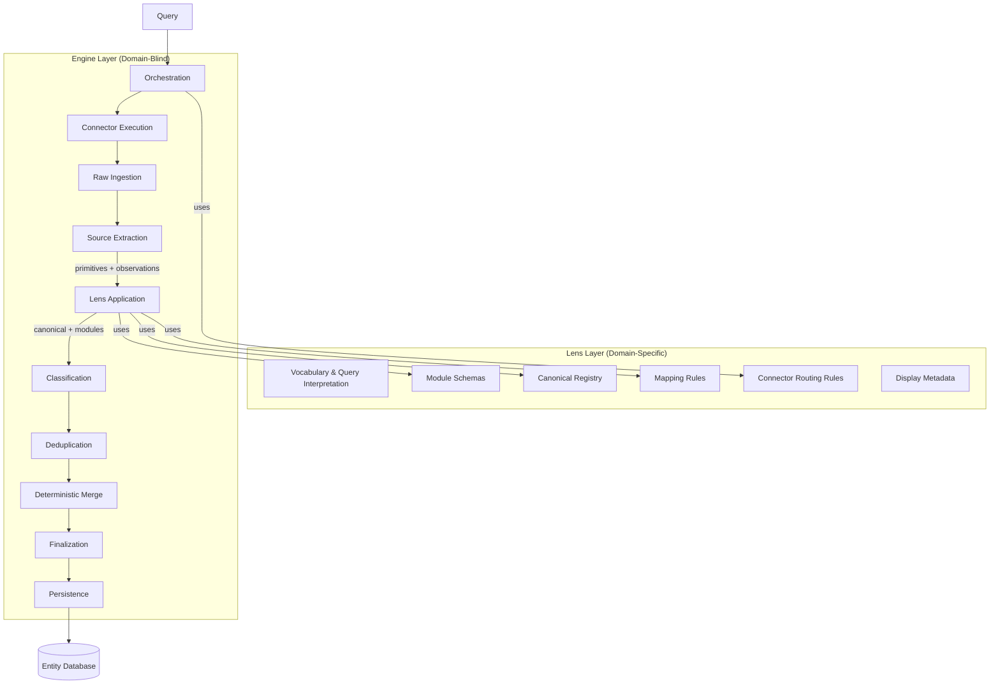
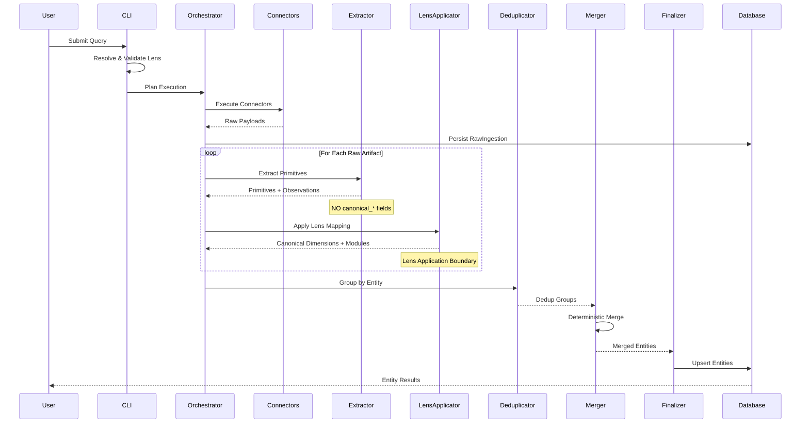
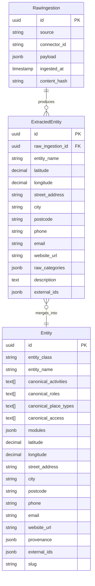
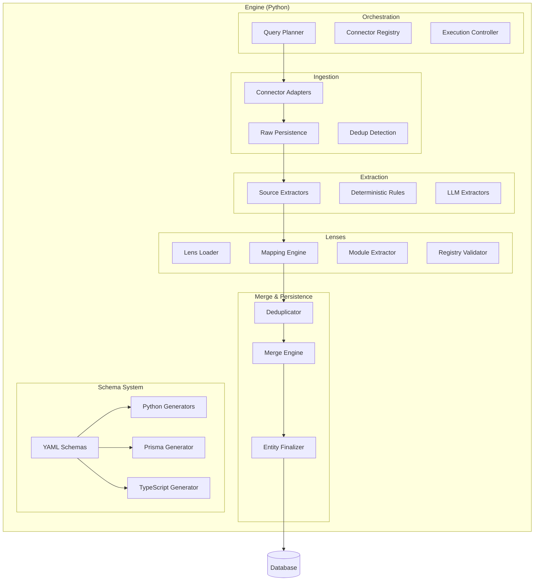
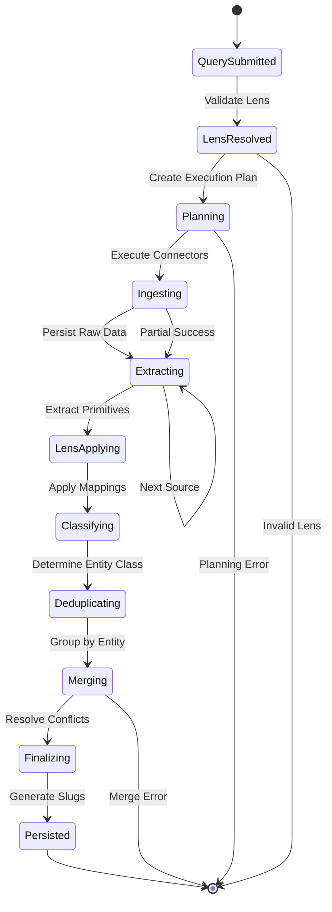
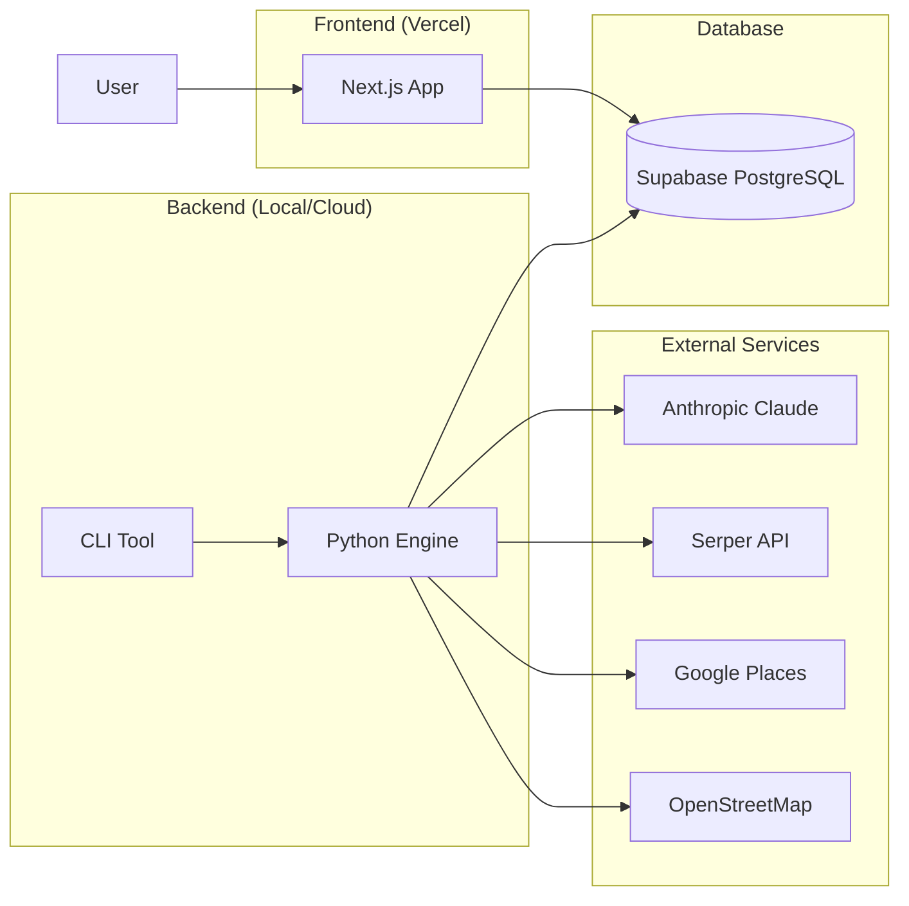

# System Architecture

# 1. Introduction and Scope

## Purpose of This Document

This document defines the concrete runtime mechanics, contracts, execution pipelines, validation rules, and operational guarantees for the Universal Entity Extraction Engine.

It operationalizes the immutable intent and architectural invariants established in `docs/target/system-vision.md`. Where ambiguity or conflict exists between these documents, the system vision is authoritative.

**Relationship to system-vision.md:**

- **system-vision.md** = Architectural Constitution
  - Defines immutable invariants that must remain true for the system's lifetime
  - Establishes the Engine vs Lens boundary (Engine = domain-blind, Lenses = all semantics)
  - Specifies success criteria: "One Perfect Entity" end-to-end validation requirement
  - Violations are architectural defects regardless of whether functionality appears to work

- **architecture.md** (this document) = Runtime Implementation Specification
  - Concrete execution pipeline stages and their ordering
  - Explicit contracts between orchestration, ingestion, extraction, lens application, deduplication, merge, and persistence
  - Validation gates, enforcement mechanisms, and error handling semantics
  - May evolve deliberately but MUST preserve all system-vision.md invariants

## Scope

### In Scope

- Execution lifecycle from input (query or entity ID) to persisted canonical entities
- Lens resolution, validation, loading, and injection via ExecutionContext
- Connector orchestration, registry metadata, and ingestion boundaries
- Extraction contracts and the locked Phase 1/Phase 2 boundary
- Deduplication grouping and deterministic merge semantics
- Canonical data model (universal schema, canonical dimensions, modules)
- Storage guarantees, indexing strategy, and persistence contracts
- Validation gates (design-time, bootstrap, runtime, persistence)
- Determinism, idempotency, and reproducibility guarantees
- Observability, provenance tracking, and auditability mechanisms

### Out of Scope

- Domain vocabulary, taxonomies, or vertical-specific interpretation (Lens-owned)
- Presentation semantics, UI behavior, SEO logic, or display metadata (Lens/Application-owned)
- Vertical business rules or application-layer workflows (Application-owned)
- Operational deployment infrastructure (CI/CD, hosting, networking, monitoring platforms)

## Target Audience

- **Developers** implementing engine components, connectors, or extractors
- **AI Agents** modifying code or proposing architectural changes
- **Architects** reviewing changes, validating boundaries, and ensuring invariant preservation
- **Contributors** adding new lenses, connectors, or enrichment sources

## Terminology (from GLOBAL_CONSTRAINTS)

- **Entity** — Canonical merged record representing a real-world entity
- **Extracted Entity** — Pre-merge output from a single source
- **Raw Ingestion** — Immutable connector payload persisted before extraction
- **Lens** — Vertical interpretation contract (YAML) defining all domain semantics
- **Module** — Namespaced structured attributes (e.g., `modules.sports_facility.*`)
- **Canonical Dimension** — Multi-valued opaque array (e.g., `canonical_activities TEXT[]`)
- **Connector** — External data source adapter implementing BaseConnector interface
- **Orchestration** — Query analysis → connector selection → execution planning
- **Deduplication** — Cross-source entity grouping (does not resolve conflicts)
- **Merge** — Deterministic conflict resolution using metadata-driven field strategies
- **Finalization** — Slug generation + idempotent persistence using canonical schema keys only

# 2. High-Level Architecture

The Universal Entity Extraction Engine operates as a pipeline-oriented, deterministic execution platform that transforms natural language queries into rich, structured entity records.

## 2.1 Two-Layer Architecture

The system maintains absolute separation between two layers:

**Engine Layer (Domain-Blind)**
- Universal orchestration, extraction, deduplication, merge, and persistence
- Operates exclusively on generic entity classifications (place, person, organization, event, thing)
- Treats canonical dimensions as opaque multi-valued arrays
- Stores detailed attributes in namespaced JSON modules
- Enforces determinism, validation, provenance tracking
- Contains zero domain knowledge or vertical-specific logic

**Lens Layer (Domain-Specific)**
- YAML-based vertical interpretation contracts
- Domain vocabulary and query interpretation rules
- Connector routing logic and orchestration hints
- Mapping rules from raw observations to canonical dimensions
- Canonical value registries with display metadata
- Module schemas and field extraction rules
- All domain semantics live exclusively here

The engine consumes Lens contracts as opaque configuration at bootstrap and never embeds, infers, or hardcodes domain meaning.

## 2.2 Core Data Flow

```
Query Input
    ↓
Lens Resolution & Validation (bootstrap-time)
    ↓
Planning (lens routing rules → connector selection)
    ↓
Connector Execution (parallel, metadata-driven)
    ↓
Raw Ingestion Persistence (immutable artifacts)
    ↓
Source Extraction (primitives + observations only)
    ↓
Lens Application (mapping rules → canonical dimensions + modules)
    ↓
Classification (entity_class determination)
    ↓
Deduplication (cross-source grouping)
    ↓
Deterministic Merge (metadata-driven, field-aware)
    ↓
Finalization & Persistence (slug generation, canonical upsert)
    ↓
Entity Database
```

Each stage consumes immutable inputs, produces immutable outputs, and behaves deterministically over captured data.

## 2.3 Horizontal Scaling Model

**Adding a new vertical requires ZERO engine code changes:**

1. Create `engine/lenses/<vertical_id>/lens.yaml`
2. Define vocabulary, routing rules, mapping rules, canonical registry, module schemas
3. Deploy

The engine automatically adapts to new lenses through metadata-driven orchestration and interpretation.

## 2.4 Technology Stack Integration

**Backend (Engine)**
- Python 3.x with Pydantic for schema-driven validation
- Instructor + Anthropic Claude for schema-bound LLM extraction
- Prisma Client Python for database access
- pytest with coverage tracking and slow markers

**Frontend (Application Layer)**
- Next.js 16 (App Router) + React 19
- TypeScript with auto-generated types from engine schemas
- Tailwind CSS v4 + shadcn/ui components
- Prisma 7.3+ for database queries

**Database**
- Supabase (PostgreSQL)
- Canonical dimensions stored as TEXT[] arrays with GIN indexes
- Modules stored as JSONB with structural validation
- Provenance and external identifiers as first-class fields

**Schema Authority**
- YAML schemas in `engine/config/schemas/` are single source of truth
- Auto-generate Python FieldSpecs, Prisma schemas, TypeScript interfaces
- Generated files marked "DO NOT EDIT" and never modified manually

## 2.5 Execution Boundaries

The architecture enforces strict boundaries to preserve purity and determinism:

**Lens Loading Boundary**
- Lenses loaded and validated only during bootstrap
- No runtime component may reload or mutate lens configuration
- ExecutionContext carries validated lens contract through pipeline

**Artifact Boundary**
- Raw payloads persisted before extraction begins
- Extracted entities are immutable inputs to deduplication
- Merged entities are immutable inputs to finalization

**Determinism Boundary**
- External systems (APIs, LLMs) may be probabilistic
- Once captured as raw artifacts, all downstream processing fully deterministic
- No randomness, iteration-order dependence, or time-based behavior

**Purity Boundary**
- Engine code contains no domain-specific terms or logic
- All semantic interpretation flows through lens contracts
- Connector names never appear in merge or orchestration logic

## 2.6 Validation Philosophy

The entity database is the ultimate correctness signal. Tests that pass but produce incorrect entity data represent system failures.

**Success Criteria**
- **One Perfect Entity (OPE):** At least one entity flows end-to-end with correct entity_class, non-empty canonical dimensions, ≥1 populated module field, accurate primitives, preserved provenance
- **Multi-Source Merge:** At least one entity from ≥2 sources, correctly deduplicated and merged

Partial success (primitives only, single-source only, empty modules) is not considered architectural validation.

## 2.7 Immutable Invariants (From system-vision.md)

These constraints govern all architectural decisions:

1. **Engine Purity** – Zero domain knowledge in engine code
2. **Lens Ownership** – All semantics in Lens contracts only
3. **Zero Engine Changes** – New verticals require only Lens YAML
4. **Determinism** – Same inputs + lens → identical outputs
5. **Canonical Registry Authority** – All values declared in registry
6. **Fail-Fast Validation** – Invalid contracts fail at bootstrap
7. **Schema-Bound LLM** – LLMs produce only validated output
8. **No Translation Layers** – Universal schema names authoritative
9. **Engine Independence** – Engine valuable without any specific vertical
10. **No Reference-Lens Exceptions** – Edinburgh Finds gets no special treatment

Violations are architectural defects regardless of whether functionality appears to work.

---

# 3. Engine-Lens Boundary and Integration

This section defines the absolute separation between domain-blind engine execution and domain-specific lens interpretation, along with the enforcement mechanisms that prevent architectural drift.

## 3.1 The Boundary Contract

**Engine Responsibilities (Domain-Blind)**
- Universal entity classification using generic classes only
- Storage of canonical dimensions as opaque TEXT[] arrays
- Storage of modules as namespaced JSONB structures
- Orchestration, ingestion, extraction, deduplication, merge, persistence
- Determinism, idempotency, validation enforcement
- Provenance tracking and reproducibility guarantees
- Generic execution of mapping rules and module extraction

**Lens Responsibilities (Domain-Specific)**
- Domain vocabulary and query interpretation semantics
- Connector routing rules (which connectors for which queries)
- Mapping rules (raw observations → canonical dimension values)
- Canonical value registries with display metadata
- Module schemas and field extraction rules
- Module attachment triggers (which modules for which entities)
- Presentation semantics (labels, icons, groupings, SEO metadata)

The engine operates only on structure, metadata, and generic contracts. It never interprets the meaning of domain values.

## 3.2 Lens Resolution and Precedence

The active lens is resolved deterministically using first-match precedence:

1. **CLI override** – Explicit flag (e.g., `--lens wine_discovery`)
2. **Environment variable** – `LENS_ID` provides environment default
3. **Application configuration** – `engine/config/app.yaml → default_lens`
4. **Dev/Test fallback** – Safety net for local dev only, must emit warning

The resolved lens identifier must be logged and persisted as execution metadata. Ambiguous or missing resolution is a fatal error (except in explicitly enabled dev mode).

## 3.3 Lens Loading Lifecycle

Lens loading occurs atomically during engine bootstrap:

1. Load lens definition from `engine/lenses/<lens_id>/lens.yaml`
2. Validate lens schema structure
3. Validate canonical registry integrity (no orphaned references)
4. Validate connector references against connector registry
5. Validate identifier uniqueness across rules and registries
6. Compile and validate all regex patterns
7. Validate module schemas and field definitions
8. Compute deterministic content hash
9. Materialize plain runtime contract (serializable dictionary)

Any validation failure aborts execution immediately. No partially valid lens may enter runtime.

Lens contracts are never reloaded or mutated during execution.

## 3.4 Canonical Registry Integrity

All canonical values must be declared in the lens canonical registry.

**Validation Rules**
- Every canonical reference in mapping rules must exist in registry
- Duplicate canonical identifiers forbidden
- Orphaned references cause validation failure
- Registry deterministic and stable under serialization
- Registry ordering must not affect runtime behavior

The registry is the single source of truth for canonical value existence. The engine never infers, synthesizes, or normalizes canonical values.

## 3.5 Connector Reference Validation

All connector identifiers referenced in lens routing rules must exist in the engine connector registry.

**Validation Rules**
- Missing connector references fail fast at bootstrap
- Silent fallback to placeholder connectors forbidden
- Connector capability mismatches surfaced as validation errors

This prevents silent production misconfiguration and ensures lens contracts reference only valid, registered connectors.

## 3.6 Module Schema Validation

Module schemas defined by lenses are validated at load time:

**Validation Rules**
- Module namespace uniqueness
- Field name uniqueness within module
- Field type correctness
- Optional schema constraints (required, enum, range)
- JSON schema validity where applicable
- No field collision with universal schema

Invalid module schemas abort execution at bootstrap.

## 3.7 ExecutionContext Contract

The ExecutionContext is an immutable carrier object passed through the entire runtime pipeline.

```python
@dataclass(frozen=True)
class ExecutionContext:
    lens_id: str
    lens_contract: dict  # Plain serializable runtime contract
    lens_hash: Optional[str]  # Content hash for reproducibility
```

**Properties**
- Created exactly once during bootstrap
- Never mutated
- Contains only plain serializable data
- Safe for logging, persistence, and replay
- No live loaders, registries, or mutable references

## 3.8 Context Propagation Rules

The ExecutionContext flows explicitly through all major runtime boundaries:

```
CLI / Bootstrap
    ↓
Planner / Orchestrator
    ↓
Ingestion Coordination
    ↓
Extraction Integration
    ↓
Extractor Implementations
    ↓
Lens Application
    ↓
Deduplication and Merge Pipelines
```

**Enforcement**
- Direct imports of lens loaders or registries outside bootstrap are forbidden
- Runtime components must not reach into filesystem for lens data
- All lens-derived behavior routed through shared engine-owned helpers

## 3.9 Extractor Interface Contract

All extractors must accept ExecutionContext explicitly:

```python
def extract(self, raw_data: dict, *, ctx: ExecutionContext) -> dict:
    """
    Extract schema primitives and raw observations only.
    NO canonical_* fields or modules permitted.
    """
    ...
```

Lens-derived behavior must be routed through shared engine-owned helpers (e.g., lens applicator, module extractor) rather than implemented inside individual extractors.

This ensures:
- Consistent behavior across extractors
- Centralized validation and enforcement
- Zero domain leakage into extractor implementations
- Mechanical testability of purity constraints

## 3.10 Enforcement Mechanisms

**Import Boundary Tests**
- Engine code must not import lens loaders, registries, or lens packages
- Static analysis detects cross-boundary imports

**Literal Detection Tests**
- Prevent hardcoded canonical values or domain literals in engine code
- Regex patterns scan for prohibited domain terms

**Context Presence Validation**
- Missing or malformed ExecutionContext raises immediate error
- Extractors fail fast if context not provided

**Bootstrap Validation Gates**
- All lens validation must complete before any ingestion begins
- Invalid lenses never reach runtime

**Runtime Assertions**
- Boundary violations fail fast with diagnostic messages
- Extraction phase validation ensures no canonical_* fields emitted by extractors

Violations are treated as architectural defects and must be corrected immediately.

## 3.11 Determinism and Versioning Guarantees

Lens contracts are versioned implicitly via content hash.

**Guarantees**
- Same lens content hash → identical behavior
- Hash persisted alongside execution metadata
- Reprocessing with different lens hash = distinct execution
- Historical executions remain reproducible

Lens changes are intentional, auditable, and traceable.

## 3.12 Non-Goals (Boundary Enforcement)

The boundary enforcement system does NOT:

- Attempt to auto-heal invalid lens contracts
- Embed domain semantics into engine validation logic
- Support runtime lens reloading or hot-swapping
- Allow implicit lens defaults in production
- Permit silent fallback to alternative lenses

Any ambiguity or misconfiguration is a fatal error requiring explicit operator resolution.

---

# 4. End-to-End Pipeline Architecture

This section defines the concrete runtime pipeline from query input to persisted entities, including the locked extraction contract that separates primitive extraction from lens-driven interpretation.

## 4.1 Pipeline Stages (Canonical Order)

A single execution progresses through exactly 11 stages in strict order:

**Stage 1: Input**
- Accept natural-language query or explicit entity identifier
- Validate input format and constraints

**Stage 2: Lens Resolution & Validation**
- Resolve lens_id by precedence (CLI → env → config → fallback)
- Load lens configuration exactly once at bootstrap
- Validate schema, references, and invariants
- Compute lens hash for reproducibility
- Inject validated lens contract into ExecutionContext

**Stage 3: Planning**
- Derive query features deterministically from query text
- Use lens vocabulary to detect domain signals
- Apply lens routing rules to select connector execution plan
- Establish execution phases, budgets, ordering, constraints

**Stage 4: Connector Execution**
- Execute connectors according to plan (potentially parallel)
- Enforce rate limits, timeouts, budgets
- Collect raw payloads and connector metadata
- Failures isolated per connector, partial ingestion permitted

**Stage 5: Raw Ingestion Persistence**
- Persist raw payload artifacts with metadata (source, timestamp, hash)
- Perform ingestion-level deduplication of identical payloads
- Raw artifacts become immutable inputs for downstream stages

**Stage 6: Source Extraction (Phase 1 — Primitives Only)**
- For each raw artifact, run source-specific extractor
- Extractors emit ONLY:
  - Schema primitives (entity_name, latitude, longitude, street_address, city, postcode, phone, email, website_url)
  - Raw observations (raw_categories, description, connector-native fields)
- Extractors MUST NOT emit:
  - canonical_* dimensions
  - modules or module fields
  - Any lens-derived interpretation
- Deterministic extraction preferred; LLM extraction permitted for primitives only
- **This includes LLM prompts: requesting canonical fields is a boundary violation**

**Stage 7: Lens Application (Phase 2 — Interpretation)**
- Apply lens mapping rules to populate canonical dimensions
- Evaluate module triggers (which modules attach to entity)
- Execute module field rules using generic module extraction engine
- Deterministic rules execute before schema-bound LLM extraction
- Output: canonical dimensions + populated modules

**Default Evidence Surfaces**
- If mapping rule omits source_fields, engine searches: entity_name, summary, description, raw_categories, street_address
- Implementations may additionally search discovered_attributes

**Stage 8: Classification**
- Determine entity_class using deterministic universal rules
- A candidate is a **place** if any geographic anchoring is present:
  - coordinates (latitude/longitude)
  - street address
  - city
  - postcode
- Otherwise classify as person, organization, event, or thing

**Stage 9: Cross-Source Deduplication Grouping**
- Group extracted entities believed to represent same real-world entity
- Multi-tier strategies: external IDs, geo similarity, normalized name similarity, content fingerprints
- No conflict resolution at this stage (grouping only)

**Stage 10: Deterministic Merge**
- Merge each deduplication group into single canonical entity
- Metadata-driven, field-aware deterministic rules
- NO connector-specific logic permitted
- Trust metadata consumed generically

**Stage 11: Finalization & Persistence**
- Generate stable slugs and derived identifiers
- Upsert merged entities idempotently
- Persist provenance and external identifiers
- Finalization MUST use canonical schema keys only (latitude, longitude, NOT location_lat)
- Legacy keys forbidden

Stages must execute in this order. Reordering or shortcutting violates architectural guarantees.

## 4.2 The Locked Extraction Contract

The extraction stage is split into two explicit phases with a hard boundary contract:

### Phase 1 — Source Extraction (Connector Adapters)

**Function Signature**
```python
extractor.extract(raw_payload, ctx) → primitives + raw_observations
```

**Permitted Outputs**
- Schema primitives: entity_name, latitude, longitude, street_address, city, postcode, phone, email, website_url, time fields, identifiers
- Raw observations: raw_categories, description, connector-native fields

**Forbidden Outputs**
- Any canonical_* dimensions (canonical_activities, canonical_roles, canonical_place_types, canonical_access)
- Any modules or module fields
- Any lens-derived interpretation or domain semantics

Source extractors must remain strictly domain-blind.

### Phase 2 — Lens Application (Engine-Owned Interpreters)

**Function Signature**
```python
apply_lens_contract(primitives, ctx.lens_contract) → canonical_* + modules
```

**Responsibilities**
- Apply mapping rules from lens contract
- Evaluate module triggers
- Execute module field rules
- Enforce deterministic ordering and validation
- Remain domain-blind and metadata-driven

### Why This Contract Exists

- Makes extractor purity mechanically testable
- Prevents vertical semantics leaking into extractor implementations
- Centralizes interpretation logic for auditability and evolution
- Prevents contributors from treating extractors as semantic layers
- Enables horizontal scaling (new verticals = new lens contract only)

### Wiring Convenience

Extractors may invoke shared pipeline helpers only if those helpers are thin pass-throughs that don't change the extractor's output contract.

The authoritative boundary is the return type:
- Extractors return only primitives and raw observations
- Lens application produces all canonical and module-derived fields

## 4.3 Artifact Immutability and Flow Guarantees

All pipeline artifacts are immutable once created.

**Immutability Rules**
- Raw ingestion artifacts immutable after persistence
- Extracted entities immutable after creation
- Deduplication groups immutable
- Merged entities immutable
- Persisted entities may only change through idempotent upsert

No stage may mutate upstream artifacts. Mutation attempts are architectural defects.

## 4.4 Idempotency, Replay, and Refresh Semantics

**Idempotent Execution**
- Re-running same query updates existing entities rather than creating duplicates
- Upsert keys stable and deterministic

**Deterministic Replay**
- When raw artifacts reused, all downstream processing produces identical outputs
- Enables safe reprocessing and backfills

**Refresh Execution**
- External connectors and LLMs re-run to capture updated reality
- Once new artifacts captured, deterministic processing resumes
- Refresh vs replay controls explicit and operator-driven

## 4.5 Boundary Contracts

### Planning Boundary
- Produces connector execution plan derived exclusively from lens routing rules and query features
- Must not perform network calls, extraction, or persistence
- Must be deterministic

### Ingestion Boundary
- Raw artifacts persisted before any extraction begins
- Downstream stages never mutate raw artifacts
- Artifact identity stable across replays

### Extraction Boundary (See Section 4.2)

### Deduplication Boundary
- Deduplication groups entities but does not resolve field conflicts
- No merge or prioritization logic at this stage

### Merge Boundary
- Merge resolves conflicts deterministically using metadata and rules
- Must not call external systems or depend on runtime ordering
- NO connector names permitted in merge logic

### Persistence Boundary
- Finalization and persistence only stages permitted to write canonical entities
- Persistence must be idempotent
- Canonical schema keys only (latitude, longitude, NOT location_lat)

## 4.6 Observability and Debuggability

The pipeline must expose sufficient observability to support:

- Debugging incorrect extraction or mapping
- Auditing merge decisions
- Tracing provenance of fields and values
- Reproducing historical executions

**Minimum Expectations**
- Artifact identifiers logged at each stage
- Lens hash recorded per execution
- Connector execution metrics captured
- Validation failures surfaced clearly

Observability must not compromise determinism.

---

# 5. Extraction Architecture

This section defines how raw connector payloads are transformed into structured primitives and observations, with strict enforcement of the domain-blind extraction boundary.

## 5.1 Core Principle

Extraction is the transformation of raw connector payloads into schema-aligned primitives and raw observations without any domain interpretation.

**Source extractors are domain-blind:**
- Operate only on connector-specific payload structure
- Emit universal schema primitives
- Preserve connector-native observations for downstream interpretation
- Never emit canonical dimensions or modules

## 5.2 Extractor Interface

All extractors implement a common interface:

```python
class BaseExtractor(ABC):
    @abstractmethod
    def extract(self, raw_payload: dict, *, ctx: ExecutionContext) -> dict:
        """
        Extract primitives and observations only.

        Returns:
            {
                "entity_name": str,
                "latitude": Optional[Decimal],
                "longitude": Optional[Decimal],
                "street_address": Optional[str],
                "city": Optional[str],
                "postcode": Optional[str],
                "phone": Optional[str],
                "email": Optional[str],
                "website_url": Optional[str],
                "raw_categories": Optional[List[str]],
                "description": Optional[str],
                # connector-native observations preserved
            }
        """
        ...
```

**Forbidden Fields in Return Value**
- canonical_activities
- canonical_roles
- canonical_place_types
- canonical_access
- modules (any nested structure)

## 5.3 Deterministic vs LLM Extraction

**Deterministic Extraction (Preferred)**
- Direct field mapping from structured payloads
- Regex-based parsing for semi-structured text
- Guaranteed reproducibility

**LLM Extraction (Schema-Bound Only)**
- Used only when deterministic extraction insufficient
- Must produce schema-validated output via Instructor
- May extract primitives only (NOT canonical dimensions)
- Prompt must not request canonical_* fields

**Precedence**
- Deterministic extraction always attempted first
- LLM extraction fills gaps where deterministic methods fail
- Hybrid approach permitted within Phase 1 constraints

## 5.4 Source-Specific Extractors

Each connector has a dedicated extractor:

- `SerperExtractor` – Processes Serper search results
- `GooglePlacesExtractor` – Processes Google Places API payloads
- `OSMExtractor` – Processes OpenStreetMap data
- `SportScotlandExtractor` – Processes Sport Scotland facilities
- `WikipediaExtractor` – Processes Wikipedia articles
- `ClubsparkExtractor` – Processes Clubspark venue data

Extractors implement connector-specific logic while adhering to universal output contract.

## 5.5 Raw Observations

Extractors preserve connector-native fields as raw observations:

**Purpose**
- Provide evidence surfaces for downstream lens application
- Support debugging and provenance tracking
- Enable incremental lens improvements without re-ingestion

**Common Raw Observations**
- raw_categories: connector-provided category labels
- description: narrative text about entity
- connector_specific_fields: native payload fields

Raw observations are opaque to extractors; interpretation occurs exclusively in Phase 2.

## 5.6 Validation and Normalization

**Extraction-Time Validation**
- Schema primitive fields validated for type correctness
- Coordinates validated for geographic plausibility
- URLs validated for format correctness
- Phone numbers normalized to standard format

**Normalization Rules**
- Whitespace trimming
- Coordinate precision standardization
- Phone number formatting
- URL canonicalization

Normalization must be deterministic and reversible where possible.

## 5.7 Error Handling and Degradation

**Rule-Level Failures**
- Individual extraction rule failures logged
- Execution continues with partial data
- Missing fields represented as null (not omitted)

**Critical Failures**
- Schema validation failures fail fast
- Malformed payloads logged and skipped
- Connector errors isolated and surfaced

Extraction must never crash entire pipeline due to individual payload failure.

## 5.8 Enforcement Mechanisms

**Purity Tests**
- Verify extractors emit no canonical_* fields
- Verify extractors emit no modules
- Run against real fixtures

**Contract Tests**
- Validate output schema conformity
- Ensure required primitives present where available

**Boundary Tests**
- Detect imports of lens loaders or mapping logic
- Prevent domain literals in extractor code

Violations are architectural defects.

## 5.9 Testing Strategy

**Fixture-Based Testing**
- Every extractor has ≥1 real connector payload fixture
- Fixtures recorded from actual API responses
- Tests validate primitives extracted correctly
- Tests verify no forbidden fields emitted

**Regression Testing**
- Schema changes validated against real fixtures
- Extractor refactoring verified not to change outputs

## 5.10 Non-Goals (Extraction)

Extraction does NOT:
- Interpret domain semantics
- Populate canonical dimensions
- Attach or populate modules
- Perform cross-source deduplication
- Resolve conflicts
- Make orchestration decisions

All semantic interpretation deferred to Phase 2 (Lens Application).

---

# 6. Lens Mapping System

This section defines how lenses declare canonical values and how raw observations are deterministically mapped into canonical dimensions.

## 6.1 Lens as Compiled Runtime Contract

A lens is not a draft configuration artifact. It is a compiled, deterministic runtime contract fully validated before execution begins.

**"Compiled" means:**
- Materialized once during bootstrap into plain serializable dictionary
- No per-execution compilation or runtime mutation permitted
- All references validated, regex patterns compiled
- Content hash computed for versioning

**Contract Properties**
- Deterministic: identical inputs → identical outputs
- Fully validated: all references, schemas, rules verified at load time
- Versioned: content hash enables reproducibility
- Test-backed: every rule justified by real fixtures

## 6.2 Canonical Registry Authority

All canonical values must be declared exactly once in the lens canonical registry.

**Registry Structure (Representative)**
```yaml
canonical_registry:
  activities:
    tennis:
      display_name: "Tennis"
      seo_slug: "tennis"
      icon: "racquet"
      description: "Tennis and racket sports"
    padel:
      display_name: "Padel"
      seo_slug: "padel"
      icon: "padel_racket"
      description: "Padel courts and facilities"

  roles:
    sports_venue:
      display_name: "Sports Venue"
      seo_slug: "sports-venue"
      icon: "stadium"

  place_types:
    indoor_facility:
      display_name: "Indoor Facility"
      seo_slug: "indoor-facility"
      icon: "building"

  access:
    membership_required:
      display_name: "Membership Required"
      seo_slug: "membership"
      icon: "id_card"
```

**Validation Rules**
- Every mapping rule value must exist in registry
- Duplicate canonical identifiers forbidden
- Orphaned references fail at load time
- Registry stable under serialization

The registry is the single source of truth. The engine never infers or synthesizes canonical values.

## 6.3 Mapping Rule Structure

Mapping rules convert raw observations into canonical dimension values.

**Rule Structure (Representative)**
```yaml
mapping_rules:
  - id: map_tennis_activity
    pattern: "(?i)tennis|racket sports"
    dimension: canonical_activities
    value: tennis
    source_fields: [raw_categories, description, entity_name]
    confidence: 0.95
    applicability:
      source: [serper, google_places]
      entity_class: [place]
```

**Required Fields**
- id: Unique identifier for rule
- pattern: Python-compatible regex
- dimension: Target canonical dimension (canonical_activities, canonical_roles, canonical_place_types, canonical_access)
- value: Canonical registry reference
- confidence: Extraction confidence (0.0–1.0)

**Optional Fields**
- source_fields: Raw fields inspected (defaults to standard evidence surfaces)
- applicability: Source and entity_class constraints

## 6.4 Mapping Rule Execution Semantics

The engine executes mapping rules generically and deterministically.

**Execution Guarantees**
- Rules execute over union of declared source_fields
- If source_fields omitted, engine searches: entity_name, summary, description, raw_categories, street_address
- Implementations may additionally search discovered_attributes
- First match wins per rule (deterministic regex execution)
- Multiple rules may contribute to same dimension
- Duplicate values deduplicated within dimension
- Ordering stabilized deterministically (lexicographic sort)
- Confidence metadata preserved for merge and provenance

**Mapping Never**
- Mutates raw inputs
- Performs network calls
- Invokes LLMs (interpretation deterministic)
- Emits undeclared canonical values

## 6.5 Default Evidence Surfaces

When source_fields omitted, the engine searches these fields by default:

- entity_name
- summary
- description
- raw_categories
- street_address

This provides sensible default behavior while allowing rules to override when needed.

Implementations may extend search to discovered_attributes for connectors with flexible schemas.

## 6.6 Evidence-Driven Vocabulary Expansion

Canonical values and mapping rules must be justified by observed real data.

**Requirements**
- Every new rule must reference real raw payload fixture
- Fixtures recorded from actual connector responses
- Rules without evidence forbidden
- Speculative taxonomy expansion prohibited

**Expansion Workflow**
```
Capture real payload from connector
    ↓
Create fixture in tests/fixtures/
    ↓
Add canonical value to lens registry
    ↓
Add mapping rule to lens.yaml
    ↓
Add validation test
    ↓
Commit together atomically
```

This preserves correctness and prevents drift.

## 6.7 Minimal Viable Lens Strategy

Initial lenses start with minimal but complete coverage:

**Minimum Deliverables**
- At least one validation entity
- At least one value populated per canonical dimension
- At least one module trigger
- At least one populated module field

Acceptance validated via real database inspection, not mocks.

Lenses expand incrementally based on observed data.

## 6.8 Lens Validation Gates

The engine enforces strict validation gates at lens load time:

1. **Schema Validation** – Lens YAML conforms to schema
2. **Canonical Reference Integrity** – All mapping rule values exist in registry
3. **Connector Reference Validation** – All referenced connectors exist
4. **Identifier Uniqueness** – No duplicate rule IDs or canonical IDs
5. **Regex Compilation Validation** – All patterns compile successfully
6. **Smoke Coverage Validation** – At least one rule per dimension
7. **Fail-Fast Enforcement** – Any failure aborts execution

Lens errors must never reach runtime.

## 6.9 Separation of Semantics from Engine Logic

The engine must never embed mapping semantics.

**Engine Responsibilities**
- Execute rules generically
- Enforce validation and determinism
- Preserve metadata and provenance
- Store canonical dimensions as opaque arrays

**Lens Responsibilities**
- Define all semantics and interpretation logic
- Provide evidence-backed rules and registries
- Declare canonical value display metadata

Violation of this separation is an architectural defect.

## 6.10 Observability and Auditability

Mapping execution must be observable and auditable.

**Retained Metadata**
- Which rules fired
- Which source fields matched
- Confidence values
- Provenance metadata

This supports debugging, validation, and continuous improvement.

---

# 7. Module Extraction Architecture

This section defines how structured module data is extracted, validated, and populated using declarative rules defined in lens contracts and executed by a generic, domain-blind engine interpreter.

## 7.1 Core Principle

Module field extraction is:
- Declarative
- Lens-owned
- Schema-driven
- Executed by generic engine interpreter
- Fully domain-blind inside engine code

No module-specific or domain-specific logic may exist in engine implementations. All semantics live exclusively in lens contracts.

## 7.2 Module Definitions

Each lens defines its domain modules declaratively.

**Module Definition Structure**
```yaml
modules:
  sports_facility:
    description: "Sports facility infrastructure and amenities"
    schema:
      properties:
        tennis_courts:
          type: object
          properties:
            total: {type: integer}
            indoor: {type: integer}
            outdoor: {type: integer}
            surfaces: {type: array, items: {type: string}}
        padel_courts:
          type: object
          properties:
            total: {type: integer}
            indoor: {type: integer}
            covered: {type: boolean}
            heated: {type: boolean}
        booking:
          type: object
          properties:
            online_booking_available: {type: boolean}
            advance_booking_days: {type: integer}
            booking_url: {type: string, format: uri}
        coaching_available: {type: boolean}
        equipment_rental: {type: boolean}
```

**Module Components**
- Module name (namespace)
- Human-readable description
- Structured schema (field hierarchy and types)
- Field extraction rules (defined separately)

Universal modules always available: core, location, contact, hours, amenities, time_range

Domain modules lens-defined and conditional.

The engine validates module structure but does not interpret field meaning.

## 7.3 Field Rule Structure

Each module declares field_rules describing how values are extracted.

**Rule Structure (Representative)**
```yaml
modules:
  sports_facility:
    field_rules:
      - rule_id: extract_tennis_court_count
        target_path: tennis_courts.total
        source_fields: [NumTennisCourts, courts_total]
        extractor: numeric_parser
        confidence: 0.90
        applicability:
          source: [sport_scotland, clubspark]
          entity_class: [place]
        normalizers: [round_integer]

      - rule_id: extract_court_surface
        target_path: tennis_courts.surfaces
        source_fields: [Surface, surface_type]
        extractor: regex_capture
        pattern: "(?i)(3G|4G|grass|hard court|clay|artificial)"
        confidence: 0.85
        normalizers: [lowercase, list_wrap]

      - rule_id: extract_booking_url
        target_path: booking.booking_url
        source_fields: [booking_link, website_url]
        extractor: coalesce
        confidence: 0.80
        normalizers: [trim]
```

**Required Fields**
- rule_id: Unique identifier
- target_path: JSON path inside module namespace (e.g., tennis_courts.total)
- source_fields: Raw fields inspected
- extractor: Generic extractor type
- confidence: Extraction confidence (0.0–1.0)

**Optional Fields**
- applicability: Source and entity_class constraints
- normalizers: Ordered post-processing pipeline
- conditions: Conditional execution guards
- pattern/schema: Extractor-specific parameters

## 7.4 Extractor Vocabulary

The engine maintains a small, stable vocabulary of generic extractors.

**Deterministic Extractors**
- `numeric_parser` – Extract numeric values
- `regex_capture` – Pattern-based extraction
- `json_path` – Navigate JSON structures
- `boolean_coercion` – Convert to boolean
- `coalesce` – First non-null value
- `normalize` – Apply normalization pipeline
- `array_builder` – Construct arrays
- `string_template` – Template-based formatting

**LLM Extractors**
- `llm_structured` – Schema-bound LLM extraction

**Constraints**
- Schema-bound only (validated output)
- Evidence-anchored where possible
- Deterministic rules always run first
- At most one LLM call per module per payload

Adding new extractor types requires:
- Architectural review
- Purity validation (no domain semantics)
- Documentation
- Test coverage

## 7.5 Execution Semantics

For each entity and each attached module:

1. Select applicable rules based on source and entity_class
2. Execute deterministic rules first
3. Populate fields when values extracted successfully
4. Evaluate conditions for remaining LLM rules
5. Build schema covering only remaining fields
6. Execute single batched LLM call if required
7. Validate and normalize LLM outputs
8. Write results to target paths
9. Do not resolve cross-source conflicts here (handled in merge)

Module extraction never mutates raw inputs. Partial population permitted.

## 7.6 Module Triggers

Module triggers determine which modules attach to which entities.

**Trigger Structure**
```yaml
module_triggers:
  - when:
      dimension: canonical_activities
      values: [tennis, padel, squash]
    add_modules: [sports_facility]

  - when:
      dimension: canonical_roles
      values: [restaurant, cafe]
    add_modules: [dining]
```

Triggers evaluated after canonical dimensions populated. Multiple triggers may fire for single entity.

## 7.7 Conditions and Normalizers

**Conditions** determine whether a rule should execute.

Supported condition types:
- `field_not_populated` – Target field empty
- `any_field_missing` – Any source field missing
- `source_has_field` – Source contains field
- `value_present` – Source field has non-null value

Conditions evaluated before rule execution.

**Normalizers** form ordered pipeline applied after extraction.

Properties:
- Pure functions
- Deterministic
- Executed left-to-right
- No side effects

Common normalizers:
- `trim` – Remove whitespace
- `lowercase` – Convert to lowercase
- `uppercase` – Convert to uppercase
- `list_wrap` – Wrap scalar in array
- `comma_split` – Split comma-separated string
- `round_integer` – Round to nearest integer

## 7.8 Error Handling and Degradation

The system must degrade gracefully on rule failures.

**Deterministic Rule Failures**
- Log rule_id, source, error
- Skip field
- Continue execution

**LLM Failures**
- Log module, source, error
- Continue with partial module data

**Lens Validation Failures**
- Fail fast at bootstrap
- Abort execution

Module extraction must never crash entire entity pipeline due to individual rule failure.

## 7.9 Conflict Resolution Rules

When multiple rules target same target_path:
- First successful match wins
- Conditions should prevent overwriting
- Deterministic rules take precedence over LLM rules
- Rule ordering must be deterministic

## 7.10 Source Awareness

Module extraction requires source awareness.

Each execution must know:
- Which connector produced raw payload
- Which entity_class being processed

Applicability filtering and conditional logic rely on this metadata.

Source awareness provided explicitly through function signatures or ExecutionContext. Implicit global state forbidden.

## 7.11 Purity and Enforcement

**Non-Negotiable Constraints**
- No domain logic in engine code
- No module-specific branching
- No hardcoded field semantics
- No dynamic schema inference
- No extractor-specific special cases

**Enforcement Mechanisms**
- Purity tests verify no domain literals
- Static analysis detects boundary violations
- Contract tests validate output conformity
- Lens validation gates prevent invalid schemas

Violations are architectural defects.

## 7.12 MVP Sequencing and Acceptance

**Phase 1: Deterministic-Only Extraction**
- 5–10 rules for single validation entity
- At least one populated module field persisted

**Phase 2: LLM Extraction**
- Introduce LLM extraction under constraints
- Validate batch behavior and confidence handling

**Acceptance Criteria**
- At least one non-null module field persisted in production schema
- Deterministic extraction validated on real fixtures
- LLM extraction validated with schema-bound output
- No engine purity violations
- Source awareness enforced
- Error handling verified
- ≤1 LLM call per module per payload

---

# 8. Deduplication and Merge Architecture

This section defines how extracted entities from multiple sources are grouped (deduplication) and merged into single canonical entities deterministically, idempotently, and without domain semantics.

## 8.1 Core Principle

Multi-source merge is:
- Deterministic
- Field-aware
- Metadata-driven
- Domain-blind
- Idempotent
- Connector-name-free

Merge consumes connector trust metadata and extraction confidence but never hardcodes connector names or domain logic.

## 8.2 Two-Stage Process

**Stage 1: Deduplication Grouping**
- Group extracted entities believed to represent same real-world entity
- No conflict resolution (grouping only)
- Multi-tier matching strategies

**Stage 2: Deterministic Merge**
- Merge each group into single canonical entity
- Field-aware conflict resolution
- Metadata-driven selection

## 8.3 Deduplication Strategies

Deduplication uses multi-tier strategies in order:

**Tier 1: External Identifier Match**
- Google Place ID, OSM ID, venue-specific IDs
- Exact match = same entity
- Highest confidence signal

**Tier 2: Geo + Name Similarity**
- Coordinates within threshold (e.g., 50 meters)
- Normalized name similarity (e.g., Levenshtein distance)
- Combined score > threshold = likely same entity

**Tier 3: Content Fingerprint**
- Hash of normalized (name, address, phone)
- Exact match = same entity
- Useful for entities without coordinates

Strategies applied in order. First definitive match wins.

## 8.4 Missingness Definition

Missingness must be explicit and shared across all merge strategies.

A field is considered **missing** if:
- Value is None/null
- Value is empty string after whitespace trim
- Value is empty array
- Value is empty object {}

A field is considered **present** otherwise.

This definition used uniformly across all field-group strategies.

## 8.5 Pre-Merge Sorting

Before field-level merge logic executes, inputs must be pre-sorted deterministically:

**Sort Order**
```python
sorted_entities = sorted(
    entities,
    key=lambda e: (
        -connector_trust_tier(e.source),  # Higher trust first
        e.source,                          # Lexicographic connector_id
        e.id                               # Lexicographic entity ID
    )
)
```

This ensures deterministic selection when multiple sources provide equivalent quality.

## 8.6 Trust Model (Metadata-Driven)

Trust expressed through connector registry metadata:

**Metadata Attributes**
- `trust_tier` – high | medium | low
- `default_priority` – integer (lower value wins ties)

Merge logic consumes metadata values only. Connector names must never appear in merge logic.

**Trust Tier Mapping**
- high → trust_score 3
- medium → trust_score 2
- low → trust_score 1

## 8.7 Field-Group Merge Strategies

Different field classes use different deterministic strategies.

### Identity and Display Fields

**Fields:** entity_name, summary, description, street_address, city, postcode

**Strategy:**
- Prefer higher trust_tier unless missing
- Prefer more complete values (longer text, more detail)
- Tie-break: trust → completeness → priority → lexicographic source ID

### Geo Fields

**Fields:** latitude, longitude

**Strategy:**
- Prefer explicit precision metadata if available
- Else higher trust_tier
- Else greater decimal precision (more digits = more precise)
- Never compute centroids
- Tie-break: precision → trust → priority → lexicographic source ID

### Contact and Presence Fields

**Fields:** phone, email, website_url, social URLs

**Strategy:**
- Deterministic quality scoring based on structure only
- Allow higher-quality crowdsourced values to win over sparse official values
- Tie-break: quality → trust → priority → lexicographic source ID

**Quality Scoring (Deterministic)**
- Phone: country code presence, format validity
- Email: domain validation, format correctness
- URL: HTTPS, domain quality heuristics

Quality scoring must never use external validation or network calls.

### Canonical Dimension Arrays

**Fields:** canonical_activities, canonical_roles, canonical_place_types, canonical_access

**Strategy:**
- Union all values from all sources
- Normalize values (lowercase, trim)
- Deduplicate
- Lexicographically sort
- No weighting or ranking

Result: comprehensive set of all observed canonical values.

### Modules JSON Structures

**Strategy:**
- Recursive merge algorithm
- Object vs object → recursive merge
- Array vs array:
  - Scalar arrays → concatenate, deduplicate, sort
  - Object arrays → select wholesale from winning source
- Type mismatch → higher trust wins wholesale
- Per-leaf selection: trust → confidence (if present) → completeness

Confidence normalized to 0.0–1.0 when present.

### Provenance and External Identifiers

**Strategy:**
- Always union
- Never overwrite
- Track all contributors
- Determine primary source via trust metadata

## 8.8 Deterministic Tie-Break Cascade

When conflicts remain after field-specific strategies:

1. `trust_tier` (higher wins)
2. `quality_score` (if applicable, higher wins)
3. `confidence` (if applicable, higher wins)
4. `completeness` (more complete wins)
5. `default_priority` (lower value wins)
6. Lexicographic stable source identifier (e.g., connector_id)

All merges must resolve deterministically. No ties permitted.

## 8.9 Idempotency Guarantees

Given identical inputs:
- Merge output must be identical across runs
- Ordering must remain stable
- No randomness or iteration-order dependence permitted

Repeated execution converges to stable state.

## 8.10 Error Handling

Merge must never crash due to malformed or missing data.

**Policies:**
- Invalid values skipped with logging
- Structural conflicts preserve higher-trust data
- Missing metadata treated as lowest priority

## 8.11 Observability and Provenance

Merge must retain sufficient metadata to audit decisions.

**Retained Metadata:**
- Contributing sources
- Confidence values
- Conflict provenance (which sources disagreed)
- Selected source per field group

## 8.12 Non-Goals (Merge)

Merge does NOT:
- Embed domain-specific branching
- Use connector names in logic
- Perform probabilistic selection
- Compute geographic centroids
- Maintain permanent translation layers
- Call external systems or LLMs

---

# 9. Canonical Data Model

This section defines the universal entity data model owned by the engine, including canonical dimensions, module structure, storage guarantees, and structural invariants.

## 9.1 Universal Entity Schema

All entities conform to universal schema stable across all verticals.

**Core Components:**
- Stable entity identity (UUID)
- entity_class (place, person, organization, event, thing)
- Canonical dimensions (multi-valued opaque arrays)
- Namespaced structured modules (JSONB)
- Universal primitives (name, location, contact, time)
- Provenance and external identifiers

The universal schema is authoritative end-to-end. No permanent translation layers permitted.

## 9.2 Entity Class (Universal Classification)

**Enumeration:** place, person, organization, event, thing

**Classification Rules (Deterministic)**

A candidate is classified as **place** if any geographic anchoring is present:
- Coordinates (latitude AND longitude)
- street_address
- city
- postcode

Otherwise classified as:
- **person** – Individual human
- **organization** – Company, institution, club
- **event** – Time-bound occurrence
- **thing** – Physical object or concept

Classification logic domain-blind and deterministic.

## 9.3 Canonical Dimensions (Universal Structure)

The engine maintains exactly **four** canonical dimensions:

```
canonical_activities     TEXT[]
canonical_roles          TEXT[]
canonical_place_types    TEXT[]
canonical_access         TEXT[]
```

Adding, removing, or redefining canonical dimensions requires explicit architectural review and amendment to `docs/target/system-vision.md`.

**Engine Guarantees:**
- Arrays always present (never null)
- Empty array represents absence of observed values
- Values treated as opaque identifiers
- No semantic interpretation in engine code
- No duplicate values within dimension
- Ordering stable and deterministic (lexicographic sort)

**Lens Responsibilities:**
- Declare allowed values in canonical registry
- Populate values through mapping rules
- Provide grouping, labeling, presentation semantics

## 9.4 Structural Semantics (Engine Perspective Only)

These descriptions are human mnemonics only. The engine must not implement logic depending on these meanings.

**Structural Intent (Not Semantic Meaning):**
- `canonical_activities` – What activities occur
- `canonical_roles` – What functional role entity serves
- `canonical_place_types` – What physical type a place is
- `canonical_access` – How users engage or access

The engine validates only registry existence and structural integrity, not semantic correctness.

## 9.5 Storage and Indexing Guarantees

Canonical dimensions stored as Postgres TEXT[] arrays with GIN indexes.

**Storage Guarantees:**
- Efficient containment queries (`WHERE canonical_activities @> ARRAY['tennis']`)
- Stable deterministic ordering after merge
- No duplicate values persisted
- Arrays always materialized (no nulls)

**Index Strategy:**
```sql
CREATE INDEX idx_entity_canonical_activities ON entity USING GIN (canonical_activities);
CREATE INDEX idx_entity_canonical_roles ON entity USING GIN (canonical_roles);
CREATE INDEX idx_entity_canonical_place_types ON entity USING GIN (canonical_place_types);
CREATE INDEX idx_entity_canonical_access ON entity USING GIN (canonical_access);
```

Indexing strategy owned by engine and must not leak semantics.

## 9.6 Namespaced Modules (Structural Contract)

Modules store structured attributes not belonging in universal schema.

**Structural Characteristics:**
- Each module is top-level namespace inside JSONB structure
- Module schemas defined exclusively by lenses
- Universal modules always available: core, location, contact, hours, amenities, time_range
- Domain modules conditionally attached via lens rules

**Engine Guarantees:**
- Namespaced structure enforcement
- No flattened module fields into universal schema
- No cross-module field collisions
- Structural validation of module payloads where applicable
- No semantic interpretation of module fields

## 9.7 Module Storage Format

Persisted module payloads follow stable nested structure:

```json
{
  "modules": {
    "sports_facility": {
      "tennis_courts": {
        "total": 12,
        "indoor": 8,
        "outdoor": 4,
        "surfaces": ["hard_court", "clay"]
      },
      "padel_courts": {
        "total": 3,
        "indoor": 3,
        "covered": true,
        "heated": true
      },
      "booking": {
        "online_booking_available": true,
        "advance_booking_days": 7,
        "booking_url": "https://example.com/book"
      },
      "coaching_available": true,
      "equipment_rental": true
    },
    "amenities": {
      "parking": {
        "available": true,
        "spaces": 50,
        "cost": "free"
      },
      "accessibility": {
        "wheelchair_accessible": true,
        "accessible_parking": true,
        "accessible_changing_rooms": true
      },
      "facilities": ["changing_rooms", "showers", "cafe", "pro_shop"]
    }
  }
}
```

The engine treats module payloads as opaque structured data with only structural validation applied.

## 9.8 Universal Primitives

Universal schema includes standard primitives:

**Identity:**
- entity_name (required)
- slug (generated, URL-safe)

**Location:**
- latitude (Decimal, nullable)
- longitude (Decimal, nullable)
- street_address (nullable)
- city (nullable)
- postcode (nullable)

**Contact:**
- phone (nullable)
- email (nullable)
- website_url (nullable)

**Time:**
- created_at (timestamp)
- updated_at (timestamp)

**Provenance:**
- provenance (JSONB, tracks sources)
- external_ids (JSONB, connector-specific IDs)

## 9.9 Provenance and External Identifiers

Every entity retains explicit provenance information.

**Provenance Includes:**
- Contributing sources
- Source identifiers
- Extraction timestamps
- Confidence metadata where applicable

**External Identifiers:**
- Google Place ID
- OSM ID
- Connector-specific IDs

**Engine Guarantees:**
- Provenance never silently discarded
- Provenance survives merges deterministically
- Conflicting provenance preserved rather than overwritten

Provenance supports debugging, traceability, trust evaluation, incremental enrichment.

## 9.10 Data Quality Expectations

The engine prioritizes correctness and completeness.

**Expectations:**
- Canonical dimensions populated when evidence exists
- Modules populated with structured detail when available
- Null or empty fields treated as signals, not ignored
- No hallucinated or fabricated data

Incorrect or missing data is system defect unless justified by missing upstream evidence.

## 9.11 Field Naming Authority

Universal schema field names are authoritative end-to-end.

**Canonical Field Names:**
- latitude, longitude (NOT location_lat, location_lng)
- street_address (NOT address)
- website_url (NOT website)
- entity_name (NOT name)

**Legacy Naming Forbidden:**
- location_*
- contact_*
- address_*
- Ambiguous aliases

Finalization and persistence must use canonical schema keys only.

## 9.12 Schema Evolution Discipline

Schema evolution must preserve backward compatibility or provide explicit migration.

**Rules:**
- Additive changes preferred
- Deprecated fields require migration window
- Permanent translation layers forbidden
- Schema changes require regression validation on real data

---

# 10. Connector Architecture

This section defines the connector abstraction, registry metadata contract, and scaling guarantees for integrating unlimited external data sources into the engine.

## 10.1 Connector Interface Contract

All connectors implement common abstract interface:

```python
class BaseConnector(ABC):
    @abstractmethod
    async def fetch(self, query: str) -> RawData:
        """Fetch raw data from external source."""
        ...

    @abstractmethod
    async def is_duplicate(self, data: RawData) -> bool:
        """Detect ingestion-level duplicates."""
        ...
```

**Responsibilities:**
- Fetch raw data from external source
- Detect ingestion-level duplicates
- Return raw payloads and metadata to engine for persistence

**NOT Responsibilities:**
- Persist raw artifacts (engine-owned)
- Extract structured data (extractor-owned)
- Write canonical entities (engine-owned)

The interface is intentionally minimal and domain-blind.

## 10.2 Connector Registry Metadata

Each connector registers ConnectorSpec with metadata:

```python
@dataclass
class ConnectorSpec:
    name: str
    cost_tier: Literal["free", "paid", "premium"]
    trust_tier: Literal["high", "medium", "low"]
    default_priority: int  # Lower value wins ties
    phase: Literal["discovery", "enrichment"]
    timeout_seconds: int
    rate_limit: Optional[RateLimit]
    capabilities: List[str]
```

**Registry Metadata Used By:**
- Orchestration: connector selection, phasing, budgets
- Merge: trust-based conflict resolution
- Observability: cost tracking, performance monitoring

No connector-specific logic may appear outside connector implementations.

## 10.3 Pluggable Integration Model

Adding a connector requires:

1. Implement BaseConnector interface
2. Register metadata in connector registry
3. Reference connector from lens routing rules

**No orchestration changes required.**

Example:
```python
# engine/ingestion/connectors/new_connector.py
class NewConnector(BaseConnector):
    async def fetch(self, query: str) -> RawData:
        # Connector-specific implementation
        ...

# engine/orchestration/registry.py
CONNECTOR_REGISTRY = {
    "new_connector": ConnectorSpec(
        name="new_connector",
        cost_tier="paid",
        trust_tier="medium",
        default_priority=50,
        phase="enrichment",
        timeout_seconds=10,
        capabilities=["search", "detail"]
    )
}
```

## 10.4 Horizontal and Vertical Scaling

**Horizontal Scaling (New Verticals)**
- New verticals introduce specialized connectors via lens configuration
- Engine code remains unchanged
- Metadata-driven orchestration adapts automatically

**Vertical Enrichment (Existing Verticals)**
- Existing verticals continuously add enrichment connectors
- Orchestration adapts based on metadata and lens routing rules

## 10.5 Cross-Vertical Reuse

Some connectors may serve multiple lenses.

Each lens configures routing behavior independently. The engine does not couple connectors to any vertical.

Example: Google Places connector used by both Edinburgh Finds (sports) and Wine Discovery (wineries).

## 10.6 Connector Lifecycle

**Stages:**
1. Development
2. Registration (ConnectorSpec in registry)
3. Lens integration (routing rules in lens.yaml)
4. Validation (fixture-based testing)
5. Production deployment
6. Monitoring (metrics, quality tracking)

Lifecycle management is operational, not architectural.

## 10.7 Quality Metrics and Observability

Each connector should emit quality metrics:

- **Coverage:** Percentage of queries returning results
- **Freshness:** Data age/staleness
- **Confidence:** Self-reported confidence scores
- **Cost:** API credits consumed
- **Latency:** Response times
- **Failure rates:** Error rates, timeouts

Metrics support operational tuning and quality monitoring.

## 10.8 Scaling Guarantees

The architecture supports:
- Hundreds of connectors
- Multiple simultaneous verticals
- Metadata-driven orchestration
- Deterministic conflict resolution

Connector growth must not degrade engine purity or determinism.

## 10.9 Existing Connectors

**Current Connectors:**
- `serper` – Serper search API
- `google_places` – Google Places API
- `openstreetmap` – OpenStreetMap Overpass API
- `sport_scotland` – Sport Scotland facilities database
- `wikipedia` – Wikipedia articles
- `clubspark` – Clubspark venue data

Each connector has dedicated extractor and registry metadata.

## 10.10 Non-Goals (Connector Architecture)

- No hardcoded connector logic in engine orchestration
- No connector-specific branching in merge
- No vertical assumptions in connector interfaces
- No implicit connector dependencies

---

# 11. Orchestration Architecture

This section defines the runtime control plane that selects and executes connectors intelligently based on lens routing rules and query features.

## 11.1 Core Principle

Orchestration is the intelligent query→connector→execution planning layer.

**Responsibilities:**
- Query feature extraction
- Lens-driven connector selection
- Execution phasing and budgeting
- Parallel execution coordination
- Ingestion-level deduplication
- Artifact persistence coordination

Orchestration remains domain-blind and metadata-driven.

## 11.2 Orchestration Components

**Query Planner** (`planner.py`)
- Analyzes query to derive features
- Applies lens routing rules
- Selects connector execution plan
- Establishes phases, budgets, ordering

**Connector Registry** (`registry.py`)
- Central metadata for all connectors
- Trust, cost, phase, timeout, capabilities
- Consumed generically by planner and merge

**Adapters** (`adapters.py`)
- Bridge async connectors to orchestrator
- Normalize connector responses
- Handle connector-specific quirks without leaking to orchestration

**Execution Controller**
- Coordinates connector execution
- Enforces rate limits, timeouts, budgets
- Collects raw payloads and metadata

## 11.3 Query Features

Query features are domain-agnostic structural signals derived from query text.

**Feature Types:**
- Geographic signals (location names, coordinates)
- Temporal signals (dates, times, durations)
- Quantitative signals (numbers, ranges)
- Syntactic signals (question words, qualifiers)

**Lens Integration:**
- Lenses define vocabulary for feature detection
- Engine derives features using lens vocabulary
- Features drive connector routing rules

Example:
```yaml
vocabulary:
  location_indicators: [edinburgh, leith, stockbridge]
  activity_keywords: [tennis, padel, squash]
```

## 11.4 Connector Routing Rules

Lenses declare connector routing rules:

```yaml
connector_rules:
  sport_scotland:
    priority: high
    triggers:
      - type: any_keyword_match
        keywords: [tennis, padel, squash, football]
      - type: location_match
        locations: [edinburgh, glasgow, scotland]

  google_places:
    priority: medium
    triggers:
      - type: always  # Universal fallback

  clubspark:
    priority: high
    triggers:
      - type: any_keyword_match
        keywords: [tennis, padel]
```

**Engine Behavior:**
- Evaluate triggers against query features
- Select all matching connectors
- Phase by priority and connector metadata
- Execute in deterministic order

## 11.5 Execution Phasing

Connectors executed in phases based on metadata:

**Phase 1: Discovery**
- Broad search connectors
- Find candidate entities
- Cost-effective coverage

**Phase 2: Enrichment**
- Detail-oriented connectors
- Enrich discovered entities
- Higher cost, higher trust

Within phase, connectors executed by priority then lexicographic name.

## 11.6 Parallel Execution

Connectors within phase may execute in parallel where safe.

**Requirements:**
- No inter-connector dependencies
- Deterministic ordering of results after collection
- Isolated error handling

Parallelism is performance optimization; must preserve determinism.

## 11.7 Ingestion-Level Deduplication

Orchestration performs ingestion-level deduplication before extraction:

**Strategy:**
- Content hash of raw payload
- Exact match = duplicate, skip persistence
- Reduces storage and downstream processing

Deduplication distinct from entity-level deduplication (which occurs after extraction).

## 11.8 Budget and Rate Limiting

Orchestration enforces budgets and rate limits:

**Budget Types:**
- API credits (cost-based)
- Request count
- Time budget

**Rate Limiting:**
- Per-connector rate limits from metadata
- Global rate limits from configuration

Budget exhaustion surfaces as warning; execution continues with available connectors.

## 11.9 Observability

Orchestration exposes metrics:

- Connectors selected
- Connectors executed
- Execution duration per connector
- Payloads ingested
- Deduplication hits
- Budget consumption

Supports debugging, cost tracking, performance tuning.

## 11.10 Non-Goals (Orchestration)

- No domain semantics in orchestration logic
- No connector-specific branching
- No hardcoded routing rules
- No vertical assumptions

All routing behavior flows through lens contracts and connector metadata.

---

# 12. Validation and Enforcement

This section defines the validation gates, integrity guarantees, and enforcement mechanisms ensuring correctness, determinism, and architectural purity across system lifecycle.

## 12.1 Validation Layers

Validation operates at multiple layers:

### Design-Time Validation
- Lens schema validation
- Canonical registry integrity
- Connector reference validation
- Module schema validation
- Rule structure validation
- Extractor vocabulary validation

Failures block merge to main branch (CI enforcement).

### Bootstrap Validation
- Lens loading validation
- Regex compilation
- Registry integrity
- Connector registry resolution
- Module schema validation

Failures abort execution immediately.

### Runtime Validation
- ExecutionContext presence
- Schema primitive validation
- Field naming validation
- Extraction boundary enforcement
- Merge contract enforcement
- Finalization enforces canonical schema keys only

Runtime validation may fail fast or degrade gracefully depending on severity.

### Persistence Validation
- Schema conformity
- Referential integrity
- Idempotency constraints
- Index consistency

Persistence failures abort execution.

## 12.2 Fail-Fast vs Graceful Degradation

**Fail-Fast Conditions:**
- Invalid lens schema or registry
- Missing connector references
- Schema violations
- Contract boundary violations
- Corrupt module schemas

Execution aborts immediately.

**Graceful Degradation Conditions:**
- Individual rule failures
- Partial connector failures
- LLM extraction failures
- Non-critical normalization errors

Execution continues with partial results and explicit logging.

## 12.3 Data Integrity Guarantees

The system guarantees:
- No silent data loss
- No silent fallback behavior
- No implicit defaults
- No hidden mutation of artifacts
- Deterministic output over captured inputs
- Idempotent persistence

Violations are defects.

## 12.4 Purity Enforcement

**Mechanisms:**
- Import boundary tests (engine code must not import lens modules)
- Literal detection tests (prevent hardcoded domain terms)
- Context presence validation (ExecutionContext required)
- Bootstrap validation gates (lens contracts fully validated)
- Runtime assertions (boundary violations fail fast)

**Tested Invariants:**
- Extractors emit no canonical_* fields
- Extractors emit no modules
- Engine code contains no domain literals
- Merge logic contains no connector names

## 12.5 Observability and Auditability

The system must expose sufficient telemetry to support:
- Traceability of field origins
- Rule execution visibility
- Connector performance analysis
- Merge decision auditing
- Regression detection

**Minimum Artifacts:**
- Execution identifier
- Lens hash
- Artifact identifiers
- Connector metrics
- Validation events

## 12.6 CI Enforcement

CI must enforce:
- Lens validation
- Purity tests
- Contract tests
- Regression tests on real fixtures
- Schema stability tests

Architectural regressions must block merge.

## 12.7 Operational Safety

Operational controls must:
- Prevent accidental schema drift
- Surface misconfiguration early
- Support safe reprocessing and backfills
- Preserve reproducibility

## 12.8 Non-Goals (Validation)

- No silent auto-healing
- No implicit migrations
- No probabilistic validation
- No environment-specific behavior divergence

---

# 13. Data Flow Diagrams

This section embeds visual representations of the system architecture using Mermaid diagrams.

## 13.1 Architecture Overview



## 13.2 Pipeline Sequence



## 13.3 Entity Relationship Diagram



## 13.4 Backend Component Architecture



## 13.5 State Machine Diagram



## 13.6 Deployment Architecture



---

# 14. Field Naming Authority

This section defines how universal schema field names are enforced across the entire pipeline and how legacy naming drift is prevented permanently.

## 14.1 Canonical Schema Authority

The schema defined in `engine/config/schemas/` is sole authority for universal field names.

**Properties:**
- All extractors emit schema-aligned field names directly
- Finalization consumes schema-aligned field names directly
- No translation layers permitted between stages
- Schema evolution explicit and versioned

Any deviation from schema naming is a defect.

## 14.2 Boundary Between Field Classes

The pipeline distinguishes three classes of fields:

### Schema Primitives (Engine-Owned)

Produced by source extractors:
- entity_name
- latitude
- longitude
- street_address
- city
- postcode
- phone
- email
- website_url
- time fields
- identifiers

Governed strictly by universal schema.

### Canonical Dimensions (Lens-Owned)

Produced exclusively by lens mapping rules:
- canonical_activities
- canonical_roles
- canonical_place_types
- canonical_access

Extractors must never emit these fields.

### Modules (Lens-Owned)

Produced exclusively by module extraction rules:
- modules.{module_name}.*

Extractors must never emit module fields.

### Raw Observations (Permitted)

Source-specific raw fields may pass through extraction for downstream interpretation but are not part of canonical schema.

## 14.3 Canonical Field Names

**Authoritative Names:**
- latitude, longitude (NOT location_lat, location_lng)
- street_address (NOT address)
- website_url (NOT website)
- entity_name (NOT name)
- canonical_activities (NOT activities)
- canonical_roles (NOT roles)

## 14.4 Legacy Naming Detection

The engine detects legacy or invalid naming patterns during extraction.

**Legacy Patterns:**
- location_*
- contact_*
- address_*
- Ambiguous aliases (website instead of website_url)

**Detection Behavior:**
- Warning during migration
- Hard error once migration completes

Validation must not reject legitimate raw observations.

## 14.5 Validation Strategy

**Rules:**
- Validate only fields claiming to be canonical primitives
- Allow unknown keys as raw observations
- Flag legacy naming patterns explicitly
- Never silently discard fields

Validation may run in strict or permissive mode based on environment.

## 14.6 Migration Strategy

**Phase 1: Compatibility**
- Warn on legacy naming patterns
- Allow execution to continue
- Monitor warnings

**Phase 2: Enforcement**
- Treat legacy patterns as fatal errors
- CI enforces strict validation
- Prevent regressions permanently

## 14.7 Regression Guarantees

Regression tests must validate that schema primitives survive pipeline unchanged from extraction through finalization.

Tests must use real fixtures rather than mocks.

## 14.8 Non-Goals (Field Naming)

- No permanent translation layers
- No duplicate schema authorities
- No connector-specific naming logic in finalization
- No silent field coercion
- No shadow schemas

All schema authority remains centralized.

---

# 15. Determinism and Reproducibility

This section defines the guarantees and mechanisms ensuring the system behaves predictably, transparently, and repeatably.

## 15.1 Core Principle

Determinism applies to processing of captured inputs. External systems (APIs, LLMs, live data sources) may produce variable outputs; once captured as raw inputs, all downstream processing must be fully deterministic.

## 15.2 Deterministic Behavior

Given same inputs, configuration, and lens contract, the system must always produce identical outputs.

**Scope:**
- Orchestration (given query + lens → same connector plan)
- Extraction (given raw payload → same primitives)
- Lens application (given primitives + lens → same canonical dimensions + modules)
- Deduplication (given extracted entities → same groups)
- Merge (given dedup groups → same canonical entity)
- Persistence (given merged entity → same database state)

All processing stages avoid non-deterministic behavior. Any ambiguity resolved using explicit, deterministic tie-break rules.

## 15.3 Sources of Non-Determinism (Forbidden)

**Prohibited:**
- Randomness or sampling
- Iteration-order dependence (use sorted collections)
- Time-based behavior (except timestamps as data)
- Hash ordering (use stable lexicographic ordering)
- Floating-point rounding inconsistencies
- Unordered set operations
- Implicit defaults varying by environment

## 15.4 Idempotency

Re-running same query or ingestion process must update existing entities rather than creating duplicates or divergent state.

**Guarantees:**
- Same query → same entities (updated, not duplicated)
- Same raw payload → same extracted entity
- Same dedup groups → same merged entity
- Repeated execution converges to stable state

## 15.5 Trust as Metadata, Not Logic

The system treats source trust as data rather than hardcoded logic.

Trust signals, priority, confidence, provenance expressed as metadata and consumed generically by engine. No domain or connector-specific assumptions embedded in merge or selection logic.

This allows trust models to evolve without architectural changes and prevents implicit bias.

## 15.6 Reproducibility and Traceability

The system must support reproducibility of results and traceability of decisions.

**Capabilities:**
- Associate outputs with lens contract version/hash
- Preserve provenance and contributing sources
- Stable deterministic behavior across repeated executions
- Clear auditability of how values derived

**Mechanisms:**
- Lens hash persisted with execution metadata
- Raw artifacts immutable and replayable
- Provenance JSONB field in entity schema
- Execution logs with artifact identifiers

## 15.7 Deterministic Tie-Breaking

When multiple values compete, resolution follows deterministic cascade:

1. trust_tier
2. quality_score (if applicable)
3. confidence (if applicable)
4. completeness
5. default_priority
6. Lexicographic stable source identifier

No ties permitted. All conflicts resolve deterministically.

## 15.8 Replay and Backfill Guarantees

**Replay (Same Raw Artifacts):**
- Given same raw artifacts + lens hash → identical extracted entities
- Given same extracted entities → identical merged entities
- Supports debugging and regression testing

**Backfill (Re-Ingest):**
- External connectors re-run to capture updated reality
- Once new artifacts captured, deterministic processing resumes
- Refresh vs replay explicit and operator-driven

## 15.9 Environment Independence

System behavior must not vary by environment (dev, staging, production) given same inputs and configuration.

**Enforcement:**
- No environment-specific branching in core logic
- Configuration explicit, not inferred
- Lens resolution deterministic and logged

## 15.10 Testing Determinism

**Validation:**
- Run same extraction twice → assert identical outputs
- Run same merge twice → assert identical outputs
- Reorder input lists → assert outputs unchanged (after sorting)
- Run across environments → assert outputs identical

Tests use real fixtures and validate database state, not mocks.

## 15.11 Non-Goals (Determinism)

- No guaranteed determinism of external API responses (captured then deterministic)
- No guaranteed determinism of LLM outputs (captured then deterministic)
- No ordering guarantees for cosmetic display (sorting applied at presentation layer)

---

# 16. Scaling and Evolution

This section defines how the system evolves safely over time while preserving architectural integrity, determinism, and long-term maintainability.

## 16.1 Scaling Dimensions

The architecture supports scaling across multiple axes:

### Connector Scale
- Hundreds of connectors may coexist
- Registry metadata enables orchestration without code changes
- Connector growth must not impact engine purity

### Lens Scale
- Many lenses may coexist simultaneously
- Each lens isolated and independently versioned
- Lens changes never require engine changes

### Data Scale
- Entity volume may grow arbitrarily
- Storage and indexing strategies preserve query performance
- Merge determinism stable at scale

### Execution Scale
- Parallel execution permitted only where determinism preserved
- Concurrency must not introduce race conditions or nondeterminism

## 16.2 Backward Compatibility

Backward compatibility mandatory for:
- Universal schema
- Canonical dimensions
- Module namespace stability
- Connector interfaces
- Execution contracts

Breaking changes require explicit migration strategy and tooling. Silent breaking changes forbidden.

## 16.3 Schema Evolution Discipline

**Rules:**
- Additive changes preferred
- Deprecated fields require migration window
- Permanent translation layers forbidden
- Schema changes require regression validation on real data

**Process:**
1. Propose schema change
2. Validate against real fixtures
3. Implement backward-compatible migration
4. Deploy with migration tooling
5. Monitor adoption
6. Remove deprecated fields after migration window

## 16.4 Lens Evolution Discipline

**Rules:**
- All new rules must be evidence-backed
- Canonical registry growth must be justified
- Rules must remain deterministic
- Lens changes versioned and auditable

**Process:**
1. Capture real payload demonstrating gap
2. Create fixture
3. Add canonical value to registry
4. Add mapping/module rule
5. Add validation test
6. Commit atomically

## 16.5 Adding New Canonical Dimensions

Adding, removing, or redefining canonical dimensions requires:
- Explicit architectural review
- Amendment to `docs/target/system-vision.md`
- Universal schema migration
- Lens contract updates
- Database schema migration
- Index creation
- Regression validation

This is rare, high-impact change requiring careful governance.

## 16.6 Adding New Extractors

Adding new extractor types requires:
- Architectural review
- Purity validation (no domain semantics)
- Generic applicability (not module-specific)
- Documentation
- Test coverage
- CI enforcement

## 16.7 Architectural Governance

All changes must preserve:
- Engine purity
- Determinism
- Idempotency
- Lens ownership of semantics
- Validation rigor

**Architectural reviews mandatory for:**
- New extractor types
- New canonical dimensions
- Merge strategy changes
- Connector interface changes
- Schema evolution

## 16.8 AI Agent Operating Rules

AI agents must:
- Treat `system-vision.md` as immutable constitution
- Preserve architectural boundaries
- Avoid introducing domain semantics into engine code
- Prefer small, auditable changes
- Validate changes with real fixtures
- Fail loudly rather than introduce silent behavior

## 16.9 Living Documentation

This document evolves deliberately.

**Change Requirements:**
- Reviewed
- Preserve invariants
- Consistent across docs and code
- Traceable

The purpose of this document is long-term coherence, not convenience.

## 16.10 Horizontal Scaling Success Criteria

**New Vertical Added Successfully When:**
- Zero engine code changes required
- Only lens YAML created/modified
- All engine tests pass unchanged
- New vertical passes "One Perfect Entity" validation
- Merge determinism preserved across verticals

## 16.11 Long-Term Maintenance Strategy

**Priorities:**
- Correctness over convenience
- Clarity over cleverness
- Explicitness over inference
- Determinism over optimization
- Architectural integrity over feature velocity

**Forbidden:**
- Silent breaking changes
- Implicit behavior changes
- Domain logic creeping into engine
- Connector names in merge logic
- Permanent translation layers

## 16.12 Change Log

**2026-02 — Phase 2 Alignment**
Formalized extraction boundary (no canonical solicitation), default evidence surfaces, geographic anchoring for classification, deterministic merge contract, and canonical-only finalization per LA-002/009/011 and DM-001–006. Completed sections 2-16 of architecture documentation.

---

**END OF DOCUMENT**

This comprehensive architecture document operationalizes the immutable intent defined in `docs/target/system-vision.md`. Where ambiguity exists, the system vision is authoritative.
